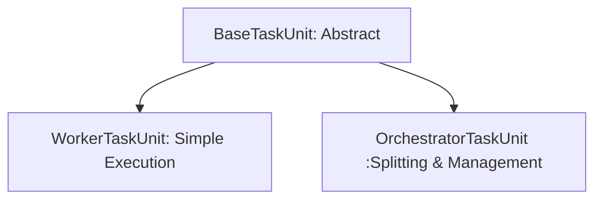

# Task Unit Design Review & Refactoring Plan

## 1. Current Design Analysis

### Issues Identified

1.  **Code Duplication & Maintenance Risk**:
    *   `ParentTaskUnit.run()` duplicates nearly all the lifecycle logic (stat recording, phase timing, logging, error handling) from `BaseTaskUnit.run()`.
    *   If the base execution logic changes (e.g., adding a new telemetry hook), `ParentTaskUnit` must be manually updated.

2.  **Coupled Framework & Business Logic**:
    *   Progress reporting logic is hardcoded inside `ParentTaskUnit.run()`.
    *   Users implementing a parent task override `fan_out`, but the relationship between `execute` (which is run but result largely unused) and `fan_out` is ambiguous.
    *   The concept of `sink` is confusing in Parent tasks (logic explicitly skips it, yet the method exists).

3.  **Complex Override Burden**:
    *   If a developer needs a slightly different orchestration (e.g., "fan out based on an API result"), they might feel compelled to override `run()`, risking breakage of progress reporting or stats.
    *   The framework concerns (how to iterate, how to report progress) are mixed with what should be user concerns (what data to fetch, how to split it).

## 2. Design Goals

*   **Separation of Concerns**: Users focus on *Data Acquisition* (Input) and *Data Persistency* (Output). The Framework handles *Flow Control*, *Progress Reporting*, and *Error Management*.
*   **Explicit Patterns**: Distinct base classes for "Leaf/Worker Tasks" (Single execution) and "Orchestrator/Parent Tasks" (Managing sub-tasks).
*   **Dry Principles**: Common lifecycle phases (Parameter parsing, Logging, Finalizing) should exist in exactly one place.

## 3. Proposed Architecture

We will introduce a separation between the **Lifecycle Manager** (Run Logic) and the **Task Definition** (User Logic).

### 3.1. Hierarchy



### 3.2. Lifecycle Definitions

#### BaseTaskUnit (Common)
Handles parameters, context setup, and finalization.
*   `_pre_run(ctx)`: `parameter_check` -> `load_dynamic` -> `merge_parameters` -> `before_execute`.
*   `_post_run(ctx)`: `finalize`.

#### WorkerTaskUnit (Standard)
Designed for tasks that do work and save results.
*   **User Methods**: `execute(ctx)`, `sink(ctx, result)`.
*   **Flow**:
    1.  `_pre_run`
    2.  `result = execute(ctx)`
    3.  `processed = post_process(ctx, result)`
    4.  `sink(ctx, processed)`
    5.  `_post_run`

#### OrchestratorTaskUnit (Parent)
Designed for tasks that generate sub-tasks.
*   **User Methods**: `plan(ctx)` (replaces `fan_out`).
    *   `plan` returns a list of Child Definitions. It can perform fetching internally if needed.
*   **Flow**:
    1.  `_pre_run`
    2.  `subtasks = plan(ctx)` (Business Logic)
    3.  `_execute_subtasks(ctx, subtasks)` (Framework Logic: Loop, Progress, Error handling)
    4.  `on_complete(ctx)` (Optional Summary)
    5.  `_post_run`

### 3.3. New Classes Interface Draft

**`BaseTaskUnit` Refactoring**:
Extract the `run` orchestration into smaller, composable methods or use the Template Method pattern strictly ensuring `run` calls `_inner_execute` which subclasses override.

**`OrchestratorTaskUnit`**:
```python
class OrchestratorTaskUnit(BaseTaskUnit):
    def plan(self, ctx) -> List[Dict]:
        """
        Business Logic: Determine what children to run.
        1. Fetch master data (e.g. stock list).
        2. Return list of dicts (params for children).
        """
        raise NotImplementedError

    def _inner_execute(self, ctx):
        # 1. Plan
        children_specs = self.plan(ctx)
        
        # 2. Init Stats
        total = len(children_specs)
        self._report_progress(ctx, 0, total)
        
        # 3. Loop & Execute
        for i, spec in enumerate(children_specs):
            self._run_single_child(ctx, spec)
            self._report_progress(ctx, i+1, total)
            
    def _run_single_child(self, ctx, spec):
        # Wraps child instantiation, run, logging, error catching
        pass
```

## 4. Code Comparison (User Perspective)

### Before (Current Parent Implementation)

```python
class StockListParent(ParentTaskUnit):
    # User has to know how fan_out interacts with explicit execute?
    # Or puts fetching logic in execute and saves to ctx to be used in fan_out?
    def execute(self, ctx):
        self.stocks = fetch_all_stocks()
        return None 

    def fan_out(self, ctx):
        return [{"key": "child_task", "params": s} for s in self.stocks]
```

### After (Proposed Orchestrator Implementation)

```python
class StockListParent(OrchestratorTaskUnit):
    def plan(self, ctx) -> List[ChildSpec]:
        # 1. Pure Business Logic: Get Data
        stocks = fetch_all_stocks()
        
        # 2. Pure Business Logic: Map to Tasks
        # (Optional: Filter or transform here)
        return [
            ChildSpec(task_code="stock_fetch_daily", params={"code": s.code, "date": s.date}) 
            for s in stocks
        ]
    
    # Progress reporting is AUTOMATIC. 
    # Logging of "Child X started/finished" is AUTOMATIC.
```

## 5. Summary of Improvements

1.  **Unified Entry Point**: `BaseTaskUnit` controls the outer try/except and logging wrapper in `run()`. Subclasses implement `_execute_strategy()`.
2.  **No More Copy-Paste**: `OrchestratorTaskUnit` inherits the telemetry and error handling of Base.
3.  **Automatic Progress**: The framework sees the list returned by `plan()` and handles the math and API calls for progress reporting. The user cannot forget to call it.
4.  **Flexible**: If we need a `ParallelOrchestrator` (using ThreadPool), we subclass `OrchestratorTaskUnit` and override only the loop logic (`_execute_subtasks`), while the user's `StockListParent` code remains unchanged (still just provides `plan()`).

