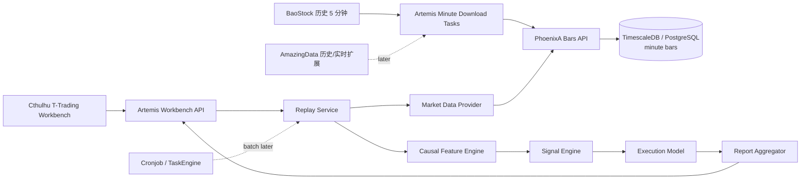
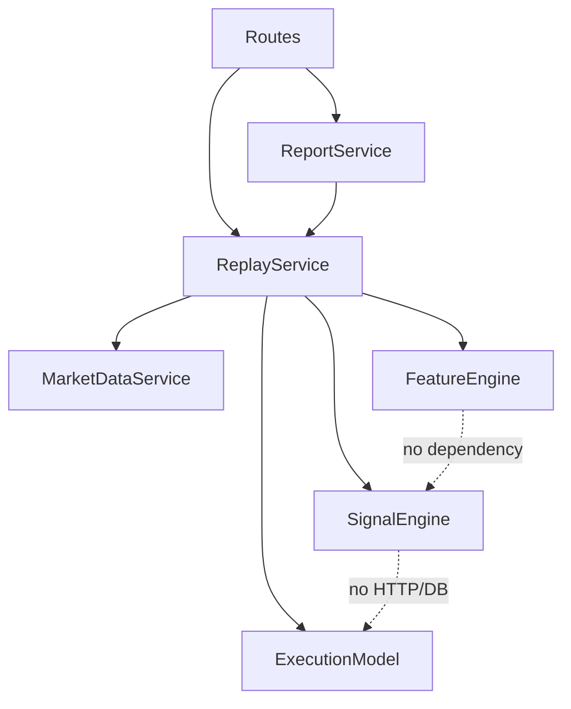
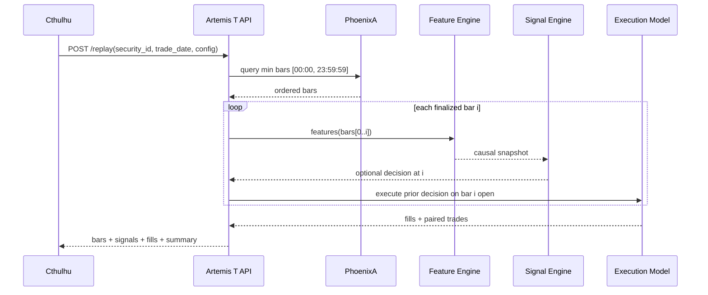

# 02. 架构与模块划分

## 1. 总体架构



## 2. 服务职责

### 2.1 PhoenixA

PhoenixA 是分钟行情的 canonical store，负责：

- 动态 bars 表命名和安全校验；
- `security_id -> symbol` 解析；
- 分钟 bars 批量 upsert；
- 按证券、时间范围、周期、复权类型分页查询；
- last-update watermark；
- 数据库迁移和唯一性约束。

PhoenixA 不负责：技术指标、信号判断、策略状态或报告计算。

### 2.2 Artemis

Artemis 是计算和研究平面，负责：

- 上游 SDK 会话及分钟下载；
- 统一分钟时间语义；
- Workbench 交互 API；
- 因果特征、信号、成交和回放；
- 单日和批量统计；
- 后续模型注册与实时 feed 适配。

### 2.3 Cthulhu

Cthulhu 是人工 review 平面，负责：

- 参数输入和交易日导航；
- 分钟 K 线、decision、fill 和指标展示；
- 当日统计卡片、交易明细和批量报告；
- 错误、空数据和无信号状态呈现。

### 2.4 Cronjob

第一轮不参与交互请求。后续批量大任务可使用 ASYNC callback；实时阶段优先采用幂等 `start/stop session`，或在 LONGRUN 协议落地后由 Cronjob 监督 heartbeat。

## 3. Artemis 模块树

```text
artemis/
  engines/
    task_engine/download/zh/
      stock_zh_a_minute_parent.py
      stock_zh_a_minute_child.py
  services/
    t_trading/
      __init__.py
      features.py          # 纯函数、因果滚动特征
      signal_engine.py     # 候选状态机和置信度
      execution.py         # next-bar 成交、成本、配对
      replay.py            # 单日编排
      report.py            # 多日/多证券聚合
  models/
    t_trading.py           # API 与领域模型
  api/http_gateway/
    t_trading_routes.py
```

核心依赖方向：



`features/signal_engine/execution` 必须能够使用 DataFrame/普通对象独立测试，不得反向依赖 FastAPI、TaskContext 或 PhoenixAClient。

## 4. 下载时序

```mermaid
sequenceDiagram
    participant C as Cronjob/User
    participant P as Minute Parent
    participant R as PhoenixA Registry/Bars
    participant W as Minute Child
    participant B as BaoStock

    C->>P: run(period=min5, adjust=nf, symbols/date range)
    P->>R: get securities + last update
    P->>P: per-security start date; replay last watermark day
    P->>W: child specs
    W->>B: query_history_k_data_plus(fields include time)
    B-->>W: minute rows
    W->>W: parse timestamp, validate OHLCV, deduplicate
    W->>R: upsert_bars(period=min5)
    R-->>W: ok
```

分钟增量从最后 watermark 的交易日重新下载，而不是简单 `last + 1 day`。原因是当日数据可能不完整，重叠 upsert 能补齐收盘前后缺口。

## 5. 单日回放时序



实现可以为性能一次性计算全部 rolling series，但单测必须证明前缀运行与全量运行在同一位置的结果一致，从而防止 centered rolling、负 shift 或全样本标准化混入。

## 6. 扩展点

### 6.1 MarketDataAdapter

```text
PhoenixHistoricalBarsAdapter   # 第一轮
AmazingDataHistoricalAdapter   # 后续 min1 + snapshot
AmazingDataRealtimeAdapter     # 后续订阅
SinaPollingAdapter             # 仅原型/备用
```

### 6.2 SignalStrategy

```text
CausalMeanReversionV1          # 第一轮
TrendPullbackV1                # 后续
MetaLabelFilter                # 后续 ML 候选过滤
```

### 6.3 ExecutionModel

```text
NextBarOpenExecution           # 第一轮
Level1TouchExecution           # 后续五档盘口
LatencyAndSlippageExecution    # 后续实时影子
```

## 7. 并发修改隔离

- 新功能使用新的 Artemis service/package 和 Cthulhu page，减少与 Atlas/Risk 代码重叠；
- PhoenixA 只修改 bars 通用链路、注册表和新增迁移；
- 不改 Atlas 配置、迁移或前端；
- 每个 Phase 开始和结束都检查 `git status` 和相关文件 diff；
- 不格式化或重写无关目录。
