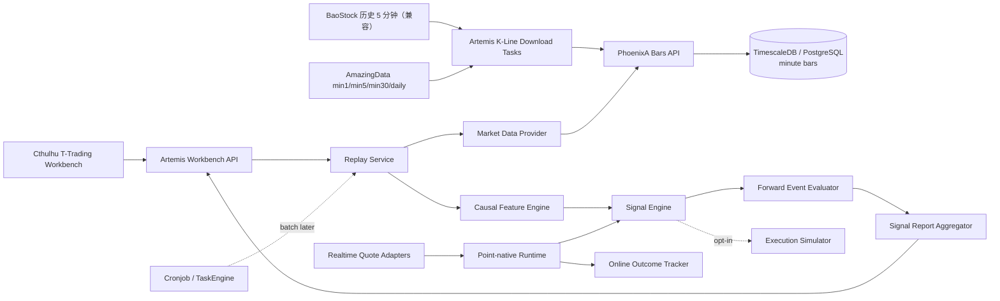
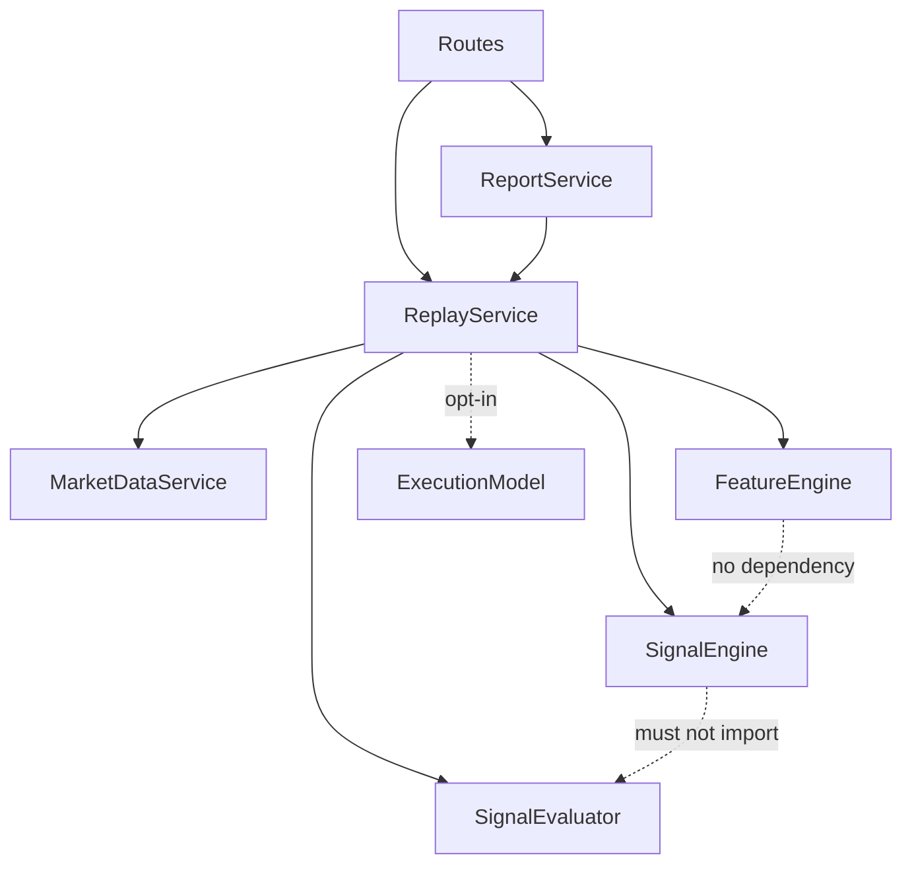
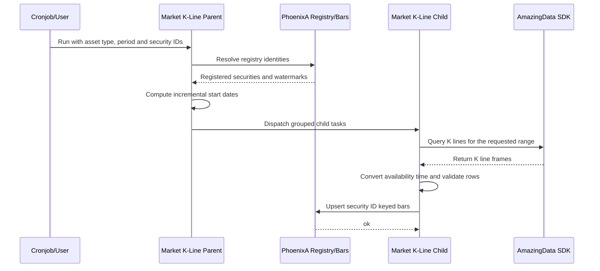
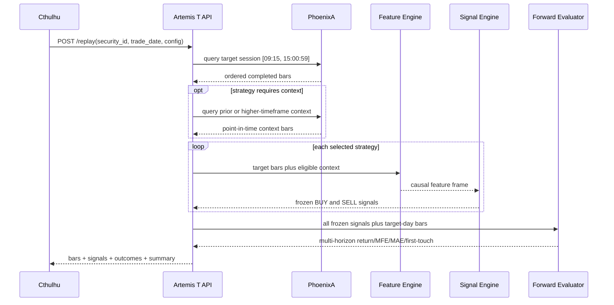

# 02. 架构与模块划分

## 1. 总体架构



## 2. 服务职责

### 2.1 PhoenixA

PhoenixA 是分钟行情的 canonical store，负责：

- 动态 bars 表命名和安全校验；
- 以 `security_id` 作为 bars 物理身份，并校验其已登记在 `security_registry`；
- 分钟 bars 批量 upsert；
- 按证券、时间范围、周期、复权类型分页查询；
- last-update watermark；
- 数据库迁移和唯一性约束。

PhoenixA 不负责：技术指标、信号判断、策略状态或报告计算。

### 2.2 Artemis

Artemis 是计算和研究平面，负责：

- 上游 SDK 会话及分钟下载；
- 统一分钟时间语义；
- Workbench 交互 API；
- 因果特征、多策略信号、前瞻事件评估和回放；
- 单日和批量统计；
- 后续模型注册与实时 feed 适配。

Workbench 内部组件不能只用一个“回放服务”笼统概括，其职责边界如下。

#### Workbench API

- 校验 `security_id/trade_date/period/strategies/evaluation`；
- 保证默认 `ephemeral`、成交模拟默认关闭；
- 把领域异常转换成稳定 HTTP 契约；
- 不计算指标，不持有跨请求策略状态。

#### Replay Service

- 只做编排：读取目标交易日 bars，并按策略声明加载历史同分钟、宽基指数、prior daily 和 completed min30 上下文；
- 为每个策略建立独立特征帧，调用 Signal Engine，冻结并合并信号；
- 冻结之后才把信号和行情交给 Forward Event Evaluator；
- 不在服务内重复实现技术指标或买卖规则。

#### Causal Feature Engine

- 计算 trailing rolling、EMA、MACD、RSI、VWAP、ATR、同分钟历史量比、市场 beta/残差以及跨周期状态；
- 所有 target bar 特征只使用 decision time 当时已经完成的数据；
- 日线只能使用前一交易日及以前，30 分钟线只能 as-of 合并已完成 bar；
- 不生成 BUY/SELL，不读取未来 outcome。

#### Signal Engine

- 根据策略配置从 causal feature frame 生成 BUY/SELL candidate、确认、冷却和置信度；
- 维护每个策略、每次 replay 独立的方向状态；
- 输出 `reason_codes + feature snapshot` 以便审计；
- 不 import 或调用 Forward Event Evaluator。

#### Forward Event Evaluator

- 只接收已经冻结的信号；
- 允许读取 decision 后的未来窗口，计算方向收益、MFE、MAE、target/stop first-touch；
- 不修改、筛选或补发信号；
- 多策略分别形成 `by_strategy`，零信号策略也保留 0 统计。

#### Signal Report Aggregator

- 汇总 overall、by_strategy、by_security、by_day；
- 隔离单个 security-day 失败；
- 汇总的是信号事件效果，不把可选成交模拟 PnL 混入主指标。

#### Realtime Point Runtime

- 每次供应商轮询得到一个 `QuotePoint`，完成时间、重复、乱序、stale 和累计量额差分检查；
- 在点序列上维护增量特征和信号状态，不把离散点伪装成 OHLC bar；
- 信号产生后由 Online Outcome Tracker 继续消费后续点并保存 compact outcome；
- 历史 bar 策略与实时 point-native 策略使用不同版本号和可比性标记。

### 2.3 Cthulhu

Cthulhu 是人工 review 平面，负责：

- 参数输入和交易日导航；
- 分钟 K 线、decision、outcome 和指标展示；
- 当日信号效果卡片、明细和批量报告；
- 错误、空数据和无信号状态呈现。

### 2.4 Cronjob

第一轮不参与交互请求。后续批量大任务可使用 ASYNC callback；实时阶段优先采用幂等 `start/stop session`，或在 LONGRUN 协议落地后由 Cronjob 监督 heartbeat。

## 3. Artemis 模块树

```text
artemis/
  engines/
    task_engine/download/zh/
      stock_zh_a_minute_parent.py
      stock_zh_a_minute_child.py
      stock_zh_a_kline_parent.py  # 股票 registry-native 按需增量规划
      stock_zh_a_kline_child.py   # 股票 AmazingData task adapter
      index_zh_a_kline_parent.py  # 指数 registry-native 按需增量规划
      index_zh_a_kline_child.py   # 指数 AmazingData task adapter
      _amazing_data_kline_*.py    # 两类任务复用的内部下载/时间语义/upsert 实现
  services/
    t_trading/
      __init__.py
      features.py          # 纯函数、因果滚动特征
      signal_engine.py     # 候选状态机和置信度
      signal_evaluation.py # 冻结信号后的多 horizon 事件评估
      live_quotes.py       # QuotePoint 契约与在线 compact outcome
      realtime_adapters.py # 供应商无关协议与新浪行情解析
      execution.py         # 默认关闭的成交诊断
      replay.py            # 单日编排
      report.py            # 多日/多证券聚合
  models/
    t_trading.py           # API 与领域模型
  api/http_gateway/
    t_trading_routes.py
```

核心依赖方向：



`features/signal_engine/signal_evaluation/live_quotes/realtime_adapters` 必须能够使用 DataFrame/普通对象独立测试，不得反向依赖 FastAPI、TaskContext 或 PhoenixAClient。实时 adapter 只把供应商响应转换为统一 `QuotePoint`，不包含信号逻辑。

## 4. 下载时序



分钟增量从最后 watermark 的交易日重新下载，而不是简单 `last + 1 day`。原因是当日数据可能不完整，重叠 upsert 能补齐收盘前后缺口。默认必须显式传 `security_ids` 或 `symbols`；只有显式 `all_registered=true` 才扫描对应资产类型的全部 registry 证券，避免误触全市场下载。

## 5. 单日回放时序



实现可以为性能一次性计算全部 rolling series，但单测必须证明前缀运行与全量运行在同一位置的结果一致，从而防止 centered rolling、负 shift 或全样本标准化混入。

## 6. 扩展点

### 6.1 MarketDataAdapter

```text
PhoenixHistoricalBarsAdapter   # 已实现，统一读取所有物理 period 表
AmazingDataHistoricalAdapter   # 已实现 query_kline 下载任务
AmazingDataRealtimeAdapter     # 后续订阅

RealtimeQuoteAdapter           # 统一 fetch(symbols) 协议
SinaRealtimeQuoteAdapter       # 已实现解析核心；未接调度/持久化
TencentRealtimeQuoteAdapter    # 计划
EastmoneyRealtimeQuoteAdapter  # 计划
```

浏览器实测只用于发现和验证新浪网页的网络契约；生产链路由后端 adapter 直接请求供应商。adapter 外层负责授权、限频、退避、stale/duplicate/gap 监控和 provider failover，策略引擎不感知供应商名称。

### 6.2 SignalStrategy

```text
CausalMeanReversionV1          # 已实现
MacdVolumeMomentumV1           # 已实现
VwapBollingerReversionV1       # 已实现
OpeningRangeBreakoutV1         # 已实现
TimeOfDayVolumeMomentumV1      # 已实现，至少 20 日同分钟基线
MarketResidualReversalV1       # 已实现，只对宽基，不含行业
MultiTimeframePullbackV1       # 已实现，prior daily + completed min30
OrderFlowImbalanceV1           # 后续 Level-1/逐笔
MetaLabelFilter                # 后续 ML 候选过滤
```

### 6.3 ExecutionModel

```text
NextBarOpenExecution           # 可选诊断，默认关闭
Level1TouchExecution           # 后续五档盘口
LatencyAndSlippageExecution    # 后续实时影子
```

## 7. 并发修改隔离

- 新功能使用新的 Artemis service/package 和 Cthulhu page，减少与 Atlas/Risk 代码重叠；
- PhoenixA 只修改 bars 通用链路、注册表和新增迁移；
- 不改 Atlas 配置、迁移或前端；
- 每个 Phase 开始和结束都检查 `git status` 和相关文件 diff；
- 不格式化或重写无关目录。
