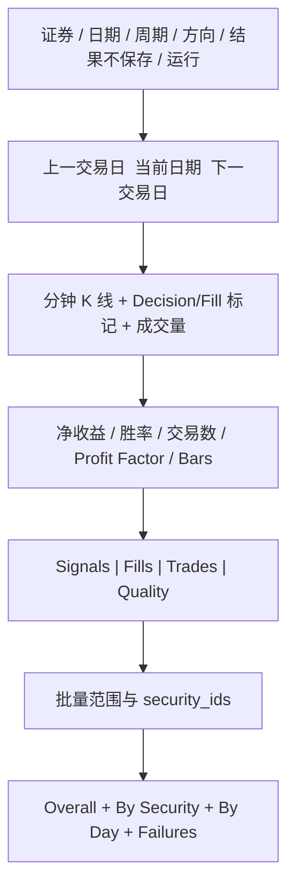

# 05. API 与 Cthulhu UI

## 1. API 总览

前缀：`/workbench/t-trading`

| Method | Path | 用途 |
|---|---|---|
| GET | `/config` | 返回周期、策略默认值、成本默认值和 engine version |
| POST | `/replay` | 单证券单交易日回放 |
| POST | `/batch` | 多证券日期范围批量报告 |

分钟原始数据继续通过已有 `/workbench/market-data` 查询；做 T API 返回 bars 是为了确保图表、signal 和 fill 来自同一冻结输入。

## 2. Replay Request

```json
{
  "security_id": 1,
  "trade_date": "2026-07-29",
  "period": "min5",
  "adjust": "nf",
  "source": null,
  "persistence_mode": "ephemeral",
  "strategy": {
    "direction": "buy_first",
    "window": 20,
    "entry_z": 1.25,
    "exit_z": 1.0,
    "entry_rsi": 35,
    "exit_rsi": 65,
    "confirmation_bars": 3,
    "cooldown_bars": 2,
    "max_round_trips": 2
  },
  "execution": {
    "quantity": 100,
    "commission_rate": 0.0003,
    "minimum_commission": 5,
    "stamp_duty_rate_on_sell": 0.0005,
    "transfer_fee_rate": 0.00001,
    "slippage_bps": 1
  }
}
```

第一轮仅接受 `persistence_mode=ephemeral`。契约提前保留 `summary_only/full`，但在结果存储 schema 和容量策略评审完成前返回 422。

校验失败返回 422；身份/维度不匹配或无数据返回 400；内部上游失败返回 502/500。合法无信号返回 200。

## 3. Batch Request

```json
{
  "security_ids": [1, 2],
  "start_date": "2026-07-01",
  "end_date": "2026-07-10",
  "period": "min5",
  "adjust": "nf",
  "persistence_mode": "ephemeral",
  "strategy": {},
  "execution": {}
}
```

限制：

- security_ids 去重、全部为正数；
- 日期范围最多 366 个自然日；
- 第一轮组合数最多 500；
- 周末/节假日无数据按 skipped 计入，不作为 failure；
- 单项异常进入 failures，整体仍返回 200；请求级配置非法才返回 422。

## 4. 前端路由

```text
/workbench/market-data       现有市场数据页
/workbench/t-trading         新增做 T 研究页
```

Workbench shell 增加导航项“做 T 复盘”。

## 5. 页面布局



第一轮使用单页，避免为策略配置、单日 review 和报告建立过多路由。

结果保存控件默认并锁定为“仅本次查看（不落库）”。未来启用其他模式时必须由用户主动选择，并展示预计保存内容和容量影响。

## 6. 图表契约

X 轴使用完整时间戳：

```text
2026-07-29T09:35:00+08:00
```

Series：

- `K-Line`：candlestick；
- `Volume`：bar；
- `Buy Decision`：向上三角，位置为 decision price；
- `Sell Decision`：向下三角；
- `Buy Fill`、`Sell Fill`：圆点/菱形，位置为 fill price；
- 后续 oracle markers 使用低饱和灰色，不与真实信号混淆。

Tooltip 展示：

```text
side
decision_time / fill_time
decision_price / fill_price
confidence + confidence_kind
reason_codes
zscore / RSI / VWAP deviation
costs
```

## 7. 交易日导航

按钮行为：

1. 前一天/后一天先按自然日移动；
2. 自动跳过周末；
3. 请求无 bars 时提示“该日无分钟数据”，保留日期；
4. 后续接入 PhoenixA 交易日历后替换为精确交易日导航。

禁止一次预取未来多日并在前端隐藏；每次 replay 请求只取指定交易日。

## 8. 统计与明细

统计卡片：

- Completed Trades；
- Net PnL；
- Win Rate；
- Profit Factor；
- Signal Count；
- Bars/Quality。

明细表：

- signals：状态、原因、置信度；
- fills：实际价格、数量、成本；
- trades：进出方向、净收益、MAE/MFE；
- quality：缺口、重复、零量、拒绝原因。

## 9. 空态和错误态

- 无数据：不显示旧图，明确提示 security/date/period；
- 无信号：显示 K 线和“策略选择不交易”，不是错误；
- signal 未成交：在表中标 `unfilled`；
- 批量部分失败：报告顶部 warning，仍展示成功汇总；
- API 错误使用现有 ErrorNotificationInterceptor 和 NzMessage。

## 10. 响应体大小

单日 min5 约 48 bars，可直接返回；min1 约 240 bars，也可接受。批量 API 默认不返回每一天的完整 bars/signals，只返回摘要与失败，防止响应膨胀。需要查看某一天时由前端再次调用 replay。
