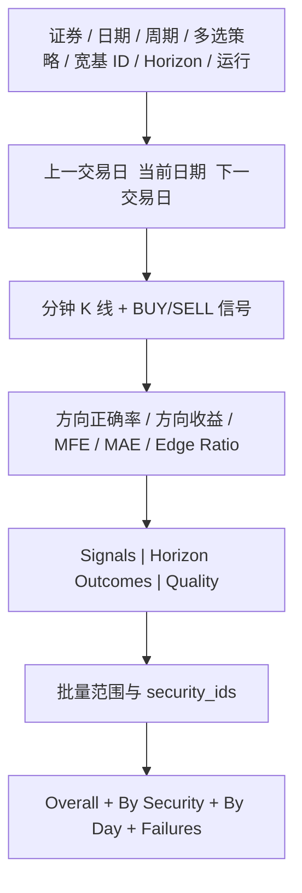

# 05. API 与 Cthulhu UI

## 1. API 总览

前缀：`/workbench/t-trading`

| Method | Path | 用途 |
|---|---|---|
| GET | `/config` | 返回周期、策略列表、默认 horizons 和执行默认关闭状态 |
| POST | `/replay` | 单证券单交易日信号回放与事件评估 |
| POST | `/batch` | 多证券日期范围的信号效果报告 |

分钟原始数据继续通过已有 `/workbench/market-data` 查询。做 T API 返回同一冻结输入的 bars、signals 和 outcomes，便于审计。

## 2. Replay Request

```json
{
  "security_id": 1,
  "trade_date": "2026-07-29",
  "period": "min1",
  "adjust": "nf",
  "source": null,
  "persistence_mode": "ephemeral",
  "strategy": {"strategy": "time_of_day_volume_momentum_v1"},
  "strategies": [
    {"strategy": "time_of_day_volume_momentum_v1"},
    {"strategy": "market_residual_reversal_v1"},
    {"strategy": "multi_timeframe_pullback_v1"}
  ],
  "benchmark_security_id": 1001,
  "evaluation": {
    "horizons_bars": [1, 3, 5, 15],
    "primary_horizon_bars": 5,
    "target_return": 0.005,
    "stop_return": 0.003
  },
  "include_execution_simulation": false,
  "execution": {}
}
```

`strategy` 为单策略旧请求兼容字段；提供 `strategies[]` 时以数组为准，最多 8 个且策略名不得重复。选择 `market_residual_reversal_v1` 时必须提供已注册的宽基指数 `benchmark_security_id`。行业残差不在合法策略列表内。

`execution` 只为兼容可选诊断层保留；默认请求不使用它，多策略请求禁止同时开启成交模拟。`primary_horizon_bars` 必须包含在 `horizons_bars` 中。

第一轮仅接受 `persistence_mode=ephemeral`。合法无信号返回 200。

## 3. Replay Response

主字段：

```text
run_meta
bars
signals
signal_evaluation
summary                   # primary horizon signal summary
data_quality
fills                     # 默认 []
round_trips               # 默认 []
execution_summary.enabled # 默认 false
```

`signal_evaluation`：

```text
evaluation_kind=forward_event_study_v1
price_basis=decision_bar_close
same_bar_touch_policy=ambiguous
config
summary
by_horizon[].by_side
by_strategy[]
outcomes[]
```

`summary` 不再包含 net PnL/Profit Factor，而包含 directional accuracy、directional return、MFE、MAE、edge ratio 和 touch rates。

## 4. Batch Request 与响应

```json
{
  "security_ids": [1, 2],
  "start_date": "2026-07-01",
  "end_date": "2026-07-10",
  "period": "min1",
  "adjust": "nf",
  "persistence_mode": "ephemeral",
  "strategy": {},
  "strategies": [
    {"strategy": "time_of_day_volume_momentum_v1"},
    {"strategy": "multi_timeframe_pullback_v1"}
  ],
  "evaluation": {},
  "include_execution_simulation": false,
  "execution": {}
}
```

限制：

- security_ids 去重、全部为正数；
- 日期范围最多 366 个自然日；
- 第一轮组合数最多 500；
- 周末/节假日无数据按 skipped 计入；
- 单项异常进入 failures，整体仍返回 200；
- 默认 results 只返回 run_meta、signal summary 和 data quality。

批量 `summary/by_strategy/by_security/by_day` 均按主 horizon 的信号效果聚合。

## 5. 页面布局



结果保存控件默认并锁定为“仅本次查看（不落库）”。策略选择提供：

- Z-score + RSI + VWAP 反转；
- MACD + 量能 + 分钟 EMA；
- VWAP + Bollinger + 拒绝影线；
- 开盘区间 + 量能突破；
- 同分钟历史量比 + 价格确认；
- 宽基市场残差反转；
- 日线 / 30 分钟顺势回踩。

行业残差不展示。策略可以选择一个或多个；选中宽基市场残差时才显示基准指数 Security ID 输入。

## 6. 图表与 Tooltip

X 轴使用完整时间戳。默认 series：

- `K-Line`；
- `Volume`；
- 每个选中且实际出信号的策略各有一对 `Buy Decision/Sell Decision` series；
- 不同策略采用不同色系，同一策略 BUY/SELL 使用同色系的不同色值；
- BUY 使用向上 pin，SELL 使用旋转向下 pin，颜色和形状双编码；
- 后续 `Oracle` marker 使用低饱和灰色。

图例为可滚动策略图例；成交模拟关闭时不显示 fill 数据点。

Tooltip：

```text
strategy / side
decision_time / decision_price
confidence + confidence_kind
reason_codes
zscore / RSI / VWAP deviation
EMA / MACD / volume ratio / ATR
selected horizon directional return / MFE / MAE / first-touch
```

## 7. 统计与明细

统计卡片：

- 主 horizon 方向正确率；
- 平均方向收益；
- 平均 MFE；
- 平均 MAE；
- MFE/MAE edge ratio；
- 可评估信号 / 总信号；
- Bars/Quality。

明细：

- signals：策略、方向、原因、规则分数和特征；
- outcomes：各 horizon 的 return/MFE/MAE/first-touch；
- quality：缺口、重复、零量和拒绝原因；
- execution：仅显式开启时展示，视觉上与 signal evaluation 分区。

## 8. 实时页扩展

未来实时模式增加：

```text
input_mode=point_native
source/source_time/observed_at
poll latency/staleness/max quote gap
active signals
1/3/5/15-minute online outcomes
EOD projection status
```

实时图直接画 QuotePoint price line，并按所选策略分别显示 BUY/SELL marker。收盘后可切换为 canonical 分钟 K 线背景，但 marker 始终保留实时 signal time/price；前端和 API 都不生成或展示“采样合成 bar”。

## 9. 空态、错误态与响应体

- 无数据：不显示旧图；
- 无信号：显示 K 线和“策略未产生候选”；
- horizon 不完整：显示 insufficient，不进入准确率分母；
- OHLC 同 bar 双触达：显示 ambiguous；
- 批量部分失败：warning + 成功汇总；
- 实时 stale/乱序/采集断档：停止生成新信号或降级，并显示质量状态。

单日 min5/min1 可直接返回详细 outcomes。批量默认不返回每一天的 bars/signals/outcomes；查看具体日期时重新调用 replay。
