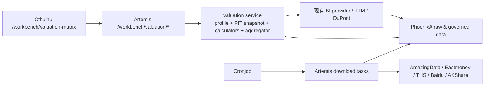
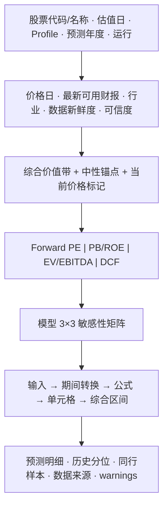

# Artemis 估值矩阵 Workbench：可行性评估与第一版设计

> 日期：2026-08-16
> 状态：Phase 0～Phase 2 已实现；完成首轮模型 Review 修复与第二轮验收
> 影响项目：Artemis、PhoenixA、Cthulhu、Cronjob
> 页面建议：`/workbench/valuation-matrix`
> 首期范围：A 股、非金融、持续盈利公司；研究辅助，不产生自动交易或仓位指令

## 0. 结论先行

这个功能可行，而且现有项目已经具备大约 60%～70% 的底座。三张财务报表、日线行情、security identity、申万行业映射、杜邦/TTM 计算、统一 symbol 搜索和 Workbench 页面骨架都可以复用。缺口主要不在估值公式，而在以下三项数据工程：

1. 盈利一致预期与历史估值虽然可通过 AKShare 的东方财富/同花顺接口取得，但目前没有稳定的下载任务、PhoenixA 存储和 as-of 数据契约；
2. PhoenixA 已有 `equity_structure` 表和查询 API，但 Artemis 还没有 AmazingData `get_equity_structure` 下载任务，开发库目前也没有股本结构数据；
3. 当前财务数据不是全市场完整回补。download engine 能工作，但必须先建立按需补数、覆盖检查、定时增量和失败降级机制。

建议把估值矩阵放在 **Cthulhu 的 Artemis Workbench**，而不是 BI 菜单。它不是静态财务看板，而是带情景参数、模型选择、敏感性矩阵和计算审计的研究工具。后端路由使用 `/workbench/valuation/*`，领域计算放在独立的 `artemis/services/valuation/`，复用现有 BI provider/TTM/DuPont 能力。PhoenixA 继续只保存原始及标准化数据，不保存“合理价格”这种业务结论。

首期不应承诺“给所有股票自动估值”。建议明确支持边界：

- `comp_type_code = 1` 的非金融公司；
- TTM EPS、净利润为正；
- 至少有 3 个完整年度或 12 个季度财报；
- 当前股本、日线价格、行业映射可用；
- 有一致预期时自动生成 Forward PE 情景；无一致预期时允许用户录入情景，但必须标为 `manual`、降低可信度。

银行、保险、券商、亏损成长股、强资源周期股需要独立估值 profile，不能套用同一套默认权重。首期遇到这些类型应明确提示“当前 profile 不适用”，而不是硬算一个价格。

## 1. 从参考思路中保留的原则

参考页面最值得保留的不是某个 PE 数字，而是以下决策框架：

- 不追求一个看似精确的单点价格，而是输出悲观/中性/乐观的价值分布；
- Forward PE、PB/ROE、EV/EBITDA、DCF、历史分位和同行比较共同提供证据；
- “公司值多少钱”“当前是否低估”“今天是否适合买”“具体何时买”是不同层次；本功能只解决第一层，并给第二层提供 `价值 vs 市价` 的上下文；
- 所有结果必须能回溯到输入、报告期、公告日、数据源、公式和参数。

因此，页面核心不只是下表这种模型汇总：

| 模型 | 悲观 | 中性 | 乐观 |
|---|---:|---:|---:|
| Forward PE | 价格 | 价格 | 价格 |
| PB / ROE | 价格 | 价格 | 价格 |
| EV/EBITDA | 价格 | 价格 | 价格 |
| DCF | 价格 | 价格 | 价格 |

还必须提供每个模型自己的敏感性矩阵。例如 PE 模型用“EPS 情景 × PE 锚点”形成 3×3 单元格，用户能看到某个价格到底是 `2.55 元 EPS × 31.4 倍 PE`，而不是只看到一个黑盒结论。

## 2. 远端现状盘点

### 2.1 可以直接复用的能力

| 能力 | 当前实现 | 对估值矩阵的用途 | 结论 |
|---|---|---|---|
| 统一证券 identity | PhoenixA `security_registry` + Cthulhu `security-search-input` | symbol/名称查询后只传 `security_id` | 直接复用 |
| 日线行情 | `/workbench/market-data` + PhoenixA bars | 最新收盘价、估值日期、历史价格 | 直接复用 |
| 三张财报下载 | `STOCK_ZH_A_BALANCE_SHEET`、`INCOME`、`CASH_FLOW` | EPS、BPS、净利润、EBITDA、FCF、净债务 | 直接复用，但要补覆盖 |
| 财务查询 | `/bi/financial/{source}/{statement_type}` | 报告期与字段查询 | 直接复用 provider；新页面不直接拼 raw API |
| TTM / 杜邦 | `artemis/services/bi/dupont.py` | TTM 净利润、ROE、利润率、周转率、杠杆 | 抽取公共 period normalizer 后复用 |
| 行业映射 | `/api/v2/taxonomy/by_security/{security_id}` | 同行集合、行业 profile | 直接复用 |
| 申万成分股 | taxonomy constituent API | 自建透明 peer set | 直接复用 |
| 中国国债利率 | `GLOBAL_RATE_DAILY` | DCF 无风险利率 | 可复用 |
| T-trading Workbench | toolbar、symbol 搜索、参数折叠、统计卡、审计表 | 估值页面交互骨架 | 直接复用交互模式，不复用交易语义 |
| 财报研报下载 | Eastmoney report task + MinIO + PhoenixA metadata | 后续解释一致预期、提取预测依据 | 只作增强；目前不是结构化预测源 |

### 2.2 已有 schema/API、但没有完整数据链路

PhoenixA 已定义 `equity_structure` 数据集、字段治理和查询 API，但 Artemis download engine 中没有 `get_equity_structure` 对应任务，开发库查询结果为 0。首期可以临时使用资产负债表 `TOT_SHARE`，但以下情况会降低可信度：

- 报告期之后发生送转、增发、回购或可转债转股；
- 用最新股本回算历史每股指标；
- 用期末股本近似加权平均股本。

因此 `STOCK_ZH_A_EQUITY_STRUCTURE` 应列为 Phase 0 必做任务，而不是页面上线后的优化项。

### 2.3 third_party_sdk 中可用但尚未平台化的数据

| 数据 | SDK 接口 | POC 结论 | 建议 |
|---|---|---|---|
| 东方财富盈利预测 | `stock_profit_forecast_em` | 可用，返回研报数、评级数、动态年度 EPS | 作为 consensus 主源之一，必须每日快照 |
| 同花顺盈利预测区间 | `stock_profit_forecast_ths` | 可用，返回年度机构数、EPS 最小/均值/最大 | 适合直接构造悲观/中性/乐观输入 |
| 个股历史估值 | `stock_value_em` | 可用，含价格、市值、股本、PE/PB/PEG/PCF/PS | 作为历史估值主源候选 |
| 百度历史估值 | `stock_zh_valuation_baidu` | 可用，PE/PB/市值单指标历史 | 适合交叉校验和 fallback |
| 东方财富同行估值 | `stock_zh_valuation_comparison_em` | 可用，但 forward 年份列标签发生错位 | 不直接信任 forward 标签；同行倍数自行计算 |
| 东财主要财务指标 | `stock_financial_analysis_indicator_em` | 可用，含 EPS/BPS/ROE/FCFF 等 | 只作校验/fallback，主财务口径仍用 AmazingData |

这些接口不能由 Workbench 请求实时抓取后直接计算。原因是上游会变化、会反爬、字段会漂移，而且历史分析需要知道“当时能看到什么”。正确做法是 Cronjob 定时触发 Artemis download task，PhoenixA 保存带 `source/as_of_date/fetched_at/raw_json` 的快照，Workbench 只消费已治理数据；缺数据时可以显式触发小范围按需回补。

## 3. 600183 生益科技 POC

本 POC 全部在远端开发机 `~/projects/chaos` 和项目 `venv` 中完成，没有修改功能代码。

### 3.1 现有链路验证

- `security_id = 4889`，symbol `600183`；
- POC 前：日线可查，但三张财报对该 security_id 均为 0；
- 使用现有正式 TaskEngine 入口，按 `symbols=[600183] + exchange=SH + 2024-01-01 至今` 运行三项任务；
- 资产负债表、利润表、现金流量表三项任务均返回 `SUCCESS`；
- 回补后 Catalog 能返回 2024-03-31 至 2026-06-30 的覆盖，合并口径 `statement_code=1` 每张表有 10 个报告期；
- 现有 `/bi/dupont/4889?period_kind=ttm` 可以直接输出 2026-06-30 TTM ROE、净利率、资产周转率和权益乘数。

结论：download engine 与 PhoenixA 财务链路本身可用，当前问题是数据覆盖/调度，而不是需要重写财务采集。

### 3.2 外部数据 POC（2026-08-16 抓取）

| 项目 | POC 结果 |
|---|---|
| 最新已交易收盘价 | 143.21 元，价格日 2026-08-14 |
| 最新财务公告 | 2026 半年报，公告日 2026-08-15 |
| 同花顺 2026 EPS | 13 家机构，最小 1.47、均值 2.41、最大 3.29 |
| 东方财富 2026 EPS | 10 份研报，一致预期 2.546 |
| 东方财富 2027 / 2028 EPS | 3.738 / 4.961 |
| 5 年月末 PE(TTM) | 25% 22.05、中位 31.37、75% 39.47 |
| 5 年月末 PB | 25% 2.87、中位 3.45、75% 4.82 |
| 当前供应商 PE/PB 示例 | `stock_value_em` 为 88.55/18.80；百度 8 月 15 日 PE 为 66.97 |

这里出现的差异不是小问题，而是估值系统必须解决的核心问题：8 月 14 日收盘之后，8 月 15 日发布了半年报。一个数据源还在使用公告前 TTM 盈利，另一个已经使用公告后 TTM 盈利；价格却仍是 8 月 14 日。页面必须同时显示 `price_as_of`、`financial_available_at` 和 `consensus_as_of`，不能只写一个模糊的“截至今天”。

另外，东方财富同行接口当前返回列名 `市盈率-25E/26E/27E`，但用 143.21 除以实际动态年度 EPS 后可以确认，它们实质对应 2026/2027/2028。说明 AKShare 或上游的显示标签没有随年份正确滚动。系统应保存原始字段，但 forward PE 必须使用 `price / consensus_eps(fiscal_year)` 自行计算，不能直接透传这三个列名。

### 3.3 POC 对模型的启示

1. 当前 TTM 与 forward 盈利差异很大，单看当前 PE 会误导；
2. 2026 EPS 的供应商均值接近，但悲观/乐观跨度很大，必须显示机构数与离散度；
3. 当前 PE/PB 已明显高于自身 5 年历史中枢，但市场可能在定价 2027/2028 的增长，历史分位只能是倍数锚，不是直接结论；
4. 当前 TTM FCF 可以计算，但扩产期 FCF 波动很大，DCF 结果对增长率/WACC 极敏感，不能与 PE 等权平均；
5. 页面可信度来自“让差异暴露出来”，而不是强行把所有模型揉成一个漂亮数字。

## 4. 估值矩阵的模型设计

### 4.1 先做适用性分类，再做计算

| Profile | 首选模型 | 辅助模型 | 首期处理 |
|---|---|---|---|
| 非金融、稳定盈利成长 | Forward PE | EV/EBITDA、DCF、PB/ROE | 首期主支持 |
| 资产密集制造/温和周期 | 中周期 PE、EV/EBITDA | PB/ROE、DCF | 首期支持，但降低自动化置信度 |
| 强资源周期 | 中周期利润、EV/EBITDA | PB | Phase 1.5；不能用高点 EPS |
| 银行 | PB/ROE、PE | 股息率 | 后续独立 profile |
| 保险 | P/EV、PB/ROE | PE | 当前缺 embedded value，暂不支持 |
| 券商 | PB/ROE、周期化 PE | - | 后续独立 profile |
| 亏损成长股 | EV/Sales、PS | DCF | 首期不支持 |

profile 的初始判断来自 `comp_type_code`、申万行业、近年利润/毛利率/ROE/FCF 稳定性；页面允许用户切换 profile，但必须显示切换原因并重新计算模型权重。

### 4.2 Point-in-time 是硬约束

请求中的 `valuation_date` 表示“站在该日期收盘后，市场当时已知的信息”。所有输入必须满足：

```text
price_date <= valuation_date
financial.ann_date <= valuation_date
consensus.as_of_date <= valuation_date
shares.change_date <= valuation_date
macro.trade_date <= valuation_date
```

如果 `valuation_date` 是非交易日，价格使用最近前一交易日，但页面必须分别展示两个日期。当前查询可以使用公告日为 8 月 15 日的半年报和 8 月 14 日收盘价，但必须提示“财报发布后尚无新交易日价格”。历史回放绝不能把后续公告财报带入过去日期。

### 4.3 财务期间标准化

利润表与现金流量表是累计值，资产负债表是时点值。TTM 累计项使用：

```text
TTM(X, current_period)
= current_YTD(X)
+ previous_FY(X)
- previous_same_period_YTD(X)
```

每股收益优先使用已披露 `BASIC_EPS/DILUTED_EPS` 的同口径 TTM 组合。若股本变动超过阈值，不能机械相加 EPS，应以归母净利润和加权平均股本重算；当前拿不到加权平均股本时降低质量等级并显示近似口径。

### 4.4 Forward PE 核心矩阵

对某一 fiscal year 或 NTM horizon，形成：

```text
Price[i,j] = Forecast_EPS[i] × PE_Anchor[j]
```

若估值落点是未来年末价格，再折现到估值日：

```text
Present_Value[i,j]
= Forecast_EPS[i] × Exit_PE[j] / (1 + Cost_of_Equity) ^ horizon_years
```

EPS 三情景建议：

- 悲观：机构预测低位；机构数不足时使用均值减一倍稳健离散度；
- 中性：多源加权中位数，不直接使用单一源均值；
- 乐观：机构预测高位，但对小样本和离群值 winsorize；
- 用户覆盖值独立显示为 `manual_override`，绝不覆盖原始 consensus。

PE 三锚点不是拍脑袋固定值，来源包括：

1. 自身 5 年月末 PE 正值样本的 25%/50%/75% 分位；
2. 申万三级或二级同行的 forward PE 稳健中位数；
3. 增长、ROE、盈利质量对倍数的修正；
4. 市场整体估值状态作为有限幅度修正，而不是直接替代公司估值。

历史序列按月末采样，避免每天重复值让某一时期权重过大。亏损造成的负 PE、极端值和异常零值必须剔除，并返回剔除规则和样本数。

页面默认突出矩阵对角线：`悲观 EPS × 低倍数`、`中性 EPS × 中位倍数`、`乐观 EPS × 高倍数`；其余六格用于显示敏感性，不隐藏。

### 4.5 PB / ROE 辅助矩阵

```text
Price[i,j] = Forward_BPS[i] × PB_Anchor[j]
```

PB 锚点同时参考历史 PB、同行 PB，并用长期 ROE/增长/资本成本校验：

```text
Justified_PB = (ROE - g) / (Cost_of_Equity - g)
```

该公式只在 `Cost_of_Equity > g` 且 ROE 可持续时有效。对于 600183 这类 PB 随成长预期快速扩张的公司，PB 更适合作为“市场隐含 ROE 是否过高”的反向检查，而不是主估值模型。

### 4.6 EV/EBITDA 同行矩阵

```text
Enterprise_Value = Forward_EBITDA × EV_EBITDA_Multiple
Equity_Value = Enterprise_Value - Net_Debt - Minority_Interest
Price = Equity_Value / Diluted_Shares
```

净债务必须明确构成：有息短债、一年内到期长期负债、长期借款、应付债券、租赁负债，减货币资金和可确认的高流动性金融资产。每个加减项都在“数据与公式”页展开。

同行集合由 PhoenixA 申万三级行业构造，样本不足时逐级回退到二级。剔除规则至少包括不同公司类型、负 EBITDA、财报过旧、ST/退市状态和极端倍数。东方财富同行接口只作为交叉校验，不作为 peer set 的唯一来源。

### 4.7 DCF 只做可解释的压力测试

```text
EV = Σ FCFF_t / (1 + WACC)^t
   + FCFF_n × (1 + terminal_g) / (WACC - terminal_g) / (1 + WACC)^n

Equity_Value = EV - Net_Debt - Minority_Interest
Price = Equity_Value / Diluted_Shares
```

DCF 页面必须是二维敏感性矩阵，默认轴为 `WACC × terminal_g`，并允许展开收入增长、利润率、Capex/折旧假设。首期只有在 FCFF 口径经核验、至少 3 年可用且非持续负值时才启用。否则显示“模型不可用”，不能用 0 填入综合估值。

中国 10 年期国债收益率已有数据链路；Beta 可用个股与宽基指数日收益滚动计算。权益风险溢价、债务成本、税率与资本结构仍需建立版本化假设，不能藏在代码常量里。

### 4.8 综合区间：避免重复计权

历史 PE、同行 PE 和增长修正只是 **PE 倍数的三个证据**，不能当成三个独立估值模型再重复加权。PB/ROE、EV/EBITDA、DCF 才是独立的交叉检查。

每个有效模型输出 `bear/base/bull` 与 `quality_score`。综合每个情景使用质量加权中位数，不使用简单平均，以降低某一个异常 DCF 或倍数对结果的拉动：

```text
combined_bear = weighted_median(valid_model_bear_values)
combined_base = weighted_median(valid_model_base_values)
combined_bull = weighted_median(valid_model_bull_values)
```

首期非金融稳定盈利 profile 的建议初始权重仅作为待校准默认值：PE 55%、EV/EBITDA 20%、DCF 15%、PB/ROE 10%。模型不可用时对剩余有效模型归一化；少于两个有效模型时，不输出“综合估值”，只输出单模型区间和低可信度提示。

最终展示：

- 综合价值区间：`combined_bear ～ combined_bull`；
- 中性锚点：`combined_base`；
- 模型分歧：各模型 base 的最大/最小差异；
- 当前价格位置：相对综合区间的百分位；
- 安全边际：`combined_base / current_price - 1`，只作为数学差值，不直接映射为仓位建议。

## 5. 数据可信度设计

可信度不能是“模型自信”，而是数据与口径完整性。建议返回 `HIGH/MEDIUM/LOW` 和可审计分项：

| 分项 | 检查 |
|---|---|
| price | 最近交易日、来源、是否停牌/陈旧 |
| financials | 三表报告期是否对齐、公告日是否满足 as-of、TTM 是否完整 |
| shares | 股本是否覆盖估值日、是否有重大变动 |
| consensus | 来源数、机构数、更新时间、离散度、年度标签是否规范化 |
| history | 历史长度、有效月数、异常值剔除比例 |
| peers | 行业层级、有效同行数、同行财报/预测新鲜度 |
| dcf | FCFF 历史、WACC 输入完整度、终值占比 |

响应必须附带 `warnings[]`，例如：

- `PRICE_PRECEDES_LATEST_FINANCIAL_ANNOUNCEMENT`
- `CONSENSUS_PROVIDER_YEAR_LABEL_NORMALIZED`
- `SHARE_COUNT_APPROXIMATED_FROM_BALANCE_SHEET`
- `PE_HISTORY_CONTAINS_EARNINGS_REGIME_BREAK`
- `PEER_SAMPLE_TOO_SMALL`
- `DCF_TERMINAL_VALUE_DOMINATES`

## 6. 目标架构与模块边界



建议后端结构：

```text
artemis/services/valuation/
├── service.py                 # 用例编排
├── models.py                  # 内部领域对象
├── profile.py                 # 公司类型与模型适用性
├── point_in_time.py           # as-of 数据快照
├── period_normalizer.py       # annual/YTD/single-quarter/TTM
├── consensus.py               # 多源 EPS 预测标准化
├── anchors.py                 # 历史分位、同行倍数、修正
├── calculators/
│   ├── pe.py
│   ├── pb_roe.py
│   ├── ev_ebitda.py
│   └── dcf.py
├── aggregator.py              # 模型有效性、权重、综合区间
├── explain.py                 # 公式图、来源和 warning
└── quality.py                 # 数据质量评分
```

`period_normalizer.py` 应从当前较大的 `bi/dupont.py` 中抽取公共能力，杜邦与估值共同使用，避免两套 TTM 逻辑。

PhoenixA 只保存原始/标准化快照，不保存估值结论。初稿曾建议新增
`ods.earnings_consensus_snapshot` 与 `ods.security_valuation_daily`；实施评审发现
现有 `ods.market_observation_daily` 已具备相同的 identity、时间轴、JSON 扩展、
幂等 upsert 和 watermark API，因此首版改为复用该纵向事实表：

1. `source=eastmoney_valuation` + `valuation_*` observation types 保存逐日估值；
2. `source=ths_consensus/eastmoney_consensus` + `eps_consensus_{year}` 保存真实抓取日快照；
3. 低/均/高、机构数和评级数放在 `extra_json`；
4. 补齐现有 `ods.equity_structure` 的 Artemis 下载任务与调度。

同行估值不建议再建一张供应商同行快照作为主路径。用 taxonomy 构造 peer set，再基于上述标准化数据计算，口径更透明；供应商同行表仅保存 raw snapshot 或用于 smoke comparison。

## 7. API 第一版

### 7.1 配置与适用性

```http
GET /workbench/valuation/config
GET /workbench/valuation/eligibility?security_id=4889&valuation_date=2026-08-16
```

`eligibility` 返回 profile、可用模型、不可用原因、数据覆盖和建议先补的数据。

### 7.2 运行估值

```http
POST /workbench/valuation/analyze
```

请求示例：

```json
{
  "security_id": 4889,
  "valuation_date": "2026-08-16",
  "profile": "auto",
  "forecast_horizon": "FY2026",
  "models": ["forward_pe", "pb_roe", "ev_ebitda", "dcf"],
  "scenario_overrides": {},
  "persistence_mode": "ephemeral"
}
```

MVP 返回一份冻结输入的完整 read model：

```text
run_meta / calculation_version
security_context / industry_context
as_of_context
eligibility
current_market
financial_snapshot
consensus_snapshot
historical_anchors
peer_anchors
model_results[].matrix / formula / inputs / provenance / warnings
combined_range
quality
```

MVP 与 t-trading 一样可使用 `ephemeral` 结果，但响应必须自包含并带 `calculation_version`。盈利预测和估值历史原始快照必须持久化，否则无法重现历史结果。后续再增加显式保存 valuation run 的能力。

## 8. Cthulhu 页面设计

页面延续 t-trading 的信息密度和交互习惯：顶部输入、折叠参数、运行、结果卡、图表、审计明细；但页面语义改为“估值研究”。



### 8.1 顶部控制区

- 复用 `app-security-search-input`，用户输入 `600183` 或 `生益科技`；
- 估值日期默认今天，可切换历史日期；
- Profile 默认自动识别；
- 预测年度/NTM horizon；
- “运行估值”按钮；
- `ephemeral · 计算结果不落库` 标签；
- 数据缺口存在时提供“按需补数据”动作，但补数是独立明确操作，不在每次运行中静默抓外网。

### 8.2 首屏结果

1. 公司上下文：名称、symbol、申万三级行业、公司类型；
2. 日期条：价格截至、财报可用截至、预测截至；
3. 综合价值带：悲观—中性—乐观，当前价格使用垂直 marker；
4. 卡片：当前价、中性估值、安全边际、历史 PE 分位、模型分歧、可信度；
5. 若价格与最新财报公告错位，首屏直接显示 warning，不埋到详情页。

### 8.3 模型 Tab

- `PE 矩阵`：EPS 三情景 × PE 三锚点，单元格显示价格；
- `PB / ROE`：BPS、历史/同行/justified PB；
- `EV/EBITDA`：EBITDA、净债务桥接表、同行倍数；
- `DCF`：WACC × 永续增长率矩阵和终值占比；
- `数据与公式`：所有字段、报告期、公告日、来源、转换步骤、缺失/剔除原因。

每个矩阵单元格 hover/click 后显示：

```text
计算价格 79.52
= 2026E EPS 2.546
× PE 31.23

EPS: 东方财富/同花顺多源中性值
PE: 5 年月末历史中位 + 申万三级同行中位校准
price_as_of: 2026-08-14
consensus_as_of: 2026-08-16
```

### 8.4 参数编辑

默认参数区折叠，分为：

- EPS 情景；
- 倍数锚点与历史窗口；
- 同行过滤规则；
- DCF/WACC；
- 模型权重。

每个字段显示系统值、来源和手动值。点击“恢复系统值”只清除 override，不重新抓数据。运行结果要明确区分 `system_derived`、`provider_consensus`、`manual_override`。

## 9. 需要特别防止的错误

1. **公告日穿越**：用 8 月 15 日财报解释 8 月 14 日以前的估值；
2. **供应商 PE 混用**：一个源已更新财报、另一个未更新，却当成同口径比较；
3. **forward 年份错位**：直接透传 `25E/26E/27E` 这种漂移列名；
4. **累计报表相加**：把 Q1、H1、Q3 直接求和；
5. **EPS 高点陷阱**：强周期公司用峰值 EPS × 历史高 PE；
6. **历史日频重复加权**：把每天相近倍数当成大量独立样本；
7. **重复模型加权**：历史 PE、同行 PE、PEG 各算一个模型，实际重复使用同一 EPS；
8. **负值被当成 0**：PE/DCF 不适用时填 0，拉低综合区间；
9. **股本单位错误**：股、万股、元混用；
10. **模型无来源**：页面展示“合理 PE=25”但无法解释由谁、何时、如何得到。

## 10. 分阶段实施建议

### Phase 0：数据与口径（先做）

- 新增并验证 `STOCK_ZH_A_EQUITY_STRUCTURE`；
- 新增盈利预测 snapshot task（东财 + 同花顺，至少双源）；
- 新增个股历史估值 daily task（东财主源、百度校验）；
- 复用 PhoenixA `market_observation_daily` 建估值/一致预期 snapshot 契约与查询链路；
- 对用户查询股票提供按需财报/估值/预测回补；
- 抽取公共 point-in-time period normalizer；
- 建 provider contract test，专门检测年度标签漂移和字段变更。

### Phase 1：可 review 的 MVP

- 只支持非金融、正盈利公司；
- Forward PE 3×3 矩阵；
- PB/ROE 辅助矩阵；
- 当前价格、历史分位、申万同行锚点；
- 综合价值带、可信度、warning；
- 完整“数据与公式”审计；
- Cthulhu 新路由 `/workbench/valuation-matrix`，复用 symbol search 和 t-trading 页面骨架。

### Phase 1.5：模型增强

- EV/EBITDA；
- DCF 敏感性矩阵；
- profile 自动分类与行业专用默认参数；
- 研报结构化预测作为 consensus evidence；
- 显式保存/比较 valuation run。

### Phase 2：历史验证

- 任意历史 `valuation_date` 的 point-in-time 重放；
- 评估“估值区间在未来 1/2/3 年的覆盖率”，而不是用短期涨跌判断模型；
- 按行业校准 profile、权重和安全边际区间；
- 再讨论银行、券商、保险和亏损成长股 profile。

## 11. 测试与验收

### 11.1 后端单元测试

- annual/YTD/single-quarter/TTM 公式；
- 公告日过滤和非交易日价格回退；
- 股本变化与单位转换；
- negative EPS/EBITDA/FCF 的模型禁用；
- 历史月末采样、分位数、winsorize；
- peer set 三级不足回退二级；
- weighted median 与不可用模型重归一化；
- DCF `WACC <= terminal_g` 拒绝；
- 供应商 forward 年份错位检测。

### 11.2 Golden case

以 600183 固化一个不依赖外网的 snapshot fixture，至少覆盖：

- 2026-08-14 收盘后但半年报尚未公告；
- 2026-08-15 公告后但尚无新交易日价格；
- 2026-08-17 新交易日后的完整快照；
- 同一 EPS 在不同 PE 锚点下的矩阵计算；
- 东财与同花顺预测差异及来源展示。

### 11.3 API / 前端验收

- symbol 查询只使用 `security_id`；
- 无数据、部分数据、模型不可用均有稳定空态；
- 每个价格能追溯公式和输入；
- 手动 override 后结果、标签和 provenance 同步变化；
- 切换股票/日期后旧结果立即清空；
- 页面不把“合理价值”表述成确定收益或自动买卖建议。

## 12. 建议本轮确认的决策

1. 同意首期只做 A 股非金融正盈利公司，不追求全市场万能估值；
2. 同意页面放在 Artemis Workbench，路由为 `/workbench/valuation-matrix`；
3. 同意 Forward PE 是 MVP 主模型，PB/ROE 是辅助，EV/EBITDA 与 DCF 后置半个 Phase；
4. 同意先落盈利预测/历史估值 snapshot，页面不实时直抓第三方；
5. 同意 point-in-time、来源/日期/公式审计是上线门槛；
6. 同意 PhoenixA 只存数据与快照，Artemis 负责估值业务计算；
7. 同意开发顺序为“数据与口径 → API → Cthulhu 页面 → 历史验证”。

## 13. 最终判断

估值矩阵不是另起炉灶。现有 Artemis 已有财务数据下载、Workbench API、TTM/DuPont 计算和行业映射，Cthulhu 也有成熟的查询与审计型页面。最合理的第一版是：

> 用现有财务底座生成可追溯的 Forward EPS，以自身历史和透明同行样本生成倍数锚点，先把 PE 3×3 矩阵与 PB/ROE 校验做可信；再引入 EV/EBITDA 和 DCF，而不是第一天就把所有模型堆上页面。

工程上最大的风险不是“算不出来”，而是供应商年份错位、公告日穿越、股本口径和数据覆盖不足导致“算得很漂亮但不可信”。这些风险目前都能通过 point-in-time snapshot、数据治理、质量 warning 和公式审计解决，因此建议进入 Phase 0/Phase 1 设计评审。

## 14. 实施结果（2026-08-16）

本设计已经从评估稿推进到远端开发环境可运行版本。实现保持 PhoenixA 只存原始/标准化事实、Artemis 负责业务计算、Cthulhu 只消费 read model 的边界。

### 14.1 已落地能力

| Phase | 已实现内容 | 远端验收 |
|---|---|---|
| Phase 0 | `STOCK_ZH_A_EQUITY_STRUCTURE`、`STOCK_ZH_A_VALUATION_DAILY`、`STOCK_ZH_A_EARNINGS_CONSENSUS`；2010 默认/显式起点；单并发、间隔、抖动、指数退避、按证券 watermark 增量 | 六只跨行业股票、沪深两组、8 个 AmazingData 任务与 4 个免费源任务全部成功 |
| Phase 1 | `/workbench/valuation/{config,eligibility,analyze}`；目标年度 Forward PE、直接预测 BVPS/ROE；历史 PE/PB 25%/50%/75% 分位；综合价值带、可信度分项、warning、逐格公式与来源 | 600183 真实数据端到端通过；信息截止日与最后交易日分离，8 月 16 日估值可以使用 8 月 15 日半年报，同时市场价格仍是 8 月 14 日收盘价 |
| Phase 1.5 | EV/EBITDA、FCFF DCF、净债务 equity bridge、不可用模型原因、剩余权重归一化 | 六股冒烟覆盖制造、消费、银行、保险、成长股；方法按数据适用性自动降级 |
| Phase 2 | `/workbench/valuation/history` 月末/季末 PIT 重放；历史 bars 缺失时回退已持久化的 `valuation_close`；最多 60 个估值点 | 600183 2024～2026 季末重放通过；缺失点稳定记录 `skipped`，不伪造数据 |
| Cthulhu | `/workbench/valuation-matrix`；symbol/名称查询；价值区间统计卡；方法×情景矩阵；公式/输入/provenance 折叠；PIT 审计线；历史重放表 | `npm run build:dev-home` 通过 |

### 14.2 存储实现调整

评审后没有立即新建 `earnings_consensus_snapshot` 与 `security_valuation_daily` 两张宽表，而是复用 PhoenixA 已有的 `ods.market_observation_daily`：

- `source=eastmoney_valuation`，`observation_type=valuation_close/valuation_pe_ttm/valuation_pb/...` 保存逐日估值事实；
- `source=ths_consensus/eastmoney_consensus`，`observation_type=eps/bvps/roe/cfps/net_profit/revenue_consensus_{fiscal_year}` 保存抓取日可见的目标年度预测；机构逐家 EPS 分布、报告日期和机构数放在 `extra_json`；
- `trade_date` 对估值数据表示交易日，对一致预期表示真实抓取日；公共接口不提供历史快照时，任务强制 `as_of_date=今天`，禁止回填伪历史；
- `security_id + trade_date + observation_type + source` 唯一键和现有 last-update API 已满足幂等、增量与 PIT 查询，因此没有为了相同时间序列重复建设 PhoenixA CRUD。

如果未来需要全市场高频 consensus revision 分析或复杂的机构级明细，再把一致预期拆到专表；当前垂直观测模型更小、更容易治理。

### 14.3 首轮真实数据覆盖

压力样本：`600183`、`600519`、`601318`、`000001`、`000858`、`300750`。

| 数据集 | 覆盖结果 |
|---|---:|
| 东财逐日估值观测 | 149,292 行；6 只股票；2018-01-02～2026-08-14 |
| 同花顺一致预期 | 18 行；6 只股票；真实快照日 2026-08-16 |
| AmazingData 资产负债表 | 835 行 |
| AmazingData 利润表 | 2,639 行 |
| AmazingData 现金流量表 | 2,629 行 |
| AmazingData 股本结构 | 223 行 |

AmazingData 的请求统一从 `2010-01-01` 发起；个别公司上市较晚或供应商历史较短时，以供应商实际返回起点为准。免费源使用 3.5～5 秒的单线程间隔做六股验收，没有并发突刺。

### 14.4 当前明确边界

- 银行、保险等金融公司不会硬套 EV/EBITDA/DCF；缺少适用字段的方法会显示未参与原因，当前主要由 PE/PB 提供区间，后续仍需独立金融 profile。
- EV/EBITDA 倍数暂用 8/12/16 倍配置假设，尚未完成同行 EV/EBITDA 横截面锚定；页面明确显示 `phase_1_5_config_assumption`。
- AmazingData 字段元数据把 `FREE_CASH_FLOW` 明确定义为“企业自由现金流量（FCFF）”，所以 DCF 从企业价值减一次净债务的桥接成立；当前缺口是没有逐年 FCFF 预测，近端增长暂用目标年度 EPS 增长代理、显式封顶并逐年衰减。
- 一致预期从首次抓取日起积累。历史重放找不到当时真实快照时，Forward PE 与 Forward PB 直接不可用并降低可信度，绝不退化为 TTM EPS、固定留存率，也绝不拿今天预测回填过去。
- 当前综合值是可用方法的加权情景值；不可用方法移除后对剩余权重归一化。高 EPS 增长且高 Forward ROE 的公司使用 `high_growth` 权重画像，Forward PE 主导、PB 只作资产护栏；权重依据在页面展示。
- 可信度由数据完整性、预测时间对齐、预测来源、PIT 完整性、模型一致性、历史稳定性六项构成。关键项是门槛而非可被其它分项补偿的加分项；没有真实历史预测快照时历史稳定性为 0。

### 14.5 首轮 Review 修复（600183）

首轮输出暴露了一个严重语义错误：`target_fiscal_year=2027`，实际 EPS 却在快照缺失时退化成 TTM EPS。公式乘法正确，但年份错配使结果不可用于定价。修复规则如下：

1. `valuation_date` 表示信息截止日，`price_as_of` 表示截止日前最后交易价格，两者不再混为同一天；
2. Forward PE 只接受信息截止日前、与目标财年完全相等的 EPS 快照；缺失即禁用；
3. PB 使用同一目标财年的直接预测 BVPS/ROE；不再用隐藏的 45%/60%/70% 留存率外推；
4. 页面同时展示 AmazingData 历史分红推导的真实派息/留存率，但直接预测 BVPS 时该留存率不参与定价；
5. 同花顺机构逐家预测优先于汇总接口的全历史 min/max，避免陈旧极值扩大情景区间；
6. EV/EBITDA 与 DCF 缺少逐年预测时，只允许使用有上限、可审计的 EPS 增长代理，并降低模型一致性/历史稳定性评分。

| 600183 · 信息截止 2026-08-16 | 首轮 | Review 修复后 |
|---|---:|---:|
| 最后交易价格 | 143.21（2026-08-14） | 143.21（2026-08-14） |
| 财报可得日 / 报告期 | 2026-04-29 / 2026Q1 | 2026-08-15 / 2026H1 |
| 2027E EPS | TTM fallback：1.37 / 1.75 / 2.02 | 机构逐家分布：3.03 / 3.48 / 4.51 |
| Forward PE 区间 | 29.81 / 55.20 / 80.57 | 65.72 / 110.07 / 179.76 |
| 综合区间 | 24.59 / 40.09 / 59.30 | 54.21 / 89.85 / 145.25 |
| 可信度 | 74，中；无分项门槛 | 66，中；模型一致性与历史稳定性均为 0 |
| 市场位置 | 高于整个区间 | 位于综合区间上沿，仍反映很高增长预期 |

第二轮远端验收覆盖原六只跨行业样本；82 个相关后端测试通过，Cthulhu `development-home` 构建通过。600183 2024～2026 季末重放仍有 11 个点且无跳过，但历史点因为没有真实预测快照而明确禁用 Forward 方法，可信度降到 33～37，不再生成伪 Forward 结论。

### 14.6 第二轮 Review：主估值、交叉验证与逐步审计

第二轮 Review 的有效结论是“方法角色失配”，不是简单把估值结果调高。审计结果分成两类：

1. **不是代码 bug，但页面解释不够。** 600183 EV/EBITDA Base 的 TTM EBITDA 为 74.07 亿元，增长 40% 后为 103.70 亿元；乘 12 倍得到的企业价值是 **1,244.42 亿元**，不是 124.4 亿元。再减 43.45 亿元净债务、除 24.29 亿股，49.44 元/股的程序结果正确。外部 Review 在“亿元 × 倍数”处少了一位数量级。
2. **DCF 数学与已声明规则一致。** 页面里的 40% 是第一年近端增长，不是连续五年 40%。Base 路径实际为 `40.00% → 30.63% → 21.25% → 11.88% → 2.50%`，再以 10% WACC 折现并减一次净债务，得到 36.24 元/股。问题在于此前没有把这条路径、显式期现值、终值现值和 equity bridge 展开，容易被误读。
3. **方法论风险真实存在。** EPS 增长只能临时代理 FCFF/EBITDA 增长；8/12/16 倍 EV/EBITDA 仍是配置假设；历史 TTM PE 分位数也不等于历史 Forward PE。它们在接入逐年收入/利润率/CAPEX/营运资本预测、同行 Forward 倍数和真实历史预测快照前，不应与高增长主模型无条件平均。

因此聚合策略调整如下：

- `high_growth` 且 Forward PE 可用时，使用 `primary_with_cross_checks`：Forward PE 形成页面主区间；EV/EBITDA 与 DCF 是交叉验证；PB 是资产护栏；原 70/5/15/10 加权结果保留为“诊断参考”，不再作为 headline。
- 非高增长画像仍使用 `weighted_blend`；只有一种方法时标记 `single_method`。
- 每种方法返回 `role` 与 `included_in_headline`，页面不再把“有公式结果”等同于“可以参与主估值”。
- 新增 Forward PE 的 EPS × PE 3×3 敏感性矩阵，拆开盈利兑现和估值倍数两个维度；同时输出当前价按 Base EPS 隐含的 Forward PE、按 Base PE 反推的 EPS，以及最接近当前价的矩阵组合。
- EV/EBITDA 返回起始 EBITDA、增长、前瞻 EBITDA、企业价值、净债务、权益价值、股本和每股价格全链路；DCF 返回每年增长率、FCFF、折现现值、显式期合计、终值现值、企业价值和 equity bridge。金额统一使用原始元，Cthulhu 明确换算成亿元显示。

600183 在新聚合规则下的主区间为 Forward PE 的 `65.72 / 110.07 / 179.76`；原全方法加权 `54.21 / 89.85 / 145.25` 继续展示，但只作为方法分歧诊断。统一计算/展示精度后，当前价 143.21 元按 Base EPS 3.4829 元隐含约 41.12 倍 2027E PE，按 Base PE 31.6033 倍反推 EPS 约 4.53 元；3×3 矩阵中最接近的组合是 Bull EPS 4.5100 × Base PE 31.6033 = 142.53 元。这比把 143 元简单判成“高于/低于某个加权公允价”更能说明市场正在交易什么预期。

### 14.7 第三轮 Review：价格参考框架与口径一致性

外部 Review 提出的核心问题成立：当 Forward PE、PB、EV/EBITDA、DCF 的价格相差数倍时，如果仍把每一格都叫“目标价”，投资者只能挑一个符合自己倾向的数字。修复原则不是把不同模型强行平均，而是明确它们各自在决策中的角色：

1. **低/中/高是预期情景，不是三个预测精度相同的目标价。** 原 `Bear/Base/Bull` 在页面改称“低一致预期 / 中位一致预期 / 高一致预期”。其中低位仍来自机构预测低值和历史倍数低分位，并不等于订单坍塌、利润率均值回归或增长逻辑证伪后的尾部压力价。
2. **先选盈利，再选倍数。** Forward PE 的 3×3 表是主要决策面：投资者先选择自己能验证的目标年度 EPS 行，再选择可持续 PE 列。只看对角线会把低盈利与低倍数、高盈利与高倍数同时叠加，夸大区间宽度。
3. **市场价用来反推假设。** 页面展示市场价在低/中/高锚之间的位置、按中位 EPS 隐含的 PE、按中位 PE 反推的 EPS，以及最接近当前价的矩阵格。问题从“模型说值多少钱”变成“当前价格要求什么盈利和估值倍数，我是否同意”。
4. **安全边际由用户选择。** 页面默认显示“中位锚 × (1 − 20%)”观察价，并允许 0%～50% 调整。它只是投资纪律的观察阈值，不是系统生成的保证买点；基本面假设改变时必须重新估值。
5. **交叉模型是诊断，不是投票。** PB/ROE 负责检验账面资本和 ROE，EV/EBITDA 检验经营资产定价，DCF 检验现金流约束。它们显著低于 Forward PE 时，表示资产/现金流尚未支持盈利增长叙事，不应直接当作买入价，也不应通过平均掩盖分歧。

新增 `PB = PE × (EPS / BVPS)` 一致性诊断：使用同一目标年度 EPS/BVPS 计算 Forward ROE，再计算 PE 对应的理论 PB，与历史 PB 锚逐情景比较。Base 差异超过 2 倍标记为严重分歧并触发 warning。该诊断定位“盈利定价”和“账面资产定价”是否讲同一个故事，但不自动判定哪一方正确。

工程口径同步收紧：Forward PE/PB 的页面输入和实际定价统一使用 4 位小数，确保任意价格格可以直接复算；EV/DCF 单元格直接显示增长、倍数或 WACC，而不再只显示一个起始 FCFF；历史 TTM PE 用作 Forward PE 的代理、固定 EV/EBITDA 倍数和 EPS→FCFF 增长代理均在主表标注。可信度改称“结构 / 数据评分”，拆成数据时点、主模型校准、交叉验证一致性、历史前瞻验证四个用途维度，并明确它不是上涨概率、推荐强度或目标价命中率。

真正的尾部压力价仍需 Phase 3 的中周期盈利模型：至少加入收入/出货量、利润率、资本开支、营运资本和 ROE 均值回归。完成前系统明确返回 `tail_stress_available=false`，不以伪精确数字填补缺口。
