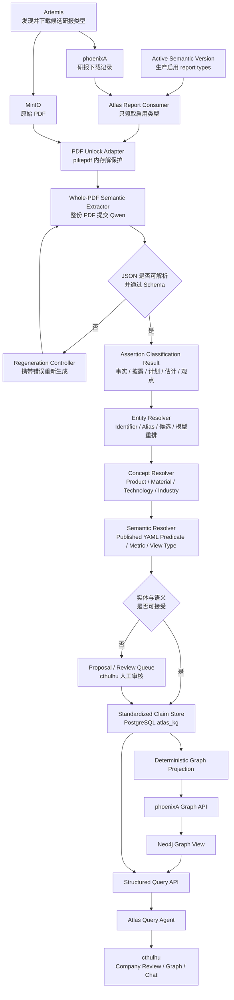
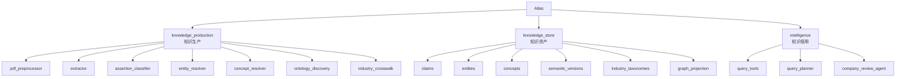
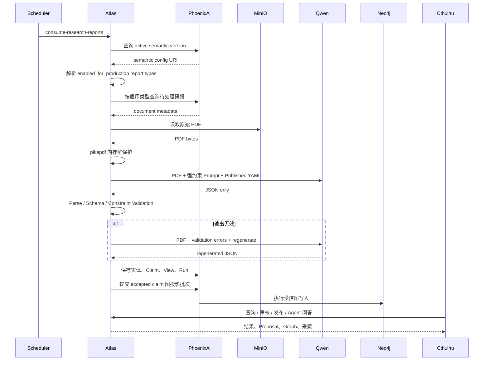

## 四、总体架构

```mermaid
flowchart TD
    A["Artemis<br/>发现并下载候选研报类型"] --> B["MinIO<br/>原始 PDF"]
    A --> C["phoenixA<br/>研报下载记录"]
    V["Active Semantic Version<br/>生产启用 report types"] --> D["Atlas Report Consumer<br/>只领取启用类型"]
    C --> D
    D --> E["PDF Unlock Adapter<br/>pikepdf 内存解保护"]
    B --> E
    E --> F["Whole-PDF Semantic Extractor<br/>整份 PDF 提交 Qwen"]
    F --> G{"JSON 是否可解析<br/>并通过 Schema"}
    G -- "否" --> H["Regeneration Controller<br/>携带错误重新生成"]
    H --> F
    G -- "是" --> I["Assertion Classification Result<br/>事实 / 披露 / 计划 / 估计 / 观点"]
    I --> J["Entity Resolver<br/>Identifier / Alias / 候选 / 模型重排"]
    J --> K["Concept Resolver<br/>Product / Material / Technology / Industry"]
    K --> L["Semantic Resolver<br/>Published YAML Predicate / Metric / View Type"]
    L --> M{"实体与语义<br/>是否可接受"}
    M -- "否" --> N["Proposal / Review Queue<br/>cthulhu 人工审核"]
    M -- "是" --> O["Standardized Claim Store<br/>PostgreSQL atlas_kg"]
    N --> O
    O --> P["Deterministic Graph Projection"]
    P --> PA["phoenixA Graph API"]
    PA --> Q["Neo4j Graph View"]
    Q --> R["Structured Query API"]
    O --> R
    R --> S["Atlas Query Agent"]
    S --> T["cthulhu<br/>Company Review / Graph / Chat"]
```

### 4.1 三个核心领域

```mermaid
flowchart TD
    A["Atlas"] --> B["knowledge_production<br/>知识生产"]
    A --> C["knowledge_store<br/>知识资产"]
    A --> D["intelligence<br/>知识使用"]

    B --> B1["pdf_preprocessor"]
    B --> B2["extractor"]
    B --> B3["assertion_classifier"]
    B --> B4["entity_resolver"]
    B --> B5["concept_resolver"]
    B --> B6["ontology_discovery"]
    B --> B7["industry_crosswalk"]

    C --> C1["claims"]
    C --> C2["entities"]
    C --> C3["concepts"]
    C --> C4["semantic_versions"]
    C --> C5["industry_taxonomies"]
    C --> C6["graph_projection"]

    D --> D1["query_tools"]
    D --> D2["query_planner"]
    D --> D3["company_review_agent"]
```

### 4.2 主要调用关系

```mermaid
sequenceDiagram
    participant Scheduler
    participant Atlas
    participant PhoenixA
    participant MinIO
    participant Qwen
    participant Neo4j
    participant Cthulhu

    Scheduler->>Atlas: consume-research-reports
    Atlas->>PhoenixA: 查询 active semantic version
    PhoenixA-->>Atlas: semantic config URI
    Atlas->>Atlas: 解析 enabled_for_production report types
    Atlas->>PhoenixA: 按启用类型查询待处理研报
    PhoenixA-->>Atlas: document metadata
    Atlas->>MinIO: 读取原始 PDF
    MinIO-->>Atlas: PDF bytes
    Atlas->>Atlas: pikepdf 内存解保护
    Atlas->>Qwen: PDF + 强约束 Prompt + Published YAML
    Qwen-->>Atlas: JSON only
    Atlas->>Atlas: Parse / Schema / Constraint Validation
    alt 输出无效
        Atlas->>Qwen: PDF + validation errors + regenerate
        Qwen-->>Atlas: regenerated JSON
    end
    Atlas->>PhoenixA: 保存实体、Claim、View、Run
    Atlas->>PhoenixA: 提交 accepted claim 图投影批次
    PhoenixA->>Neo4j: 执行受控图写入
    Cthulhu->>Atlas: 查询 / 审核 / 发布 / Agent 问答
    Atlas-->>Cthulhu: 结果、Proposal、Graph、来源
```

---
