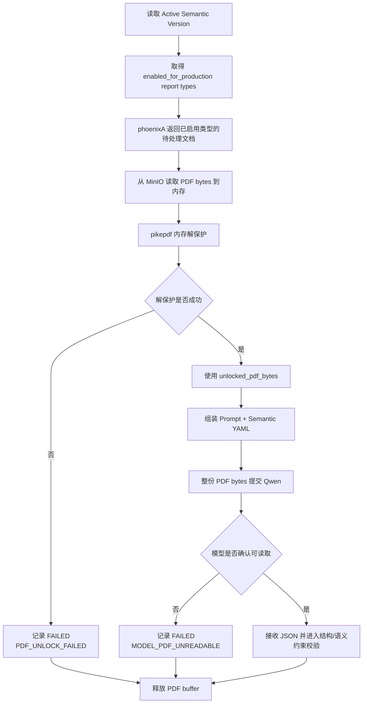

## 七、PDF 预处理与整份文档输入

### 7.1 Phase 1 输入决策

Phase 1 的主路径不进行文本抽取和 Chunking。

前提：

- 上线前的 Sample/Discovery 已证明当前本地推理端能够接收并读取代表性 PDF。
- Sample/Discovery 已证明模型请求能够返回符合约束的结构化 JSON。
- Sample/Discovery 已经给出各 report type 是否适合生产抽取的结论。

以上结论属于 Sample 阶段产物，生产 Pipeline 不再为每次运行重复 Capability Probe 或 Whole-PDF Gate。

主策略：

```text
PDF_DIRECT
```

明确不实现：

```text
TEXT_EXTRACTED
TEXT_CHUNKED
PAGE_IMAGE_BATCH
DOCLING_DOCUMENT
MARKER_MARKDOWN
```

这些模式作为 fallback TODO，只有 Phase 1 实测证明整份 PDF 直读不能满足要求时再引入。

### 7.2 为什么第一期先不 Chunk

当前研报平均文件大小约 1MB，本地试验表明 4070S 可以处理一般文档，因此先验证最简单链路：

```text
PDF → Qwen → JSON
```

优势：

- 不需要设计 chunk 边界。
- 避免跨 chunk 关系合并。
- 模型能看到整篇研报上下文。
- 减少 parser、normalizer 和 chunk storage。
- 更适合第一阶段验证“模型能否从候选研报类型中提取知识，并判断哪些类型值得进入生产”。

风险：

- PDF 文件大小不等于文本 token 数。
- 图片密集型和扫描型 PDF 的模型负载不同。
- 某些长研报可能超过上下文或显存。
- 模型可能在长文档后半部分遗漏信息。
- 推理端可能静默截断页面或文本。

因此必须记录真实实验指标，不能只根据 1MB 文件大小判断。

### 7.3 PDF Input Adapter

PDF Input Adapter 是程序化模块，只负责取得 PDF bytes、解除访问限制并管理内存生命周期，不判断 PDF 内容。

职责：

1. 使用 phoenixA 返回的 MinIO object URI 将原始 PDF 读入内存。
2. 对每份 PDF 调用 `pikepdf` 在内存中重新序列化，以去除可能存在的 owner permission/内容提取限制。
3. 将解保护后的 bytes、文件名和 MIME type 交给 LLM Client。
4. LLM 请求结束、失败或超时后释放输入和输出 buffer。
5. 解保护失败时，只在既有 `document_extraction_run` 中记录 `PDF_UNLOCK_FAILED`，不创建 Claim。

Phase 1 不为以下情况设计单独的复杂分支：

- 损坏 PDF 修复。
- 用户密码管理。
- 加密算法兼容矩阵。
- 数字签名验证。

当前数据源预期不存在这些情况。如果实际遇到，统一表现为无法解保护或模型无法读取，并进入运行失败记录；不要为尚未出现的问题扩大 Pipeline。

### 7.4 使用 pikepdf 在内存中解保护

处理路径：

```text
MinIO object
    ↓ read
source_pdf_bytes
    ↓ pikepdf 内存 open/save
unlocked_pdf_bytes
    ↓ immediate request
Local LLM API
    ↓ request finished
释放全部 PDF buffer
```

`unlocked_pdf_bytes` 只是一次 LLM 请求生命周期内的内存对象，不是本地文件、MinIO 对象或新的 source document。

示意实现：

```python
from io import BytesIO

def unlock_pdf_in_memory(source_pdf_bytes: bytes) -> tuple[bytes, int]:
    source_stream = BytesIO(source_pdf_bytes)
    unlocked_stream = BytesIO()

    with pikepdf.Pdf.open(source_stream, password="") as pdf:
        page_count = len(pdf.pages)
        pdf.save(unlocked_stream, encryption=False)

    return unlocked_stream.getvalue(), page_count
```

实现约束：

- 输入必须是 `BytesIO` 等可 seek 的二进制流，输出也写入内存流。
- 不允许把 source 或 unlocked PDF 写入本地临时路径。
- 不允许把 unlocked PDF 回写 MinIO。
- 不覆盖 Artemis 保存的原始 PDF。
- 不猜测密码，不建立 password/secret 分支。
- 捕获 `pikepdf` 异常后写入 `document_extraction_run.error_code=PDF_UNLOCK_FAILED` 和简短 `error_summary`。
- 日志不能包含 PDF bytes。
- buffer 必须在 `finally` 中释放；实现可使用 context manager 或显式 `close()`。

实现参考：

- [pikepdf Tutorial — `Pdf.open()`/`Pdf.save()` 支持可 seek stream](https://pikepdf.readthedocs.io/en/latest/tutorial.html)
- [pikepdf Main Objects API — stream 生命周期](https://pikepdf.readthedocs.io/en/latest/api/main.html)

### 7.5 整份 PDF 模型输入协议

模型调用输入必须包含四部分：

```text
1. System Prompt
2. Published Semantic YAML
3. Report Type Prompt
4. PDF File
```

逻辑请求：

```json
{
  "document_id": "report_001",
  "report_type": "artemis_report_type",
  "semantic_version": "atlas-semantic-v3",
  "prompt_version": "whole-pdf-extraction-v2",
  "input_mode": "PDF_DIRECT",
  "file": "in_memory_pdf_bytes",
  "response_format": "atlas_extraction_result_v2"
}
```

模型端必须：

- 返回单个 JSON object。
- 不返回 Markdown code fence。
- 不返回解释文字。
- 不返回推理过程。
- 不返回 schema 中不存在的顶层字段。

### 7.6 纵向处理流程



---
