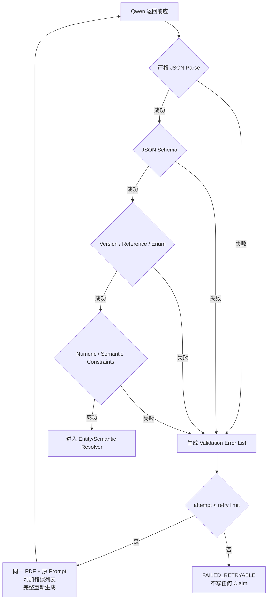

## 九、LLM 语义抽取

### 9.1 主模型

Phase 1 默认：

```text
Qwen3-14B Q4_K_M
GPU: RTX 4070S
并发：1 个主模型请求
```

模型不承担：

- PDF 下载。
- 文档状态机。
- 数据库写入。
- 图谱写入。
- Identifier 精确匹配。
- 幂等处理。

模型是以下语义的唯一主判断者：

- 什么内容属于事实。
- 什么内容属于公司披露。
- 什么内容属于管理层计划。
- 什么内容属于分析师估计、观点和预测。
- 文档中出现了哪些实体和关系。
- 一段话是否表达了产能、份额等量化语义。

程序不能从格式推断这些语义，只能验证模型输出是否符合约定。

### 9.2 Prompt 组装

每次全量抽取的 Prompt 由五层组成，顺序固定：

```text
Layer 1: System Role and Non-Negotiable Rules
Layer 2: Output JSON Schema and Field Dictionary
Layer 3: Published Semantic YAML
Layer 4: Report-Type-Specific Instructions
Layer 5: Document Metadata + PDF File
```

版本签名：

```text
prompt_signature =
  system_prompt_version
  + extraction_schema_version
  + semantic_version
  + report_type_prompt_version
  + model_id
```

任何一层变化都必须生成新的 `prompt_signature` 并记录到 Extraction Run。

### 9.3 不可协商的模型约束

System Prompt 必须明确包含以下规则：

```text
你是 Atlas 产业知识抽取器，不是聊天助手。

输出规则：
1. 只输出一个合法 JSON object。
2. 不输出 Markdown 或 code fence。
3. 不输出解释、前言、后记、分析过程或推理过程。
4. 不输出 Schema 未定义的字段。
5. 所有数组字段必须存在；没有结果时输出 []。
6. 可空标量没有信息时输出 null。
7. 不用“未知”“无”“N/A”“待确认”等字符串代替 null。

真实性规则：
8. 只能提取 PDF 中明确出现的信息。
9. 不得使用模型常识补充 PDF 未提及的信息。
10. 不得因为认识某家公司而补充代码、产品、客户或供应商。
11. 不得根据行业常识推测供应关系。
12. 不得根据一个关系推导另一个关系。
13. 不得把可能、预计、计划、目标、假设写成已经发生的事实。
14. 不得把分析师判断写成公司披露。
15. 不得把图表中看不清的数字猜出来。
16. 不得补齐缺少的单位、基期、地区或产品。
17. 不得自行计算 PDF 没有直接表达的增长率、份额或绝对值。

名称规则：
18. mention 尽量保留 PDF 中原始名称。
19. 不得在抽取阶段自行决定 Atlas entity_id。
20. 不得把品牌、子公司、母公司和上市主体自动视为同一实体。
21. 不得翻译后覆盖原始名称。

关系规则：
22. canonical predicate 只能来自 Published Semantic YAML。
23. 无法映射时 canonical_predicate_hint 必须为 null。
24. 无法映射的关系仍输出 raw_predicate 和 predicate_family。
25. 供应方向严格按照 subject → object 表达。
26. 同一关系存在不同产品、地区或时间时分别输出。

数字规则：
27. absolute_value 只保存 PDF 明确出现的绝对值。
28. relative_change 使用小数；20% 输出 0.20。
29. 只有相对变化、没有基数时，absolute_value 必须为 null。
30. 单位不明确时 unit 必须为 null。
31. “计划新增”“预计达到”“已经投产”使用不同 status。

来源规则：
32. 每个 Relation/Quantified/View 必须提供最短原文 evidence_quote。
33. page_number 填写 PDF 对应页码；无法确定时为 null。
34. evidence_quote 不得改写为总结。

完整性规则：
35. 阅读整份 PDF，而不是只处理摘要或前几页。
36. 怀疑未完整读取时 possible_truncation=true。
37. 相同事实重复出现时不要输出完全相同的对象。
```

无内容时必须按以下方式输出：

| 字段类别 | 无内容时输出 |
|---|---|
| 数组 | `[]` |
| 可空字符串、数字、日期 | `null` |
| 必填枚举 | 必须选择合法值，否则整次输出无效 |
| boolean | `true` 或 `false` |
| qualifiers | `{}`，只放 PDF 明确给出的限定条件 |

### 9.4 Published Semantic YAML 注入

Prompt 只注入当前已发布版本，不使用 draft proposal。

模型可读取：

- Entity Type 及字段说明。
- Assertion Type 及边界。
- Predicate Family。
- Canonical Predicate、方向、类型约束和 aliases。
- Metric、允许单位和数值含义。
- Analyst View Type。
- 与当前报告相关的 Industry Canonical Concept/Crosswalk 子集。
- 本报告类型需要重点抽取的字段。

完整 Published YAML 可能包含大量行业映射，不能不加筛选地全部塞入每次模型上下文。

Prompt Builder 根据以下信息生成 Prompt View：

- 报告类型。
- 报告关联的 A 股 security/company。
- phoenixA 已知申万/东财分类。
- Semantic YAML 中标记 `include_in_prompt=true` 的定义。
- Atlas Industry 顶层概念。

完整 Crosswalk 由模型输出后的 Concept Resolver 程序化使用。模型即使没有看到某个完整 mapping，也应输出 PDF 中的 raw industry term，Resolver 再映射。

### 9.5 Whole-PDF 抽取输出

模型输出统一结构：

```json
{
  "schema_version": "atlas-extraction-v2",
  "semantic_version": "atlas-semantic-v3",
  "document_id": "report_001",
  "document_assessment": {
    "readability": "READABLE",
    "readability_reason": null,
    "observed_title": "某公司深度研究",
    "primary_language": "zh",
    "possible_truncation": false,
    "last_page_referenced": 38
  },
  "entity_mentions": [],
  "relation_claims": [],
  "quantified_claims": [],
  "analyst_views": [],
  "unknown_semantic_terms": []
}
```

顶层字段：

| 字段 | 类型 | 必填 | 含义 |
|---|---|---:|---|
| `schema_version` | string | 是 | 输出 JSON Schema 版本 |
| `semantic_version` | string | 是 | 本次使用的 Published Semantic YAML 版本 |
| `document_id` | string | 是 | Atlas 传入的 source document ID，必须原样返回 |
| `document_assessment` | object | 是 | 模型对整份 PDF 可读性的声明 |
| `entity_mentions` | array | 是 | 与 Claim 有关的实体 Mention |
| `relation_claims` | array | 是 | 主体—关系—客体候选 |
| `quantified_claims` | array | 是 | 产能、份额等量化候选 |
| `analyst_views` | array | 是 | 风险、机会和投资观点 |
| `unknown_semantic_terms` | array | 是 | YAML 中未定义的语义候选 |

`document_assessment`：

| 字段 | 类型 | 可空 | 含义 |
|---|---|---:|---|
| `readability` | enum | 否 | `READABLE` 或 `UNREADABLE`；不得用空 Claim 数组代替不可读声明 |
| `readability_reason` | string | 是 | 不可读时给出简短原因；可读时为 null |
| `observed_title` | string | 是 | 模型实际读到的报告标题，用于与 phoenixA 元数据做低成本可读性校验 |
| `primary_language` | string | 否 | PDF 主要语言 |
| `possible_truncation` | boolean | 否 | 模型是否怀疑未完整读取 PDF |
| `last_page_referenced` | integer | 是 | 输出中实际引用到的最大页码，用于发现疑似截断 |

### 9.6 Entity Mention 字段字典

```json
{
  "mention_id": "m_001",
  "mention": "英伟达",
  "suggested_entity_type": "COMPANY",
  "country_hint": "US",
  "ticker_hint": "NVDA",
  "context": "英伟达是全球领先的 GPU 供应商",
  "attributes": {},
  "page_number": 12
}
```

模型只提取线索，不决定最终 `entity_id`。

| 字段 | 类型 | 可空 | 含义 |
|---|---|---:|---|
| `mention_id` | string | 否 | 当前 JSON 内的临时引用 ID |
| `mention` | string | 否 | PDF 中实际出现的实体名称 |
| `suggested_entity_type` | enum | 否 | 模型建议的 Entity Type |
| `country_hint` | string | 是 | PDF 明确给出的国家/地区线索 |
| `ticker_hint` | string | 是 | PDF 明确出现的证券代码，不得依靠常识补写 |
| `context` | string | 否 | 包含该实体的最短上下文，用于消歧 |
| `attributes` | object | 否 | Published YAML 允许的 Entity Semantic Attributes |
| `page_number` | integer | 是 | Mention 所在 PDF 页码 |

### 9.7 Relation Claim Candidate 字段字典

```json
{
  "candidate_id": "r_001",
  "subject_mention_id": "m_002",
  "subject_mention": "公司B",
  "raw_predicate": "是主要原材料供应商",
  "predicate_family": "SUPPLY_CHAIN",
  "canonical_predicate_hint": "SUPPLIES_TO",
  "object_mention_id": "m_003",
  "object_mention": "公司A",
  "assertion_type": "OBSERVED_FACT",
  "polarity": "AFFIRMED",
  "qualifiers": {
    "product": "正极材料",
    "region": null,
    "share": null
  },
  "valid_from": null,
  "valid_to": null,
  "evidence_quote": "公司B是公司A正极材料的主要供应商",
  "page_number": 12,
  "extraction_confidence": 0.84
}
```

| 字段 | 类型 | 可空 | 含义 |
|---|---|---:|---|
| `candidate_id` | string | 否 | 当前 JSON 内的 Relation Candidate ID |
| `subject_mention_id` | string | 否 | 指向 `entity_mentions[].mention_id` |
| `subject_mention` | string | 否 | 关系起点原始名称 |
| `raw_predicate` | string | 否 | PDF 原文表达的关系短语 |
| `predicate_family` | enum | 否 | Published YAML 中的顶层关系族 |
| `canonical_predicate_hint` | string | 是 | 只能选择 YAML 中的 predicate；无法匹配时为 null |
| `object_mention_id` | string | 否 | 指向客体 Mention |
| `object_mention` | string | 否 | 关系终点原始名称 |
| `assertion_type` | enum | 否 | 事实、披露、计划、估计、观点、预测或情景 |
| `polarity` | enum | 否 | `AFFIRMED`、`NEGATED`、`UNCERTAIN` |
| `qualifiers` | object | 否 | 产品、地区、份额和条件；没有时 `{}` |
| `valid_from` | date/string | 是 | 关系开始有效时间 |
| `valid_to` | date/string | 是 | 关系结束有效时间 |
| `evidence_quote` | string | 否 | 支持关系的最短 PDF 原文 |
| `page_number` | integer | 是 | 原文所在 PDF 页码 |
| `extraction_confidence` | number | 否 | 模型抽取自评，范围 0–1，不是真实概率 |

### 9.8 Quantified Claim Candidate 字段字典

```json
{
  "candidate_id": "q_001",
  "subject_mention_id": "m_004",
  "subject_mention": "公司A",
  "metric_raw_name": "动力电池产能",
  "metric_hint": "PRODUCTION_CAPACITY",
  "product_mention_id": "m_005",
  "product_mention": "动力电池",
  "absolute_value": null,
  "relative_change": 0.20,
  "unit": null,
  "baseline_period": "2025",
  "target_period": "2026",
  "status": "PLANNED",
  "assertion_type": "MANAGEMENT_GUIDANCE",
  "qualifiers": {
    "location": null
  },
  "evidence_quote": "公司计划于2027年将动力电池产能提升20%",
  "page_number": 18,
  "extraction_confidence": 0.82
}
```

| 字段 | 类型 | 可空 | 含义 |
|---|---|---:|---|
| `candidate_id` | string | 否 | 当前 JSON 内的 Quantified Candidate ID |
| `subject_mention_id` | string | 否 | 被度量主体 Mention |
| `subject_mention` | string | 否 | PDF 中主体原始名称 |
| `metric_raw_name` | string | 否 | PDF 对指标的原始表达 |
| `metric_hint` | string | 是 | Published YAML 中的 canonical metric |
| `product_mention_id` | string | 是 | 指标对应的产品 Mention |
| `product_mention` | string | 是 | 产品原始名称 |
| `absolute_value` | number | 是 | PDF 明确给出的绝对值 |
| `relative_change` | number | 是 | PDF 明确给出的相对变化，小数形式 |
| `unit` | string | 是 | PDF 明确给出的单位 |
| `baseline_period` | string | 是 | 相对变化基期 |
| `target_period` | string | 是 | 目标值或变化对应期间 |
| `status` | enum | 否 | 当前、历史、计划、建设中、完成、估计或预测 |
| `assertion_type` | enum | 否 | 信息性质 |
| `qualifiers` | object | 否 | Published YAML 允许的 Metric Semantic Attributes |
| `evidence_quote` | string | 否 | 支持数字的最短原文 |
| `page_number` | integer | 是 | 原文所在页码 |
| `extraction_confidence` | number | 否 | 模型抽取自评 0–1 |

数字规则：

- 只有百分比时不推断绝对值。
- 只有目标值时不推断当前值。
- `PLANNED`、`UNDER_CONSTRUCTION`、`COMPLETED` 必须区分。
- 公司计划和分析师估计必须区分。
- 单位不明确时保存为 null，不猜测。

### 9.9 Analyst View Candidate 字段字典

```json
{
  "candidate_id": "v_001",
  "subject_mention_id": "m_006",
  "subject_mention": "公司A",
  "view_type": "RISK",
  "topic": "原材料价格",
  "direction": "NEGATIVE",
  "summary": "上游材料价格上涨可能压缩盈利空间",
  "horizon": "MEDIUM_TERM",
  "assertion_type": "ANALYST_OPINION",
  "attributes": {},
  "evidence_quote": "我们认为上游原材料涨价将压缩公司的盈利空间",
  "page_number": 30,
  "extraction_confidence": 0.78
}
```

Analyst View 不直接投影为事实关系。

| 字段 | 类型 | 可空 | 含义 |
|---|---|---:|---|
| `candidate_id` | string | 否 | 当前 JSON 内的 View Candidate ID |
| `subject_mention_id` | string | 否 | 观点针对的实体 Mention |
| `subject_mention` | string | 否 | PDF 中实体原始名称 |
| `view_type` | enum | 否 | 风险、机会、优势、弱点、趋势或投资逻辑 |
| `topic` | string | 否 | 观点主题 |
| `direction` | enum | 否 | `POSITIVE`、`NEGATIVE`、`MIXED`、`NEUTRAL` |
| `summary` | string | 否 | 对分析师观点的忠实压缩，不引入新结论 |
| `horizon` | enum | 是 | `IMMEDIATE`、`SHORT_TERM`、`MEDIUM_TERM`、`LONG_TERM` |
| `assertion_type` | enum | 否 | 通常为 `ANALYST_OPINION`、`FORECAST` 或 `SCENARIO` |
| `attributes` | object | 否 | Published YAML 允许的 View Semantic Attributes |
| `evidence_quote` | string | 否 | 支持观点的最短原文 |
| `page_number` | integer | 是 | 原文所在页码 |
| `extraction_confidence` | number | 否 | 模型抽取自评 0–1 |

### 9.10 Unknown Semantic Term 字段字典

```json
{
  "candidate_id": "u_001",
  "semantic_kind": "PREDICATE",
  "raw_term": "协同开发",
  "suggested_family": "TECHNOLOGY",
  "suggested_definition": "两个实体共同参与产品或技术开发",
  "subject_type_hint": "COMPANY",
  "object_type_hint": "COMPANY",
  "evidence_quote": "双方将协同开发下一代电池平台",
  "page_number": 22
}
```

| 字段 | 类型 | 可空 | 含义 |
|---|---|---:|---|
| `candidate_id` | string | 否 | 当前 JSON 内的未知语义 ID |
| `semantic_kind` | enum | 否 | `FIELD`、`PREDICATE`、`METRIC`、`VIEW_TYPE`、`CONCEPT` |
| `raw_term` | string | 否 | PDF 中出现但 Published YAML 未定义的词 |
| `suggested_family` | string | 是 | 建议所属 family |
| `suggested_definition` | string | 否 | 对术语的简洁建议定义 |
| `subject_type_hint` | string | 是 | Predicate 可能的 subject type |
| `object_type_hint` | string | 是 | Predicate 可能的 object type |
| `evidence_quote` | string | 否 | 原文示例 |
| `page_number` | integer | 是 | 原文页码 |

### 9.11 程序化校验

程序不判断事实/观点的语义是否正确，但必须严格校验输出协议。

#### Level 1：响应格式

- 必须从 `{` 开始，以 `}` 结束。
- 禁止 Markdown code fence。
- 禁止 JSON 前后出现说明文字。
- 必须是单个 JSON object。
- 禁止 NaN、Infinity、注释和 trailing comma。

#### Level 2：JSON Schema

- 所有必填字段存在。
- 字段类型正确。
- nullable 符合定义。
- 禁止未定义顶层字段。
- 枚举值合法。

#### Level 3：版本一致性

- `schema_version` 等于请求值。
- `semantic_version` 等于请求值。
- `document_id` 与请求一致。

#### Level 4：引用完整性

- Relation 的 subject/object mention ID 必须存在。
- Metric/View 的 subject mention ID 必须存在。
- `page_number` 必须在 `1..pdf_page_count` 内。
- `evidence_quote` 不能为空且不能只是实体名称。

Phase 1 不做逐字 Evidence 自动比对，但 Evidence 会展示给人工审核。

#### Level 5：语义配置约束

- canonical predicate 必须存在于 Published YAML。
- metric hint 必须存在于 Published YAML。
- view type 必须存在于 Published YAML。
- subject/object type 必须满足 predicate 约束。
- 未知项必须进入 `unknown_semantic_terms`。

#### Level 6：数值与状态约束

- `relative_change` 使用小数。
- `absolute_value` 是数值或 null。
- 没有数值时不能只有单位。
- `PLANNED` 不能标记为 `OBSERVED_FACT`。
- `ANALYST_ESTIMATE` 不能标记为 `COMPANY_DISCLOSURE`。

### 9.12 Invalid Output 打回重生成

任何 Level 1–6 强制校验失败，整份输出无效，不进行部分入库。



重生成 Prompt：

```text
上一次输出无效。
请根据以下校验错误重新生成完整 JSON。
不要只返回修改片段。
不要解释错误。
不要复用不合法字段。
仍然只能输出一个 JSON object。
```

重试策略：

```text
initial attempt: 1
regeneration retries: 2
maximum total attempts: 3
```

不得：

- 用正则从解释文字中截取 JSON 后静默接受。
- 自动补造缺失业务字段。
- 把未知枚举替换为 `OTHER` 后静默入库。
- 只保存通过校验的部分数组。

### 9.13 模型调用与结果处理

单文档只产生一份 Whole-PDF Extraction Result。

模型原始响应在转换完成后丢弃。

如果模型返回 `document_assessment.readability=UNREADABLE`，或无法返回与输入元数据基本一致的 `observed_title` 且所有业务数组均为空：

- 本次输出不能被解释为“文档没有知识”。
- Atlas 记录 `MODEL_PDF_UNREADABLE`。
- 不创建 Entity/Claim/View。
- 是否重新运行由失败重试策略决定。

运行记录中保留：

- model_id。
- model_quantization。
- prompt_version。
- extraction_schema_version。
- semantic_version。
- input_mode=`PDF_DIRECT`。
- PDF size/page count/unlock status。
- request attempt 数。
- validation error code。
- 开始和完成时间。
- 错误摘要。

### 9.14 Constrained Decoding

如果本地推理端支持 JSON Schema、grammar 或 structured output，生产抽取必须启用。

优先级：

```text
JSON Schema constrained decoding
    >
JSON grammar constrained decoding
    >
Prompt-only JSON + strict validator
```

即使启用 constrained decoding，仍然必须运行 Level 1–6 Validator，因为 grammar 只能保证 JSON 形状，不能保证：

- Predicate 来自正确 Semantic Version。
- Mention 引用存在。
- Assertion Type 与 Status 自洽。
- 数字没有被错误填充。
- Evidence 和页码合理。

模型参数必须通过配置管理并写入 Run，例如：

```text
thinking_mode
temperature
top_p
top_k
maximum_output_tokens
context_limit
```

不在文档中假定某一组参数永远最优。Sample/Discovery 与 Draft Version Test 负责比较参数配置，并固定成具名 profile：

```text
production_extraction
semantic_discovery
query_agent
company_review
```

### 9.15 Report Type Prompt

Sample/Discovery 选中的生产报告类型共用核心 Schema，但可以有不同重点。未启用类型不进入生产抽取。

Published Semantic YAML 中按 Artemis report type 定义是否生产启用、抽取重点和所引用的 `prompt_profile_key`：

```yaml
report_type_profiles:
  default:
    enabled_for_production: false
    description: 未经 Sample 明确评估的类型默认禁用
  artemis_report_type:
    enabled_for_production: true
    selection_origin: discovery-run-20260727-001
    selection_reason: 样本显示产品、供应链、运营指标和观点信息密度较高
    prompt_profile_key: company-research-v1
    focus:
      - company_product_relations
      - supply_chain_relations
      - operational_metrics
      - analyst_views
    ignore_if_available_in_phoenixa:
      - historical_revenue
      - historical_net_profit
      - historical_roe
    additional_rules:
      - 不要重复抽取标准历史财务表
      - 重点提取产能、产品、客户、供应商、竞争和技术
```

`report_prompt_mapping.yaml` 不重复保存 report type 的启用状态，只把 `prompt_profile_key` 路由到具体 Prompt 实现：

```yaml
prompt_profiles:
  company-research-v1:
    template: prompts/research-extraction-v1.jinja2
    version: research-extraction-v1
```

规则：

- Report Type Prompt 只能增加关注重点，不能放宽 System Prompt 的真实性约束。
- Report Type Prompt 不能自定义与 Published YAML 冲突的 Predicate。
- 某类报告没有相关字段时输出空数组或 null，不能为了满足“重点”而猜测。
- 全部 report type profile 必须带版本。
- `enabled_for_production=false` 或未配置的类型只能用于显式 Sample/Test Run，Report Consumer 必须忽略。
- 如果 Semantic YAML 引用的 `prompt_profile_key` 在 `report_prompt_mapping.yaml` 中不存在，启动或发布校验必须失败。

### 9.16 Prompt 回归样本

每次修改 System Prompt、Schema 或 Semantic YAML，必须使用固定回归样本。

回归样本至少包含：

- 一份事实关系丰富的报告。
- 一份观点/预测丰富的报告。
- 一份产能数字丰富的报告。
- 一份海外公司名称较多的报告。
- 一份非上市供应商较多的报告。
- 一份保护 PDF。
- 一份长报告。

重点回归：

- JSON 是否纯净。
- 是否把计划写成事实。
- 是否补写 PDF 未出现的 ticker。
- 是否把公司集团、品牌、子公司错误合并。
- 是否把供应方向反转。
- 是否从模糊数字推算绝对值。
- 是否能读取到报告后半部分。

---
