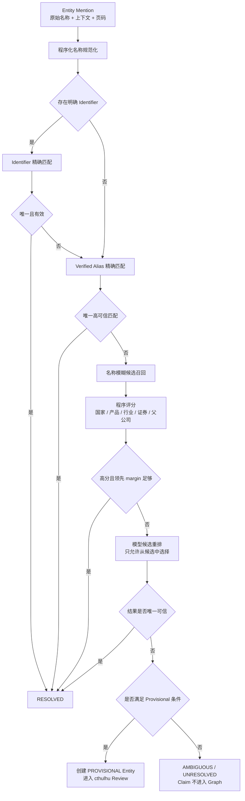

## 十、知识实体与消歧

### 10.1 渐进式实体策略

Atlas 不预先建设完整全球公司库。

实体来源：

1. phoenixA A 股 `security_registry`。
2. 研报中出现的新公司、组织、产品、材料和技术。
3. 公司公告和财报提供的子公司、参股公司和品牌线索。
4. TODO：Artemis 按需采集的官方实体资料。

### 10.2 实体类型

Phase 1 稳定枚举：

```text
COMPANY
ORGANIZATION
BRAND
PRODUCT
MATERIAL
TECHNOLOGY
MARKET
INDUSTRY_CLASS
VALUE_CHAIN
```

TODO：

```text
FACILITY
PERSON
LOCATION
ASSET
COMMODITY_INSTRUMENT
```

### 10.3 实体状态

```text
VERIFIED
    来自 security_registry、硬标识或高可信官方资料。

PROVISIONAL
    文档中能够明确区分，但缺少权威标识。

MERGED
    已合并到另一个实体。

DISABLED
    被确认无效。
```

### 10.4 为什么不直接使用名称作为 ID

以下名称可能指向同一公司：

```text
NVIDIA Corporation
NVIDIA
Nvidia
英伟达
NVDA
```

以下名称虽然相似，却可能是不同主体：

```text
上市公司
上市公司旗下品牌
上市公司的子公司
上市公司的合资公司
```

因此 Graph 和 Claim 始终使用 Atlas `entity_id`，名称只是属性和 alias。

### 10.5 实体解析流程



### 10.6 自动创建 Provisional Entity

允许自动创建，但必须满足最低条件。

公司类：

- 名称在文档中明确。
- 上下文明确是公司或组织。
- 与已有实体没有高相似候选。
- 至少存在一个区分线索：
  - 国家或地区。
  - 产品。
  - 母公司。
  - 客户/供应商关系。
  - 股票代码。
  - 原始语言全称。

不满足时只保留 unresolved mention，不创建 Graph 节点。

### 10.7 Alias 学习

Alias 可以来自：

- security_registry 中的简称和全称。
- 同一句或同一文档中的中英文并列名称。
- 股票代码附近的公司名称。
- 多份来源持续指向同一实体的名称。

状态：

```text
CANDIDATE
VERIFIED
REJECTED
```

只有 VERIFIED alias 参与无条件精确匹配。

---

