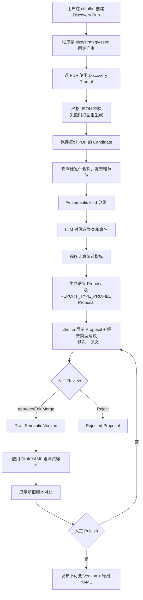

## 十一、Predicate 与语义发现

### 11.1 不在启动前人工穷举 Predicate

旧设计列出了固定关系类型，包括：

- `SUPPLIER_OF`
- `CUSTOMER_OF`
- `DEPENDS_ON_RESOURCE`
- `CONSUMES_RESOURCE`
- `PRODUCES_RESOURCE`
- `EXTRACTS_RESOURCE`
- `COMPETITOR_OF`
- `BELONGS_TO_INDUSTRY`
- `OPERATES_IN_MARKET`
- `PRODUCES`
- `USES_TECHNOLOGY`
- `OWNS_ASSET`
- `SUBSIDIARY_OF`
- `INVESTED_IN`
- `PART_OF_PRODUCT`
- `APPLIED_IN`

V2 将这些关系作为 Phase 1 的 bootstrap 参考，不把它们视为最终全集。

### 11.2 顶层 Predicate Family

模型开放抽取时，只要求先落入少量稳定 family：

```text
SUPPLY_CHAIN
PRODUCT
PRODUCTION
RESOURCE_INPUT
OWNERSHIP
INVESTMENT
COMPETITION
TECHNOLOGY
MARKET
INDUSTRY_ROLE
OTHER
```

Family 是稳定的程序约束；细粒度 predicate 可以逐步发现。

### 11.3 Phase 1 Seed Predicate

建议初始 canonical predicate：

```text
SUPPLIES_TO
PRODUCES
USES_INPUT
DEPENDS_ON
COMPETES_WITH
SUBSIDIARY_OF
INVESTS_IN
USES_TECHNOLOGY
PART_OF_PRODUCT
APPLIED_IN
OPERATES_IN_MARKET
PARTICIPATES_IN_VALUE_CHAIN
CLASSIFIED_AS
```

设计说明：

- 使用 `SUPPLIES_TO` 作为唯一正向供应关系。
- `CUSTOMER_OF` 作为查询时的反向视图，不重复持久化。
- `USES_INPUT` 覆盖材料、部件等生产输入，具体对象类型由 entity type 和 qualifier 表达。
- `CLASSIFIED_AS` 必须携带 scheme 和 version。
- Event 相关 predicate 不进入 Phase 1。

### 11.4 Raw Predicate 处理

模型可以输出：

```text
“为其核心客户”
“向其供应正极材料”
“原材料主要采购自”
“共同开发”
“潜在替代者”
```

Semantic Resolver：

1. 对 raw predicate 做文本规范化。
2. 查询已知 semantic alias。
3. 根据 subject/object entity type 过滤。
4. 使用模型判断是否可映射到现有 canonical predicate。
5. 能映射则写入 `canonical_predicate_key`。
6. 不能映射则保留 raw predicate，Claim 状态为 `CANDIDATE_SEMANTIC`。
7. 未归一化 Claim 不进入强类型 Graph。

### 11.5 Semantic Control Plane

Phase 1 建设一个小型、专用的 Semantic Control Plane。

它不是通用 Ontology 平台，只服务 Atlas 研报抽取，负责：

- 创建可配置的 Sample Discovery Run。
- 评估 Artemis 候选 report type 是否值得进入生产全量抽取。
- 让 LLM 从样本中发现全量运行所需字段。
- 聚合 Predicate、Metric、View Type 和 Concept 候选。
- 在 cthulhu 中展示 Proposal 和样本文档原文。
- 允许人工 Approve、Reject、Merge、Edit。
- 基于已审核内容构建 Draft Semantic Version。
- 使用 Draft Version 运行测试样本。
- 比较当前版本和 Draft Version 的抽取结果。
- 发布不可变 Semantic Version。
- 导出 Published Semantic YAML。
- 为测试和部署提供确定版本的 YAML。

### 11.6 两种 Discovery Run

#### BOOTSTRAP_DISCOVERY

在全量研报处理前运行。

目标：

- 从当前六类候选研报样本中总结“哪些 report type 值得处理”以及“全量运行需要提取什么”。
- 发现初始字段、Predicate、Metric、View Type 和 Concept。
- 为每个 report type 生成 `ENABLE`、`DISABLE` 或 `NEEDS_MORE_SAMPLE` 建议和专用抽取重点。
- 生成第一份可审核 Semantic Proposal。

#### INCREMENTAL_DISCOVERY

全量运行后定期或手动运行。

输入：

- 已入库但未映射的 raw predicate。
- 未知 metric。
- 未知 view type。
- 未解析的 industry/product/material/technology concept。
- 人工指定的一批新 PDF。

目标：

- 吸收长尾语义。
- 合并 synonym。
- 修订错误定义。
- 生成下一版 Semantic Proposal。

### 11.7 Discovery Run 输入参数

cthulhu 创建任务时提供：

```json
{
  "run_type": "BOOTSTRAP_DISCOVERY",
  "base_semantic_version": "atlas-semantic-v0",
  "sample_size": 120,
  "sampling_strategy": "STRATIFIED",
  "random_seed": 20260727,
  "report_types": [],
  "institutions": [],
  "published_from": "2025-01-01",
  "published_to": "2026-07-27",
  "minimum_pages": null,
  "maximum_pages": null,
  "include_processed_documents": true,
  "discover": {
    "fields": true,
    "predicates": true,
    "metrics": true,
    "view_types": true,
    "concepts": true,
    "industry_terms": true
  }
}
```

字段说明：

| 字段 | 含义 |
|---|---|
| `run_type` | 初始发现或增量发现 |
| `base_semantic_version` | Proposal 对比和继承的已发布版本 |
| `sample_size` | 本次最多抽取多少份 PDF，由用户在界面填写 |
| `sampling_strategy` | `RANDOM`、`STRATIFIED` 或 `MANUAL` |
| `random_seed` | 保证随机抽样可复现 |
| `report_types` | 限定 Artemis report type；Discovery 中空表示抽样覆盖 Artemis 当前全部候选类型，以便评估类型价值 |
| `institutions` | 限定券商/机构；空表示全部 |
| `published_from/to` | 只从可获取的近两年文档中筛选 |
| `minimum/maximum_pages` | 可选页数过滤，用于覆盖短报告和长报告 |
| `include_processed_documents` | 是否允许从已有成功抽取文档中重新做 discovery |
| `discover` | 本次希望发现的语义类别 |

### 11.8 分层抽样算法

`STRATIFIED` 由程序执行，不让 LLM 随意选文档。

优先维度：

1. Artemis report type。
2. 券商/机构。
3. 报告页数区间。
4. 行业或标的公司。
5. 发布时间。

算法：

```text
取得候选文档
    ↓
按 report_type 分组
    ↓
为每组分配基础 quota
    ↓
组内按 institution/page bucket 去重
    ↓
使用 random_seed 选择
    ↓
不足 quota 的组将余额分配给其他组
    ↓
冻结 sample_document_ids
```

Discovery Run 创建后必须保存实际 `sample_document_ids`，避免重跑时抽到另一批文档。

### 11.9 样本发现 Prompt 输出

Discovery Prompt 与生产抽取 Prompt 不同。

它不直接产出最终 Claim，而是产出“建议全量抽取的语义定义”：

```json
{
  "field_candidates": [
    {
      "field_key_suggestion": "capacity_relative_change",
      "display_name": "产能相对变化",
      "description": "公司、产品或工厂产能相对于基期的变化比例",
      "value_type": "NUMBER",
      "nullable": true,
      "applicable_report_types": ["..."],
      "example_values": [0.20],
      "evidence_examples": [
        {
          "document_id": "report_001",
          "page_number": 18,
          "quote": "预计2027年产能提升20%"
        }
      ]
    }
  ],
  "predicate_candidates": [],
  "metric_candidates": [],
  "view_type_candidates": [],
  "concept_candidates": [],
  "industry_term_candidates": [],
  "document_utility_assessment": {
    "report_type": "artemis_report_type",
    "readability": "READABLE",
    "knowledge_yield": "HIGH",
    "useful_dimensions": [
      "SUPPLY_CHAIN",
      "PRODUCT",
      "PRODUCTION",
      "ANALYST_VIEW"
    ],
    "mostly_duplicates_phoenixa_data": false,
    "recommendation": "ENABLE",
    "rationale": "该类报告反复出现可溯源的产品、产能和供应链关系"
  }
}
```

`document_utility_assessment` 是单文档样本判断，不能直接控制生产消费。Candidate Aggregator 必须按 `report_type` 聚合后再生成 `REPORT_TYPE_PROFILE` Proposal。

每个报告类型至少汇总：

```text
sample_document_count
readable_document_count
successful_extraction_count
documents_with_relation_claims
documents_with_quantified_claims
documents_with_analyst_views
average_claim_count
evidence_complete_rate
unknown_semantic_term_count
mostly_duplicates_phoenixa_count
model_enable_votes
model_disable_votes
model_needs_more_sample_votes
representative_documents
```

然后由模型读取汇总统计和代表性样本，生成：

```json
{
  "semantic_kind": "REPORT_TYPE_PROFILE",
  "report_type": "artemis_report_type",
  "enabled_for_production": true,
  "recommendation": "ENABLE",
  "focus": [
    "company_product_relations",
    "supply_chain_relations",
    "operational_metrics",
    "analyst_views"
  ],
  "ignored_content": [
    "historical_financial_tables"
  ],
  "prompt_profile_key": "company-research-v1",
  "reason": "样本中关系与量化 Claim 密度高，且大部分 Evidence 可定位",
  "statistics": {}
}
```

约束：

- 模型负责评价语义价值和建议关注重点，程序负责计算计数、成功率和覆盖率。
- `NEEDS_MORE_SAMPLE` 不能自动转成 `ENABLE`；应扩大该类型样本或由用户明确决定。
- 用户在构建/发布 Draft Semantic Version 时确认最终 `enabled_for_production`。
- 未出现在已发布 `report_type_profiles` 中的 report type 默认禁用。
- Production Consumer 只读取已发布启用清单，不能因为请求参数为空而消费全部候选类型。

字段候选必须区分两类：

```text
CORE_SCHEMA_FIELD
    改变固定 JSON envelope，例如新增一种顶层数组。
    需要修改代码、Pydantic 和 extraction_schema_version。
    不能只发布 YAML 后直接生效。

SEMANTIC_ATTRIBUTE
    放在已有对象的 qualifiers/attributes 中。
    例如 supplier_share、capacity_location、technology_generation。
    可以通过 Semantic YAML 定义并进入下一次 Prompt。
```

Phase 1 的 Discovery 默认建议 `SEMANTIC_ATTRIBUTE`，避免每发现一个字段就修改程序。

允许的扩展位置：

```text
relation_claim.qualifiers
quantified_claim.qualifiers
analyst_view.attributes
entity_mention.attributes
```

每个 YAML field definition 必须声明：

```text
target_object
target_path
value_type
nullable
description
allowed_values（如适用）
unit_semantics（如适用）
applicable_report_types
```

如果 Proposal 判断必须新增 `CORE_SCHEMA_FIELD`：

- cthulhu 标记为 `REQUIRES_CODE_CHANGE`。
- 不能直接加入普通 Draft Semantic Version。
- 开发完成并升级 Extraction Schema 后才能发布。

### 11.10 “从 Sample 总结全量字段”的具体算法

该过程不是让一次 LLM 调用直接决定最终 Schema。



程序聚合指标：

```text
document_frequency
report_type_coverage
institution_coverage
entity_type_pair_distribution
example_count
existing_definition_match
conflicting_definition_count
null_rate_in_sample
report_type_knowledge_yield
report_type_readable_rate
report_type_duplicate_data_ratio
```

Proposal 优先级：

```text
HIGH
    多个文档、多个机构重复出现，并直接服务 Graph/Query。

MEDIUM
    有清晰定义，但只在部分报告类型出现。

LOW
    低频、定义模糊或仅单一来源出现。
```

### 11.11 Proposal Review

Proposal 状态：

```text
DRAFT
APPROVED
REJECTED
MERGED
NEEDS_EDIT
PUBLISHED
```

cthulhu Review 页面必须显示：

- Proposal kind（包括 `REPORT_TYPE_PROFILE`）。
- 建议 key。
- 中文显示名。
- 字段说明。
- value type / nullable。
- Predicate 方向和 subject/object type。
- 出现文档数。
- 覆盖报告类型和机构。
- 至少 3 个原文样例。
- 与当前定义的相似项。
- LLM 建议理由。
- 用户编辑后的最终定义。

Review 操作：

- Approve。
- Reject。
- Edit Key/Name/Description。
- 修改 Enum/Type/Nullable。
- 修改 Predicate Direction。
- Merge 到已有定义。
- 拆分成两个定义。
- 标记为仅特定 report type 使用。
- 确认某个 report type 是否 `enabled_for_production`，并编辑其 focus/prompt profile。

### 11.12 Semantic Version 生命周期

```text
DRAFT
    ↓ test
TESTED
    ↓ publish
PUBLISHED
    ↓ newer version
RETIRED
```

约束：

- Published Version 不可原地修改。
- 修改必须基于旧版本创建新 Draft。
- 环境激活状态单独记录，不修改 Version 内容。
- 每个环境同一时间只有一个 Active Version。
- Extraction Run 必须记录实际 semantic version。
- 测试可以显式指定 Draft Version。
- 生产默认只能使用 Published/Active Version。

### 11.13 YAML 发布

发布操作生成完整、不可变 YAML：

```text
s3://atlas-config/semantic/atlas-semantic-v0003.yaml
```

本地开发和自动化测试可通过导出命令写入：

```text
app/projects/atlas/config/semantic/atlas-semantic-v0003.yaml
```

服务不直接修改 Git 工作区。用户可从 cthulhu 下载 YAML，或由部署流程从 MinIO 拉取。

运行配置：

```text
ATLAS_SEMANTIC_CONFIG_URI=s3://atlas-config/semantic/atlas-semantic-v0003.yaml
```

测试配置：

```text
ATLAS_SEMANTIC_CONFIG_PATH=app/projects/atlas/config/semantic/atlas-semantic-v0003.yaml
```

YAML 发布时必须：

- 通过 Schema 校验。
- 检查 key 唯一。
- 检查 alias 冲突。
- 检查 Predicate subject/object type。
- 检查 Crosswalk 引用存在。
- 检查至少一个 report type 被启用。
- 检查启用类型都有 prompt profile，且 key 与 Artemis 元数据枚举一致。
- 计算 SHA-256。
- 保存 version、hash、object URI 和发布人。

### 11.14 YAML 结构

```yaml
version: atlas-semantic-v0003
schema_version: atlas-semantic-schema-v1

extraction_fields:
  - key: capacity_relative_change
    display_name: 产能相对变化
    description: 公司、产品或工厂产能相对于基期的变化比例
    field_class: SEMANTIC_ATTRIBUTE
    target_object: quantified_claim
    target_path: qualifiers.capacity_relative_change
    value_type: number
    nullable: true
    applies_to:
      - quantified_claim

entity_types:
  - key: COMPANY
    display_name: 公司
    description: 具有独立经营或法律身份的企业主体

assertion_types:
  - key: OBSERVED_FACT
    display_name: 已发生事实
    description: PDF 明确陈述已经发生或当前存在的事实

predicate_families:
  - key: SUPPLY_CHAIN
    display_name: 供应链

predicates:
  - key: SUPPLIES_TO
    display_name: 向其供应
    description: subject 向 object 供应产品、材料或部件
    family: SUPPLY_CHAIN
    subject_types: [COMPANY]
    object_types: [COMPANY]
    aliases:
      - 是其供应商
      - 向其供货
      - 为其提供原材料

metrics:
  - key: PRODUCTION_CAPACITY
    display_name: 产能
    description: 在指定期间和单位下的最大生产能力
    allowed_units: [GWh, 万吨, 万台, 亿元]

analyst_view_types:
  - key: RISK
    display_name: 风险
    description: 分析师认为可能对主体产生不利影响的因素

industry_taxonomies: []
industry_crosswalks: []

report_type_profiles:
  default:
    enabled_for_production: false
    description: 未经 Sample/Discovery 明确评估的类型默认不进入生产
  artemis_report_type:
    enabled_for_production: true
    selection_origin: discovery-run-20260727-001
    recommendation: ENABLE
    reason: 样本中产业关系和运营量化信息密度较高
    prompt_profile_key: company-research-v1
    required_sections:
      - entity_mentions
      - relation_claims
      - quantified_claims
      - analyst_views
```

---
