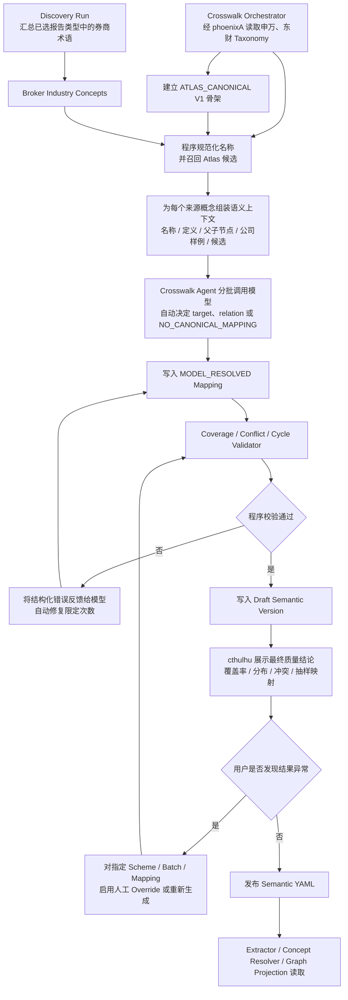

## 十二、产业分类与产业链

### 12.1 Phase 1 Crosswalk 决策

Phase 1 必须构建以下 Crosswalk：

```text
申万行业分类
东财行业/概念分类
Sample 选中类型的研报中出现的券商行业术语
        ↓
Atlas Canonical Industry
```

“完整”的 Phase 1 范围定义为：

- 配置版本中的全部申万行业概念都有明确处理结果。
- 已由 Artemis/phoenixA 获取的全部东财行业/概念都有明确处理结果。
- Discovery Sample 和 Phase 1 全量研报中实际出现的券商行业术语都有明确处理结果。
- 每个来源概念必须：
  - 映射到一个或多个 Atlas Canonical Industry；或
  - 明确标记为 `NO_CANONICAL_MAPPING` 并说明原因。

不承诺覆盖尚未获取、尚未在 PDF 中出现的所有券商内部分类。

数据责任：

| 数据 | 采集 | 共享持久化 | Crosswalk 构建 |
|---|---|---|---|
| 申万分类 Snapshot | 已有任务/phoenixA | phoenixA | Atlas |
| 东财行业/概念 Snapshot | Artemis | phoenixA | Atlas |
| 券商行业术语 | Artemis 已下载 PDF | PDF 在 MinIO，术语在 atlas_kg | Atlas LLM 自动映射 + 结果级 Review |
| Atlas Canonical Industry | 不外采 | atlas_kg + Semantic YAML | Atlas |

如果 Phase 1 开始时东财 Snapshot 尚未进入 phoenixA：

- Atlas 不自行实现东财下载。
- 将“Artemis 获取东财 Snapshot”列为 Crosswalk Phase 的前置依赖。
- 申万、券商术语可以先进入 Draft，但不能把 Crosswalk 标记为 Phase 1 完整发布。

### 12.2 为什么需要 Atlas Canonical Industry

如果 Graph 只保存：

```text
Company
  ├── CLASSIFIED_AS → SW2021 Industry Concept
  └── CLASSIFIED_AS → EastMoney Industry Concept
```

查询“某产业有哪些公司”时会得到多个互不兼容的答案。

因此增加独立的：

```text
Atlas Canonical Industry Scheme
```

它的用途：

- 作为跨来源查询的统一入口。
- 保留申万、东财和券商术语的来源差异。
- 不覆盖原始分类。
- 允许一对多和多对一映射。
- 为 LLM 抽取提供稳定的行业候选。
- 为 Cthulhu 展示统一行业入口。

### 12.3 初始 Canonical Industry 构建

Phase 1 不从空白开始创造一套行业体系。

初始化策略：

1. 使用当前申万行业层级作为第一版结构骨架。
2. 为每个申万概念生成独立 Atlas canonical ID。
3. 申万概念与对应 Atlas 概念初始为 `EXACT`。
4. 经 phoenixA 读取东财概念，由 Crosswalk Agent 自动生成映射。
5. 从研报样本发现券商行业术语，由 Crosswalk Agent 自动生成映射。
6. 当东财或券商概念无法合理映射到现有 Atlas 概念时，允许模型建议新增 Atlas Concept。
7. 模型结果通过 Coverage/Conflict/Cycle 校验后直接进入 Draft Semantic Version，不要求人工逐条批准。
8. 人工在 cthulhu 查看最终覆盖率、关系分布、冲突和抽样结果；发现整体结果不合理时，再对指定 Scheme、Batch 或 Mapping 启用人工介入。

这样申万只是 V1 的结构起点，不是永远不可修改的唯一真相。

### 12.4 Taxonomy Scheme

每套分类保存独立 Scheme：

```text
SW
EASTMONEY
BROKER:{institution_key}
ATLAS_CANONICAL
```

Scheme 字段：

```json
{
  "scheme_key": "SW",
  "display_name": "申万行业分类",
  "version": "2021",
  "source_system": "phoenixA",
  "snapshot_date": "2026-07-27",
  "status": "ACTIVE"
}
```

券商 PDF 中没有正式代码时：

```text
scheme_key = BROKER:{institution_key}
concept_code = hash(normalized_raw_term)
external_code = null
```

### 12.5 Crosswalk Relation

映射类型：

```text
EXACT
    来源概念与 Atlas 概念语义等价。

CLOSE
    高度接近，但边界存在轻微差异。

BROADER
    来源概念比 Atlas 概念更宽。

NARROWER
    来源概念比 Atlas 概念更窄。

RELATED
    有明显关联，但不是层级或等价。

NO_CANONICAL_MAPPING
    当前明确不映射；必须填写原因。
```

一个 Crosswalk Mapping 必须包含：

```text
source_scheme
source_concept
target_atlas_concept
mapping_relation
confidence
proposal_origin
resolution_status
crosswalk_run_id
semantic_version
notes
overridden_by（可空）
override_reason（可空）
```

### 12.6 Crosswalk 构建流程



模型读取 phoenixA 数据的含义是：

- Crosswalk Orchestrator 调用 phoenixA 领域 API 获取版本化 Taxonomy Snapshot、层级、定义以及可选公司归属样例。
- 程序按 source concept 组装有限、可审计的 Context Packet，再交给模型；不把 PostgreSQL/Neo4j 凭据或任意 SQL 能力交给模型。
- 数据量较大时按同一父节点、相邻层级或候选 Atlas 子树分批；每个 source concept 最终只能有一个明确处理状态。
- 模型可以选择 `EXACT/CLOSE/BROADER/NARROWER/RELATED/NO_CANONICAL_MAPPING`，也可以建议新增 Atlas Concept，但不能直接发布版本。
- 每次模型输出仍须经过严格 JSON Schema 和枚举校验；格式错误按 LLM Regeneration 规则打回。

### 12.7 Crosswalk 程序检查

程序化检查：

- 所有来源 concept 都有处理结果。
- `EXACT/CLOSE/BROADER/NARROWER/RELATED` 必须引用存在的 Atlas concept。
- 不允许 concept 映射到自己。
- Atlas broader/narrower 层级不能形成循环。
- 同一个来源 concept 可以映射多个 Atlas concept，但必须说明。
- `EXACT` 多重映射需要警告。
- 被删除或 retired 的 Atlas concept 不能作为新 target。
- 所有 mapping 必须属于明确 semantic version。

LLM 负责：

- 根据名称、定义、父子层级和公司样例自动确定映射。
- 决定是 EXACT、CLOSE、BROADER、NARROWER、RELATED 还是 NO_CANONICAL_MAPPING。
- 必要时建议新建 Atlas concept。
- 根据程序返回的覆盖、冲突或循环错误自动修复映射。
- 给出简短映射理由和自评 confidence。

人工负责：

- 查看整个 Crosswalk Run 的最终质量摘要和代表性抽样。
- 决定是否发布/激活包含该 Crosswalk 的 Semantic Version。
- 只有发现结果异常时，才对指定范围编辑 Atlas concept、修改映射、标记 No Mapping 或要求模型重新生成。
- 人工修改必须作为 `HUMAN_OVERRIDE` 记录，保留原模型结果、修改人和原因；不能静默覆盖。

### 12.8 Graph 中如何应用 Crosswalk

保留两类节点：

```text
(:IndustryConcept {
  concept_id,
  scheme_key,
  code,
  name,
  version
})

(:AtlasIndustry {
  concept_id,
  name,
  definition,
  semantic_version
})
```

保留来源分类：

```text
(:Company)-[:CLASSIFIED_AS {
  scheme: "SW",
  version: "2021",
  source: "phoenixA"
}]->(:IndustryConcept)
```

建立映射：

```text
(:IndustryConcept)-[:MAPS_TO {
  relation: "EXACT",
  semantic_version: "atlas-semantic-v3"
}]->(:AtlasIndustry)
```

统一查询视图：

```text
Company
→ CLASSIFIED_AS
→ Source Industry Concept
→ MAPS_TO
→ Atlas Industry
```

研报直接明确描述公司所属产业时，也可以形成来源为研报的 `CLASSIFIED_AS` Claim，但必须保留：

- 原始行业术语。
- 券商 Scheme。
- Assertion Type。
- Source Document。

### 12.9 LLM 抽取如何使用 Crosswalk

Published YAML 为模型提供：

```yaml
industry_taxonomies:
  - scheme: SW
    version: "2021"
  - scheme: EASTMONEY
    version: "2026-07-27"
  - scheme: ATLAS_CANONICAL
    version: "v3"

industry_crosswalks:
  - source_scheme: SW
    source_code: "..."
    source_name: "电池"
    relation: EXACT
    target_atlas_key: BATTERY_INDUSTRY
```

生产抽取时：

- 模型先输出 PDF 中的 raw industry term。
- 如果 Published YAML 中有明确 alias/crosswalk，可以给出 canonical hint。
- 没有时输出 unknown industry term。
- 模型不得自创申万或东财 code。
- Concept Resolver 在模型输出后再次程序化校验。

### 12.10 Cthulhu Crosswalk Quality 与异常介入

页面默认是结果级质量观察页，不要求用户逐条处理 Mapping。至少包含：

- Scheme/Version 过滤。
- Crosswalk Run 状态和所用模型/Prompt/Taxonomy Snapshot 版本。
- 已处理、校验失败、No Mapping、Human Override 过滤。
- 来源 concept 的 code、name、parent 和 description。
- 模型确定的 Atlas concept。
- Mapping Relation。
- LLM 理由和 confidence。
- 研报原文例子。
- 当前 Coverage。
- 冲突和循环警告。
- 各 relation 类型分布和低 confidence 分布。
- 按 Scheme/层级随机抽样的 Mapping。
- Draft/Published Version 对比。

异常介入操作：

- 对指定 Scheme、父节点或模型批次重新生成。
- 对单条 Mapping 执行 Override。
- Mark No Mapping。
- 创建或修改 Atlas canonical concept 后重跑受影响子树。
- 开启 `manual_review_required` 仅阻断指定范围，而不是把全量 Crosswalk 退化为逐条审核。

### 12.11 产业链不是行业分类

Atlas 的产业链主要由实体和关系构成：

```text
Material → Product → Product → Market
              ↑          ↑
           Company    Company
```

示例：

```text
锂矿
  → 正极材料
  → 电芯
  → 动力电池包
  → 新能源汽车
```

公司通过以下关系参与产业链：

- `PRODUCES`
- `USES_INPUT`
- `SUPPLIES_TO`
- `USES_TECHNOLOGY`
- `PARTICIPATES_IN_VALUE_CHAIN`

Crosswalk 解决“不同体系怎样说同一个行业”，产品和供需 Graph 解决“产业链如何实际连接”，两者不能互相替代。

### 12.12 上中下游位置

`upstream/midstream/downstream` 不是 Company 固定属性。

如需表达：

```json
{
  "predicate": "PARTICIPATES_IN_VALUE_CHAIN",
  "qualifiers": {
    "value_chain": "动力电池产业链",
    "segment": "电芯制造",
    "position": "MIDSTREAM",
    "product": "动力电池电芯"
  }
}
```

同一公司可以在不同产业链中拥有不同位置。

### 12.13 研报中的行业词

模型抽取到：

```text
锂电产业
动力电池行业
新能源汽车电池产业链
AI 算力产业链
GPU 产业
```

处理方式：

- 先作为 `VALUE_CHAIN`、`MARKET` 或 `INDUSTRY_CLASS` 类型的 entity mention。
- 尝试匹配已有 Atlas knowledge entity alias。
- 无法匹配时创建 provisional knowledge entity。
- 同时生成 Broker Industry Concept，并交给 Crosswalk Agent 自动映射。
- 多份文档中的相似概念由 Discovery/Crosswalk Workflow 归并。

Phase 1 允许暂时存在 provisional 概念，但在目标 Semantic Version 发布前，所有已发现行业术语必须具有明确处理结果：有效 Mapping、`NO_CANONICAL_MAPPING` 或被显式置入异常阻断范围。默认不要求逐条人工 review。

---
