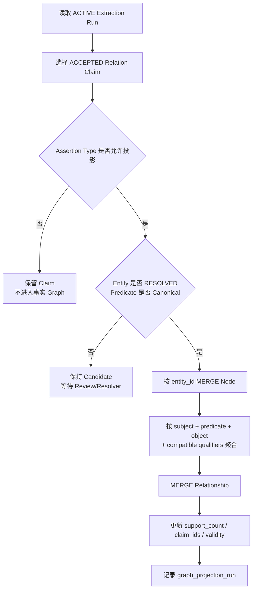

## 十五、Neo4j 图谱设计

### 15.1 节点

使用 Atlas `entity_id` 作为唯一键。

示例：

```text
(:Company {
  entity_id,
  canonical_name,
  country_code,
  entity_status
})

(:Product {
  entity_id,
  canonical_name,
  entity_status
})

(:Material {
  entity_id,
  canonical_name,
  entity_status
})

(:Technology {
  entity_id,
  canonical_name,
  entity_status
})

(:Market {
  entity_id,
  canonical_name,
  entity_status
})

(:IndustryClass {
  entity_id,
  canonical_name,
  scheme,
  code,
  version
})

(:ValueChain {
  entity_id,
  canonical_name,
  entity_status
})
```

### 15.2 关系

只投影 canonical predicate。

示例：

```text
(:Company)-[:SUPPLIES_TO]->(:Company)
(:Company)-[:PRODUCES]->(:Product)
(:Company)-[:USES_INPUT]->(:Material)
(:Company)-[:DEPENDS_ON]->(:Product|Material|Technology)
(:Company)-[:COMPETES_WITH]->(:Company)
(:Company)-[:SUBSIDIARY_OF]->(:Company)
(:Company)-[:INVESTS_IN]->(:Company)
(:Company)-[:USES_TECHNOLOGY]->(:Technology)
(:Product)-[:PART_OF_PRODUCT]->(:Product)
(:Technology)-[:APPLIED_IN]->(:Product)
(:Company)-[:OPERATES_IN_MARKET]->(:Market)
(:Company)-[:CLASSIFIED_AS]->(:IndustryClass)
(:Company)-[:PARTICIPATES_IN_VALUE_CHAIN]->(:ValueChain)
```

### 15.3 关系属性

Graph 关系保存最小聚合信息：

```text
support_count
support_claim_ids
latest_source_document_id
assertion_type
valid_from
valid_to
qualifiers
last_projected_at
```

说明：

- Graph 关系来自 Claim 聚合。
- `support_claim_ids` 用于回查 PostgreSQL。
- 不把 Analyst View 投影成事实边。
- 不把未知 raw predicate 投影成强类型边。

### 15.4 投影规则



### 15.5 删除和修正

当 Claim 被 `REJECTED` 或 `SUPERSEDED`：

- 增量投影重新计算对应聚合关系。
- 若无有效支持 Claim，删除 Graph 关系。
- 若仍有其他支持 Claim，只更新 support 信息。

### 15.6 Neo4j 访问边界

Atlas 负责生成确定性的 Node/Relationship Projection Batch 和结构化查询参数，但不直接连接 Neo4j：

```text
Atlas projection_service
    ↓ projection batch
Atlas graph_repository
    ↓ HTTP
phoenixA Graph API
    ↓ managed Neo4j driver / transaction
Neo4j
```

约束：

- Neo4j URI、凭据、Driver 和连接池只存在于 phoenixA infrastructure。
- Atlas `graph_repository` 通过 `phoenixa_client` 调用领域化接口。
- 写入接口接收版本化投影批次，不接收任意 Cypher。
- 查询接口使用预定义 `query_name + parameters`，Query Agent 不能执行任意 Cypher。
- phoenixA 负责连接、事务、权限和审计；Atlas 负责 Claim 选择、关系语义、聚合键和重建顺序。

---
