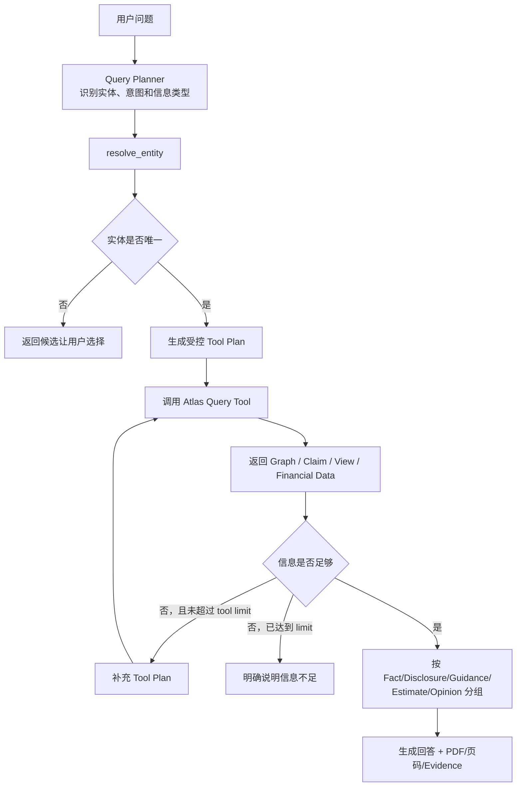

## 十七、Atlas Query Agent

### 17.1 定位

Query Agent 是 Atlas 领域内的问答编排器，不是全局 Agent 平台。

适合回答：

- 某公司的核心产品是什么。
- 某公司的主要供应商和客户有哪些。
- 某公司依赖哪些原材料和技术。
- 某产品链有哪些 A 股公司。
- 券商对某公司的主要风险观点是什么。
- 研报中对某项产能的看法是否一致。
- 某公司在不同产业链中的位置是什么。

不负责：

- 自动交易。
- 投资组合管理。
- 通用互联网搜索。
- 邮件、日历等外部操作。
- 当前新闻事件影响判断。

### 17.2 Query Agent 工具集

Agent 只能调用允许的领域工具：

```text
resolve_entity
get_company_profile
get_company_products
get_company_inputs
get_supply_relationships
get_competitors
traverse_value_chain
find_relation_claims
find_quantified_claims
find_analyst_views
get_phoenixa_financial_metrics
get_source_document_metadata
```

### 17.3 执行流程



### 17.4 回答约束

Query Agent 必须：

- 区分事实、公司披露和分析师观点。
- 不把 Analyst View 表述成已经发生的事实。
- 指明主要信息来自哪些 source document。
- 当实体无法唯一解析时返回歧义候选。
- 当 Graph 和 Claim 不包含答案时明确说明缺少信息。
- 不根据常识自动补写未入库关系。

Phase 1 保存模型返回的最小 evidence quote 和 page number，因此 Query Agent 可以引用文档、页码和短原文。它不提供 bbox，也没有程序逐字校验原文位置；回答中必须把这类 Evidence 视为模型抽取的可审核定位，而不是经过版面引擎验证的精确 Anchor。

### 17.5 API

```http
POST /api/v1/atlas-kg/query
```

```json
{
  "question": "宁德时代的主要上游依赖和券商关注的风险是什么？",
  "max_tool_calls": 8,
  "include_source_documents": true
}
```

---

