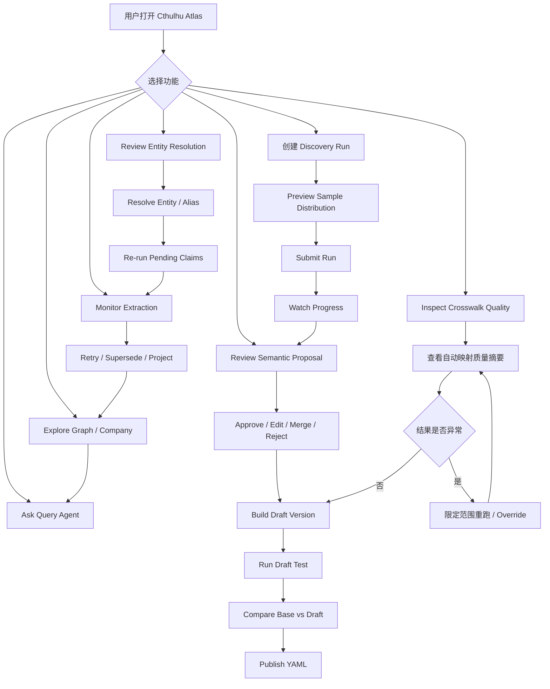

## 十九、Cthulhu 前端接入

### 19.1 Phase 1 前端范围

Cthulhu 是 Atlas Phase 1 的操作和审核入口，不只是 Graph 展示页面。

必须支持：

- 查看 Atlas 运行状态。
- 创建可选 sample size 的 Semantic Discovery Run。
- 查看 Discovery 进度和样本文档。
- 查看每种候选 report type 的知识产出评估，并确认生产启用清单。
- 审核字段、Predicate、Metric、View Type 和 Concept Proposal。
- 构建、测试、发布和激活 Semantic Version。
- 下载已发布 YAML。
- 查看申万、东财、券商行业 Crosswalk 的自动处理结论，并在异常时介入。
- 审核歧义实体和 provisional entity。
- 查看 Extraction Run 和失败原因。
- 手动重试 PDF。
- 查看 Graph。
- 查看公司产业画像。
- 使用 Atlas Query Agent。

### 19.2 前端路由

```text
/atlas
/atlas/overview
/atlas/extraction-runs
/atlas/extraction-runs/:runId
/atlas/discovery-runs
/atlas/discovery-runs/new
/atlas/discovery-runs/:runId
/atlas/semantic-proposals
/atlas/semantic-proposals/:proposalId
/atlas/semantic-versions
/atlas/semantic-versions/:version
/atlas/industry-crosswalk
/atlas/entity-review
/atlas/graph
/atlas/companies/:entityId
/atlas/query
```

### 19.3 Overview 页面

展示：

- 待处理 PDF 数。
- 成功/失败 Extraction Run。
- PDF 内存解保护成功/失败分布。
- JSON regeneration 次数和通过率。
- possible truncation 数量。
- unresolved entity 数量。
- semantic proposal 待审核数量。
- industry mapping coverage。
- active semantic version。
- Neo4j projection 状态。

快捷操作：

- Consume Reports。
- Create Discovery Run。
- Review Proposals。
- Inspect Crosswalk Quality。
- Publish/Activate Version。
- Rebuild Graph。

### 19.4 Discovery Run 创建页面

表单：

```text
Run Type
Base Semantic Version
Sample Size
Sampling Strategy
Random Seed
Report Types
Institutions
Publish Date Range
Minimum/Maximum Pages
Discover Fields
Discover Predicates
Discover Metrics
Discover View Types
Discover Concepts
Discover Industry Terms
```

提交前预览：

- 候选文档总数。
- 各 report type 预计样本数。
- 各机构预计样本数。
- 页数区间分布。
- 是否存在某类报告样本不足。

API：

```http
POST /api/v1/atlas-kg/semantic-discovery-runs:preview
POST /api/v1/atlas-kg/semantic-discovery-runs
GET  /api/v1/atlas-kg/semantic-discovery-runs/{run_id}
POST /api/v1/atlas-kg/semantic-discovery-runs/{run_id}:cancel
POST /api/v1/atlas-kg/semantic-discovery-runs/{run_id}:retry-failed
```

### 19.5 Discovery Run 详情页面

显示：

- 输入参数。
- 固定后的 sample document IDs。
- 总进度。
- 每个 report type 进度。
- 每个 report type 的可读率、Claim 产出、Evidence 完整率和模型启用建议。
- 每个 PDF 状态和失败原因。
- JSON format retry 次数。
- 已发现 Candidate 数。
- Aggregation 状态。
- 生成的 Proposal 数。
- `REPORT_TYPE_PROFILE` Proposal 及建议启用/禁用原因。

运行中允许：

- Cancel。
- 查看失败 PDF。
- 对失败 PDF 单独重试。

运行完成后：

- 跳转 Proposal Review。
- 导出统计结果。
- 使用同一 sample 创建对照测试。

### 19.6 Semantic Proposal Review 页面

布局：

```text
左侧：Proposal 列表和过滤器
中间：定义、类型、频次和冲突信息
右侧：PDF 原文例子和当前版本相似定义
底部：Review 操作
```

过滤器：

```text
Semantic Kind
Review Status
Priority
Report Type
Institution
Minimum Document Frequency
Has Conflict
Suggested Existing Mapping
```

列表列：

```text
Kind
Suggested Key
Display Name
Document Frequency
Report Type Coverage
Institution Coverage
Priority
Review Status
```

编辑表单必须显示字段说明：

```text
Key
Display Name
Description
Value Type
Nullable
Family
Subject Types
Object Types
Aliases
Applicable Report Types
Enabled For Production（仅 REPORT_TYPE_PROFILE）
Prompt Profile（仅 REPORT_TYPE_PROFILE）
```

操作：

```text
Approve
Reject
Needs Edit
Merge Into Existing
Split Proposal
Save Edited Definition
Bulk Approve Selected
Confirm Report Type Selection
```

API：

```http
GET   /api/v1/atlas-kg/semantic-proposals
GET   /api/v1/atlas-kg/semantic-proposals/{proposal_id}
PATCH /api/v1/atlas-kg/semantic-proposals/{proposal_id}
POST  /api/v1/atlas-kg/semantic-proposals/{proposal_id}:approve
POST  /api/v1/atlas-kg/semantic-proposals/{proposal_id}:reject
POST  /api/v1/atlas-kg/semantic-proposals/{proposal_id}:merge
POST  /api/v1/atlas-kg/semantic-proposals:bulk-review
```

### 19.7 Semantic Version 页面

能力：

- 从 base version + approved proposals 创建 Draft。
- 显示 YAML 结构化预览。
- 显示与 base version 的 Diff。
- 显示新增、修改、删除定义。
- 运行 Schema Validation。
- 选择测试 sample。
- 使用 Draft YAML 发起 Extraction Test。
- 对比 base/draft 抽取结果。
- 发布 Version。
- 激活到指定环境。
- 下载 YAML。

Draft Test 对比：

| 指标 | Base | Draft | 变化 |
|---|---:|---:|---:|
| JSON valid rate |  |  |  |
| Relation count |  |  |  |
| Unknown predicate count |  |  |  |
| Entity unresolved count |  |  |  |
| Quantified claim count |  |  |  |
| Analyst view count |  |  |  |
| Possible truncation |  |  |  |

API：

```http
POST /api/v1/atlas-kg/semantic-versions
GET  /api/v1/atlas-kg/semantic-versions
GET  /api/v1/atlas-kg/semantic-versions/{version}
GET  /api/v1/atlas-kg/semantic-versions/{version}/diff
POST /api/v1/atlas-kg/semantic-versions/{version}:validate
POST /api/v1/atlas-kg/semantic-versions/{version}:test
GET  /api/v1/atlas-kg/semantic-versions/{version}/test-result
POST /api/v1/atlas-kg/semantic-versions/{version}:publish
POST /api/v1/atlas-kg/semantic-versions/{version}:activate
GET  /api/v1/atlas-kg/semantic-versions/{version}/yaml
```

激活请求：

```json
{
  "environment": "TEST",
  "expected_yaml_sha256": "..."
}
```

### 19.8 Industry Crosswalk Quality 与异常介入页面

默认布局：

```text
Crosswalk Run / Scheme / Version Selector
    ↓
Quality Summary
    ↓
Relation Distribution + Conflict/Cycle + Confidence
    ↓
Representative Mapping Samples
    ↓
Exception Actions（默认收起）
```

Quality Summary：

```text
total concepts
processed concepts
mapped concepts
exact mappings
close mappings
broader/narrower mappings
related mappings
no canonical mapping
validation failed
human override
conflicts
coverage percentage
```

默认行为：

- 查看模型已经完成的 Crosswalk 结果，不要求逐条 Approve。
- 查看本次模型、Prompt、申万/东财/券商 Snapshot 和 Atlas Scheme 版本。
- 查看来源分类树和 Atlas 分类树。
- 按 Scheme/层级随机抽样 Mapping。
- 当 Coverage 完整、无结构冲突且抽样合理时，用户只需继续发布 Semantic Version。

只有发现结果异常时才展开操作：

- Re-run 指定 Scheme、父节点、概念或失败批次。
- Override target Atlas concept 或 relation。
- Mark No Mapping。
- Create/Edit Atlas concept 后重跑受影响子树。
- 对指定范围开启 `manual_review_required`。

每次 Override 必须填写原因，UI 同时展示模型原结果与人工有效结果。

API：

```http
GET    /api/v1/atlas-kg/industry-taxonomies
POST   /api/v1/atlas-kg/industry-taxonomies:import
POST   /api/v1/atlas-kg/industry-crosswalk-runs
GET    /api/v1/atlas-kg/industry-crosswalk-runs/{run_id}
GET    /api/v1/atlas-kg/industry-crosswalk/coverage
GET    /api/v1/atlas-kg/industry-crosswalk/mappings
POST   /api/v1/atlas-kg/industry-crosswalk-runs/{run_id}:rerun-scope
POST   /api/v1/atlas-kg/industry-crosswalk/mappings/{mapping_id}:override
DELETE /api/v1/atlas-kg/industry-crosswalk/mappings/{mapping_id}/override
POST   /api/v1/atlas-kg/atlas-industries
```

### 19.9 Entity Resolution Review 页面

展示：

- raw mention。
- 建议 entity type。
- 来源 PDF、页码和上下文。
- 候选实体及分数。
- 已知 alias、identifier、国家、产品和关联证券。
- 模型重排理由。
- 当前 Claim 数。

操作：

- Resolve to Existing。
- Create Provisional Entity。
- Add Candidate Alias。
- Reject Mention。
- Merge Entities。
- Re-run Pending Claims。

### 19.10 Extraction Run 页面

列表显示：

```text
Run ID
Document
Report Type
PDF Size/Page Count
PDF Unlock Status
Model
Semantic Version
Prompt Signature
Attempt Count
Validation Errors
Possible Truncation
Claim Counts
Status
Duration
```

详情显示：

- 文档元数据。
- PDF Input Adapter / Unlock 状态。
- 每次请求 attempt 的开始/完成时间和错误码。
- 不显示 LLM raw response。
- 最终标准化 Entity/Claim/View。
- Evidence quote 和 page number。

操作：

- Retry。
- Retry With Semantic Version。
- Mark Permanent Failure。
- Supersede Run。
- Re-project Graph。

### 19.11 Graph、Company Review 与 Query 页面

Graph Explorer：

- 按 entity、predicate、industry、claim support 过滤。
- 展示 Company/Product/Material/Technology/Industry。
- 点击 Edge 显示支持 Claim 和来源文档。
- 区分 VERIFIED/PROVISIONAL entity。
- 默认不显示 Analyst View 为事实边。

Company Review：

- 公司实体和证券。
- 申万/东财/券商/Atlas 行业。
- 核心产品。
- 上游输入和供应商。
- 下游客户和市场。
- 竞争关系。
- Quantified Claim。
- Analyst View。
- 来源报告。

Query：

- 自然语言输入。
- 显示 Query Agent Tool Call timeline。
- 显示结构化结果。
- 显示最终总结。
- 显示来源 PDF、页码和 evidence quote。
- 标记内容性质：Fact、Disclosure、Guidance、Estimate、Opinion。

### 19.12 前端调用流程



### 19.13 权限

建议权限：

```text
ATLAS_VIEWER
    查看运行、Proposal、Graph 和 Query。

ATLAS_REVIEWER
    审核 Semantic Proposal 和 Entity Resolution；在 Crosswalk 异常时执行 Override。

ATLAS_PUBLISHER
    发布和激活 Semantic Version。

ATLAS_OPERATOR
    发起批处理、重试、取消、Graph Rebuild。
```

高风险操作：

- Publish Semantic Version。
- Activate Production Version。
- Full Graph Rebuild。
- Merge Entity。
- Crosswalk 批量 Override 或范围重跑。

必须二次确认并记录操作者。

### 19.14 Cthulhu 逻辑模块

以下是逻辑组织，具体 Angular 目录应在实现时对齐 cthulhu 现有项目约定：

```text
cthulhu atlas feature
├── atlas-routing
├── atlas-api-client
├── overview
├── extraction-runs
│   ├── extraction-run-list
│   └── extraction-run-detail
├── semantic-discovery
│   ├── discovery-run-create
│   ├── discovery-run-detail
│   ├── proposal-review
│   ├── version-list
│   ├── version-diff
│   └── version-test-result
├── industry-crosswalk
│   ├── taxonomy-tree
│   ├── quality-summary
│   ├── mapping-sampler
│   ├── exception-override
│   └── coverage-summary
├── entity-resolution
│   ├── unresolved-list
│   └── entity-review-detail
├── graph-explorer
├── company-review
└── query-agent
```

共享组件：

```text
SourceDocumentLink
EvidenceQuote
AssertionTypeBadge
EntityStatusBadge
SemanticVersionBadge
ReviewStatusBadge
ValidationErrorList
YamlViewer
VersionDiffViewer
```

---
