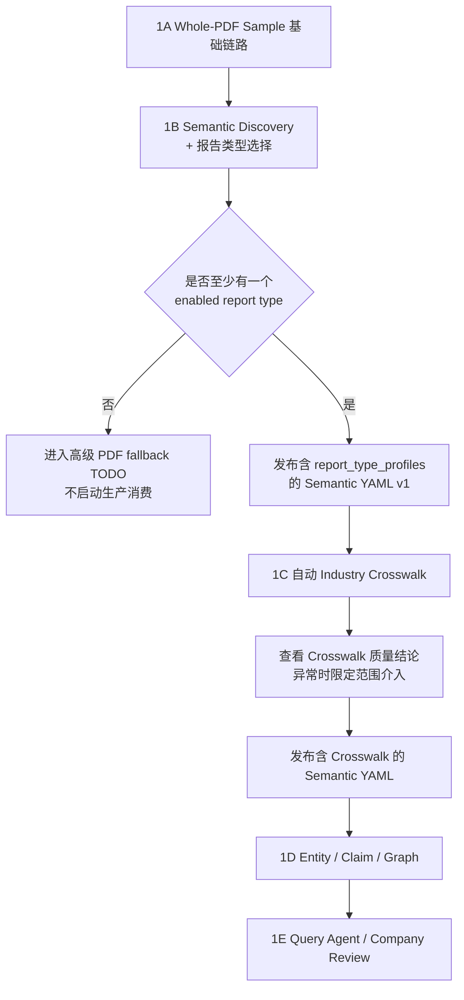

## 二十四、实施阶段

### Phase 1A：Whole-PDF Sample 基础链路

目标：

- 建立可运行的 Whole-PDF Sample 抽取链路。
- 对 Artemis 当前候选报告类型取得真实运行数据，供下一阶段判断哪些类型值得生产消费。

工作：

- 接入 phoenixA 下载记录和 MinIO 读取。
- 集成 pikepdf 内存解保护。
- 实现 PDF buffer 生命周期和强制释放。
- 实现 Whole-PDF LLM Client。
- 定义严格 JSON Schema。
- 实现六级 Validator。
- 实现 Invalid Output Regeneration。
- 对每种候选 report type 运行可配置规模的 Sample。
- 记录可读性、耗时、Schema 成功率、Claim 产出和 Evidence 完整率。
- 失败文档写入运行记录，不为损坏、密码、加密类型另建复杂分支。

本阶段不再额外产生 `Capability Probe` 或 `Whole-PDF Gate`。Sample 本身就是能力验证；结果直接进入 Phase 1B 的报告类型和语义归纳：

```text
候选 report type 的部分文档失败
    保留失败指标，由模型和用户结合知识产出决定是否启用该类型。

某个 report type 普遍不可读或没有有效知识产出
    建议 DISABLE，不影响其他可用类型继续推进。

全部候选 report type 均不可用
    才阻断生产上线，并进入高级 PDF fallback TODO。
```

### Phase 1B：Semantic Discovery Control Plane

目标：

- 从用户选择规模的样本中总结生产启用的 report type，以及全量抽取所需字段和语义。

工作：

- 实现 Discovery Sampler。
- 实现 Bootstrap Discovery Prompt。
- 运行开放式抽取。
- 使用旧文档中的关系枚举作为 bootstrap。
- 实现 Candidate Aggregator。
- 实现 Proposal Generator。
- 按 report type 聚合可读率、知识产出、Evidence 完整率和数据重复度。
- 生成 `REPORT_TYPE_PROFILE` Proposal，确定 `enabled_for_production`、focus 和 prompt profile。
- 建立 Discovery/Proposal/Version 数据表。
- 实现 cthulhu Discovery Run 页面。
- 实现 cthulhu Proposal Review 页面。
- 实现 Draft/Test/Publish 流程。
- 实现 YAML Publisher。
- 发布第一版 `atlas-semantic-v0001.yaml`。
- 确保 YAML 至少启用一个 report type；未配置类型默认禁用。

样本不要求跨多年，优先覆盖：

- 不同报告类型。
- 不同券商。
- 不同行业。
- 不同长度和版式。

### Phase 1C：行业 Taxonomy 与 Crosswalk

目标：

- 形成可用于全量抽取和查询的申万、东财、券商行业统一映射。

工作：

- 导入申万 Scheme/Concept Snapshot。
- 基于申万建立 Atlas Canonical Industry V1。
- 导入东财 Scheme/Concept Snapshot。
- 从 Discovery Sample 导入券商行业术语。
- 实现经 phoenixA 读取 Taxonomy Context 的 Mapping Resolution Agent。
- 实现 Coverage/Conflict/Cycle Validator。
- 实现模型自动修复校验失败 Mapping 的受控循环。
- 实现 cthulhu Crosswalk Quality/Exception 页面。
- 将程序校验通过的模型 Crosswalk 写入 Draft Semantic Version，不要求逐条人工批准。
- 发布包含 Crosswalk 的 YAML。

### Phase 1D：实体、Claim 与 Graph

目标：

- 只批量处理 Active Semantic Version 启用的研报类型并生成可查询 Graph。

工作：

- 导入 A 股 security entity seeds。
- 实现实体候选召回和匹配。
- 实现 provisional entity。
- 实现 Relation/Quantified/View 持久化。
- 保存最小 evidence quote/page number。
- 实现 Claim Quality Gate。
- 实现经 phoenixA Graph API 的 Neo4j Projection。
- 提供结构化查询 API。
- 实现 cthulhu Entity Review。
- 实现 cthulhu Extraction Run。
- 实现 cthulhu Graph Explorer。

### Phase 1E：Atlas Intelligence

目标：

- 使用模型完成公司产业综述和自然语言查询。

工作：

- 实现 Query Agent 工具集。
- 实现受控 Query Planner。
- 实现公司产业链 Review。
- 实现事实/观点分离总结。
- 实现 cthulhu Company Review。
- 实现 cthulhu Query 页面。

### Phase 1 依赖顺序



---
