# Atlas 产业知识图谱引擎 V2 — Phase 1 设计

> 文档状态：Draft  
> 设计日期：2026-07-27  
> 适用范围：Atlas Phase 1（研报知识抽取、知识图谱构建、查询与总结）  
> 历史文档：[2026-04-29 DESIGN_ATLAS_KNOWLEDGE_GRAPH_ENGINE.md](./2026-04-29%20DESIGN_ATLAS_KNOWLEDGE_GRAPH_ENGINE.md)

---

## 一、文档目的

本文档重新定义 Atlas 第一期的目标、系统边界、数据模型、模块组织、处理入口和调用流程。

旧设计同时包含了文档下载、知识图谱、新闻事件、事件去重、影响推理、向量化和前端展示，范围过大。V2 将第一期收敛到一条可以验证的核心链路：

```text
Artemis 已下载的六类研报 PDF
    ↓
Atlas PDF 检查与临时解保护
    ↓
整份 PDF 直接提交本地 LLM
    ↓
实体解析 + 行业 Crosswalk + 关系归一化
    ↓
标准化 Claim 持久化
    ↓
Neo4j 图谱投影
    ↓
cthulhu 管理/审核 + 结构化查询 + LLM 查询与公司产业综述
```

本文档必须回答以下问题：

1. Atlas 与 Artemis、phoenixA、MinIO、Neo4j 的边界是什么。
2. 哪些步骤由确定性程序完成。
3. 哪些步骤依赖模型语义能力。
4. 哪些能力需要 Agentic 编排。
5. 第一阶段具体保存什么，不保存什么。
6. 公司、产品、材料、技术等实体如何逐步建立和消歧。
7. Predicate 和语义定义如何由样本自动发现，而不是启动前人工穷举。
8. 如何从标准化 Claim 构建可查询、可重建的知识图谱。
9. Atlas 的 API、后台任务和查询入口如何组织。
10. Event、Embedding、Impact Engine 等后续能力如何预留，但不进入第一期实现。

---

## 二、Phase 1 核心决策

### 2.1 第一阶段做什么

Phase 1 包含：

- 消费 Artemis 已下载并登记的六类研报 PDF。
- 检查 PDF 完整性、加密和访问限制。
- 对允许处理但带 PDF 权限限制的文件，使用 `pikepdf` 在临时目录生成可读取副本。
- 在模型端支持的前提下，将整份 PDF 直接提交 Qwen，不预先切块。
- 使用 Qwen3-14B Q4_K_M 作为主语义模型。
- 从研报中区分：
  - 事实陈述。
  - 公司披露。
  - 管理层计划或指引。
  - 分析师估计。
  - 分析师观点。
  - 预测和情景假设。
- 抽取公司、产品、材料、技术、市场等知识实体。
- 以 phoenixA `security_registry` 作为 A 股公司种子。
- 渐进建立 Atlas 自己的知识实体及别名。
- 抽取和归一化公司、产品、材料、技术之间的关系。
- 抽取产能、产量、销量、市占率等量化 Claim。
- 从可选规模的研报样本中自动总结：
  - 需要全量抽取的字段。
  - Predicate。
  - Metric。
  - Analyst View Type。
  - Product/Material/Technology/Industry Concept。
- 在 cthulhu 中审核语义 Proposal、行业 Crosswalk 和实体歧义。
- 发布不可变 Semantic Version，并导出运行时 YAML。
- 构建申万、东财和研报/券商行业概念到 Atlas Industry Concept 的 Crosswalk。
- 保存标准化 Claim，而不是保存 LLM 原始响应。
- 将已接受的 Claim 投影到 Neo4j。
- 提供公司、上下游、产品、竞争关系等结构化查询。
- 提供基于受控工具的 Atlas Query Agent。
- 提供公司产业链综述和研报观点总结。
- 提供 cthulhu Atlas 页面：
  - Sample/Discovery Run。
  - Semantic Proposal Review。
  - Semantic Version Publish。
  - Industry Crosswalk Review。
  - Entity Resolution Review。
  - Extraction Run Monitoring。
  - Graph Explorer。
  - Company Review / Query Agent。

### 2.2 第一阶段明确不做什么

Phase 1 不包含：

- 新闻和政策事件处理。
- EventMention、CanonicalEvent、EventRevision 的正式实现。
- Event fingerprint 和事件去重。
- 油价、金价、期货等时间序列信号生成。
- Impact Engine。
- 利好、利空和影响时间尺度判断。
- 向量生成和向量数据库。
- normalized document 长期持久化。
- chunks 长期持久化。
- LLM 原始响应持久化。
- parser 调试图片持久化。
- bbox 和 chunk 级 Evidence 子系统。
- Docling、Marker 等复杂版面解析作为必选依赖。
- 图片、图表、复杂表格的深度理解。
- DeepSeek 或其他模型的全量二次复核。
- 完整全球公司主数据预构建。
- 基于 Chunk 的主抽取链路；只有整份 PDF 实测失败后才重新评估。
- 面向所有知识领域的通用 Ontology 管理平台。
- 通用的跨系统 Agent 平台。

### 2.3 最小持久化原则

Phase 1 只持久化对知识生产、查询和图谱重建有直接价值的数据。

| 数据 | Phase 1 是否保存 | 存储位置 |
|---|---:|---|
| 原始 PDF | 已由 Artemis 保存 | MinIO |
| PDF 下载记录和对象地址 | 已由 Artemis/phoenixA 保存 | phoenixA |
| 临时解保护 PDF | 否，单次运行结束立即删除 | 临时目录 |
| normalized document | 否 | 不生成 |
| chunks | 否 | 不生成 |
| LLM 原始响应 | 否，校验并转换后丢弃 | 内存 |
| parser 调试图片 | 否 | 不生成 |
| 文档抽取运行状态 | 是 | PostgreSQL |
| 知识实体和别名 | 是 | PostgreSQL |
| 标准化关系 Claim | 是 | PostgreSQL |
| 标准化量化 Claim | 是 | PostgreSQL |
| 分析师观点 | 是 | PostgreSQL |
| Semantic Discovery Run/Proposal/Version | 是 | PostgreSQL |
| 发布后的 Semantic YAML | 是 | MinIO 或部署配置目录 |
| 行业体系、概念和 Crosswalk | 是 | PostgreSQL + 发布 YAML |
| 最小 Evidence（页码+短原文） | 是，嵌入 Claim | PostgreSQL |
| Neo4j 图谱 | 是，但属于派生数据 | Neo4j |
| Embedding | 否 | TODO |

关于 Evidence 的收敛决策：

- 不建设 `claim_evidence` 表。
- 不保存 bbox。
- 不保存 chunk 引用。
- 但为了控制模型幻觉、支持 cthulhu 审核，每条 Claim/View 必须保存一段短 `evidence_quote` 和可空 `page_number`。
- 这部分存储量远小于 normalized/chunks，却是人工判断模型是否胡编的必要信息。

接受以下工程权衡：

- 更换 prompt 或重新抽取时，重新读取原始 PDF 并提交模型。
- Phase 1 先用真实样本验证整份 PDF 直读的成功率、耗时和输出质量。
- PDF 大小不能完全代表页数或模型上下文；超限文档必须显式失败，不能静默截断。
- LLM 抽取结果一旦通过校验，应转换为标准化 Claim；原始模型响应不作为系统资产。
- Neo4j 出现问题时，从 PostgreSQL 中的有效 Claim 重新构建。

---

## 三、系统定位与边界

### 3.1 Artemis

Artemis 负责数据采集，不负责知识理解。

职责：

- 执行六类研报的发现和下载任务。
- 对下载任务进行重试和调度。
- 将原始 PDF 写入 MinIO。
- 将下载记录、文件对象地址、来源、报告类型、发布时间等写入 phoenixA。
- 保证 Atlas 只看到已经完整上传并可读取的 PDF。
- 将来根据 Atlas 的实体补全请求采集额外公开资料。

不负责：

- PDF 语义抽取。
- 公司消歧。
- Predicate 发现。
- Claim 标准化。
- Graph 构建。
- 公司产业综述。

### 3.2 phoenixA

phoenixA 是共享数据与主数据入口。

职责：

- 保存 Artemis 下载记录。
- 提供 MinIO 对象位置和文档元数据。
- 提供 A 股 `security_registry`。
- 提供已有的财务数据和行业分类数据。
- 提供 Atlas Phase 1 所需的 PostgreSQL schema/API。
- 对外提供共享的安全、权限和数据访问边界。

phoenixA 不负责 Atlas 的语义决策。即使 Atlas 数据表物理存储在 phoenixA 使用的 PostgreSQL 中，表的领域语义、迁移和写入规则仍由 Atlas 定义。

### 3.3 Atlas

Atlas 是产业知识生产和查询服务。

职责：

- 发现尚未处理的研报记录。
- 检查 PDF，并在必要时临时解除可处理的访问限制。
- 将整份 PDF 提交给模型完成语义抽取。
- 调用 LLM 抽取实体、关系、量化陈述和分析师观点。
- 进行实体候选召回、匹配和渐进式实体注册。
- 将开放式 raw predicate 映射到已知语义定义。
- 通过样本发现、审核和发布语义版本。
- 构建和维护行业体系 Crosswalk。
- 保存标准化 Claim。
- 将有效 Claim 投影到 Neo4j。
- 提供结构化图谱查询。
- 提供基于 Atlas 工具集的 Query Agent。
- 生成公司产业链综述和研报观点总结。
- 为 cthulhu 提供语义审核、行业 Crosswalk、实体审核、运行监控和图谱查询 API。

Atlas 不再拥有任何研报下载、新闻抓取或通用爬虫代码。

### 3.4 MinIO

Phase 1 中 MinIO 主要承担原始 PDF 和已发布配置 artifact 存储。

Atlas：

- 根据 phoenixA 返回的 object URI 读取 PDF。
- 不复制 PDF 到 Atlas 专用 bucket。
- 不写 normalized、chunks、LLM raw response 或 debug artifact。
- 发布 Semantic Version 时可以写入不可变 YAML artifact。
- 测试和部署通过明确的 Semantic YAML URI 或本地路径加载配置。

### 3.5 Neo4j

Neo4j 是关系查询的派生视图，不是事实唯一存储。

Neo4j：

- 只接收已接受的标准化 Claim。
- 使用稳定的 Atlas `entity_id`。
- 可以被清空并从 PostgreSQL 重建。
- 不保存 LLM 原始输出。
- 不负责决定实体是否相同。
- 不负责决定 raw predicate 应映射成什么关系。

### 3.6 数据访问方式

Phase 1 延续 Chaos 的数据边界：

```text
Atlas → phoenixA HTTP API → PostgreSQL atlas_kg schema
Atlas → phoenixA HTTP API → security_registry / financial / taxonomy
Atlas → MinIO S3 API      → 原始 PDF 读取 + Semantic YAML 发布/读取
Atlas → Neo4j Bolt        → Graph Projection 与图查询
Atlas → Local LLM API     → Qwen 语义能力
cthulhu → Atlas HTTP API  → 审核、发布、监控、图谱与 Query Agent
```

Atlas 不直接连接 phoenixA 管理的 PostgreSQL。

Atlas 内部通过 Repository 接口表达领域写入，通过 `phoenixa_client` 完成实际 HTTP 调用。这样：

- Atlas 代码不依赖 phoenixA 的物理数据库结构。
- phoenixA 保持认证、审计和数据库连接管理。
- Atlas 仍然拥有 `atlas_kg` 表的业务定义和迁移需求。
- 将来更换存储访问方式时，不影响 Atlas application/domain 模块。

Atlas 依赖 phoenixA 提供以下能力接口，具体 URL 可在实现时与 phoenixA 现有 API 规范对齐：

```text
list_available_research_reports(cursor, report_types, date_range)
get_research_report(document_id)
get_security_registry_record(security_id)
search_security_registry(name, ticker)
get_company_financial_metrics(security_id, periods, metrics)
get_company_taxonomy_assignments(security_id)

create_document_extraction_run(...)
update_document_extraction_run(...)
upsert_knowledge_entity(...)
upsert_knowledge_entity_alias(...)
upsert_knowledge_entity_identifier(...)
upsert_security_entity_link(...)
create_relation_claims(...)
create_quantified_claims(...)
create_analyst_views(...)
create_semantic_discovery_run(...)
list_semantic_proposals(...)
review_semantic_proposal(...)
create_semantic_version(...)
publish_semantic_version(...)
activate_semantic_version(...)
upsert_industry_taxonomy_snapshot(...)
review_industry_crosswalk_mapping(...)
create_graph_projection_run(...)
update_graph_projection_run(...)
```

这些是领域能力接口，不要求 phoenixA 为每一张表机械暴露通用 CRUD。

---

## 四、总体架构

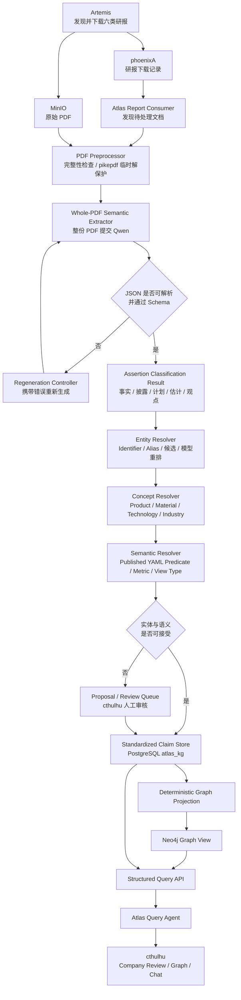

### 4.1 三个核心领域

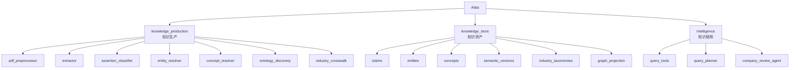

### 4.2 主要调用关系

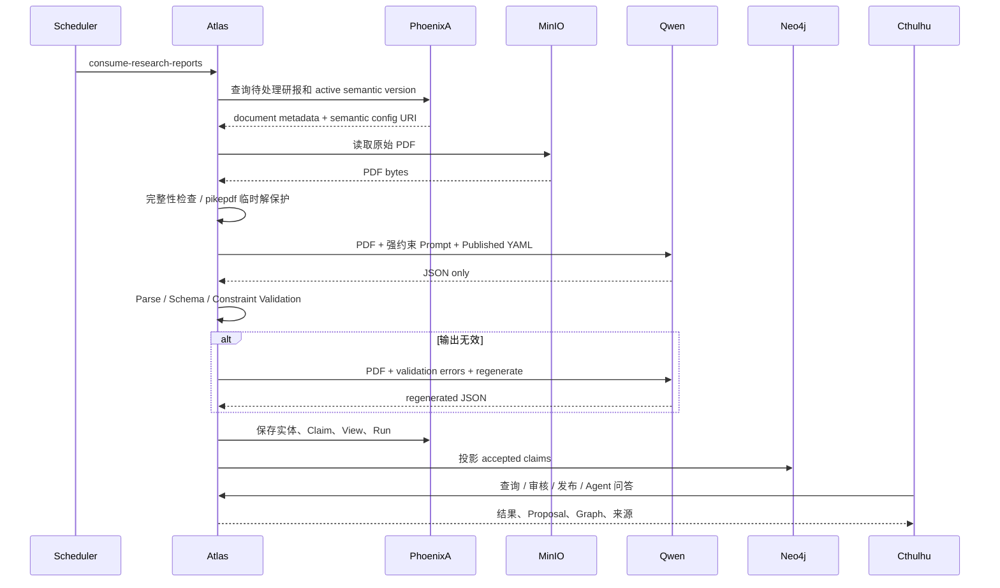

---

## 五、能力类型定义

Atlas 中不能把所有使用 LLM 的步骤都称为 Agent。本文档采用以下定义。

### 5.1 程序化能力（Deterministic）

输入相同、版本相同，输出应当相同。

典型能力：

- 查询待处理文档。
- MinIO 文件读取。
- PDF 完整性和页数检查。
- pikepdf 临时解保护。
- JSON Schema/Pydantic 校验。
- 字段枚举、类型、nullable 和数值范围校验。
- 实体名称标准化。
- Identifier 和已验证 alias 精确匹配。
- 模糊候选召回。
- 幂等控制。
- Claim 写入。
- Graph 投影。
- 结构化查询。

### 5.2 模型能力（Model Capability）

一次调用完成一个边界明确的语义任务，不自主决定系统工作流程。

典型能力：

- 判断一句话是事实、计划、估计还是观点。
- 从文本中抽取 subject、predicate、object。
- 从文本中抽取产能变化。
- 从报告中识别分析师观点。
- 在多个候选公司之间进行上下文重排。
- 将 raw predicate 映射到已知 canonical predicate。
- 对未知关系生成简短定义。

### 5.3 Agentic 能力

模型需要根据目标规划多个步骤、选择工具、观察结果并继续执行。

Phase 1 有三类受控 Agentic 工作流：

1. Semantic Discovery Workflow
   - 抽取样本。
   - 汇总 raw predicates。
   - 调用程序进行聚类和统计。
   - 调用模型生成语义定义建议。
   - 回放样本评估覆盖率。

2. Atlas Query Agent
   - 理解用户问题。
   - 解析目标公司或产品。
   - 选择结构化查询工具。
   - 获取关系、量化 Claim 和观点。
   - 必要时继续查询。
   - 生成有来源文档引用的回答。

3. Industry Crosswalk Proposal Workflow
   - 读取申万、东财和研报/券商行业概念。
   - 生成候选 Atlas canonical industry。
   - 为每个来源概念建议映射关系。
   - 检查未覆盖、冲突和循环映射。
   - 交给 cthulhu 人工审核。
   - 审核通过后发布到 Semantic YAML。

Agent 不允许：

- 自由修改数据库。
- 自由创建 Neo4j 关系类型。
- 自由执行任意 Cypher。
- 自由调用 Artemis 下载任意网站。
- 绕过 Claim 状态直接把结果写入 Graph。

### 5.4 Phase 1 能力归属矩阵

| 工作 | 程序化 | 模型能力 | Agentic | Phase 1 |
|---|---:|---:|---:|---:|
| 查询待处理研报 | ✅ |  |  | ✅ |
| 从 MinIO 读取 PDF | ✅ |  |  | ✅ |
| PDF 完整性/保护检查 | ✅ |  |  | ✅ |
| pikepdf 临时解保护 | ✅ |  |  | ✅ |
| 整份 PDF 模型输入 | 调用与超时 | ✅ 读取 PDF |  | ✅ |
| PDF 文本提取 |  |  |  | TODO fallback |
| Chunking |  |  |  | TODO fallback |
| 事实/观点/预测分类 | 只校验枚举和格式 | ✅ 唯一语义判断者 |  | ✅ |
| 实体 Mention 抽取 |  | ✅ |  | ✅ |
| Identifier/alias 精确匹配 | ✅ |  |  | ✅ |
| 实体模糊候选召回 | ✅ |  |  | ✅ |
| 歧义实体候选重排 | 约束与阈值 | ✅ |  | ✅ |
| Relation/Metric/View 抽取 | Schema 校验 | ✅ |  | ✅ |
| raw predicate 映射 | 候选和类型约束 | ✅ |  | ✅ |
| 高频未知 predicate 发现 | 聚合与统计 | ✅ 归纳 | ✅ 受控流程 | ✅ |
| 申万/东财/券商 Crosswalk | 完整性和冲突检查 | ✅ 映射建议 | ✅ 受控流程 | ✅ |
| Semantic Proposal 人工审核 | 状态和权限 |  | cthulhu 操作流程 | ✅ |
| Semantic YAML 发布 | ✅ 生成/校验/签名 |  |  | ✅ |
| Claim 持久化 | ✅ |  |  | ✅ |
| Graph Projection | ✅ |  |  | ✅ |
| 结构化查询 API | ✅ |  |  | ✅ |
| 公司产业综述 | 数据准备 | ✅ 总结 | 受控多工具查询 | ✅ |
| 自然语言图谱查询 | 工具实现 | ✅ 规划与总结 | ✅ | ✅ |
| Event 聚类与去重 |  |  |  | TODO |
| 商品趋势信号 | ✅ 规则 | 可选解释 |  | TODO |
| Impact 推理 | 规则 | ✅ | ✅ | TODO |
| Embedding | ✅ Pipeline | Embedding Model |  | TODO |
| 图片/图表理解 | 预处理 | VLM | 可选 | TODO |

判断标准：

- 能通过明确规则稳定完成的工作，不交给模型。
- 需要理解语言含义，但只需一次有 Schema 的输入输出时，使用模型能力。
- 只有需要多步规划、选择工具和根据中间结果继续行动时，才建设 Agentic 流程。

---

## 六、Phase 1 处理入口

### 6.1 主入口：后台消费任务

Phase 1 优先使用简单、可恢复的轮询任务，不引入消息队列或 Outbox。

```text
定时任务
    ↓
Atlas Report Consumer
    ↓
调用 phoenixA：
查询已下载、MinIO 对象可用、且 Atlas 未成功处理的研报
    ↓
为每份文档创建 document_extraction_run
    ↓
进入 Extraction Orchestrator
```

推荐内部入口：

```http
POST /internal/v1/atlas-kg/jobs/consume-research-reports
```

请求示例：

```json
{
  "published_from": "2025-01-01",
  "published_to": "2026-07-27",
  "report_types": [],
  "limit": 100,
  "force": false
}
```

说明：

- `report_types` 为空时消费 Artemis 当前支持的全部研报类型。
- 六类研报的具体枚举由 Artemis 文档元数据传递，Atlas 不复制硬编码另一套名称。
- Atlas 可以按报告类型路由不同 prompt，但必须通过配置映射。
- `force=false` 时遵守幂等规则。

### 6.2 手动单文档入口

用于调试、重跑和质量抽查：

```http
POST /api/v1/atlas-kg/extraction-runs
```

```json
{
  "source_document_id": "phoenixA_document_id",
  "pipeline_version": "atlas-kg-v1",
  "force": false
}
```

### 6.3 批次状态查询

```http
GET /api/v1/atlas-kg/extraction-runs/{run_id}
GET /api/v1/atlas-kg/extraction-runs?status=FAILED
GET /api/v1/atlas-kg/extraction-runs?source_document_id=...
```

### 6.4 Graph 重建入口

```http
POST /internal/v1/atlas-kg/graph-projections
```

```json
{
  "mode": "incremental",
  "claim_updated_after": "2026-07-27T00:00:00Z"
}
```

支持：

- `incremental`：只处理新增或变更 Claim。
- `full_rebuild`：清空 Atlas 图谱投影并从有效 Claim 重建。

`full_rebuild` 属于受控运维操作，不暴露给 Query Agent。

---

## 七、PDF 预处理与整份文档输入

### 7.1 Phase 1 输入决策

Phase 1 的主路径不进行文本抽取和 Chunking。

前提：

- 当前本地推理端能够接收 PDF 文件输入。
- 模型能够读取 PDF 中的主要正文。
- 模型请求能够返回结构化 JSON。
- PDF 页数和模型上下文没有超过推理端限制。

主策略：

```text
PDF_DIRECT
```

明确不实现：

```text
TEXT_EXTRACTED
TEXT_CHUNKED
PAGE_IMAGE_BATCH
DOCLING_DOCUMENT
MARKER_MARKDOWN
```

这些模式作为 fallback TODO，只有 Phase 1 实测证明整份 PDF 直读不能满足要求时再引入。

### 7.2 为什么第一期先不 Chunk

当前研报平均文件大小约 1MB，本地试验表明 4070S 可以处理一般文档，因此先验证最简单链路：

```text
PDF → Qwen → JSON
```

优势：

- 不需要设计 chunk 边界。
- 避免跨 chunk 关系合并。
- 模型能看到整篇研报上下文。
- 减少 parser、normalizer 和 chunk storage。
- 更适合第一阶段验证“模型能否从六类研报中提取知识”。

风险：

- PDF 文件大小不等于文本 token 数。
- 图片密集型和扫描型 PDF 的模型负载不同。
- 某些长研报可能超过上下文或显存。
- 模型可能在长文档后半部分遗漏信息。
- 推理端可能静默截断页面或文本。

因此必须记录真实实验指标，不能只根据 1MB 文件大小判断。

### 7.3 PDF Preprocessor

PDF Preprocessor 是程序化模块，只负责让“可合法读取的 PDF”以稳定方式提交模型，不理解文档语义。

职责：

1. 从 MinIO 下载到受控临时目录。
2. 校验文件头是否为 PDF。
3. 校验文件大小是否与 phoenixA 记录一致。
4. 计算或核对 SHA-256。
5. 使用 `pikepdf` 检查：
   - 是否损坏。
   - 是否加密。
   - 是否存在复制、打印或内容提取限制。
   - 页数。
6. 根据保护状态决定：
   - 直接使用原 PDF。
   - 生成临时可读取副本。
   - 标记为无法处理。
7. 调用结束后删除所有临时文件。

### 7.4 使用 pikepdf 临时解保护

很多研报 PDF 允许正常打开，但限制复制或文本提取。这类 PDF 可以在确认具有使用权限的前提下，通过 `pikepdf` 重新保存为临时副本。

处理分类：

```text
UNPROTECTED
    PDF 无加密或访问限制，直接提交模型。

OWNER_RESTRICTED_EMPTY_PASSWORD
    PDF 可用空密码打开，但设置了 owner permission。
    使用 pikepdf 生成本次运行的临时副本。

USER_PASSWORD_REQUIRED
    必须提供用户密码才能打开。
    未配置密码时拒绝处理。

CORRUPTED
    pikepdf 无法打开或重写。

UNSUPPORTED_ENCRYPTION
    当前运行环境不支持的加密方式。
```

约束：

- 只处理系统有权使用的研报。
- 不猜测密码。
- 不尝试暴力破解。
- 用户密码可通过受控 secret 配置提供，但不能写入日志或数据库。
- 临时副本不写 MinIO。
- 临时副本不作为新的 source document。
- 无论成功、失败或超时，finally block 都必须清理临时文件。

临时路径：

```text
{system_temp}/atlas/{run_id}/source.pdf
{system_temp}/atlas/{run_id}/unlocked.pdf
```

实现形态：

```python
with pikepdf.Pdf.open(source_path, password=resolved_password) as pdf:
    page_count = len(pdf.pages)
    user_password_matched = pdf.user_password_matched
    owner_password_matched = pdf.owner_password_matched
    pdf.save(unlocked_path, encryption=False)
```

约束：

- 输入和输出必须是不同路径，不覆盖 source PDF。
- 保存后重新用 pikepdf 打开临时副本进行完整性检查。
- 原始 PDF 始终保留在 MinIO，不被修改。
- Atlas 不负责验证 PDF 数字签名；如果未来把签名作为可信度依据，必须另建签名验证能力。

实现参考：

- [pikepdf PDF Security](https://pikepdf.readthedocs.io/en/latest/topics/security.html)
- [pikepdf Tutorial — Open/Save Encrypted PDF](https://pikepdf.readthedocs.io/en/latest/tutorial.html)

### 7.5 整份 PDF 模型输入协议

模型调用输入必须包含四部分：

```text
1. System Prompt
2. Published Semantic YAML
3. Report Type Prompt
4. PDF File
```

逻辑请求：

```json
{
  "document_id": "report_001",
  "report_type": "artemis_report_type",
  "semantic_version": "atlas-semantic-v3",
  "prompt_version": "whole-pdf-extraction-v2",
  "input_mode": "PDF_DIRECT",
  "file": "temporary_pdf_reference",
  "response_format": "atlas_extraction_result_v2"
}
```

模型端必须：

- 返回单个 JSON object。
- 不返回 Markdown code fence。
- 不返回解释文字。
- 不返回推理过程。
- 不返回 schema 中不存在的顶层字段。

### 7.6 运行前 Capability Probe

实现整批处理前，必须对本地推理端执行一次能力验证：

| 检查 | 通过条件 |
|---|---|
| PDF 文件输入 | API 能接收 PDF，而不是只接收纯文本 |
| 中文正文读取 | 能正确读取六类研报的中文正文 |
| 页码能力 | 能返回合理的来源页码 |
| JSON 输出 | 能在受约束 Prompt 下输出合法 JSON |
| 大文档行为 | 超限时明确报错，不静默截断 |
| 显存恢复 | 请求结束后显存可被后续请求复用 |
| 超时取消 | Atlas 能取消超时请求并清理临时文件 |

如果推理端实际上在内部进行了 PDF 文本提取或 OCR，Atlas 将其视为模型服务实现细节；Phase 1 不在 Atlas 重复建设同类 pipeline。

### 7.7 Whole-PDF 试验 Gate

在全量运行前，对六类报告分别执行可配置样本试验。

建议最低试验：

```text
每种 report type：
  - 小文件
  - 中位大小文件
  - 大文件
  - 页数较多文件
  - 图表密集文件
```

记录：

```text
file_size_bytes
page_count
processing_seconds
peak_gpu_memory_mb
json_valid
retry_count
entity_count
relation_claim_count
quantified_claim_count
analyst_view_count
possible_truncation
```

通过 Gate：

- 绝大多数样本能完成。
- 无明显静默截断。
- JSON 重试后通过率达到验收目标。
- 输出不是只覆盖报告前几页。

失败 Gate：

- 超长报告普遍失败。
- 后半部分信息持续遗漏。
- 模型服务不支持 PDF 文件输入。
- 显存不足或响应时间不可接受。

失败后才启动 TODO：

- PDF 文本提取。
- Page Batch。
- Section/Chunk 提取。
- Docling/Marker fallback。

### 7.8 纵向处理流程

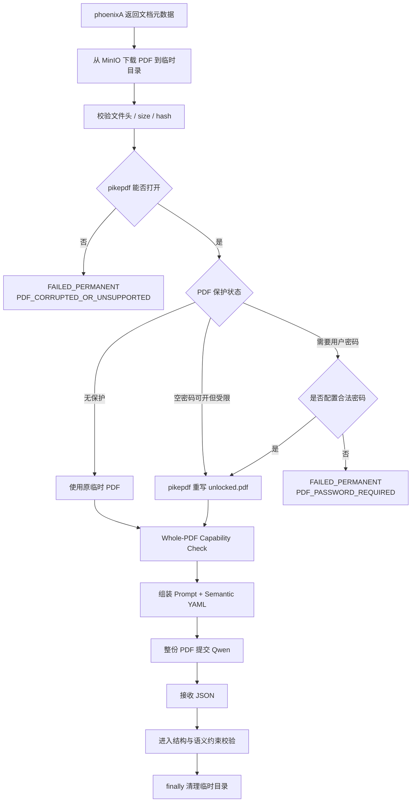

---

## 八、抽取对象：Claim，而不是直接的 Graph Edge

### 8.1 为什么需要 Claim

研报中的句子可能是：

- 已经发生的事实。
- 公司自己的披露。
- 管理层计划。
- 券商估计。
- 分析师观点。
- 条件情景。

如果模型抽取后直接写成 Neo4j 关系，这些语义会被压平为“事实”。

因此 LLM 的标准产出是 Claim，Graph Edge 只是已接受 Claim 的投影视图。

### 8.2 Assertion Type

```text
OBSERVED_FACT
    文档直接陈述已经发生或当前存在的事实。

COMPANY_DISCLOSURE
    来自公司公告、财报或管理层披露，但 Atlas 尚未独立验证。

MANAGEMENT_GUIDANCE
    公司对未来的计划、目标或指引。

ANALYST_ESTIMATE
    分析师对数值、产能、份额等做出的估计。

ANALYST_OPINION
    分析师的定性判断、风险、机会或投资观点。

FORECAST
    明确面向未来的预测结果。

SCENARIO
    在特定假设成立时的情景推演。
```

### 8.3 第一阶段 Claim 分类

Phase 1 持久化三类标准对象：

1. Relation Claim
   - 公司与公司之间的关系。
   - 公司与产品、材料、技术、市场之间的关系。
   - 产品、材料、技术之间的关系。

2. Quantified Claim
   - 产能、产量、销量、市占率、利用率等运营数据。
   - 变化比例。
   - 管理层目标和券商预测。

3. Analyst View
   - 风险、机会、优势、竞争判断。
   - 推荐逻辑。
   - 未来趋势观点。

标准化历史财务数据不进入 Atlas Claim：

- 收入。
- 净利润。
- ROE。
- 标准毛利率。
- 每股收益历史值。

这些数据优先从 phoenixA 的结构化财务数据读取。

以下财务相关内容可以进入 Analyst View 或 Quantified Claim：

- 券商盈利预测。
- 估值假设。
- 目标价。
- 未来毛利率预测。
- 与产能、产品和市场份额相关的运营假设。

---

## 九、LLM 语义抽取

### 9.1 主模型

Phase 1 默认：

```text
Qwen3-14B Q4_K_M
GPU: RTX 4070S
并发：1 个主模型请求
```

模型不承担：

- PDF 下载。
- 文档状态机。
- 数据库写入。
- 图谱写入。
- Identifier 精确匹配。
- 幂等处理。

模型是以下语义的唯一主判断者：

- 什么内容属于事实。
- 什么内容属于公司披露。
- 什么内容属于管理层计划。
- 什么内容属于分析师估计、观点和预测。
- 文档中出现了哪些实体和关系。
- 一段话是否表达了产能、份额等量化语义。

程序不能从格式推断这些语义，只能验证模型输出是否符合约定。

### 9.2 Prompt 组装

每次全量抽取的 Prompt 由五层组成，顺序固定：

```text
Layer 1: System Role and Non-Negotiable Rules
Layer 2: Output JSON Schema and Field Dictionary
Layer 3: Published Semantic YAML
Layer 4: Report-Type-Specific Instructions
Layer 5: Document Metadata + PDF File
```

版本签名：

```text
prompt_signature =
  system_prompt_version
  + extraction_schema_version
  + semantic_version
  + report_type_prompt_version
  + model_id
```

任何一层变化都必须生成新的 `prompt_signature` 并记录到 Extraction Run。

### 9.3 不可协商的模型约束

System Prompt 必须明确包含以下规则：

```text
你是 Atlas 产业知识抽取器，不是聊天助手。

输出规则：
1. 只输出一个合法 JSON object。
2. 不输出 Markdown 或 code fence。
3. 不输出解释、前言、后记、分析过程或推理过程。
4. 不输出 Schema 未定义的字段。
5. 所有数组字段必须存在；没有结果时输出 []。
6. 可空标量没有信息时输出 null。
7. 不用“未知”“无”“N/A”“待确认”等字符串代替 null。

真实性规则：
8. 只能提取 PDF 中明确出现的信息。
9. 不得使用模型常识补充 PDF 未提及的信息。
10. 不得因为认识某家公司而补充代码、产品、客户或供应商。
11. 不得根据行业常识推测供应关系。
12. 不得根据一个关系推导另一个关系。
13. 不得把可能、预计、计划、目标、假设写成已经发生的事实。
14. 不得把分析师判断写成公司披露。
15. 不得把图表中看不清的数字猜出来。
16. 不得补齐缺少的单位、基期、地区或产品。
17. 不得自行计算 PDF 没有直接表达的增长率、份额或绝对值。

名称规则：
18. mention 尽量保留 PDF 中原始名称。
19. 不得在抽取阶段自行决定 Atlas entity_id。
20. 不得把品牌、子公司、母公司和上市主体自动视为同一实体。
21. 不得翻译后覆盖原始名称。

关系规则：
22. canonical predicate 只能来自 Published Semantic YAML。
23. 无法映射时 canonical_predicate_hint 必须为 null。
24. 无法映射的关系仍输出 raw_predicate 和 predicate_family。
25. 供应方向严格按照 subject → object 表达。
26. 同一关系存在不同产品、地区或时间时分别输出。

数字规则：
27. absolute_value 只保存 PDF 明确出现的绝对值。
28. relative_change 使用小数；20% 输出 0.20。
29. 只有相对变化、没有基数时，absolute_value 必须为 null。
30. 单位不明确时 unit 必须为 null。
31. “计划新增”“预计达到”“已经投产”使用不同 status。

来源规则：
32. 每个 Relation/Quantified/View 必须提供最短原文 evidence_quote。
33. page_number 填写 PDF 对应页码；无法确定时为 null。
34. evidence_quote 不得改写为总结。

完整性规则：
35. 阅读整份 PDF，而不是只处理摘要或前几页。
36. 怀疑未完整读取时 possible_truncation=true。
37. 相同事实重复出现时不要输出完全相同的对象。
```

无内容时必须按以下方式输出：

| 字段类别 | 无内容时输出 |
|---|---|
| 数组 | `[]` |
| 可空字符串、数字、日期 | `null` |
| 必填枚举 | 必须选择合法值，否则整次输出无效 |
| boolean | `true` 或 `false` |
| qualifiers | `{}`，只放 PDF 明确给出的限定条件 |

### 9.4 Published Semantic YAML 注入

Prompt 只注入当前已发布版本，不使用 draft proposal。

模型可读取：

- Entity Type 及字段说明。
- Assertion Type 及边界。
- Predicate Family。
- Canonical Predicate、方向、类型约束和 aliases。
- Metric、允许单位和数值含义。
- Analyst View Type。
- 与当前报告相关的 Industry Canonical Concept/Crosswalk 子集。
- 本报告类型需要重点抽取的字段。

完整 Published YAML 可能包含大量行业映射，不能不加筛选地全部塞入每次模型上下文。

Prompt Builder 根据以下信息生成 Prompt View：

- 报告类型。
- 报告关联的 A 股 security/company。
- phoenixA 已知申万/东财分类。
- Semantic YAML 中标记 `include_in_prompt=true` 的定义。
- Atlas Industry 顶层概念。

完整 Crosswalk 由模型输出后的 Concept Resolver 程序化使用。模型即使没有看到某个完整 mapping，也应输出 PDF 中的 raw industry term，Resolver 再映射。

### 9.5 Whole-PDF 抽取输出

模型输出统一结构：

```json
{
  "schema_version": "atlas-extraction-v2",
  "semantic_version": "atlas-semantic-v3",
  "document_id": "report_001",
  "document_assessment": {
    "primary_language": "zh",
    "possible_truncation": false,
    "last_page_referenced": 38
  },
  "entity_mentions": [],
  "relation_claims": [],
  "quantified_claims": [],
  "analyst_views": [],
  "unknown_semantic_terms": []
}
```

顶层字段：

| 字段 | 类型 | 必填 | 含义 |
|---|---|---:|---|
| `schema_version` | string | 是 | 输出 JSON Schema 版本 |
| `semantic_version` | string | 是 | 本次使用的 Published Semantic YAML 版本 |
| `document_id` | string | 是 | Atlas 传入的 source document ID，必须原样返回 |
| `document_assessment` | object | 是 | 模型对整份 PDF 可读性的声明 |
| `entity_mentions` | array | 是 | 与 Claim 有关的实体 Mention |
| `relation_claims` | array | 是 | 主体—关系—客体候选 |
| `quantified_claims` | array | 是 | 产能、份额等量化候选 |
| `analyst_views` | array | 是 | 风险、机会和投资观点 |
| `unknown_semantic_terms` | array | 是 | YAML 中未定义的语义候选 |

`document_assessment`：

| 字段 | 类型 | 可空 | 含义 |
|---|---|---:|---|
| `primary_language` | string | 否 | PDF 主要语言 |
| `possible_truncation` | boolean | 否 | 模型是否怀疑未完整读取 PDF |
| `last_page_referenced` | integer | 是 | 输出中实际引用到的最大页码，用于发现疑似截断 |

### 9.6 Entity Mention 字段字典

```json
{
  "mention_id": "m_001",
  "mention": "英伟达",
  "suggested_entity_type": "COMPANY",
  "country_hint": "US",
  "ticker_hint": "NVDA",
  "context": "英伟达是全球领先的 GPU 供应商",
  "attributes": {},
  "page_number": 12
}
```

模型只提取线索，不决定最终 `entity_id`。

| 字段 | 类型 | 可空 | 含义 |
|---|---|---:|---|
| `mention_id` | string | 否 | 当前 JSON 内的临时引用 ID |
| `mention` | string | 否 | PDF 中实际出现的实体名称 |
| `suggested_entity_type` | enum | 否 | 模型建议的 Entity Type |
| `country_hint` | string | 是 | PDF 明确给出的国家/地区线索 |
| `ticker_hint` | string | 是 | PDF 明确出现的证券代码，不得依靠常识补写 |
| `context` | string | 否 | 包含该实体的最短上下文，用于消歧 |
| `attributes` | object | 否 | Published YAML 允许的 Entity Semantic Attributes |
| `page_number` | integer | 是 | Mention 所在 PDF 页码 |

### 9.7 Relation Claim Candidate 字段字典

```json
{
  "candidate_id": "r_001",
  "subject_mention_id": "m_002",
  "subject_mention": "公司B",
  "raw_predicate": "是主要原材料供应商",
  "predicate_family": "SUPPLY_CHAIN",
  "canonical_predicate_hint": "SUPPLIES_TO",
  "object_mention_id": "m_003",
  "object_mention": "公司A",
  "assertion_type": "OBSERVED_FACT",
  "polarity": "AFFIRMED",
  "qualifiers": {
    "product": "正极材料",
    "region": null,
    "share": null
  },
  "valid_from": null,
  "valid_to": null,
  "evidence_quote": "公司B是公司A正极材料的主要供应商",
  "page_number": 12,
  "extraction_confidence": 0.84
}
```

| 字段 | 类型 | 可空 | 含义 |
|---|---|---:|---|
| `candidate_id` | string | 否 | 当前 JSON 内的 Relation Candidate ID |
| `subject_mention_id` | string | 否 | 指向 `entity_mentions[].mention_id` |
| `subject_mention` | string | 否 | 关系起点原始名称 |
| `raw_predicate` | string | 否 | PDF 原文表达的关系短语 |
| `predicate_family` | enum | 否 | Published YAML 中的顶层关系族 |
| `canonical_predicate_hint` | string | 是 | 只能选择 YAML 中的 predicate；无法匹配时为 null |
| `object_mention_id` | string | 否 | 指向客体 Mention |
| `object_mention` | string | 否 | 关系终点原始名称 |
| `assertion_type` | enum | 否 | 事实、披露、计划、估计、观点、预测或情景 |
| `polarity` | enum | 否 | `AFFIRMED`、`NEGATED`、`UNCERTAIN` |
| `qualifiers` | object | 否 | 产品、地区、份额和条件；没有时 `{}` |
| `valid_from` | date/string | 是 | 关系开始有效时间 |
| `valid_to` | date/string | 是 | 关系结束有效时间 |
| `evidence_quote` | string | 否 | 支持关系的最短 PDF 原文 |
| `page_number` | integer | 是 | 原文所在 PDF 页码 |
| `extraction_confidence` | number | 否 | 模型抽取自评，范围 0–1，不是真实概率 |

### 9.8 Quantified Claim Candidate 字段字典

```json
{
  "candidate_id": "q_001",
  "subject_mention_id": "m_004",
  "subject_mention": "公司A",
  "metric_raw_name": "动力电池产能",
  "metric_hint": "PRODUCTION_CAPACITY",
  "product_mention_id": "m_005",
  "product_mention": "动力电池",
  "absolute_value": null,
  "relative_change": 0.20,
  "unit": null,
  "baseline_period": "2025",
  "target_period": "2026",
  "status": "PLANNED",
  "assertion_type": "MANAGEMENT_GUIDANCE",
  "qualifiers": {
    "location": null
  },
  "evidence_quote": "公司计划于2027年将动力电池产能提升20%",
  "page_number": 18,
  "extraction_confidence": 0.82
}
```

| 字段 | 类型 | 可空 | 含义 |
|---|---|---:|---|
| `candidate_id` | string | 否 | 当前 JSON 内的 Quantified Candidate ID |
| `subject_mention_id` | string | 否 | 被度量主体 Mention |
| `subject_mention` | string | 否 | PDF 中主体原始名称 |
| `metric_raw_name` | string | 否 | PDF 对指标的原始表达 |
| `metric_hint` | string | 是 | Published YAML 中的 canonical metric |
| `product_mention_id` | string | 是 | 指标对应的产品 Mention |
| `product_mention` | string | 是 | 产品原始名称 |
| `absolute_value` | number | 是 | PDF 明确给出的绝对值 |
| `relative_change` | number | 是 | PDF 明确给出的相对变化，小数形式 |
| `unit` | string | 是 | PDF 明确给出的单位 |
| `baseline_period` | string | 是 | 相对变化基期 |
| `target_period` | string | 是 | 目标值或变化对应期间 |
| `status` | enum | 否 | 当前、历史、计划、建设中、完成、估计或预测 |
| `assertion_type` | enum | 否 | 信息性质 |
| `qualifiers` | object | 否 | Published YAML 允许的 Metric Semantic Attributes |
| `evidence_quote` | string | 否 | 支持数字的最短原文 |
| `page_number` | integer | 是 | 原文所在页码 |
| `extraction_confidence` | number | 否 | 模型抽取自评 0–1 |

数字规则：

- 只有百分比时不推断绝对值。
- 只有目标值时不推断当前值。
- `PLANNED`、`UNDER_CONSTRUCTION`、`COMPLETED` 必须区分。
- 公司计划和分析师估计必须区分。
- 单位不明确时保存为 null，不猜测。

### 9.9 Analyst View Candidate 字段字典

```json
{
  "candidate_id": "v_001",
  "subject_mention_id": "m_006",
  "subject_mention": "公司A",
  "view_type": "RISK",
  "topic": "原材料价格",
  "direction": "NEGATIVE",
  "summary": "上游材料价格上涨可能压缩盈利空间",
  "horizon": "MEDIUM_TERM",
  "assertion_type": "ANALYST_OPINION",
  "attributes": {},
  "evidence_quote": "我们认为上游原材料涨价将压缩公司的盈利空间",
  "page_number": 30,
  "extraction_confidence": 0.78
}
```

Analyst View 不直接投影为事实关系。

| 字段 | 类型 | 可空 | 含义 |
|---|---|---:|---|
| `candidate_id` | string | 否 | 当前 JSON 内的 View Candidate ID |
| `subject_mention_id` | string | 否 | 观点针对的实体 Mention |
| `subject_mention` | string | 否 | PDF 中实体原始名称 |
| `view_type` | enum | 否 | 风险、机会、优势、弱点、趋势或投资逻辑 |
| `topic` | string | 否 | 观点主题 |
| `direction` | enum | 否 | `POSITIVE`、`NEGATIVE`、`MIXED`、`NEUTRAL` |
| `summary` | string | 否 | 对分析师观点的忠实压缩，不引入新结论 |
| `horizon` | enum | 是 | `IMMEDIATE`、`SHORT_TERM`、`MEDIUM_TERM`、`LONG_TERM` |
| `assertion_type` | enum | 否 | 通常为 `ANALYST_OPINION`、`FORECAST` 或 `SCENARIO` |
| `attributes` | object | 否 | Published YAML 允许的 View Semantic Attributes |
| `evidence_quote` | string | 否 | 支持观点的最短原文 |
| `page_number` | integer | 是 | 原文所在页码 |
| `extraction_confidence` | number | 否 | 模型抽取自评 0–1 |

### 9.10 Unknown Semantic Term 字段字典

```json
{
  "candidate_id": "u_001",
  "semantic_kind": "PREDICATE",
  "raw_term": "协同开发",
  "suggested_family": "TECHNOLOGY",
  "suggested_definition": "两个实体共同参与产品或技术开发",
  "subject_type_hint": "COMPANY",
  "object_type_hint": "COMPANY",
  "evidence_quote": "双方将协同开发下一代电池平台",
  "page_number": 22
}
```

| 字段 | 类型 | 可空 | 含义 |
|---|---|---:|---|
| `candidate_id` | string | 否 | 当前 JSON 内的未知语义 ID |
| `semantic_kind` | enum | 否 | `FIELD`、`PREDICATE`、`METRIC`、`VIEW_TYPE`、`CONCEPT` |
| `raw_term` | string | 否 | PDF 中出现但 Published YAML 未定义的词 |
| `suggested_family` | string | 是 | 建议所属 family |
| `suggested_definition` | string | 否 | 对术语的简洁建议定义 |
| `subject_type_hint` | string | 是 | Predicate 可能的 subject type |
| `object_type_hint` | string | 是 | Predicate 可能的 object type |
| `evidence_quote` | string | 否 | 原文示例 |
| `page_number` | integer | 是 | 原文页码 |

### 9.11 程序化校验

程序不判断事实/观点的语义是否正确，但必须严格校验输出协议。

#### Level 1：响应格式

- 必须从 `{` 开始，以 `}` 结束。
- 禁止 Markdown code fence。
- 禁止 JSON 前后出现说明文字。
- 必须是单个 JSON object。
- 禁止 NaN、Infinity、注释和 trailing comma。

#### Level 2：JSON Schema

- 所有必填字段存在。
- 字段类型正确。
- nullable 符合定义。
- 禁止未定义顶层字段。
- 枚举值合法。

#### Level 3：版本一致性

- `schema_version` 等于请求值。
- `semantic_version` 等于请求值。
- `document_id` 与请求一致。

#### Level 4：引用完整性

- Relation 的 subject/object mention ID 必须存在。
- Metric/View 的 subject mention ID 必须存在。
- `page_number` 必须在 `1..pdf_page_count` 内。
- `evidence_quote` 不能为空且不能只是实体名称。

Phase 1 不做逐字 Evidence 自动比对，但 Evidence 会展示给人工审核。

#### Level 5：语义配置约束

- canonical predicate 必须存在于 Published YAML。
- metric hint 必须存在于 Published YAML。
- view type 必须存在于 Published YAML。
- subject/object type 必须满足 predicate 约束。
- 未知项必须进入 `unknown_semantic_terms`。

#### Level 6：数值与状态约束

- `relative_change` 使用小数。
- `absolute_value` 是数值或 null。
- 没有数值时不能只有单位。
- `PLANNED` 不能标记为 `OBSERVED_FACT`。
- `ANALYST_ESTIMATE` 不能标记为 `COMPANY_DISCLOSURE`。

### 9.12 Invalid Output 打回重生成

任何 Level 1–6 强制校验失败，整份输出无效，不进行部分入库。

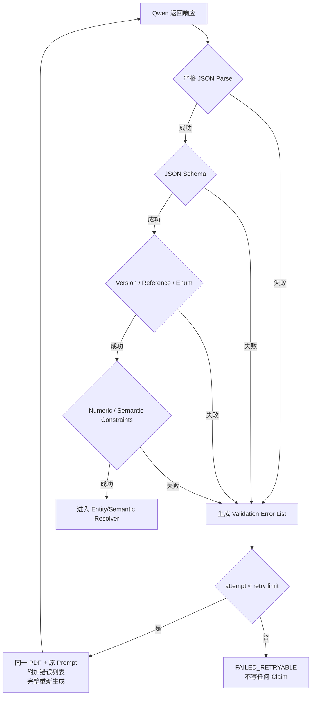

重生成 Prompt：

```text
上一次输出无效。
请根据以下校验错误重新生成完整 JSON。
不要只返回修改片段。
不要解释错误。
不要复用不合法字段。
仍然只能输出一个 JSON object。
```

重试策略：

```text
initial attempt: 1
regeneration retries: 2
maximum total attempts: 3
```

不得：

- 用正则从解释文字中截取 JSON 后静默接受。
- 自动补造缺失业务字段。
- 把未知枚举替换为 `OTHER` 后静默入库。
- 只保存通过校验的部分数组。

### 9.13 模型调用与结果处理

单文档只产生一份 Whole-PDF Extraction Result。

模型原始响应在转换完成后丢弃。

运行记录中保留：

- model_id。
- model_quantization。
- prompt_version。
- extraction_schema_version。
- semantic_version。
- input_mode=`PDF_DIRECT`。
- PDF size/page count/protection status。
- request attempt 数。
- validation error code。
- 开始和完成时间。
- 错误摘要。

### 9.14 Constrained Decoding

如果本地推理端支持 JSON Schema、grammar 或 structured output，生产抽取必须启用。

优先级：

```text
JSON Schema constrained decoding
    >
JSON grammar constrained decoding
    >
Prompt-only JSON + strict validator
```

即使启用 constrained decoding，仍然必须运行 Level 1–6 Validator，因为 grammar 只能保证 JSON 形状，不能保证：

- Predicate 来自正确 Semantic Version。
- Mention 引用存在。
- Assertion Type 与 Status 自洽。
- 数字没有被错误填充。
- Evidence 和页码合理。

模型参数必须通过配置管理并写入 Run，例如：

```text
thinking_mode
temperature
top_p
top_k
maximum_output_tokens
context_limit
```

不在文档中假定某一组参数永远最优。Whole-PDF Gate 和 Draft Version Test 必须比较参数配置，并固定成具名 profile：

```text
production_extraction
semantic_discovery
query_agent
company_review
```

### 9.15 Report Type Prompt

六类研报共用核心 Schema，但可以有不同重点。

`report_prompt_mapping.yaml` 中每种 report type 定义：

```yaml
report_type_profiles:
  default:
    focus:
      - company_product_relations
      - supply_chain_relations
      - operational_metrics
      - analyst_views
    ignore_if_available_in_phoenixa:
      - historical_revenue
      - historical_net_profit
      - historical_roe
    additional_rules:
      - 不要重复抽取标准历史财务表
      - 重点提取产能、产品、客户、供应商、竞争和技术
```

规则：

- Report Type Prompt 只能增加关注重点，不能放宽 System Prompt 的真实性约束。
- Report Type Prompt 不能自定义与 Published YAML 冲突的 Predicate。
- 某类报告没有相关字段时输出空数组或 null，不能为了满足“重点”而猜测。
- 全部 report type profile 必须带版本。

### 9.16 Prompt 回归样本

每次修改 System Prompt、Schema 或 Semantic YAML，必须使用固定回归样本。

回归样本至少包含：

- 一份事实关系丰富的报告。
- 一份观点/预测丰富的报告。
- 一份产能数字丰富的报告。
- 一份海外公司名称较多的报告。
- 一份非上市供应商较多的报告。
- 一份保护 PDF。
- 一份长报告。

重点回归：

- JSON 是否纯净。
- 是否把计划写成事实。
- 是否补写 PDF 未出现的 ticker。
- 是否把公司集团、品牌、子公司错误合并。
- 是否把供应方向反转。
- 是否从模糊数字推算绝对值。
- 是否能读取到报告后半部分。

---

## 十、知识实体与消歧

### 10.1 渐进式实体策略

Atlas 不预先建设完整全球公司库。

实体来源：

1. phoenixA A 股 `security_registry`。
2. 研报中出现的新公司、组织、产品、材料和技术。
3. 公司公告和财报提供的子公司、参股公司和品牌线索。
4. TODO：Artemis 按需采集的官方实体资料。

### 10.2 实体类型

Phase 1 稳定枚举：

```text
COMPANY
ORGANIZATION
BRAND
PRODUCT
MATERIAL
TECHNOLOGY
MARKET
INDUSTRY_CLASS
VALUE_CHAIN
```

TODO：

```text
FACILITY
PERSON
LOCATION
ASSET
COMMODITY_INSTRUMENT
```

### 10.3 实体状态

```text
VERIFIED
    来自 security_registry、硬标识或高可信官方资料。

PROVISIONAL
    文档中能够明确区分，但缺少权威标识。

MERGED
    已合并到另一个实体。

DISABLED
    被确认无效。
```

### 10.4 为什么不直接使用名称作为 ID

以下名称可能指向同一公司：

```text
NVIDIA Corporation
NVIDIA
Nvidia
英伟达
NVDA
```

以下名称虽然相似，却可能是不同主体：

```text
上市公司
上市公司旗下品牌
上市公司的子公司
上市公司的合资公司
```

因此 Graph 和 Claim 始终使用 Atlas `entity_id`，名称只是属性和 alias。

### 10.5 实体解析流程

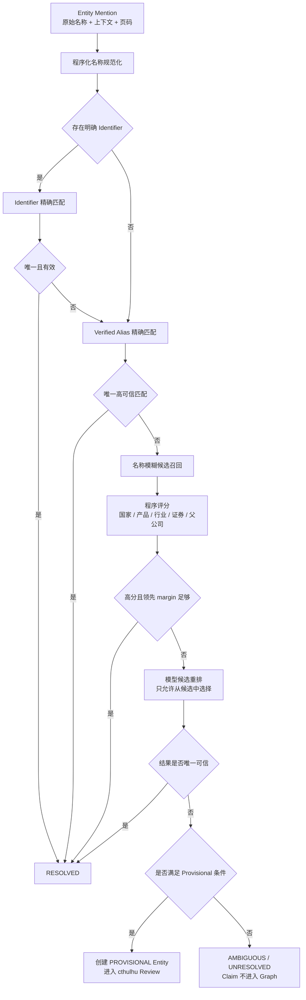

### 10.6 自动创建 Provisional Entity

允许自动创建，但必须满足最低条件。

公司类：

- 名称在文档中明确。
- 上下文明确是公司或组织。
- 与已有实体没有高相似候选。
- 至少存在一个区分线索：
  - 国家或地区。
  - 产品。
  - 母公司。
  - 客户/供应商关系。
  - 股票代码。
  - 原始语言全称。

不满足时只保留 unresolved mention，不创建 Graph 节点。

### 10.7 Alias 学习

Alias 可以来自：

- security_registry 中的简称和全称。
- 同一句或同一文档中的中英文并列名称。
- 股票代码附近的公司名称。
- 多份来源持续指向同一实体的名称。

状态：

```text
CANDIDATE
VERIFIED
REJECTED
```

只有 VERIFIED alias 参与无条件精确匹配。

---

## 十一、Predicate 与语义发现

### 11.1 不在启动前人工穷举 Predicate

旧设计列出了固定关系类型，包括：

- `SUPPLIER_OF`
- `CUSTOMER_OF`
- `DEPENDS_ON_RESOURCE`
- `CONSUMES_RESOURCE`
- `PRODUCES_RESOURCE`
- `EXTRACTS_RESOURCE`
- `COMPETITOR_OF`
- `BELONGS_TO_INDUSTRY`
- `OPERATES_IN_MARKET`
- `PRODUCES`
- `USES_TECHNOLOGY`
- `OWNS_ASSET`
- `SUBSIDIARY_OF`
- `INVESTED_IN`
- `PART_OF_PRODUCT`
- `APPLIED_IN`

V2 将这些关系作为 Phase 1 的 bootstrap 参考，不把它们视为最终全集。

### 11.2 顶层 Predicate Family

模型开放抽取时，只要求先落入少量稳定 family：

```text
SUPPLY_CHAIN
PRODUCT
PRODUCTION
RESOURCE_INPUT
OWNERSHIP
INVESTMENT
COMPETITION
TECHNOLOGY
MARKET
INDUSTRY_ROLE
OTHER
```

Family 是稳定的程序约束；细粒度 predicate 可以逐步发现。

### 11.3 Phase 1 Seed Predicate

建议初始 canonical predicate：

```text
SUPPLIES_TO
PRODUCES
USES_INPUT
DEPENDS_ON
COMPETES_WITH
SUBSIDIARY_OF
INVESTS_IN
USES_TECHNOLOGY
PART_OF_PRODUCT
APPLIED_IN
OPERATES_IN_MARKET
PARTICIPATES_IN_VALUE_CHAIN
CLASSIFIED_AS
```

设计说明：

- 使用 `SUPPLIES_TO` 作为唯一正向供应关系。
- `CUSTOMER_OF` 作为查询时的反向视图，不重复持久化。
- `USES_INPUT` 覆盖材料、部件等生产输入，具体对象类型由 entity type 和 qualifier 表达。
- `CLASSIFIED_AS` 必须携带 scheme 和 version。
- Event 相关 predicate 不进入 Phase 1。

### 11.4 Raw Predicate 处理

模型可以输出：

```text
“为其核心客户”
“向其供应正极材料”
“原材料主要采购自”
“共同开发”
“潜在替代者”
```

Semantic Resolver：

1. 对 raw predicate 做文本规范化。
2. 查询已知 semantic alias。
3. 根据 subject/object entity type 过滤。
4. 使用模型判断是否可映射到现有 canonical predicate。
5. 能映射则写入 `canonical_predicate_key`。
6. 不能映射则保留 raw predicate，Claim 状态为 `CANDIDATE_SEMANTIC`。
7. 未归一化 Claim 不进入强类型 Graph。

### 11.5 Semantic Control Plane

Phase 1 建设一个小型、专用的 Semantic Control Plane。

它不是通用 Ontology 平台，只服务 Atlas 研报抽取，负责：

- 创建可配置的 Sample Discovery Run。
- 让 LLM 从样本中发现全量运行所需字段。
- 聚合 Predicate、Metric、View Type 和 Concept 候选。
- 在 cthulhu 中展示 Proposal 和样本文档原文。
- 允许人工 Approve、Reject、Merge、Edit。
- 基于已审核内容构建 Draft Semantic Version。
- 使用 Draft Version 运行测试样本。
- 比较当前版本和 Draft Version 的抽取结果。
- 发布不可变 Semantic Version。
- 导出 Published Semantic YAML。
- 为测试和部署提供确定版本的 YAML。

### 11.6 两种 Discovery Run

#### BOOTSTRAP_DISCOVERY

在全量研报处理前运行。

目标：

- 从六类研报样本中总结“全量运行需要提取什么”。
- 发现初始字段、Predicate、Metric、View Type 和 Concept。
- 生成第一份可审核 Semantic Proposal。

#### INCREMENTAL_DISCOVERY

全量运行后定期或手动运行。

输入：

- 已入库但未映射的 raw predicate。
- 未知 metric。
- 未知 view type。
- 未解析的 industry/product/material/technology concept。
- 人工指定的一批新 PDF。

目标：

- 吸收长尾语义。
- 合并 synonym。
- 修订错误定义。
- 生成下一版 Semantic Proposal。

### 11.7 Discovery Run 输入参数

cthulhu 创建任务时提供：

```json
{
  "run_type": "BOOTSTRAP_DISCOVERY",
  "base_semantic_version": "atlas-semantic-v0",
  "sample_size": 120,
  "sampling_strategy": "STRATIFIED",
  "random_seed": 20260727,
  "report_types": [],
  "institutions": [],
  "published_from": "2025-01-01",
  "published_to": "2026-07-27",
  "minimum_pages": null,
  "maximum_pages": null,
  "include_processed_documents": true,
  "discover": {
    "fields": true,
    "predicates": true,
    "metrics": true,
    "view_types": true,
    "concepts": true,
    "industry_terms": true
  }
}
```

字段说明：

| 字段 | 含义 |
|---|---|
| `run_type` | 初始发现或增量发现 |
| `base_semantic_version` | Proposal 对比和继承的已发布版本 |
| `sample_size` | 本次最多抽取多少份 PDF，由用户在界面填写 |
| `sampling_strategy` | `RANDOM`、`STRATIFIED` 或 `MANUAL` |
| `random_seed` | 保证随机抽样可复现 |
| `report_types` | 限定 Artemis report type；空表示全部六类 |
| `institutions` | 限定券商/机构；空表示全部 |
| `published_from/to` | 只从可获取的近两年文档中筛选 |
| `minimum/maximum_pages` | 可选页数过滤，用于覆盖短报告和长报告 |
| `include_processed_documents` | 是否允许从已有成功抽取文档中重新做 discovery |
| `discover` | 本次希望发现的语义类别 |

### 11.8 分层抽样算法

`STRATIFIED` 由程序执行，不让 LLM 随意选文档。

优先维度：

1. Artemis report type。
2. 券商/机构。
3. 报告页数区间。
4. 行业或标的公司。
5. 发布时间。

算法：

```text
取得候选文档
    ↓
按 report_type 分组
    ↓
为每组分配基础 quota
    ↓
组内按 institution/page bucket 去重
    ↓
使用 random_seed 选择
    ↓
不足 quota 的组将余额分配给其他组
    ↓
冻结 sample_document_ids
```

Discovery Run 创建后必须保存实际 `sample_document_ids`，避免重跑时抽到另一批文档。

### 11.9 样本发现 Prompt 输出

Discovery Prompt 与生产抽取 Prompt 不同。

它不直接产出最终 Claim，而是产出“建议全量抽取的语义定义”：

```json
{
  "field_candidates": [
    {
      "field_key_suggestion": "capacity_relative_change",
      "display_name": "产能相对变化",
      "description": "公司、产品或工厂产能相对于基期的变化比例",
      "value_type": "NUMBER",
      "nullable": true,
      "applicable_report_types": ["..."],
      "example_values": [0.20],
      "evidence_examples": [
        {
          "document_id": "report_001",
          "page_number": 18,
          "quote": "预计2027年产能提升20%"
        }
      ]
    }
  ],
  "predicate_candidates": [],
  "metric_candidates": [],
  "view_type_candidates": [],
  "concept_candidates": [],
  "industry_term_candidates": []
}
```

字段候选必须区分两类：

```text
CORE_SCHEMA_FIELD
    改变固定 JSON envelope，例如新增一种顶层数组。
    需要修改代码、Pydantic 和 extraction_schema_version。
    不能只发布 YAML 后直接生效。

SEMANTIC_ATTRIBUTE
    放在已有对象的 qualifiers/attributes 中。
    例如 supplier_share、capacity_location、technology_generation。
    可以通过 Semantic YAML 定义并进入下一次 Prompt。
```

Phase 1 的 Discovery 默认建议 `SEMANTIC_ATTRIBUTE`，避免每发现一个字段就修改程序。

允许的扩展位置：

```text
relation_claim.qualifiers
quantified_claim.qualifiers
analyst_view.attributes
entity_mention.attributes
```

每个 YAML field definition 必须声明：

```text
target_object
target_path
value_type
nullable
description
allowed_values（如适用）
unit_semantics（如适用）
applicable_report_types
```

如果 Proposal 判断必须新增 `CORE_SCHEMA_FIELD`：

- cthulhu 标记为 `REQUIRES_CODE_CHANGE`。
- 不能直接加入普通 Draft Semantic Version。
- 开发完成并升级 Extraction Schema 后才能发布。

### 11.10 “从 Sample 总结全量字段”的具体算法

该过程不是让一次 LLM 调用直接决定最终 Schema。

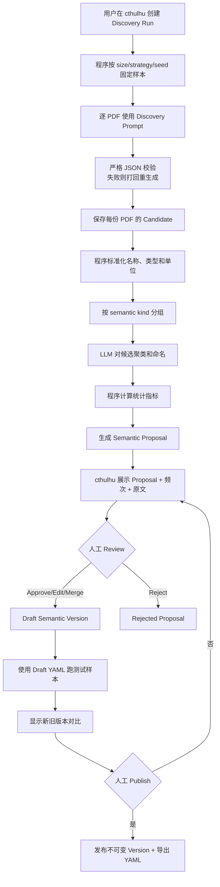

程序聚合指标：

```text
document_frequency
report_type_coverage
institution_coverage
entity_type_pair_distribution
example_count
existing_definition_match
conflicting_definition_count
null_rate_in_sample
```

Proposal 优先级：

```text
HIGH
    多个文档、多个机构重复出现，并直接服务 Graph/Query。

MEDIUM
    有清晰定义，但只在部分报告类型出现。

LOW
    低频、定义模糊或仅单一来源出现。
```

### 11.11 Proposal Review

Proposal 状态：

```text
DRAFT
APPROVED
REJECTED
MERGED
NEEDS_EDIT
PUBLISHED
```

cthulhu Review 页面必须显示：

- Proposal kind。
- 建议 key。
- 中文显示名。
- 字段说明。
- value type / nullable。
- Predicate 方向和 subject/object type。
- 出现文档数。
- 覆盖报告类型和机构。
- 至少 3 个原文样例。
- 与当前定义的相似项。
- LLM 建议理由。
- 用户编辑后的最终定义。

Review 操作：

- Approve。
- Reject。
- Edit Key/Name/Description。
- 修改 Enum/Type/Nullable。
- 修改 Predicate Direction。
- Merge 到已有定义。
- 拆分成两个定义。
- 标记为仅特定 report type 使用。

### 11.12 Semantic Version 生命周期

```text
DRAFT
    ↓ test
TESTED
    ↓ publish
PUBLISHED
    ↓ newer version
RETIRED
```

约束：

- Published Version 不可原地修改。
- 修改必须基于旧版本创建新 Draft。
- 环境激活状态单独记录，不修改 Version 内容。
- 每个环境同一时间只有一个 Active Version。
- Extraction Run 必须记录实际 semantic version。
- 测试可以显式指定 Draft Version。
- 生产默认只能使用 Published/Active Version。

### 11.13 YAML 发布

发布操作生成完整、不可变 YAML：

```text
s3://atlas-config/semantic/atlas-semantic-v0003.yaml
```

本地开发和自动化测试可通过导出命令写入：

```text
app/projects/atlas/config/semantic/atlas-semantic-v0003.yaml
```

服务不直接修改 Git 工作区。用户可从 cthulhu 下载 YAML，或由部署流程从 MinIO 拉取。

运行配置：

```text
ATLAS_SEMANTIC_CONFIG_URI=s3://atlas-config/semantic/atlas-semantic-v0003.yaml
```

测试配置：

```text
ATLAS_SEMANTIC_CONFIG_PATH=app/projects/atlas/config/semantic/atlas-semantic-v0003.yaml
```

YAML 发布时必须：

- 通过 Schema 校验。
- 检查 key 唯一。
- 检查 alias 冲突。
- 检查 Predicate subject/object type。
- 检查 Crosswalk 引用存在。
- 计算 SHA-256。
- 保存 version、hash、object URI 和发布人。

### 11.14 YAML 结构

```yaml
version: atlas-semantic-v0003
schema_version: atlas-semantic-schema-v1

extraction_fields:
  - key: capacity_relative_change
    display_name: 产能相对变化
    description: 公司、产品或工厂产能相对于基期的变化比例
    field_class: SEMANTIC_ATTRIBUTE
    target_object: quantified_claim
    target_path: qualifiers.capacity_relative_change
    value_type: number
    nullable: true
    applies_to:
      - quantified_claim

entity_types:
  - key: COMPANY
    display_name: 公司
    description: 具有独立经营或法律身份的企业主体

assertion_types:
  - key: OBSERVED_FACT
    display_name: 已发生事实
    description: PDF 明确陈述已经发生或当前存在的事实

predicate_families:
  - key: SUPPLY_CHAIN
    display_name: 供应链

predicates:
  - key: SUPPLIES_TO
    display_name: 向其供应
    description: subject 向 object 供应产品、材料或部件
    family: SUPPLY_CHAIN
    subject_types: [COMPANY]
    object_types: [COMPANY]
    aliases:
      - 是其供应商
      - 向其供货
      - 为其提供原材料

metrics:
  - key: PRODUCTION_CAPACITY
    display_name: 产能
    description: 在指定期间和单位下的最大生产能力
    allowed_units: [GWh, 万吨, 万台, 亿元]

analyst_view_types:
  - key: RISK
    display_name: 风险
    description: 分析师认为可能对主体产生不利影响的因素

industry_taxonomies: []
industry_crosswalks: []

report_type_profiles:
  default:
    required_sections:
      - entity_mentions
      - relation_claims
      - quantified_claims
      - analyst_views
```

---

## 十二、产业分类与产业链

### 12.1 Phase 1 Crosswalk 决策

Phase 1 必须构建以下 Crosswalk：

```text
申万行业分类
东财行业/概念分类
六类研报中出现的券商行业术语
        ↓
Atlas Canonical Industry
```

“完整”的 Phase 1 范围定义为：

- 配置版本中的全部申万行业概念都有明确处理结果。
- 已由 Artemis/phoenixA 获取的全部东财行业/概念都有明确处理结果。
- Discovery Sample 和 Phase 1 全量研报中实际出现的券商行业术语都有明确处理结果。
- 每个来源概念必须：
  - 映射到一个或多个 Atlas Canonical Industry；或
  - 明确标记为 `NO_CANONICAL_MAPPING` 并说明原因。

不承诺覆盖尚未获取、尚未在 PDF 中出现的所有券商内部分类。

数据责任：

| 数据 | 采集 | 共享持久化 | Crosswalk 构建 |
|---|---|---|---|
| 申万分类 Snapshot | 已有任务/phoenixA | phoenixA | Atlas |
| 东财行业/概念 Snapshot | Artemis | phoenixA | Atlas |
| 券商行业术语 | Artemis 已下载 PDF | PDF 在 MinIO，术语在 atlas_kg | Atlas LLM + Review |
| Atlas Canonical Industry | 不外采 | atlas_kg + Semantic YAML | Atlas |

如果 Phase 1 开始时东财 Snapshot 尚未进入 phoenixA：

- Atlas 不自行实现东财下载。
- 将“Artemis 获取东财 Snapshot”列为 Crosswalk Phase 的前置依赖。
- 申万、券商术语可以先进入 Draft，但不能把 Crosswalk 标记为 Phase 1 完整发布。

### 12.2 为什么需要 Atlas Canonical Industry

如果 Graph 只保存：

```text
Company
  ├── CLASSIFIED_AS → SW2021 Industry Concept
  └── CLASSIFIED_AS → EastMoney Industry Concept
```

查询“某产业有哪些公司”时会得到多个互不兼容的答案。

因此增加独立的：

```text
Atlas Canonical Industry Scheme
```

它的用途：

- 作为跨来源查询的统一入口。
- 保留申万、东财和券商术语的来源差异。
- 不覆盖原始分类。
- 允许一对多和多对一映射。
- 为 LLM 抽取提供稳定的行业候选。
- 为 Cthulhu 展示统一行业入口。

### 12.3 初始 Canonical Industry 构建

Phase 1 不从空白开始创造一套行业体系。

初始化策略：

1. 使用当前申万行业层级作为第一版结构骨架。
2. 为每个申万概念生成独立 Atlas canonical ID。
3. 申万概念与对应 Atlas 概念初始为 `EXACT`。
4. 导入东财概念并生成映射 Proposal。
5. 从研报样本发现券商行业术语并生成映射 Proposal。
6. 当东财或券商概念无法合理映射到现有 Atlas 概念时，允许 Proposal 新增 Atlas Concept。
7. 所有新建和非精确映射必须在 cthulhu 审核后生效。

这样申万只是 V1 的结构起点，不是永远不可修改的唯一真相。

### 12.4 Taxonomy Scheme

每套分类保存独立 Scheme：

```text
SW
EASTMONEY
BROKER:{institution_key}
ATLAS_CANONICAL
```

Scheme 字段：

```json
{
  "scheme_key": "SW",
  "display_name": "申万行业分类",
  "version": "2021",
  "source_system": "phoenixA",
  "snapshot_date": "2026-07-27",
  "status": "ACTIVE"
}
```

券商 PDF 中没有正式代码时：

```text
scheme_key = BROKER:{institution_key}
concept_code = hash(normalized_raw_term)
external_code = null
```

### 12.5 Crosswalk Relation

映射类型：

```text
EXACT
    来源概念与 Atlas 概念语义等价。

CLOSE
    高度接近，但边界存在轻微差异。

BROADER
    来源概念比 Atlas 概念更宽。

NARROWER
    来源概念比 Atlas 概念更窄。

RELATED
    有明显关联，但不是层级或等价。

NO_CANONICAL_MAPPING
    当前明确不映射；必须填写原因。
```

一个 Crosswalk Mapping 必须包含：

```text
source_scheme
source_concept
target_atlas_concept
mapping_relation
confidence
proposal_origin
review_status
reviewed_by
semantic_version
notes
```

### 12.6 Crosswalk 构建流程

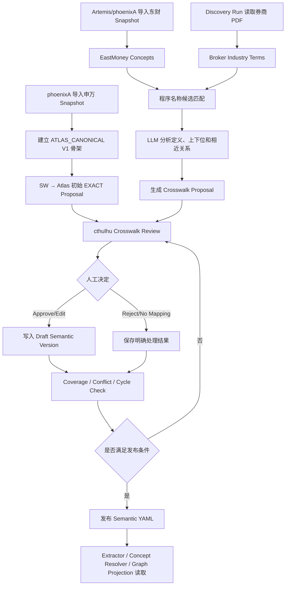

### 12.7 Crosswalk 程序检查

程序化检查：

- 所有来源 concept 都有处理结果。
- `EXACT/CLOSE/BROADER/NARROWER/RELATED` 必须引用存在的 Atlas concept。
- 不允许 concept 映射到自己。
- Atlas broader/narrower 层级不能形成循环。
- 同一个来源 concept 可以映射多个 Atlas concept，但必须说明。
- `EXACT` 多重映射需要警告。
- 被删除或 retired 的 Atlas concept 不能作为新 target。
- 所有 mapping 必须属于明确 semantic version。

LLM 负责：

- 根据名称、定义和样例建议映射。
- 建议是 EXACT、CLOSE、BROADER、NARROWER 或 RELATED。
- 建议新建 Atlas concept。
- 给出简短映射理由。

人工负责：

- 最终确认非平凡映射。
- 编辑 Atlas concept 名称和定义。
- 决定一对多映射。
- 决定新增 canonical concept。
- 发布版本。

### 12.8 Graph 中如何应用 Crosswalk

保留两类节点：

```text
(:IndustryConcept {
  concept_id,
  scheme_key,
  code,
  name,
  version
})

(:AtlasIndustry {
  concept_id,
  name,
  definition,
  semantic_version
})
```

保留来源分类：

```text
(:Company)-[:CLASSIFIED_AS {
  scheme: "SW",
  version: "2021",
  source: "phoenixA"
}]->(:IndustryConcept)
```

建立映射：

```text
(:IndustryConcept)-[:MAPS_TO {
  relation: "EXACT",
  semantic_version: "atlas-semantic-v3"
}]->(:AtlasIndustry)
```

统一查询视图：

```text
Company
→ CLASSIFIED_AS
→ Source Industry Concept
→ MAPS_TO
→ Atlas Industry
```

研报直接明确描述公司所属产业时，也可以形成来源为研报的 `CLASSIFIED_AS` Claim，但必须保留：

- 原始行业术语。
- 券商 Scheme。
- Assertion Type。
- Source Document。

### 12.9 LLM 抽取如何使用 Crosswalk

Published YAML 为模型提供：

```yaml
industry_taxonomies:
  - scheme: SW
    version: "2021"
  - scheme: EASTMONEY
    version: "2026-07-27"
  - scheme: ATLAS_CANONICAL
    version: "v3"

industry_crosswalks:
  - source_scheme: SW
    source_code: "..."
    source_name: "电池"
    relation: EXACT
    target_atlas_key: BATTERY_INDUSTRY
```

生产抽取时：

- 模型先输出 PDF 中的 raw industry term。
- 如果 Published YAML 中有明确 alias/crosswalk，可以给出 canonical hint。
- 没有时输出 unknown industry term。
- 模型不得自创申万或东财 code。
- Concept Resolver 在模型输出后再次程序化校验。

### 12.10 Cthulhu Crosswalk Review

页面至少包含：

- Scheme/Version 过滤。
- 未处理、待审核、已通过、无映射过滤。
- 来源 concept 的 code、name、parent 和 description。
- 建议 Atlas concept。
- Mapping Relation。
- LLM 理由和 confidence。
- 研报原文例子。
- 当前 Coverage。
- 冲突和循环警告。
- 批量批准低风险 EXACT mapping。
- 单条 Edit/Approve/Reject/No Mapping。
- 创建新的 Atlas canonical concept。
- Draft/Published Version 对比。

### 12.11 产业链不是行业分类

Atlas 的产业链主要由实体和关系构成：

```text
Material → Product → Product → Market
              ↑          ↑
           Company    Company
```

示例：

```text
锂矿
  → 正极材料
  → 电芯
  → 动力电池包
  → 新能源汽车
```

公司通过以下关系参与产业链：

- `PRODUCES`
- `USES_INPUT`
- `SUPPLIES_TO`
- `USES_TECHNOLOGY`
- `PARTICIPATES_IN_VALUE_CHAIN`

Crosswalk 解决“不同体系怎样说同一个行业”，产品和供需 Graph 解决“产业链如何实际连接”，两者不能互相替代。

### 12.12 上中下游位置

`upstream/midstream/downstream` 不是 Company 固定属性。

如需表达：

```json
{
  "predicate": "PARTICIPATES_IN_VALUE_CHAIN",
  "qualifiers": {
    "value_chain": "动力电池产业链",
    "segment": "电芯制造",
    "position": "MIDSTREAM",
    "product": "动力电池电芯"
  }
}
```

同一公司可以在不同产业链中拥有不同位置。

### 12.13 研报中的行业词

模型抽取到：

```text
锂电产业
动力电池行业
新能源汽车电池产业链
AI 算力产业链
GPU 产业
```

处理方式：

- 先作为 `VALUE_CHAIN`、`MARKET` 或 `INDUSTRY_CLASS` 类型的 entity mention。
- 尝试匹配已有 Atlas knowledge entity alias。
- 无法匹配时创建 provisional knowledge entity。
- 同时生成 Broker Industry Concept 和 Crosswalk Proposal。
- 多份文档中的相似概念由 Discovery/Crosswalk Workflow 归并。

Phase 1 允许暂时存在 provisional 概念，但在目标 Semantic Version 发布前，所有已发现行业术语必须具有明确 review 结果。

---

## 十三、PostgreSQL 数据设计

### 13.1 命名原则

phoenixA 中表数量较多，Atlas 表必须具有清晰业务归属。

使用独立 PostgreSQL schema：

```text
atlas_kg
```

禁止使用无业务前缀的全局名称：

```text
entities
entity_aliases
claims
events
```

使用：

```text
atlas_kg.knowledge_entity
atlas_kg.knowledge_entity_alias
atlas_kg.relation_claim
```

API 路径统一使用：

```text
/api/v1/atlas-kg/...
```

### 13.2 Phase 1 表清单

```text
atlas_kg.document_extraction_run
atlas_kg.knowledge_entity
atlas_kg.knowledge_entity_alias
atlas_kg.knowledge_entity_identifier
atlas_kg.security_entity_link
atlas_kg.relation_claim
atlas_kg.quantified_claim
atlas_kg.analyst_view
atlas_kg.semantic_discovery_run
atlas_kg.semantic_discovery_sample
atlas_kg.semantic_discovery_candidate
atlas_kg.semantic_proposal
atlas_kg.semantic_version
atlas_kg.semantic_version_entry
atlas_kg.semantic_environment_activation
atlas_kg.industry_taxonomy_scheme
atlas_kg.industry_taxonomy_concept
atlas_kg.industry_crosswalk_mapping
atlas_kg.graph_projection_run
```

不创建：

```text
normalized_document
document_chunk
llm_raw_response
claim_evidence
event
event_revision
embedding
```

说明：

- 不创建独立 `claim_evidence` 表。
- `evidence_quote` 和 `page_number` 直接放在 Relation/Quantified/View 表中。
- Semantic Proposal 现在属于 Phase 1，需要可视化审核，因此必须持久化。
- Published YAML 是 `semantic_version` 的发布 artifact，不替代数据库中的审核记录。

### 13.3 document_extraction_run

用途：

- 跟踪哪些 PDF 已处理。
- 保证幂等。
- 记录模型、prompt 和 schema 版本。
- 记录成功、失败和重跑。

核心字段：

```text
id
source_document_id
source_content_hash
source_report_type
pipeline_version
run_generation
input_mode
pdf_size_bytes
pdf_page_count
pdf_protection_status
pdf_preprocessor_version
model_id
model_quantization
system_prompt_version
report_type_prompt_version
prompt_signature
extraction_schema_version
semantic_version
status
warning_code
error_summary
request_attempt_count
validation_error_codes JSONB
possible_truncation
last_page_referenced
relation_claim_count
quantified_claim_count
analyst_view_count
started_at
completed_at
created_at
```

唯一约束：

```text
UNIQUE(
  source_document_id,
  source_content_hash,
  pipeline_version,
  prompt_signature,
  run_generation
)
```

关键字段说明：

| 字段 | 含义 |
|---|---|
| `input_mode` | Phase 1 固定为 `PDF_DIRECT` |
| `run_generation` | 同一文档和相同 Prompt 的受控强制重跑序号；普通重试不增加 |
| `pdf_protection_status` | 无保护、空密码 owner 限制、需密码、损坏或不支持 |
| `pdf_preprocessor_version` | pikepdf 检查和临时重写逻辑版本 |
| `prompt_signature` | System Prompt、Schema、Semantic Version、Report Prompt 和模型的组合签名 |
| `semantic_version` | 实际注入模型的 Published/Draft Semantic Version |
| `request_attempt_count` | 初始请求和打回重生成的总次数 |
| `validation_error_codes` | 每次失败的结构化错误码，不保存模型 raw response |
| `possible_truncation` | 模型是否声明可能未完整读取 PDF |
| `last_page_referenced` | 模型输出中引用到的最大页码 |

幂等规则：

- 默认请求先查询相同 document/hash/prompt signature 的最新 `SUCCEEDED` run，存在则跳过。
- 格式错误重生成属于同一个 run，只增加 `request_attempt_count`。
- 用户显式 `force=true` 时创建新的 `run_generation`，并在成功后 supersede 旧 run。

状态：

```text
PENDING
PROCESSING
SUCCEEDED
FAILED_RETRYABLE
FAILED_PERMANENT
SUPERSEDED
```

### 13.4 knowledge_entity

核心字段：

```text
entity_id UUID
entity_type
canonical_name
country_code
status
parent_entity_id
created_from_document_id
created_by_run_id
merged_into_entity_id
attributes JSONB
created_at
updated_at
```

说明：

- `canonical_name` 不作为全局唯一键。
- `entity_id` 是 Claim 和 Graph 的稳定身份。
- 不同国家允许出现相同 canonical name。
- 产品、材料、技术和市场也使用同一知识实体表。

### 13.5 knowledge_entity_alias

核心字段：

```text
id
entity_id
alias
normalized_alias
language
alias_status
source_document_id
created_by_run_id
created_at
```

索引：

```text
normalized_alias
entity_id
alias_status
```

### 13.6 knowledge_entity_identifier

核心字段：

```text
id
entity_id
identifier_type
identifier_value
issuer
valid_from
valid_to
source
```

标识类型示例：

```text
TICKER
EXCHANGE_CODE
ISIN
LEI
UNIFIED_SOCIAL_CREDIT_CODE
INTERNAL_SECURITY_ID
```

### 13.7 security_entity_link

连接 Atlas Knowledge Entity 与 phoenixA Security：

```text
id
entity_id
security_id
link_type
valid_from
valid_to
source
created_at
```

`link_type`：

```text
ISSUER
PARENT_COMPANY
OPERATING_COMPANY
```

### 13.8 relation_claim

核心字段：

```text
claim_id UUID
extraction_run_id
source_document_id
subject_entity_id
object_entity_id
raw_subject_text
raw_object_text
predicate_family
raw_predicate
canonical_predicate_key
assertion_type
claim_status
valid_from
valid_to
qualifiers JSONB
evidence_quote
page_number
extraction_confidence
created_at
updated_at
```

`claim_status`：

```text
CANDIDATE_ENTITY
CANDIDATE_SEMANTIC
ACCEPTED
REJECTED
SUPERSEDED
```

Phase 1 最小来源追踪：

- 必须保存 `source_document_id`。
- 不建立独立 Evidence 表。
- 不要求 bbox。
- 不要求 chunk ID。
- 必须保存模型返回的最短 `evidence_quote`。
- `page_number` 允许为 null，但非空时必须在 PDF 页数范围内。
- Evidence 直接嵌入 Claim，支持 cthulhu 审核，不形成独立检索子系统。

### 13.9 quantified_claim

核心字段：

```text
claim_id UUID
extraction_run_id
source_document_id
subject_entity_id
product_entity_id
metric_key
metric_raw_name
absolute_value
relative_change
unit
currency
baseline_period
target_period
measurement_status
assertion_type
claim_status
qualifiers JSONB
evidence_quote
page_number
extraction_confidence
created_at
updated_at
```

`measurement_status`：

```text
CURRENT
HISTORICAL
PLANNED
UNDER_CONSTRUCTION
COMPLETED
ANALYST_ESTIMATE
FORECAST
```

### 13.10 analyst_view

核心字段：

```text
view_id UUID
extraction_run_id
source_document_id
subject_entity_id
view_type
topic
direction
summary
horizon
view_status
attributes JSONB
evidence_quote
page_number
extraction_confidence
created_at
updated_at
```

`view_type`：

```text
OPPORTUNITY
RISK
COMPETITIVE_ADVANTAGE
COMPETITIVE_WEAKNESS
INDUSTRY_TREND
INVESTMENT_THESIS
OTHER
```

### 13.11 semantic_discovery_run

记录用户从 cthulhu 发起的一次 Sample Discovery。

核心字段：

```text
id UUID
run_type
base_semantic_version
sampling_strategy
random_seed
requested_sample_size
actual_sample_size
filters JSONB
discover_options JSONB
status
documents_succeeded
documents_failed
proposal_count
error_summary
created_by
started_at
completed_at
created_at
```

状态：

```text
DRAFT
SAMPLING
RUNNING
AGGREGATING
AWAITING_REVIEW
COMPLETED
FAILED
CANCELLED
```

### 13.12 semantic_discovery_sample

冻结 Discovery Run 实际选择的 PDF。

核心字段：

```text
id
discovery_run_id
source_document_id
report_type
institution
page_count
stratum_key
sample_order
status
attempt_count
candidate_count
error_summary
created_at
completed_at
```

不保存单次 LLM raw response；校验通过的候选转换成标准化 `semantic_discovery_candidate`。

### 13.13 semantic_discovery_candidate

保存通过 Schema 校验的发现候选，不保存模型完整响应。

```text
id UUID
discovery_run_id
discovery_sample_id
semantic_kind
raw_term
suggested_key
display_name
description
field_class
target_object
target_path
value_type
candidate_payload JSONB
evidence_page_number
evidence_quote
created_at
```

用途：

- 大 sample size 时支持分批聚合。
- Discovery Run 中断后不必重跑成功 PDF。
- Proposal 可以追溯到多个标准化 Candidate。
- 只保存与语义发现相关的结构化结果，不保存聊天文字或模型推理。

### 13.14 semantic_proposal

cthulhu 人工审核的核心对象。

```text
proposal_id UUID
discovery_run_id
semantic_kind
suggested_key
display_name
description
family
field_class
target_object
target_path
value_type
nullable
subject_entity_types JSONB
object_entity_types JSONB
aliases JSONB
applicable_report_types JSONB
statistics JSONB
evidence_examples JSONB
llm_rationale
proposal_priority
review_status
merged_into_semantic_key
reviewed_definition JSONB
reviewed_by
reviewed_at
created_at
updated_at
```

字段说明：

| 字段 | 含义 |
|---|---|
| `semantic_kind` | FIELD、PREDICATE、METRIC、VIEW_TYPE 或 CONCEPT；行业映射使用独立 Crosswalk 表 |
| `suggested_key` | LLM 建议的稳定英文 key，人工可编辑 |
| `field_class` | CORE_SCHEMA_FIELD 或 SEMANTIC_ATTRIBUTE |
| `target_object/target_path` | 字段生效的 JSON 对象和 qualifiers/attributes 路径 |
| `reviewed_definition` | 人工修改后的最终定义；发布时优先使用 |
| `statistics` | 文档频次、报告类型覆盖、机构覆盖、冲突数等 |
| `evidence_examples` | 用于 UI Review 的少量文档 ID、页码和原文 |
| `merged_into_semantic_key` | Proposal 合并到已有定义时使用 |

### 13.15 semantic_version

```text
id UUID
version
base_version
status
schema_version
change_summary
yaml_object_uri
yaml_sha256
entry_count
created_by
published_by
created_at
tested_at
published_at
retired_at
```

状态：

```text
DRAFT
TESTED
PUBLISHED
RETIRED
```

唯一约束：

```text
UNIQUE(version)
UNIQUE(yaml_sha256)
```

### 13.16 semantic_version_entry

保存某个版本中实际生效的定义。

```text
id
semantic_version_id
semantic_kind
semantic_key
definition JSONB
origin
source_proposal_id
created_at
```

唯一约束：

```text
UNIQUE(
  semantic_version_id,
  semantic_kind,
  semantic_key
)
```

YAML 由这些 version entries 确定性生成，不能让 LLM直接自由写最终 YAML。

### 13.17 semantic_environment_activation

记录不同环境实际使用哪个 Published Version：

```text
id
environment
semantic_version_id
yaml_object_uri
yaml_sha256
activated_by
activated_at
```

环境示例：

```text
LOCAL
TEST
PRODUCTION
```

唯一约束：

```text
UNIQUE(environment)
```

激活操作必须确认 version 为 `PUBLISHED` 且 YAML hash 校验成功。

### 13.18 industry_taxonomy_scheme

```text
id UUID
scheme_key
display_name
version
source_system
snapshot_date
status
created_at
updated_at
```

唯一约束：

```text
UNIQUE(scheme_key, version)
```

### 13.19 industry_taxonomy_concept

```text
concept_id UUID
taxonomy_scheme_id
external_code
name
normalized_name
description
parent_concept_id
level
status
source_document_id
created_at
updated_at
```

对于券商术语：

- `external_code` 可以为 null。
- `source_document_id` 记录首次发现该术语的 PDF。
- `taxonomy_scheme_id` 指向 `BROKER:{institution}`。

### 13.20 industry_crosswalk_mapping

```text
mapping_id UUID
source_concept_id
target_atlas_concept_id
mapping_relation
confidence
proposal_origin
review_status
semantic_version_id
llm_rationale
notes
reviewed_by
reviewed_at
created_at
updated_at
```

`mapping_relation`：

```text
EXACT
CLOSE
BROADER
NARROWER
RELATED
NO_CANONICAL_MAPPING
```

`NO_CANONICAL_MAPPING` 时 `target_atlas_concept_id` 可以为 null，其他关系必须非空。

### 13.21 graph_projection_run

核心字段：

```text
id
mode
status
claim_updated_after
entities_created
entities_updated
relationships_created
relationships_updated
relationships_removed
error_summary
started_at
completed_at
```

### 13.22 数据库字段命名约定

| 形式 | 含义 |
|---|---|
| `*_id` | 数据库或领域稳定 ID |
| `*_key` | 可放入配置/YAML 的稳定英文 key |
| `raw_*` | PDF 或模型原始表达，尚未 canonicalize |
| `canonical_*` | 已映射到 Published Semantic Version 的定义 |
| `source_*` | 原始数据来源或 phoenixA 文档引用 |
| `suggested_*` | 模型 Proposal，不代表已经生效 |
| `reviewed_*` | 人工审核后的值 |
| `*_version` | 不可变定义、Schema、Prompt 或数据 Snapshot 版本 |
| `*_status` | 对象生命周期状态，不代表模型置信度 |
| `extraction_confidence` | 模型对抽取动作的自评，不是真实概率 |
| `valid_from/valid_to` | 现实世界关系或分类的有效时间 |
| `created_at/updated_at` | 数据库记录时间，不是现实事件时间 |

模型输出到数据库的映射：

| 模型字段 | PostgreSQL 字段 | 说明 |
|---|---|---|
| `subject_mention` | `raw_subject_text` | 保留 PDF 原始名称 |
| resolved subject | `subject_entity_id` | Entity Resolver 写入 |
| `raw_predicate` | `raw_predicate` | 保留原始关系短语 |
| `canonical_predicate_hint` | `canonical_predicate_key` | Semantic Resolver 校验后写入 |
| `evidence_quote` | `evidence_quote` | 最小审核原文 |
| `page_number` | `page_number` | PDF 页码 |
| `confidence`/`extraction_confidence` | `extraction_confidence` | 统一使用后者 |
| `qualifiers` | `qualifiers` JSONB | 只允许 Published YAML 定义字段 |
| `attributes` | 对应 `attributes` JSONB | 只允许 Published YAML 定义字段 |

任何字段在代码、API、数据库和 YAML 中必须使用同一含义。不能出现同名字段在不同模块表达不同语义。

---

## 十四、Claim 接受与质量门控

### 14.1 不能只看模型 Confidence

模型输出 `0.82` 不等于真实世界中 82% 正确。

Phase 1 中必须区分两种“接受”：

```text
STRUCTURALLY_VALID
    程序确认格式、枚举、引用、类型和数值约束有效。

SEMANTICALLY_ACCEPTED
    使用模型给出的 Assertion Type、Evidence 和实体/语义解析结果，
    根据发布规则决定是否可以进入事实 Graph。
```

程序不能证明 PDF 中的陈述是真实世界事实，也不能独立判断一句话是观点还是事实。Assertion Type 由模型判断；程序只检查该判断是否是合法枚举、是否与其他字段自洽。

Relation Claim 进入 `ACCEPTED` 至少要求：

- Whole-PDF JSON 通过所有结构和约束校验。
- subject 已解析为 entity。
- object 已解析为 entity。
- subject 与 object 不违反类型约束。
- canonical predicate 已确定。
- assertion type 是合法值。
- polarity 不是 `NEGATED`。
- evidence quote 非空。
- page number 为空或在合法范围内。
- document 没有被标记为 `possible_truncation`，或者已经人工复核。

“模型是否胡编”不能仅靠程序判断，因此通过以下方式降低风险：

- Prompt 明确禁止补充常识。
- 每个 Claim 强制输出 evidence quote。
- 低频新 Predicate、新实体和疑似截断结果进入 Review。
- cthulhu 显示 Claim、页码和原文。
- Semantic Version 升级使用固定 sample 回归。

### 14.2 Assertion Type 与 Graph

默认可进入事实 Graph：

```text
OBSERVED_FACT
COMPANY_DISCLOSURE
```

默认不进入事实 Graph：

```text
MANAGEMENT_GUIDANCE
ANALYST_ESTIMATE
ANALYST_OPINION
FORECAST
SCENARIO
```

例外：

- 管理层计划可以投影为明确带 `assertion_type=MANAGEMENT_GUIDANCE` 的计划关系，但不能与当前事实关系合并。
- Phase 1 可暂时不投影计划关系，只通过 Claim API 查询。

### 14.3 单次 Whole-PDF 输出内去重

同一关系可能在摘要、正文和结论中重复出现，模型可能输出多条相同 Candidate。

程序化合并键：

```text
source_document_id
subject_entity_id
canonical_predicate_key
object_entity_id
assertion_type
关键 qualifiers
```

保留：

- 最高 extraction confidence。
- qualifiers 的非冲突并集。
- 冲突时保留多条 Claim，不强制覆盖。

### 14.4 跨文档关系

不同文档中相同关系保留为不同 Claim，因为：

- 来源不同。
- 发布时间不同。
- Assertion Type 可能不同。
- 有效期可能不同。
- 后续需要判断支持数量和冲突。

Graph Projection 可以聚合这些 Claim。

---

## 十五、Neo4j 图谱设计

### 15.1 节点

使用 Atlas `entity_id` 作为唯一键。

示例：

```text
(:Company {
  entity_id,
  canonical_name,
  country_code,
  entity_status
})

(:Product {
  entity_id,
  canonical_name,
  entity_status
})

(:Material {
  entity_id,
  canonical_name,
  entity_status
})

(:Technology {
  entity_id,
  canonical_name,
  entity_status
})

(:Market {
  entity_id,
  canonical_name,
  entity_status
})

(:IndustryClass {
  entity_id,
  canonical_name,
  scheme,
  code,
  version
})

(:ValueChain {
  entity_id,
  canonical_name,
  entity_status
})
```

### 15.2 关系

只投影 canonical predicate。

示例：

```text
(:Company)-[:SUPPLIES_TO]->(:Company)
(:Company)-[:PRODUCES]->(:Product)
(:Company)-[:USES_INPUT]->(:Material)
(:Company)-[:DEPENDS_ON]->(:Product|Material|Technology)
(:Company)-[:COMPETES_WITH]->(:Company)
(:Company)-[:SUBSIDIARY_OF]->(:Company)
(:Company)-[:INVESTS_IN]->(:Company)
(:Company)-[:USES_TECHNOLOGY]->(:Technology)
(:Product)-[:PART_OF_PRODUCT]->(:Product)
(:Technology)-[:APPLIED_IN]->(:Product)
(:Company)-[:OPERATES_IN_MARKET]->(:Market)
(:Company)-[:CLASSIFIED_AS]->(:IndustryClass)
(:Company)-[:PARTICIPATES_IN_VALUE_CHAIN]->(:ValueChain)
```

### 15.3 关系属性

Graph 关系保存最小聚合信息：

```text
support_count
support_claim_ids
latest_source_document_id
assertion_type
valid_from
valid_to
qualifiers
last_projected_at
```

说明：

- Graph 关系来自 Claim 聚合。
- `support_claim_ids` 用于回查 PostgreSQL。
- 不把 Analyst View 投影成事实边。
- 不把未知 raw predicate 投影成强类型边。

### 15.4 投影规则

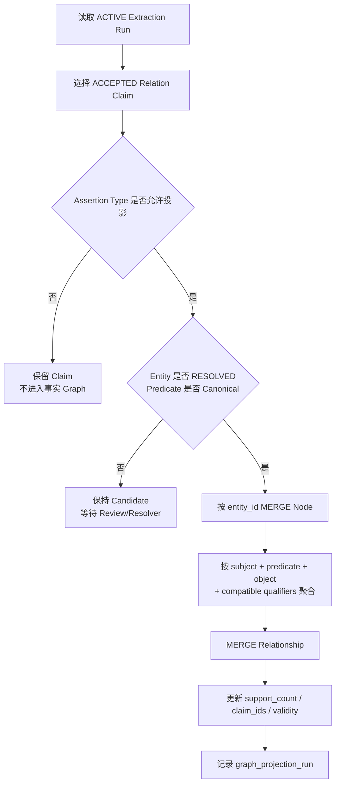

### 15.5 删除和修正

当 Claim 被 `REJECTED` 或 `SUPERSEDED`：

- 增量投影重新计算对应聚合关系。
- 若无有效支持 Claim，删除 Graph 关系。
- 若仍有其他支持 Claim，只更新 support 信息。

---

## 十六、结构化查询 API

### 16.1 实体解析

```http
GET /api/v1/atlas-kg/entities:resolve?name=英伟达
GET /api/v1/atlas-kg/entities/{entity_id}
GET /api/v1/atlas-kg/entities/{entity_id}/aliases
```

### 16.2 公司画像

```http
GET /api/v1/atlas-kg/companies/{entity_id}/profile
```

返回：

- 公司基本实体信息。
- 关联证券。
- 产品。
- 使用的材料和技术。
- 所属外部行业分类。
- 参与的价值链。
- 客户、供应商和竞争者。
- 量化 Claim 摘要。
- 分析师观点摘要。

### 16.3 上下游查询

```http
GET /api/v1/atlas-kg/companies/{entity_id}/suppliers
GET /api/v1/atlas-kg/companies/{entity_id}/customers
GET /api/v1/atlas-kg/companies/{entity_id}/competitors
GET /api/v1/atlas-kg/companies/{entity_id}/products
GET /api/v1/atlas-kg/companies/{entity_id}/inputs
```

### 16.4 价值链查询

```http
GET /api/v1/atlas-kg/value-chains/{entity_id}
GET /api/v1/atlas-kg/value-chains/{entity_id}/graph?depth=2
GET /api/v1/atlas-kg/companies/{entity_id}/value-chain-context
```

### 16.5 Claim 查询

```http
GET /api/v1/atlas-kg/claims/relations
GET /api/v1/atlas-kg/claims/quantified
GET /api/v1/atlas-kg/analyst-views
```

过滤参数：

```text
entity_id
predicate
metric
assertion_type
source_document_id
published_from
published_to
status
```

---

## 十七、Atlas Query Agent

### 17.1 定位

Query Agent 是 Atlas 领域内的问答编排器，不是全局 Agent 平台。

适合回答：

- 某公司的核心产品是什么。
- 某公司的主要供应商和客户有哪些。
- 某公司依赖哪些原材料和技术。
- 某产品链有哪些 A 股公司。
- 券商对某公司的主要风险观点是什么。
- 研报中对某项产能的看法是否一致。
- 某公司在不同产业链中的位置是什么。

不负责：

- 自动交易。
- 投资组合管理。
- 通用互联网搜索。
- 邮件、日历等外部操作。
- 当前新闻事件影响判断。

### 17.2 Query Agent 工具集

Agent 只能调用允许的领域工具：

```text
resolve_entity
get_company_profile
get_company_products
get_company_inputs
get_supply_relationships
get_competitors
traverse_value_chain
find_relation_claims
find_quantified_claims
find_analyst_views
get_phoenixa_financial_metrics
get_source_document_metadata
```

### 17.3 执行流程

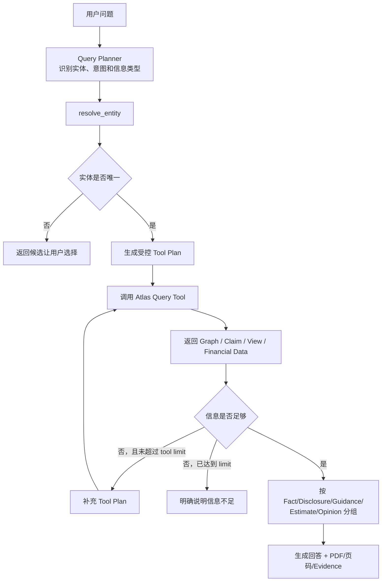

### 17.4 回答约束

Query Agent 必须：

- 区分事实、公司披露和分析师观点。
- 不把 Analyst View 表述成已经发生的事实。
- 指明主要信息来自哪些 source document。
- 当实体无法唯一解析时返回歧义候选。
- 当 Graph 和 Claim 不包含答案时明确说明缺少信息。
- 不根据常识自动补写未入库关系。

Phase 1 保存模型返回的最小 evidence quote 和 page number，因此 Query Agent 可以引用文档、页码和短原文。它不提供 bbox，也没有程序逐字校验原文位置；回答中必须把这类 Evidence 视为模型抽取的可审核定位，而不是经过版面引擎验证的精确 Anchor。

### 17.5 API

```http
POST /api/v1/atlas-kg/query
```

```json
{
  "question": "宁德时代的主要上游依赖和券商关注的风险是什么？",
  "max_tool_calls": 8,
  "include_source_documents": true
}
```

---

## 十八、模块组织

以下为 V2 建议的逻辑结构，不要求一次完成所有文件。

```text
app/projects/atlas/
├── atlas/
│   ├── main.py
│   │
│   ├── knowledge_production/
│   │   ├── pdf_preprocessor/
│   │   │   ├── pdf_inspector.py
│   │   │   ├── pikepdf_unlocker.py
│   │   │   └── temporary_file_scope.py
│   │   ├── extractor/
│   │   │   ├── whole_pdf_extractor.py
│   │   │   ├── prompt_builder.py
│   │   │   ├── extraction_schema.py
│   │   │   ├── extraction_validator.py
│   │   │   └── regeneration_controller.py
│   │   ├── assertion_classifier/
│   │   │   └── assertion_semantics.py
│   │   ├── entity_resolver/
│   │   │   ├── name_normalizer.py
│   │   │   ├── candidate_finder.py
│   │   │   ├── candidate_reranker.py
│   │   │   └── resolution_service.py
│   │   ├── concept_resolver/
│   │   │   ├── concept_candidate_finder.py
│   │   │   └── concept_resolution_service.py
│   │   ├── ontology_discovery/
│   │   │   ├── sampler.py
│   │   │   ├── discovery_prompt.py
│   │   │   ├── candidate_aggregator.py
│   │   │   ├── proposal_generator.py
│   │   │   ├── version_builder.py
│   │   │   └── yaml_publisher.py
│   │   └── industry_crosswalk/
│   │       ├── taxonomy_importer.py
│   │       ├── mapping_candidate_finder.py
│   │       ├── mapping_proposal_agent.py
│   │       └── crosswalk_validator.py
│   │
│   ├── knowledge_store/
│   │   ├── claims/
│   │   │   ├── relation_claim.py
│   │   │   ├── quantified_claim.py
│   │   │   └── analyst_view.py
│   │   ├── entities/
│   │   │   ├── knowledge_entity.py
│   │   │   ├── entity_alias.py
│   │   │   └── security_entity_link.py
│   │   ├── concepts/
│   │   │   ├── industry_taxonomy.py
│   │   │   └── industry_crosswalk.py
│   │   ├── semantic_versions/
│   │   │   ├── discovery_run.py
│   │   │   ├── semantic_proposal.py
│   │   │   └── semantic_version.py
│   │   ├── repositories/
│   │   │   ├── extraction_run_repository.py
│   │   │   ├── entity_repository.py
│   │   │   ├── claim_repository.py
│   │   │   ├── semantic_repository.py
│   │   │   └── industry_repository.py
│   │   └── graph_projection/
│   │       ├── projection_service.py
│   │       └── projection_rules.py
│   │
│   ├── intelligence/
│   │   ├── query_tools/
│   │   │   ├── entity_tools.py
│   │   │   ├── graph_tools.py
│   │   │   ├── claim_tools.py
│   │   │   └── financial_tools.py
│   │   ├── query_planner/
│   │   │   ├── planner.py
│   │   │   └── tool_execution_loop.py
│   │   └── company_review_agent/
│   │       ├── review_agent.py
│   │       └── review_prompt.py
│   │
│   ├── application/
│   │   ├── report_consumer.py
│   │   ├── extraction_orchestrator.py
│   │   ├── semantic_discovery_orchestrator.py
│   │   ├── crosswalk_orchestrator.py
│   │   └── query_orchestrator.py
│   │
│   ├── api/
│   │   ├── extraction_routes.py
│   │   ├── entity_routes.py
│   │   ├── claim_routes.py
│   │   ├── semantic_routes.py
│   │   ├── industry_crosswalk_routes.py
│   │   ├── graph_routes.py
│   │   └── query_routes.py
│   │
│   └── connectors/
│       ├── phoenixa_client.py
│       ├── minio_reader.py
│       ├── neo4j_client.py
│       └── llm_client.py
│
├── config/
│   ├── atlas.yaml
│   ├── report_prompt_mapping.yaml
│   ├── semantic_seed.yaml
│   └── semantic/
│       └── atlas-semantic-v0001.yaml
│
└── docs/
    └── 2026-07-27 DESIGN_ATLAS_KNOWLEDGE_GRAPH_ENGINE_V2.md
```

### 18.1 程序化模块

```text
report_consumer
extraction_orchestrator
pdf_inspector
pikepdf_unlocker
temporary_file_scope
extraction_validator
regeneration_controller
name_normalizer
entity_candidate_finder
crosswalk_validator
version_builder
yaml_publisher
repositories
projection_service
connectors
```

### 18.2 模型能力模块

```text
semantic_extractor
assertion_classifier
entity_candidate_reranker
predicate_mapper
mapping_proposal_agent
company_review_generator
```

### 18.3 Agentic 模块

```text
semantic_discovery_agent
industry_crosswalk proposal workflow
query_planner + query_orchestrator
```

这些 Agentic 模块由应用层控制执行边界，不允许直接修改 Graph 或任意数据库表。

### 18.4 配置边界

程序运行参数放入 `atlas.yaml`，报告类型与 prompt 的路由单独放入 `report_prompt_mapping.yaml`。

`semantic_seed.yaml` 只用于第一次 BOOTSTRAP_DISCOVERY 的基础枚举，不作为生产运行时配置。生产和测试必须读取明确版本的 `atlas-semantic-vNNNN.yaml`。

示例：

```yaml
pipeline:
  version: atlas-kg-v1
  poll_batch_size: 20
  max_document_workers: 1
  llm_concurrency: 1
  llm_retry_count: 2

pdf_input:
  mode: PDF_DIRECT
  preprocessor: pikepdf
  temporary_root: system_temp
  allow_empty_password_unlock: true
  allow_configured_user_password: false
  cleanup_always: true
  chunking_enabled: false

llm:
  extraction_model: qwen3-14b-q4_k_m
  extraction_prompt_version: whole-pdf-extraction-v2
  extraction_schema_version: atlas-extraction-v2
  query_model: qwen3-14b-q4_k_m
  require_json_only: true
  reject_markdown_fence: true
  maximum_total_attempts: 3

entity_resolution:
  exact_alias_auto_accept: true
  fuzzy_candidate_limit: 10
  auto_resolve_threshold: 0.92
  ambiguous_margin: 0.05
  allow_provisional_company: true

semantic_resolution:
  config_uri: s3://atlas-config/semantic/atlas-semantic-v0001.yaml
  allow_unknown_raw_predicate: true
  unknown_predicate_graph_projection: false

semantic_discovery:
  enabled: true
  default_sample_size: 120
  maximum_sample_size: 2000
  require_human_review: true
  publish_yaml_bucket: atlas-config

industry_crosswalk:
  enabled: true
  require_complete_source_coverage: true
  allow_unreviewed_mapping: false

graph_projection:
  include_assertion_types:
    - OBSERVED_FACT
    - COMPANY_DISCLOSURE
  include_claim_status:
    - ACCEPTED

query_agent:
  enabled: true
  maximum_tool_calls: 8
  allow_arbitrary_cypher: false
  allow_database_write: false
```

报告类型路由示例：

```yaml
report_prompt_mapping:
  # key 使用 Artemis 实际传入的 report_type。
  # 六类报告的确切 key 在实现时从 Artemis 元数据确认，
  # Atlas 不自行复制另一套业务枚举。
  default:
    prompt: research-extraction-v1
    extract_relations: true
    extract_quantified_claims: true
    extract_analyst_views: true
```

配置能控制运行参数，但以下变化必须升级版本，不能只改 YAML 后覆盖旧结果：

- Entity Type 语义变化。
- Assertion Type 语义变化。
- canonical predicate 的方向或含义变化。
- Claim Schema 变化。
- Graph Projection 语义变化。
- Prompt 导致抽取含义发生明显变化。

---

## 十九、Cthulhu 前端接入

### 19.1 Phase 1 前端范围

Cthulhu 是 Atlas Phase 1 的操作和审核入口，不只是 Graph 展示页面。

必须支持：

- 查看 Atlas 运行状态。
- 创建可选 sample size 的 Semantic Discovery Run。
- 查看 Discovery 进度和样本文档。
- 审核字段、Predicate、Metric、View Type 和 Concept Proposal。
- 构建、测试、发布和激活 Semantic Version。
- 下载已发布 YAML。
- 审核申万、东财、券商行业 Crosswalk。
- 审核歧义实体和 provisional entity。
- 查看 Extraction Run 和失败原因。
- 手动重试 PDF。
- 查看 Graph。
- 查看公司产业画像。
- 使用 Atlas Query Agent。

### 19.2 前端路由

```text
/atlas
/atlas/overview
/atlas/extraction-runs
/atlas/extraction-runs/:runId
/atlas/discovery-runs
/atlas/discovery-runs/new
/atlas/discovery-runs/:runId
/atlas/semantic-proposals
/atlas/semantic-proposals/:proposalId
/atlas/semantic-versions
/atlas/semantic-versions/:version
/atlas/industry-crosswalk
/atlas/entity-review
/atlas/graph
/atlas/companies/:entityId
/atlas/query
```

### 19.3 Overview 页面

展示：

- 待处理 PDF 数。
- 成功/失败 Extraction Run。
- PDF protection 类型分布。
- JSON regeneration 次数和通过率。
- possible truncation 数量。
- unresolved entity 数量。
- semantic proposal 待审核数量。
- industry mapping coverage。
- active semantic version。
- Neo4j projection 状态。

快捷操作：

- Consume Reports。
- Create Discovery Run。
- Review Proposals。
- Review Crosswalk。
- Publish/Activate Version。
- Rebuild Graph。

### 19.4 Discovery Run 创建页面

表单：

```text
Run Type
Base Semantic Version
Sample Size
Sampling Strategy
Random Seed
Report Types
Institutions
Publish Date Range
Minimum/Maximum Pages
Discover Fields
Discover Predicates
Discover Metrics
Discover View Types
Discover Concepts
Discover Industry Terms
```

提交前预览：

- 候选文档总数。
- 各 report type 预计样本数。
- 各机构预计样本数。
- 页数区间分布。
- 是否存在某类报告样本不足。

API：

```http
POST /api/v1/atlas-kg/semantic-discovery-runs:preview
POST /api/v1/atlas-kg/semantic-discovery-runs
GET  /api/v1/atlas-kg/semantic-discovery-runs/{run_id}
POST /api/v1/atlas-kg/semantic-discovery-runs/{run_id}:cancel
POST /api/v1/atlas-kg/semantic-discovery-runs/{run_id}:retry-failed
```

### 19.5 Discovery Run 详情页面

显示：

- 输入参数。
- 固定后的 sample document IDs。
- 总进度。
- 每个 report type 进度。
- 每个 PDF 状态和失败原因。
- JSON format retry 次数。
- 已发现 Candidate 数。
- Aggregation 状态。
- 生成的 Proposal 数。

运行中允许：

- Cancel。
- 查看失败 PDF。
- 对失败 PDF 单独重试。

运行完成后：

- 跳转 Proposal Review。
- 导出统计结果。
- 使用同一 sample 创建对照测试。

### 19.6 Semantic Proposal Review 页面

布局：

```text
左侧：Proposal 列表和过滤器
中间：定义、类型、频次和冲突信息
右侧：PDF 原文例子和当前版本相似定义
底部：Review 操作
```

过滤器：

```text
Semantic Kind
Review Status
Priority
Report Type
Institution
Minimum Document Frequency
Has Conflict
Suggested Existing Mapping
```

列表列：

```text
Kind
Suggested Key
Display Name
Document Frequency
Report Type Coverage
Institution Coverage
Priority
Review Status
```

编辑表单必须显示字段说明：

```text
Key
Display Name
Description
Value Type
Nullable
Family
Subject Types
Object Types
Aliases
Applicable Report Types
```

操作：

```text
Approve
Reject
Needs Edit
Merge Into Existing
Split Proposal
Save Edited Definition
Bulk Approve Selected
```

API：

```http
GET   /api/v1/atlas-kg/semantic-proposals
GET   /api/v1/atlas-kg/semantic-proposals/{proposal_id}
PATCH /api/v1/atlas-kg/semantic-proposals/{proposal_id}
POST  /api/v1/atlas-kg/semantic-proposals/{proposal_id}:approve
POST  /api/v1/atlas-kg/semantic-proposals/{proposal_id}:reject
POST  /api/v1/atlas-kg/semantic-proposals/{proposal_id}:merge
POST  /api/v1/atlas-kg/semantic-proposals:bulk-review
```

### 19.7 Semantic Version 页面

能力：

- 从 base version + approved proposals 创建 Draft。
- 显示 YAML 结构化预览。
- 显示与 base version 的 Diff。
- 显示新增、修改、删除定义。
- 运行 Schema Validation。
- 选择测试 sample。
- 使用 Draft YAML 发起 Extraction Test。
- 对比 base/draft 抽取结果。
- 发布 Version。
- 激活到指定环境。
- 下载 YAML。

Draft Test 对比：

| 指标 | Base | Draft | 变化 |
|---|---:|---:|---:|
| JSON valid rate |  |  |  |
| Relation count |  |  |  |
| Unknown predicate count |  |  |  |
| Entity unresolved count |  |  |  |
| Quantified claim count |  |  |  |
| Analyst view count |  |  |  |
| Possible truncation |  |  |  |

API：

```http
POST /api/v1/atlas-kg/semantic-versions
GET  /api/v1/atlas-kg/semantic-versions
GET  /api/v1/atlas-kg/semantic-versions/{version}
GET  /api/v1/atlas-kg/semantic-versions/{version}/diff
POST /api/v1/atlas-kg/semantic-versions/{version}:validate
POST /api/v1/atlas-kg/semantic-versions/{version}:test
GET  /api/v1/atlas-kg/semantic-versions/{version}/test-result
POST /api/v1/atlas-kg/semantic-versions/{version}:publish
POST /api/v1/atlas-kg/semantic-versions/{version}:activate
GET  /api/v1/atlas-kg/semantic-versions/{version}/yaml
```

激活请求：

```json
{
  "environment": "TEST",
  "expected_yaml_sha256": "..."
}
```

### 19.8 Industry Crosswalk Review 页面

布局：

```text
Scheme/Version Selector
    ↓
Coverage Summary
    ↓
Source Concept Tree
    ↓
Mapping Proposal Detail
    ↓
Review Actions
```

Coverage：

```text
total concepts
mapped concepts
exact mappings
close mappings
broader/narrower mappings
related mappings
no canonical mapping
pending review
conflicts
coverage percentage
```

操作：

- Approve mapping。
- Edit relation。
- Choose another Atlas concept。
- Create Atlas concept。
- Mark No Mapping。
- Batch approve safe EXACT proposals。
- Re-run proposal generation。
- 查看来源分类树和 Atlas 分类树。

API：

```http
GET  /api/v1/atlas-kg/industry-taxonomies
POST /api/v1/atlas-kg/industry-taxonomies:import
GET  /api/v1/atlas-kg/industry-crosswalk/coverage
GET  /api/v1/atlas-kg/industry-crosswalk/mappings
PATCH /api/v1/atlas-kg/industry-crosswalk/mappings/{mapping_id}
POST /api/v1/atlas-kg/industry-crosswalk/mappings/{mapping_id}:approve
POST /api/v1/atlas-kg/industry-crosswalk/mappings/{mapping_id}:reject
POST /api/v1/atlas-kg/industry-crosswalk:generate-proposals
POST /api/v1/atlas-kg/atlas-industries
```

### 19.9 Entity Resolution Review 页面

展示：

- raw mention。
- 建议 entity type。
- 来源 PDF、页码和上下文。
- 候选实体及分数。
- 已知 alias、identifier、国家、产品和关联证券。
- 模型重排理由。
- 当前 Claim 数。

操作：

- Resolve to Existing。
- Create Provisional Entity。
- Add Candidate Alias。
- Reject Mention。
- Merge Entities。
- Re-run Pending Claims。

### 19.10 Extraction Run 页面

列表显示：

```text
Run ID
Document
Report Type
PDF Size/Page Count
PDF Protection
Model
Semantic Version
Prompt Signature
Attempt Count
Validation Errors
Possible Truncation
Claim Counts
Status
Duration
```

详情显示：

- 文档元数据。
- PDF Preprocessor 状态。
- 每次请求 attempt 的开始/完成时间和错误码。
- 不显示 LLM raw response。
- 最终标准化 Entity/Claim/View。
- Evidence quote 和 page number。

操作：

- Retry。
- Retry With Semantic Version。
- Mark Permanent Failure。
- Supersede Run。
- Re-project Graph。

### 19.11 Graph、Company Review 与 Query 页面

Graph Explorer：

- 按 entity、predicate、industry、claim support 过滤。
- 展示 Company/Product/Material/Technology/Industry。
- 点击 Edge 显示支持 Claim 和来源文档。
- 区分 VERIFIED/PROVISIONAL entity。
- 默认不显示 Analyst View 为事实边。

Company Review：

- 公司实体和证券。
- 申万/东财/券商/Atlas 行业。
- 核心产品。
- 上游输入和供应商。
- 下游客户和市场。
- 竞争关系。
- Quantified Claim。
- Analyst View。
- 来源报告。

Query：

- 自然语言输入。
- 显示 Query Agent Tool Call timeline。
- 显示结构化结果。
- 显示最终总结。
- 显示来源 PDF、页码和 evidence quote。
- 标记内容性质：Fact、Disclosure、Guidance、Estimate、Opinion。

### 19.12 前端调用流程

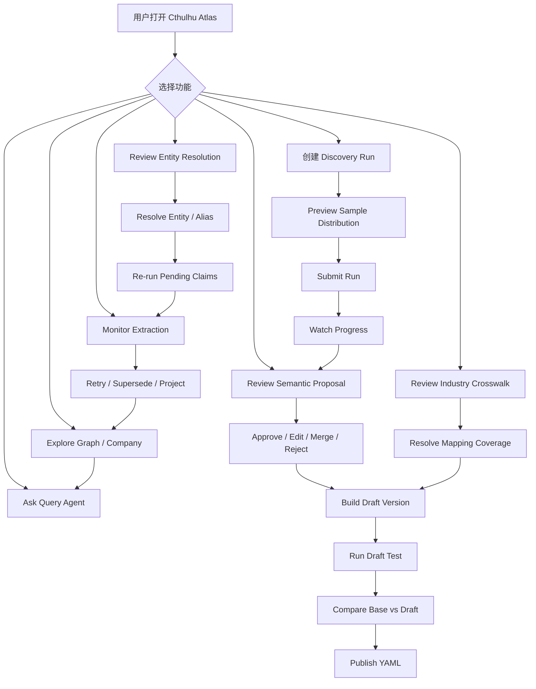

### 19.13 权限

建议权限：

```text
ATLAS_VIEWER
    查看运行、Proposal、Graph 和 Query。

ATLAS_REVIEWER
    审核 Semantic Proposal、Crosswalk 和 Entity Resolution。

ATLAS_PUBLISHER
    发布和激活 Semantic Version。

ATLAS_OPERATOR
    发起批处理、重试、取消、Graph Rebuild。
```

高风险操作：

- Publish Semantic Version。
- Activate Production Version。
- Full Graph Rebuild。
- Merge Entity。
- Bulk Approve Crosswalk。

必须二次确认并记录操作者。

### 19.14 Cthulhu 逻辑模块

以下是逻辑组织，具体 Angular 目录应在实现时对齐 cthulhu 现有项目约定：

```text
cthulhu atlas feature
├── atlas-routing
├── atlas-api-client
├── overview
├── extraction-runs
│   ├── extraction-run-list
│   └── extraction-run-detail
├── semantic-discovery
│   ├── discovery-run-create
│   ├── discovery-run-detail
│   ├── proposal-review
│   ├── version-list
│   ├── version-diff
│   └── version-test-result
├── industry-crosswalk
│   ├── taxonomy-tree
│   ├── mapping-review
│   └── coverage-summary
├── entity-resolution
│   ├── unresolved-list
│   └── entity-review-detail
├── graph-explorer
├── company-review
└── query-agent
```

共享组件：

```text
SourceDocumentLink
EvidenceQuote
AssertionTypeBadge
EntityStatusBadge
SemanticVersionBadge
ReviewStatusBadge
ValidationErrorList
YamlViewer
VersionDiffViewer
```

---

## 二十、端到端示例

假设 Artemis 下载一份动力电池公司研报。

### Step 1：Artemis 完成下载

MinIO：

```text
research-reports/2026/07/report_001.pdf
```

phoenixA：

```json
{
  "document_id": "report_001",
  "report_type": "artemis_report_type",
  "title": "某公司深度研究",
  "institution": "某证券",
  "publish_date": "2026-07-01",
  "object_uri": "s3://research-reports/2026/07/report_001.pdf",
  "content_hash": "..."
}
```

### Step 2：Atlas Report Consumer 发现文档

程序判断当前不存在：

```text
source_document_id = report_001
content_hash = ...
pipeline_version = atlas-kg-v1
status = SUCCEEDED
```

创建 `document_extraction_run`。

### Step 3：PDF Preprocessor

```text
MinIO PDF
→ 临时目录 source.pdf
→ pikepdf 检查
→ 发现 owner restriction
→ 生成临时 unlocked.pdf
```

Run 记录：

```text
input_mode = PDF_DIRECT
pdf_page_count = 38
pdf_protection_status = OWNER_RESTRICTED_EMPTY_PASSWORD
```

### Step 4：加载 Published Semantic YAML

```text
ATLAS_SEMANTIC_CONFIG_URI
→ atlas-semantic-v0003.yaml
→ 校验 SHA-256 和 Schema
→ 加载 Predicate / Metric / View / Industry Crosswalk
```

### Step 5：整份 PDF 提交 LLM

输入：

- System Prompt 强约束。
- Extraction JSON Schema 和字段说明。
- `atlas-semantic-v0003.yaml`。
- 当前 report type prompt。
- `unlocked.pdf`。

第一次响应在 JSON 后包含解释文字，因此 Level 1 校验失败。

Atlas 打回：

```text
FORMAT_TRAILING_TEXT
```

第二次模型只返回合法 JSON，通过 Schema 和 Constraint Validation。

模型发现：

```text
公司A生产动力电池。
正极材料主要由公司B供应。
公司计划于2027年将动力电池产能提升20%。
分析师认为原材料价格上涨是主要风险。
```

输出：

- Relation Claim Candidate：
  - 公司A `PRODUCES` 动力电池。
  - 公司B `SUPPLIES_TO` 公司A，product=正极材料。
- Quantified Claim Candidate：
  - 公司A动力电池产能在2027年计划提升20%。
- Analyst View：
  - 原材料价格上涨是公司A的负面风险。

每条 Candidate 同时包含：

- `evidence_quote`。
- `page_number`。
- `assertion_type`。

### Step 6：实体与概念解析

- 公司A通过 security_registry 匹配 VERIFIED entity。
- 公司B未上市：
  - 名称清晰。
  - 文档明确其产品为正极材料。
  - 没有已有高相似候选。
  - 创建 PROVISIONAL COMPANY entity。
- 动力电池匹配已有 PRODUCT entity。
- 正极材料匹配已有 MATERIAL entity。
- 研报行业术语通过 Published Crosswalk 映射到 Atlas Canonical Industry。

### Step 7：Claim 持久化

保存：

- 2 条 relation claim。
- 1 条 quantified claim。
- 1 条 analyst view。

不保存：

- LLM 原始 JSON。
- chunk。
- bbox。
- parser debug。

保存最小审核信息：

- source document ID。
- evidence quote。
- page number。

### Step 8：Graph Projection

投影：

```text
CompanyA -[:PRODUCES]-> PowerBattery
CompanyB -[:SUPPLIES_TO {product: CathodeMaterial}]-> CompanyA
```

不投影：

- 2027 产能提升20%的计划。
- 分析师认为原材料价格上涨是风险。

它们通过 Claim API 和 Query Agent 查询。

### Step 9：Cthulhu

用户可以：

- 在 Extraction Run 页面查看第二次生成成功。
- 查看 PDF protection 和 page count。
- 查看 Claim、原文和页码。
- 查看公司 Graph。
- 查看公司所属申万、东财和 Atlas Canonical Industry。

### Step 10：Query Agent

问题：

```text
公司A的主要上游依赖和券商关注风险是什么？
```

Agent：

1. 解析公司A。
2. 查询 `USES_INPUT`、`SUPPLIES_TO`。
3. 查询 `analyst_view`。
4. 查询相关 source document metadata。
5. 区分事实关系和券商观点后生成回答。

---

## 二十一、失败处理和重跑

### 21.1 PDF 无法读取或解保护

```text
PDF_CORRUPTED
PDF_PASSWORD_REQUIRED
PDF_UNSUPPORTED_ENCRYPTION
PDF_HASH_MISMATCH
PDF_DOWNLOAD_FAILED
```

处理：

- 下载失败属于 `FAILED_RETRYABLE`。
- hash mismatch、损坏、未提供密码和不支持加密属于 `FAILED_PERMANENT`。
- 不创建 Claim。
- finally 清理临时文件。

### 21.2 模型不能完整处理 PDF

错误：

```text
MODEL_PDF_INPUT_UNSUPPORTED
MODEL_CONTEXT_EXCEEDED
MODEL_OUT_OF_MEMORY
MODEL_TIMEOUT
MODEL_POSSIBLE_TRUNCATION
```

Phase 1：

- OOM、timeout 可以按运行策略重试。
- PDF input unsupported/context exceeded 直接进入 Whole-PDF Gate 失败统计。
- `possible_truncation=true` 的结果不自动进入全量事实 Graph，默认进入人工 Review。
- 不在本期自动切 Chunk。

TODO：

- Gate 失败后设计 TEXT/PAGE/CHUNK fallback。

### 21.3 LLM 输出不合法

```text
第一次校验失败
→ 使用校验错误信息完整重生成
→ 第二次仍失败再次完整重生成
→ 三次均失败则 FAILED_RETRYABLE
```

不保存无效 raw response。

### 21.4 实体无法解析

- Relation Claim 保存为 `CANDIDATE_ENTITY`。
- 保存 raw subject/object text。
- 不进入 Graph。
- 后续新增 alias 或 entity 后可重新运行 Entity Resolver，不必重新调用 LLM。

### 21.5 Predicate 无法解析

- Relation Claim 保存为 `CANDIDATE_SEMANTIC`。
- 保存 raw predicate 和 predicate family。
- 不进入强类型 Graph。
- Semantic Discovery Workflow 后续重新映射，不必重新调用 LLM。

### 21.6 Semantic/Crosswalk 未审核

- 未发布定义不能作为 production canonical key。
- Draft Version 只能用于明确的 test run。
- 未审核 Crosswalk 不进入 Production YAML。
- 对应 Claim 保持 `CANDIDATE_SEMANTIC`。
- Proposal 审核发布后可以只重跑 Semantic Resolver，不重新调用 PDF LLM。

### 21.7 Graph 写入失败

- Claim 已经在 PostgreSQL 中，不丢失。
- `graph_projection_run` 标记失败。
- 重试 Graph Projection，不重跑 PDF 和 LLM 抽取。

### 21.8 Prompt 或 Semantic Version 升级

新 prompt/version：

```text
创建新的 document_extraction_run
→ 重新读取 PDF
→ pikepdf 检查/临时解保护
→ 加载目标 Semantic YAML
→ 重新调用 LLM
→ 新 Claim 写入
→ 旧 run 和旧 Claim 标记 SUPERSEDED
→ Graph 增量重投影
```

如果只修改：

- Entity alias。
- 已存在 raw predicate 到 canonical predicate 的映射。
- Crosswalk mapping。

则优先重新运行 Resolver/Projection，不重新调用 LLM。

---

## 二十二、资源与运行策略

### 22.1 GPU

RTX 4070S 上：

- 主模型并发固定为 1。
- 同时只运行一个文档的模型抽取任务。
- pikepdf 检查和临时重写走 CPU。
- 不同时加载 Docling/Marker GPU 模型。
- Query Agent 请求与批量抽取使用优先级队列。
- Whole-PDF 请求必须设置超时和取消。
- 每次请求后记录显存峰值和耗时。
- OOM 后必须确认模型服务恢复，不能直接继续领取下一份 PDF。

建议优先级：

```text
交互式 Query Agent
    >
单文档手动抽取
    >
Draft Semantic Version 测试
    >
批量研报抽取
    >
Semantic Discovery
```

### 22.2 批处理

- Report Consumer 每次领取有限文档。
- 单次批量默认 10–50 份，但模型并发仍为 1。
- 避免在本地同时下载多份完整 PDF。
- Discovery Run 可以包含较大 sample size，但排队逐份处理。
- 每完成一份文档立即提交 Claim 和 run 状态。
- 每份 PDF 处理完成后立即清理临时目录。

### 22.3 数据库

- Claim 写入按文档事务提交。
- Claim 写入成功后才将 run 标为 `SUCCEEDED`。
- Graph Projection 与 Claim 事务分离。
- Neo4j 故障不应使已经完成的抽取回滚。

---

## 二十三、Phase 1 自动化质量指标

由于人力有限，第一期以自动统计和少量抽查为主。

质量目标优先级：

```text
错误事实进入 Graph 的风险
    >
事实/观点混淆
    >
实体错误合并
    >
Predicate 方向错误
    >
信息漏抽取
```

即：

> Phase 1 优先 Precision，不为了提高 Recall 允许模型猜测。

### 23.1 文档处理指标

```text
PDF 下载成功率
pikepdf 打开成功率
PDF protection 类型分布
Whole-PDF 模型处理成功率
context exceeded / OOM / timeout 比例
possible truncation 比例
last_page_referenced / total_page_count 分布
文档抽取成功率
LLM schema 首次通过率
LLM 重试后通过率
平均 regeneration 次数
平均每文档 Claim 数
平均处理时间
平均峰值显存
```

### 23.2 实体解析指标

```text
VERIFIED entity 匹配率
PROVISIONAL entity 创建率
AMBIGUOUS mention 比例
UNRESOLVED mention 比例
alias 自动学习数量
```

### 23.3 语义指标

```text
canonical predicate 映射率
unknown raw predicate 数量
unknown raw predicate 跨文档重复率
各 predicate 的文档覆盖率
OTHER 占比
semantic proposal 待审核数量
sample → proposal 转换率
published semantic version 数量
draft/base 抽取差异
申万 mapping coverage
东财 mapping coverage
券商已发现术语 mapping coverage
crosswalk conflict 数量
```

### 23.4 Graph 指标

```text
Company/Product/Material/Technology 节点数
各关系类型边数
有两个以上来源支持的关系数
只有 PROVISIONAL entity 的关系比例
孤立节点比例
```

### 23.5 少量人工抽查

不建设大规模人工标注系统。

建议每次模型或 prompt 版本升级时：

- 随机抽查 10–20 份报告。
- 每种报告类型至少覆盖若干样本。
- 优先抽查：
  - 模型重生成过的 PDF。
  - possible truncation。
  - 新 Predicate。
  - 新 Provisional Entity。
  - 非 EXACT Crosswalk。
- 重点检查：
  - 事实和观点是否混淆。
  - 公司是否错误合并。
  - 供应方向是否反了。
  - 计划是否被当成已完成事实。
  - 产能百分比是否被错误转换。
  - evidence quote 是否真的支持 Claim。
  - PDF 没有提及的信息是否被模型补写。

发现幻觉时：

1. 对应 Claim 标记 `REJECTED`。
2. 检查是否是 Prompt 约束缺失。
3. 检查是否是 Semantic YAML 定义诱导错误。
4. 修改 Prompt/YAML 后创建新版本。
5. 使用相同 PDF 回归测试。
6. 不直接在数据库中手工修正模型 Claim 后假装抽取正确。

---

## 二十四、实施阶段

### Phase 1A：Whole-PDF Capability Gate

目标：

- 证明当前本地模型服务可以稳定读取六类整份 PDF。

工作：

- 接入 phoenixA 下载记录和 MinIO 读取。
- 实现 PDF Inspector。
- 集成 pikepdf。
- 实现临时文件作用域和强制清理。
- 实现 Whole-PDF LLM Client。
- 定义严格 JSON Schema。
- 实现六级 Validator。
- 实现 Invalid Output Regeneration。
- 对六类 PDF 运行 size/page/layout 样本。
- 输出 Capability Gate 报告。

Gate 结果：

```text
PASS
    继续 Whole-PDF Phase 1。

CONDITIONAL_PASS
    定义明确的 page/size 限制，超限文档暂不处理。

FAIL
    暂停全量运行，单独设计 TEXT/PAGE/CHUNK fallback。
```

### Phase 1B：Semantic Discovery Control Plane

目标：

- 从用户选择规模的样本中总结全量抽取所需字段和语义。

工作：

- 实现 Discovery Sampler。
- 实现 Bootstrap Discovery Prompt。
- 运行开放式抽取。
- 使用旧文档中的关系枚举作为 bootstrap。
- 实现 Candidate Aggregator。
- 实现 Proposal Generator。
- 建立 Discovery/Proposal/Version 数据表。
- 实现 cthulhu Discovery Run 页面。
- 实现 cthulhu Proposal Review 页面。
- 实现 Draft/Test/Publish 流程。
- 实现 YAML Publisher。
- 发布第一版 `atlas-semantic-v0001.yaml`。

样本不要求跨多年，优先覆盖：

- 不同报告类型。
- 不同券商。
- 不同行业。
- 不同长度和版式。

### Phase 1C：行业 Taxonomy 与 Crosswalk

目标：

- 形成可用于全量抽取和查询的申万、东财、券商行业统一映射。

工作：

- 导入申万 Scheme/Concept Snapshot。
- 基于申万建立 Atlas Canonical Industry V1。
- 导入东财 Scheme/Concept Snapshot。
- 从 Discovery Sample 导入券商行业术语。
- 实现 Mapping Proposal Agent。
- 实现 Coverage/Conflict/Cycle Validator。
- 实现 cthulhu Crosswalk Review。
- 将 Approved Crosswalk 写入 Draft Semantic Version。
- 发布包含 Crosswalk 的 YAML。

### Phase 1D：实体、Claim 与 Graph

目标：

- 批量处理六类研报并生成可查询 Graph。

工作：

- 导入 A 股 security entity seeds。
- 实现实体候选召回和匹配。
- 实现 provisional entity。
- 实现 Relation/Quantified/View 持久化。
- 保存最小 evidence quote/page number。
- 实现 Claim Quality Gate。
- 实现 Neo4j Projection。
- 提供结构化查询 API。
- 实现 cthulhu Entity Review。
- 实现 cthulhu Extraction Run。
- 实现 cthulhu Graph Explorer。

### Phase 1E：Atlas Intelligence

目标：

- 使用模型完成公司产业综述和自然语言查询。

工作：

- 实现 Query Agent 工具集。
- 实现受控 Query Planner。
- 实现公司产业链 Review。
- 实现事实/观点分离总结。
- 实现 cthulhu Company Review。
- 实现 cthulhu Query 页面。

### Phase 1 依赖顺序

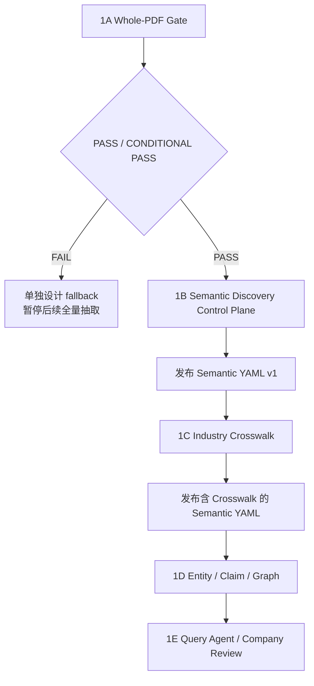

---

## 二十五、TODO：Event 与市场信号

> 本章只记录后续设计方向，不进入 Phase 1 数据表、API 和实现。

### 25.1 为什么 Event 暂缓

事件处理涉及：

- 同一现实事件被多篇新闻重复报道。
- 传闻、公告、批准、完成和取消等阶段变化。
- 同一个事件随时间新增事实。
- 连续市场价格变化与离散事件的区别。
- 新信息是否应该重新触发影响分析。

这些问题会显著扩大第一期范围，因此先完成稳定知识图谱。

### 25.2 后续 Event 三层对象

#### EventMention

某个文档对事件的一次描述。

示例：

```text
新闻A：“公司X计划收购公司Y”
新闻B：“公司X就收购公司Y签署协议”
公告C：“公司X收购公司Y获得监管批准”
```

每一条都是独立 EventMention。

#### CanonicalEvent

Atlas 判断多个 EventMention 是否描述同一现实世界事件后形成的内部聚合对象。

它不是外部数据源提供的对象，而是 Atlas 的事件聚类结果。

示例：

```text
CanonicalEvent: 公司X收购公司Y
  ├── EventMention A
  ├── EventMention B
  └── EventMention C
```

#### EventRevision

同一 CanonicalEvent 的状态或核心事实发生变化。

示例：

```text
Revision 1: rumored
Revision 2: announced
Revision 3: signed
Revision 4: approved
Revision 5: completed
```

EventRevision 不是对 EventMention 做归因，而是记录同一现实事件的演进版本。

### 25.3 Fingerprint 的后续定位

Fingerprint 只用于候选召回，不作为事件唯一身份。

可能字段：

```text
event family
canonical participants
target/object
time window
location
stage
metric
```

最终是否合并需要规则、语义匹配和必要的模型判断。

### 25.4 商品和期货价格

油价、金价、期货等不使用 Event 去重。

后续模型：

```text
MarketInstrument
DailyObservation
TrendEpisode
```

`DailyObservation` 来自结构化行情数据。

`TrendEpisode` 由程序规则生成：

- N 日涨跌幅。
- 波动率变化。
- 突破。
- 连续上涨或下跌。
- 成交量异常。

新闻中的“油价上涨”只作为市场信号的解释来源，不作为唯一价格事实。

---

## 二十六、TODO：Embedding 与持久化 Chunk

Phase 1 不生成 Embedding，也不持久化 Chunk。

未来出现以下明确需求时再引入：

- 从原文中检索支持和反驳证据。
- 相似研报检索。
- 实体消歧候选召回。
- Event 语义候选召回。
- RAG 公司综述。
- 关系冲突检测。

届时需要：

- 定义稳定 chunk ID。
- 持久化 normalized document。
- 持久化 chunk text、page、heading、hash。
- 记录 embedding model/version/dimension。
- 支持重新 embedding 而不重新解析 PDF。

是否引入应由明确查询场景驱动，而不是为了“以后可能有用”提前建设。

---

## 二十七、TODO：高级 PDF 解析

以下情况达到一定比例后，再评估 Docling/Marker/OCR：

- 大量扫描 PDF。
- 文本提取乱码。
- 多栏阅读顺序严重错误。
- 关键知识集中在表格中。
- 关键产业关系主要存在于图表中。
- Query Agent 需要精确页码或原文引用。

候选能力：

- 标题层级恢复。
- 页眉页脚识别。
- 表格结构恢复。
- 图片和图表理解。
- page/bbox evidence。
- 原文精确引用。

Phase 1 的 `DocumentModelInput` 接口必须允许以后增加 `TEXT_EXTRACTED`、`PAGE_BATCH` 和 `TEXT_CHUNKED` 实现，但当前只实现 `PDF_DIRECT`。

---

## 二十八、TODO：Impact Engine

Impact Engine 不进入 Phase 1。

未来需要在知识图谱基础上增加：

- Event/Market Signal 输入。
- 公司产品和地域暴露。
- 成本和收入传导。
- 库存、合同、套保和替代性。
- 即时、短期、中期、长期影响。
- positive、negative、mixed、unknown。
- 市场反应与基本面兑现的分离验证。

Phase 1 为其保留的基础：

- 稳定 entity_id。
- 事实和观点分离。
- `valid_from/valid_to`。
- Assertion Type。
- 产品、材料、技术和供应关系。
- Quantified Claim。

---

## 二十九、TODO：实体补全闭环

未来 Atlas 遇到高价值 unresolved company 时：

```text
Atlas
  → entity_enrichment_requested
  → Artemis 获取官方页面/公告/注册资料
  → MinIO + phoenixA
  → Atlas 重新解析
  → 更新 entity/alias/identifier
  → 重新解析待定 Claim
  → Graph 增量更新
```

Phase 1 不实现自动外部搜索，只保留 unresolved mention 和重新解析能力。

---

## 三十、TODO：跨域 Agent Orchestrator

Atlas Query Agent 只负责 Atlas 领域。

未来如果需要同时调用：

- Atlas 产业知识。
- phoenixA 行情与财务数据。
- 新闻事件。
- 投资组合。
- 风险系统。
- 交易或通知能力。

应建设 Atlas 之外的跨域 Agent Orchestrator。

Atlas 对它暴露稳定工具和 API，不将通用 Agent 平台塞入 Atlas。

---

## 三十一、验收标准

Phase 1 完成至少满足：

1. 能从 phoenixA 获取 Artemis 下载的研报记录。
2. 能从 MinIO 读取 PDF。
3. 能使用 pikepdf 检查 PDF，并临时处理允许读取的保护限制。
4. 能将整份 PDF 提交 Qwen3-14B，不依赖 Chunking。
5. 格式错误时能携带校验错误完整打回重生成。
6. Qwen3-14B 能输出符合 Schema 的实体、关系、量化 Claim 和观点。
7. 能区分事实、公司披露、管理层计划和分析师观点。
8. 每个 Claim/View 都有最小 evidence quote 和合法 page number/null。
9. 能创建可选 sample size 的 Discovery Run。
10. 能在 cthulhu 审核 Semantic Proposal。
11. 能发布、下载并加载不可变 Semantic YAML。
12. 申万、已获取东财和已发现券商行业术语具有完整 Crosswalk 处理结果。
13. 能以 security_registry 初始化 A 股实体。
14. 能解析研报中新出现的海外公司和非上市公司。
15. 不能确定的实体不会错误进入 Graph。
16. 未知 predicate 能进入 Semantic Proposal Review。
17. 标准化 Claim 能持久化。
18. Neo4j 能从有效 Claim 构建和重建。
19. cthulhu 能审核、监控、查看 Graph 和使用 Query Agent。
20. 能查询公司产品、上下游、竞争者、材料和技术。
21. Query Agent 只能通过受控工具查询。
22. Query Agent 能区分事实和分析师观点。
23. Event、Impact、Embedding 和高级 PDF fallback 未被混入主抽取链路。

---

## 三十二、最终范围总结

Atlas Phase 1 的核心不是：

```text
PDF → LLM → Neo4j
```

而是：

```text
PDF
→ pikepdf 检查/临时解保护
→ Published Semantic YAML + 强约束 Prompt
→ 整份 PDF 提交 Qwen
→ 严格结构校验，失败则完整打回重生成
→ 模型语义候选 + 最小 Evidence
→ 实体与语义解析
→ 标准化 Claim
→ 可重建 Graph
→ Cthulhu 审核/管理
→ 结构化查询和受控 Agentic 查询
```

Atlas 的价值由以下能力组成：

- 使用模型理解研报。
- 让事实、计划、估计和观点保持语义差异。
- 渐进建立跨 A 股、海外和非上市公司的实体网络。
- 从可配置规模的样本中自动发现并演进字段、Predicate、Metric、View 和 Concept。
- 在 Cthulhu 中审核 Proposal、Crosswalk 和实体歧义。
- 以不可变 YAML 发布可测试、可部署的语义版本。
- 建立申万、东财和券商行业术语的 Crosswalk。
- 把不稳定的模型输出转换成稳定、可查询的知识资产。
- 在 Graph 上提供确定性查询。
- 使用受控 Query Agent 将知识转化成公司和产业洞察。

Phase 1 不追求一次解决所有知识图谱问题，而是先建立一个能够持续吸收研报、逐步改进语义、并且不会因模型变化而失去结构的最小完整系统。
