# Atlas 研报知识生产与产业链知识图谱引擎 V3 架构设计

> 文档日期：2026-08-13
>
> 文档状态：Current / Architecture Baseline
>
> 适用范围：`app/projects/atlas`、PhoenixA Atlas KG API、Cthulhu Atlas 工作台，以及 Artemis/MinIO 研报输入边界
>
> 代码基线：Atlas `v0.2.1` 之后的当前 `Unreleased` 变更
>
> 文档性质：本文件是 Atlas 当前唯一的总体架构设计；`DEPLOYMENT.md` 只记录部署操作，带日期的 Sampling 验证报告只记录实验事实

---

## 1. 阅读指南与事实等级

本文不是产品概述，而是熟悉、维护、扩展和审核 Atlas 的工程设计基线。它必须回答以下问题：

1. Atlas 为什么存在，它与 Artemis、PhoenixA、MinIO、PostgreSQL、Neo4j、Cthulhu 的边界是什么。
2. 为什么字段未知时不能直接做严格全量抽取，以及 Sampling 如何发现六类研报各自的 extraction profile。
3. 单 PDF 自由 JSON、同类字段 Review、跨类型目录和人工发布之间如何分层。
4. PDF 文本层、layout、OCR 如何按成本和质量逐级升级。
5. 多模型 Harness 如何注册模型、管理多个 key、选择 provider、校验业务结果、熔断和降级。
6. 正式生产抽取如何从 PDF 变成 Entity、Claim 和可重建 Graph。
7. 当前代码、配置、API、数据库表、状态机和前端页面分别在哪里。
8. 哪些能力已经实现，哪些只是必须保持的契约，哪些仍是计划，避免把愿景误读成现状。

文中使用以下标记：

| 标记 | 含义 |
| --- | --- |
| **Implemented** | 当前代码、迁移或配置中已经存在，并有对应测试或真实验证 |
| **Contract** | 当前架构必须保持的边界；即使实现细节变化也不能静默破坏 |
| **Planned** | 尚未形成完整产品闭环，不能对外宣称已经可用 |
| **Candidate** | 有样本证据但尚未经过生产批准的语义或字段产物 |

旧 V2 的优点是覆盖面和工程细节充分；其主要过时点是把模型固定为 Qwen、把主输入固定为整份 PDF，以及把规划中的细粒度数据库表写成了既定方案。V3 保留其完整设计深度，同时以当前代码和迁移为准纠正这些假设。

---

## 2. 系统目的

### 2.1 Atlas 要解决的问题

Artemis 已经能够获得大量证券和行业研报，但 PDF 本身不是可查询知识。研究人员真正需要的是：

- 一家公司生产什么、使用什么材料、依赖什么技术、面向哪些应用；
- 一家公司或行业处于产业链哪个环节，上游、下游、供应商、客户和竞争者是谁；
- 供给、需求、产能、库存、价格、政策和宏观变量如何影响主体；
- 哪些陈述是已发生事实，哪些是公司披露、管理层计划、分析师估计、观点或情景假设；
- 每条结论来自哪份文档、哪一页、哪段原文；
- 模型、Prompt 或语义版本变化后，如何重跑、比较和重建图，而不是丢失来源。

Atlas 的职责是把不稳定的模型理解转换成可治理、可审计、可重建的知识资产。

### 2.2 为什么必须有开发期 Sampling

六类研报的有效内容不同，而且当前不知道完整字段全集。如果在一开始就给所有 PDF 同一套严格字段：

- 模型只会填写预设字段，无法发现未知概念；
- 公司或行业特有指标容易直接污染全局 Schema；
- `stock`、`macro`、`morning_report` 被错误拉平；
- 少量失败文档会被误判为模型能力问题，实际可能是 PDF 文本层或 Prompt 问题；
- 每次试错都重新跑大量 PDF，浪费时间、免费额度和本地显存。

因此 Atlas 将语义发现与生产抽取分离：Sampling 先自由理解并总结字段，Production 再用审核后的字段和严格 Schema 填值。

### 2.3 最终产品形态

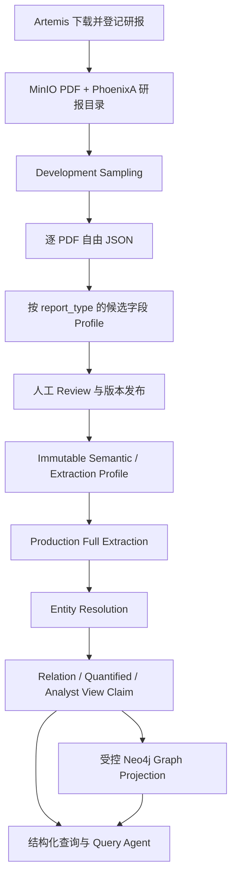
```mermaid
flowchart TD
    A["Artemis 下载并登记研报"] --> B["MinIO PDF + PhoenixA 研报目录"]
    B --> C["Development Sampling"]
    C --> D["逐 PDF 自由 JSON"]
    D --> E["按 report_type 的候选字段 Profile"]
    E --> F["人工 Review 与版本发布"]
    F --> G["Immutable Semantic / Extraction Profile"]
    G --> H["Production Full Extraction"]
    H --> I["Entity Resolution"]
    I --> J["Relation / Quantified / Analyst View Claim"]
    J --> K["受控 Neo4j Graph Projection"]
    J --> L["结构化查询与 Query Agent"]
    K --> L
```

这条链路的核心不是 `PDF → LLM → Neo4j`，而是：

```text
PDF
→ 可读性与解析路径判断
→ 可追踪的模型理解
→ 严格验证或字段治理
→ 实体解析
→ 带证据的 Claim
→ 有条件的 Graph Projection
→ 受控查询
```

---

## 3. 目标、非目标与核心决策

### 3.1 当前目标

- 覆盖 `stock`、`industry`、`macro`、`strategy`、`morning_report`、`new_stock` 六类生产研报。
- 使用多轮小样本而不是一次全库试错，优先提升语义多样性和结果可复用性。
- 保留每份 PDF 的自由理解结果，使没有读过原文的人仍能理解报告。
- 从同类多文档中发现通用字段，同时保留每种报告的独立 profile。
- 让免费、限流、可能下线的远程模型与本地 14B 模型组成可插拔资源池。
- 对 born-digital PDF 使用低成本文本层，对真正需要的文档才升级 OCR/layout。
- 在生产中严格区分 Entity、Relation Claim、Quantified Claim 和 Analyst View。
- 所有业务持久化与图访问通过 PhoenixA，不让 Atlas 直接连接数据库。
- 所有生产结论保留 evidence、page、semantic version、prompt signature 和 extraction run。

### 3.2 非目标

- Sampling 不负责证明所有抽取值已经达到生产级精度；它首先发现语义槽位。
- Sampling 原始 JSON 可以包含公司或指标细节，但这些细节不能自动成为生产字段名。
- 不要求每种文档填写所有 CORE 字段；CORE 表示有证据时优先请求和建图。
- 不默认对全部 PDF 使用 Docling、PP-StructureV3 或 OCR。
- 不依赖某一个模型、provider、免费账号或 API key 保证可用性。
- 不允许模型直接写 PostgreSQL、Neo4j 或执行任意 Cypher。
- Event/Impact Engine、持久化 Chunk/Embedding 和跨域 Agent Orchestrator 不属于当前已实现闭环。

### 3.3 核心架构决策

| ID | 决策 | 原因 | 状态 |
| --- | --- | --- | --- |
| ADR-01 | Atlas 不直接连接 PostgreSQL/Neo4j | 数据连接、迁移和事务由 PhoenixA 统一管理 | Contract / Implemented |
| ADR-02 | Sampling 只存在于 development/test | 生产不应在线探索 Schema | Contract / Implemented |
| ADR-03 | Sampling 先自由 JSON、后严格字段 Review | 字段未知时不能先限制输出结构 | Contract / Implemented |
| ADR-04 | 六类报告独立 profile | 文档目的和有效语义不同 | Contract / Implemented |
| ADR-05 | Production 只消费已审核 immutable semantic version | 防止候选字段静默污染全量任务 | Contract / Partially implemented |
| ADR-06 | 模型以注册表 + Stage Harness 插拔 | 免费资源不稳定，不能硬编码单模型 | Contract / Implemented for Sampling |
| ADR-07 | HTTP 成功不等于业务成功 | 非 JSON、错误 Schema、无证据内容也必须 failover | Contract / Implemented |
| ADR-08 | PDF parser 使用质量门控的成本阶梯 | home 资源有限，OCR 不可全量默认 | Contract / Implemented |
| ADR-09 | Claim 是事实源，Graph 是可重建投影 | 保留证据、观点差异和修正能力 | Contract / Implemented |
| ADR-10 | Query Agent 只能调用 allowlist 工具 | 防止任意数据库/图查询和无依据回答 | Contract / Implemented |

---

## 4. 系统上下文与所有权

### 4.1 总体上下文

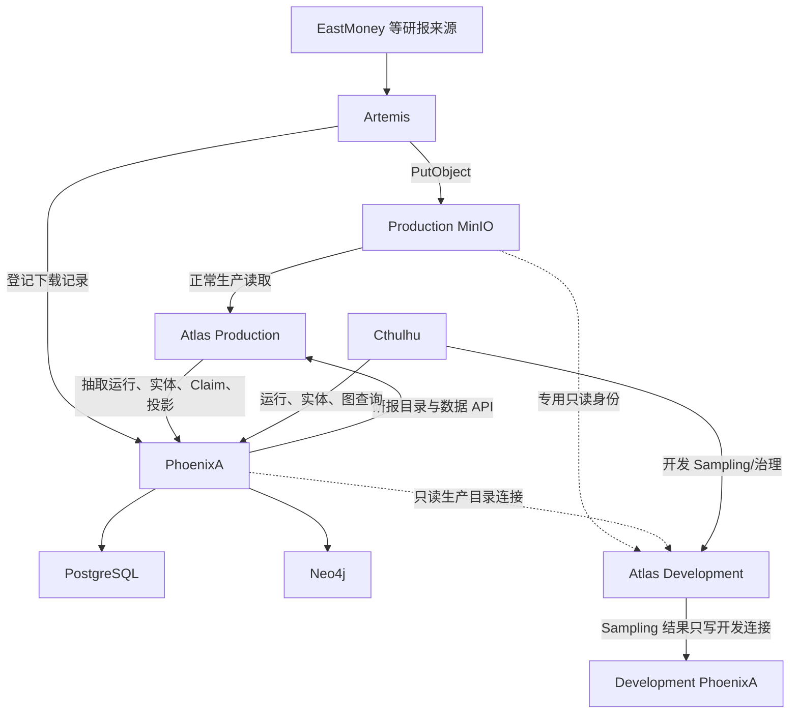
```mermaid
flowchart TD
    SRC["EastMoney 等研报来源"] --> ART["Artemis"]
    ART -->|"PutObject"| MINIO["Production MinIO"]
    ART -->|"登记下载记录"| PHX["PhoenixA"]

    PHX --> PG["PostgreSQL"]
    PHX --> NEO["Neo4j"]

    MINIO -->|"正常生产读取"| PROD["Atlas Production"]
    PHX -->|"研报目录与数据 API"| PROD
    PROD -->|"抽取运行、实体、Claim、投影"| PHX

    MINIO -. "专用只读身份" .-> DEV["Atlas Development"]
    PHX -. "只读生产目录连接" .-> DEV
    DEV -->|"Sampling 结果只写开发连接"| DEVPHX["Development PhoenixA"]

    CTH["Cthulhu"] -->|"开发 Sampling/治理"| DEV
    CTH -->|"运行、实体、图查询"| PHX
```

### 4.2 Artemis 边界

**Implemented / Contract**

Artemis 拥有：

- 研报下载、去重、重试；
- MinIO 对象写入；
- `ods.research_report_download_record` 等下载目录记录；
- `resource_id`、`report_type`、标题、机构、发布日期、对象 key 等源元数据。

Artemis 不拥有：

- PDF 语义抽取；
- Entity/Claim/Graph；
- Sampling 字段归纳；
- Semantic version 和 Crosswalk Review。

### 4.3 Atlas 边界

**Implemented**

Atlas 拥有三个领域：

1. `knowledge_production`：PDF 预处理、自由/严格抽取、实体解析、Claim 和 Graph 投影编排。
2. `semantic_control_plane`：Sampling、字段 Review、Predicate/Concept discovery、Semantic YAML、Taxonomy Crosswalk。
3. `intelligence`：结构化查询计划、受控工具执行、引用校验和公司 Review。

Atlas 只通过客户端访问外部系统：

- `MinIOPDFReader` 只读 PDF；
- `PhoenixAClient` 读目录、写运行和知识数据；
- provider adapters 调用 LLM；
- `CronjobCallbackClient` 上报异步进度。

### 4.4 PhoenixA 边界

**Implemented / Contract**

PhoenixA 是 Atlas 的数据平面：

- 管理 PostgreSQL/Neo4j 连接；
- 执行 `atlas_kg` migration；
- 提供 extraction run、governance、entity、claim、sample 和 graph projection API；
- 提供 ODS 研报、证券、财务和 taxonomy 数据；
- Cthulhu 部分列表查询直接访问 PhoenixA。

Atlas 不接收 PostgreSQL/Neo4j 凭据，也不在业务代码中拼 SQL/Cypher。

### 4.5 MinIO 边界

MinIO 对象由 Artemis 拥有，Atlas 只读。开发 Sampling 可以读取生产对象，但必须使用专用服务端只读身份：

```text
Allow: s3:ListBucket, s3:GetObject
Deny:  s3:PutObject, s3:DeleteObject
```

`read_only: true` 只是 Atlas 配置验证标志，不能代替 MinIO IAM。`credential_source` 可以从 Artemis `config-production.yaml` 导入 MinIO 连接字段，目的是避免复制密钥；导入器只读取顶层 `minio` 中的 `endpoint/access_key/secret_key/secure`，不会修改来源文件。

### 4.6 Cthulhu 边界

**Implemented**

Cthulhu 是人工治理和观察面：

- 开发：Sample Runs、Sample Extractions、Semantic Governance、Crosswalk；
- 正式运行：Extraction Runs、Entity Review；
- 查询：Graph & Query、Company Review。

生产环境 `atlasSamplingEnabled=false`，Angular route 和菜单不会注册 Sampling 页面。前端门控只是用户体验层；后端配置仍必须独立 fail closed。

---

## 5. 逻辑架构与代码模块

### 5.1 分层结构

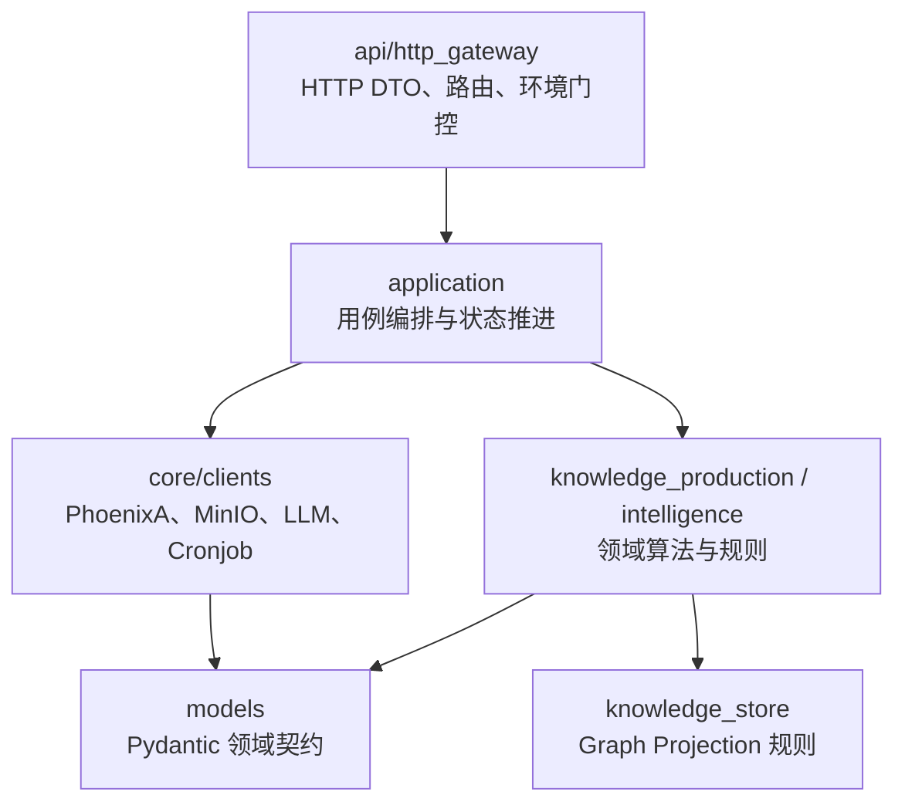
```mermaid
flowchart TD
    API["api/http_gateway<br/>HTTP DTO、路由、环境门控"] --> APP["application<br/>用例编排与状态推进"]
    APP --> DOMAIN["knowledge_production / intelligence<br/>领域算法与规则"]
    APP --> CLIENTS["core/clients<br/>PhoenixA、MinIO、LLM、Cronjob"]
    DOMAIN --> MODELS["models<br/>Pydantic 领域契约"]
    CLIENTS --> MODELS
    DOMAIN --> STORE["knowledge_store<br/>Graph Projection 规则"]
```

依赖方向必须从外向内。领域规则不应引用 FastAPI、Angular 或数据库驱动。

### 5.2 当前模块树

```text
app/projects/atlas/
├── atlas/
│   ├── api/http_gateway/
│   │   ├── routes.py
│   │   ├── sample_routes.py
│   │   ├── extraction_routes.py
│   │   ├── governance_routes.py
│   │   └── query_routes.py
│   ├── application/
│   │   ├── runtime.py
│   │   ├── free_extraction_runner.py
│   │   ├── semantic_discovery_service.py
│   │   ├── extraction_orchestrator.py
│   │   ├── knowledge_production_orchestrator.py
│   │   ├── report_consumer.py
│   │   ├── crosswalk_orchestrator.py
│   │   └── crosswalk_service.py
│   ├── core/
│   │   ├── config_manager.py
│   │   ├── sample_task_registry.py
│   │   ├── llm/harness.py
│   │   ├── llm/key_pool.py
│   │   └── clients/
│   ├── knowledge_production/
│   │   ├── extractor/
│   │   ├── pdf_preprocessor/
│   │   ├── ontology_discovery/
│   │   ├── entity_resolver/
│   │   ├── industry_crosswalk/
│   │   └── claim_builder.py
│   ├── knowledge_store/graph_projection/
│   ├── intelligence/
│   └── models/
├── config/
├── scripts/
├── tests/
└── docs/
```

### 5.3 主要类职责

| 类/模块 | 输入 | 输出 | 不负责 |
| --- | --- | --- | --- |
| `ConfigManager` | base YAML、环境 override、credential source | 严格 `Config` | 业务连接、密钥轮换 |
| `build_runtime` | `Config` | 完整对象图 `AtlasRuntime` | 请求处理 |
| `SemanticDiscoveryService` | sample request、报告目录 | 逐文档结果、每类 field summary、governance | 直接发布候选 catalog 为生产 profile |
| `FreeExtractionRunner` | `ResearchReport` | `ExtractionRun + FreeExtractionResult` | 跨文档字段归纳 |
| `FreeExtractionExtractor` | PDF、自由 Prompt | 单文档自由 JSON | 生产严格 Claim 输出 |
| `FreeFieldReviewSummariser` | 同类自由 JSON | `CategoryFieldReview` | 跨类型最终批准 |
| `FailoverLLMClient` | 阶段请求、validator | 第一个业务有效响应 | 判断字段的最终业务价值 |
| `KeyPool` | 多 key 与并发上限 | 一次租约 | 多进程全局限流 |
| `ExtractionOrchestrator` | 报告、semantic/profile | 严格 extraction run/result | 实体与 Claim 写入 |
| `KnowledgeProductionOrchestrator` | validated extraction | entity、claim、graph projection | Sampling |
| `EntityResolutionService` | mention、PhoenixA candidates | resolved/provisional mention | 人工合并 UI |
| `CrosswalkSchemeService` | taxonomy nodes | reviewed/published crosswalk | 产业链上下游推理 |
| `QueryOrchestrator` | 自然语言问题 | grounded answer + tool trace | 任意 Cypher/SQL |

---

## 6. 能力类型与责任矩阵

### 6.1 Deterministic 能力

程序必须负责：

- 配置合并、环境边界和 capability 校验；
- PDF 对象读取、hash、页数、owner permission 解保护；
- 文本质量统计、分块、代表页选择；
- JSON/Pydantic Schema、页码和引用完整性校验；
- 字段证据路径归属、同义族归并和 CORE 降级；
- Entity exact match、阈值、margin 和状态转换；
- Claim 去重、状态和 Graph projectability；
- run 幂等、checkpoint、状态持久化和孤儿运行恢复；
- Query tool allowlist、参数 Schema、调用数和 citation grounding。

### 6.2 Model 能力

模型适合：

- 单 PDF 的语义理解和自由 JSON 组织；
- 同类多文档的字段语义归纳；
- Predicate/Concept proposal；
- taxonomy 候选映射；
- Entity candidate rerank 和文档内共指聚类；
- Query plan 和基于工具结果的自然语言回答。

模型不能独立决定：

- 环境读写权限；
- 字段证据是否真实存在；
- Semantic version 是否批准；
- Entity 是否无条件自动合并；
- Claim 是否投影进图；
- 数据库查询范围。

### 6.3 Agentic 能力

当前 Agentic 范围非常小：Query Agent 先计划 allowlisted tool calls，再顺序执行，最后基于 observations 回答。Sampling 和生产抽取是确定性 orchestrator，不是无限循环自主 Agent。

### 6.4 能力归属矩阵

| 能力 | Program | Model | Human |
| --- | :---: | :---: | :---: |
| PDF 质量门控 | 主 | 无 | 观察异常样本 |
| 单文档自由理解 | 验证/编排 | 主 | 业务抽查 |
| 同类字段归纳 | 证据 Guard | 主 | 批准/驳回 |
| 跨类型 Catalog | 确定性合并为主 | 可选辅助 | 最终批准 |
| LLM 可用性 | Harness | 被编排资源 | 配置供应商 |
| 实体解析 | 阈值/状态 | rerank/cluster | 歧义 Review |
| Claim 接受 | 主 | 生成候选 | 抽查/治理 |
| Graph Projection | 主 | 无 | 规则审核 |
| Query | 工具边界 | plan/answer | 使用者判断 |

---

## 7. Development 与 Production 双生命周期

### 7.1 环境能力矩阵

| 能力 | Development/Test | Production |
| --- | --- | --- |
| `sampling_enabled` | `true` | 必须 `false` |
| 创建 `/sample-runs` | 允许 | 路由不注册 |
| `/discovery-runs` | 允许 | 404 |
| Cthulhu Sampling 页面 | 注册 | 不注册 |
| 读取生产 PhoenixA 目录 | 可选、只读连接 | 正常业务连接 |
| 读取生产 MinIO | 可选、只读身份 | 正常读取 |
| 写 Sampling 结果 | 只写开发 PhoenixA | 禁止 |
| 候选 catalog | 扩样和 Review | 不可直接消费 |
| approved semantic/profile | 回归验证 | 全量抽取 |

### 7.2 启动期 fail closed

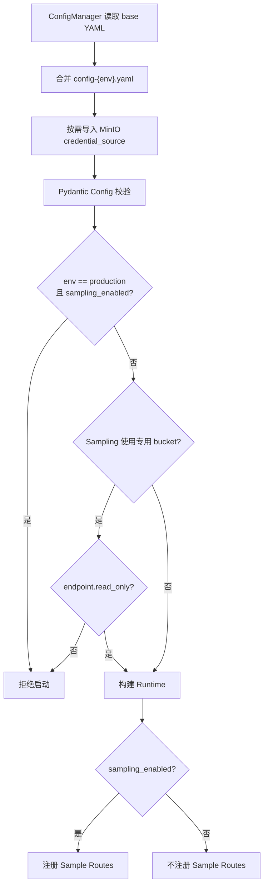
```mermaid
flowchart TD
    A["ConfigManager 读取 base YAML"] --> B["合并 config-{env}.yaml"]
    B --> C["按需导入 MinIO credential_source"]
    C --> D["Pydantic Config 校验"]
    D --> E{"env == production<br/>且 sampling_enabled?"}
    E -->|"是"| F["拒绝启动"]
    E -->|"否"| G{"Sampling 使用专用 bucket?"}
    G -->|"是"| H{"endpoint.read_only?"}
    H -->|"否"| F
    H -->|"是"| I["构建 Runtime"]
    G -->|"否"| I
    I --> J{"sampling_enabled?"}
    J -->|"是"| K["注册 Sample Routes"]
    J -->|"否"| L["不注册 Sample Routes"]
```

### 7.3 开发读生产、写开发

`build_runtime` 构建两个逻辑 PhoenixA client：

- `phoenixa`：所有 extraction/sample/governance 写入的主连接；
- `sampling_catalog`：只用于 `list_research_reports`；未配置时复用主连接。

MinIO 同样分为：

- `minio`：普通 extraction 的 `source_bucket`；
- `sampling_minio`：Sampling 的 `sampling_source_bucket`；未配置时回退 source。

**Contract：** 即使 Sampling 目录和 PDF 来自生产，`sample_run`、自由 JSON、field summary 和治理记录也只能写 `phoenixa`，不能写生产 catalog 连接。

---

## 8. 六种报告类型

### 8.1 类型来源

类型以 PhoenixA 研报目录的 `report_type` 为准，不能从 MinIO 前缀推断。`new_stock` 与 `stock` 可以共享对象前缀，但它们必须独立采样、独立 Review、独立发布 profile。

### 8.2 类型目标

| report_type | 文档特征 | Sampling 优先语义 | 不应强制 |
| --- | --- | --- | --- |
| `stock` | 公司深度、点评、财报、首次覆盖 | 主营产品、技术、上下游、客户、产能、经营指标、风险、预测 | 每篇都有产业链深度 |
| `industry` | 行业专题、供需、技术路径 | 材料、产品、技术、应用、参与者、竞争、政策和风险传导 | 公司财务全字段 |
| `macro` | 政策、增长、通胀、地产、利率等 | 指标、地域、期间、政策作用对象与传导 | 公司实体和产业链字段 |
| `strategy` | 配置、风格、行业观点、市场信号 | 资产/行业映射、催化、风险、建议、情景 | 把观点当事实 |
| `morning_report` | 多主题摘要和快讯 | 明确主体、事件、产品/行业信息、风险和关注方向 | 作为公司主档 Schema |
| `new_stock` | 新股、招股书与募投分析 | 主营业务、技术、客户供应商、募投、产能、风险 | 与普通 stock 混合 Review |

### 8.3 Prompt Profile

`config/report_prompt_mapping.yaml` 为六类报告提供 profile：

- `company-research-v1`
- `industry-research-v1`
- `macro-research-v1`
- `new-stock-research-v1`
- `strategy-research-v1`
- `morning-report-v1`

Profile 包含 description、focus、exclude 和是否抽 relation/quantified/view。Sampling 可以在 bootstrap 类型 disabled 时以 `allow_disabled=true` 读取 profile；Production 只能读取 enabled 类型。

### 8.4 无数据语义

若某类型没有可用文档：

- 创建空 `sample_category_result`；
- `recommended_fields/core_fields/conditional_fields` 为空；
- `coverage_gaps` 说明数据源缺失；
- `notes=NO_SOURCE_DOCUMENTS`；
- 禁止复制其他类型 profile 填补空缺。

---

## 9. Sampling 总体架构

### 9.1 业务阶段

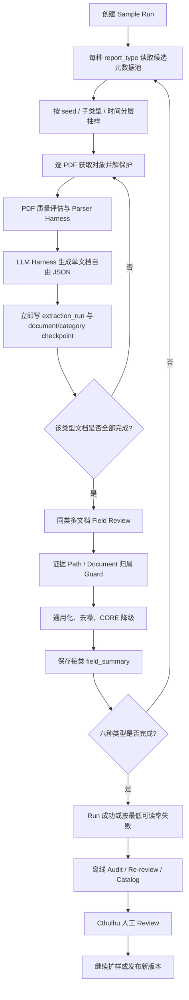
```mermaid
flowchart TD
    A["创建 Sample Run"] --> B["每种 report_type 读取候选元数据池"]
    B --> C["按 seed / 子类型 / 时间分层抽样"]
    C --> D["逐 PDF 获取对象并解保护"]
    D --> E["PDF 质量评估与 Parser Harness"]
    E --> F["LLM Harness 生成单文档自由 JSON"]
    F --> G["立即写 extraction_run 与 document/category checkpoint"]
    G --> H{"该类型文档是否全部完成?"}
    H -->|"否"| D
    H -->|"是"| I["同类多文档 Field Review"]
    I --> J["证据 Path / Document 归属 Guard"]
    J --> K["通用化、去噪、CORE 降级"]
    K --> L["保存每类 field_summary"]
    L --> M{"六种类型是否完成?"}
    M -->|"否"| B
    M -->|"是"| N["Run 成功或按最低可读率失败"]
    N --> O["离线 Audit / Re-review / Catalog"]
    O --> P["Cthulhu 人工 Review"]
    P --> Q["继续扩样或发布新版本"]
```

### 9.2 Sampling 不是旧 Discovery 的简单别名

当前代码保留两条相关用例：

- `/sample-runs`：新的异步两阶段自由字段发现，持久化逐 PDF JSON 和每类 summary；这是当前主要工作台。
- `/discovery-runs`：旧的同步 `DiscoveryRun`/Predicate/Concept proposal 与 Semantic YAML 发布路径；仍可用于治理，但不是当前自由 JSON 结果的自动发布闭环。

**Planned：** 将候选 field catalog 经人工批准后无歧义地转换为每类 production extraction profile，并纳入 Semantic YAML 发布。当前不能把 catalog JSON 文件直接当作生产配置。

### 9.3 Sample Request

`POST /api/v1/atlas-kg/sample-runs` 接受：

| 字段 | 类型 | 语义 |
| --- | --- | --- |
| `sample_size` | `0..5000` | 总样本数；0 表示显式全量 |
| `report_types` | `list[str]` | 请求的报告类型 |
| `published_from/to` | date string/null | 可选时间窗口 |
| `sample_seed` | non-negative int | 可重复但可多轮变化的抽样 seed |
| `force` | bool | 允许绕过当前活跃同身份任务检查 |

接口既接受裸 body，也接受 Cronjob `{meta, body}` envelope；`meta.run_id` 映射为 `cronjob_run_id`。

### 9.4 任务身份与异步执行

任务逻辑身份：

```text
n={sample_size};types={sorted report types};from={...};to={...};seed={...}
```

`SampleTaskRegistry` 在单进程内拒绝相同身份的并行任务并返回 409；任务以 `asyncio.create_task` 启动，完成后从内存 registry 释放。持久状态在 PhoenixA，内存 registry 不是事实源。进程重启时，不能恢复 Python coroutine，因此 startup 把孤儿运行 fail closed。

分层抽样选出的精确 `document_id` 集合在终态更新中写入 PhoenixA `sample_run.sampled_document_ids`；逐文档状态和分类结果不能替代该父级审计字段。142 的 PhoenixA 必须运行包含 v1.44.0 Sampling API 的当前源码构建，旧 v1.43.0 二进制没有这些路由。

### 9.5 Sample Run 状态

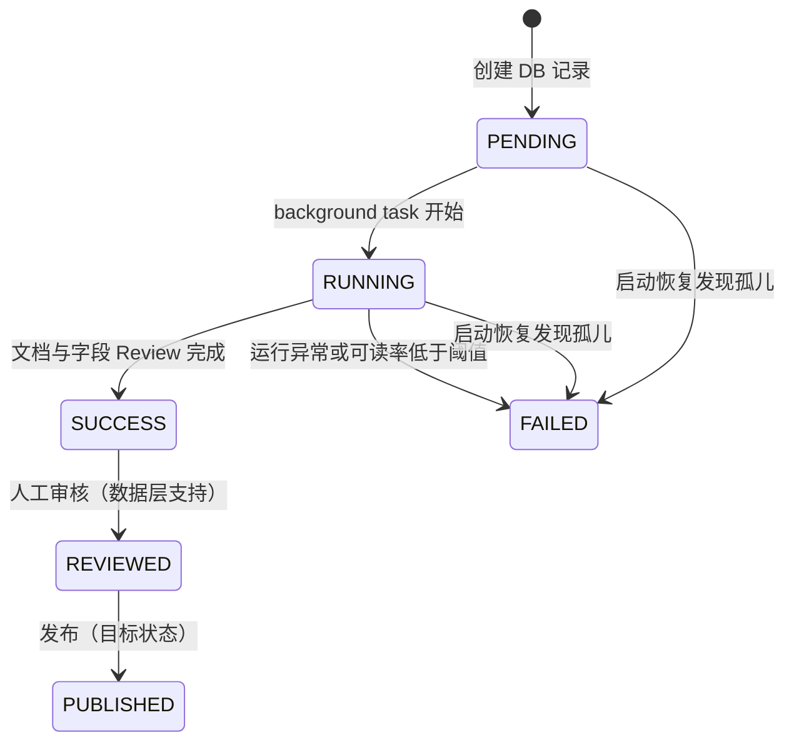
```mermaid
stateDiagram-v2
    [*] --> PENDING: 创建 DB 记录
    PENDING --> RUNNING: background task 开始
    RUNNING --> SUCCESS: 文档与字段 Review 完成
    RUNNING --> FAILED: 运行异常或可读率低于阈值
    SUCCESS --> REVIEWED: 人工审核（数据层支持）
    REVIEWED --> PUBLISHED: 发布（目标状态）
    PENDING --> FAILED: 启动恢复发现孤儿
    RUNNING --> FAILED: 启动恢复发现孤儿
```

当前 Sampling 主流程自动推进到 `SUCCESS/FAILED`；`REVIEWED/PUBLISHED` 是数据层允许的治理状态，完整 UI 发布闭环仍需继续完善。

---

## 10. 分层抽样算法

### 10.1 为什么不能直接 LIMIT N

多个类型共用一个数据库 LIMIT 时，前面的类型可能耗尽结果；只读最新 12 篇也会反复选中财报点评，导致主营产品、产业链、技术和客户覆盖不足。PDF/LLM 昂贵，元数据读取便宜，因此候选池应该比最终样本大。

### 10.2 当前算法

非全量模式对每个请求类型独立读取：

```text
per_type_limit = max(
    80,
    ceil(sample_size / requested_type_count) * 12
)
```

然后 `stratified_sample` 使用：

- `report_type`；
- 从 title/metadata 推断的 report subtype；
- 时间排序；
- `sample_seed`；

生成可重复的多样化样本。

### 10.3 推荐运行策略

- 第一轮每类 4–8 篇，六类分别运行或确保配额均衡；
- 第二轮更换 seed，检查字段族稳定性；
- 对 coverage gap 定向选择公司深度、首次覆盖、行业专题等子类型；
- 字段趋于稳定后再扩大到每类数十篇；
- 不用“PDF 数量很多”替代“子类型和行业多样性”。

### 10.4 抽样验收

每轮记录：

- 候选池数量和实际样本 ID；
- 每类型/子类型分布；
- 机构和时间分布；
- 可读、不可读和 fallback 数量；
- 与上一 seed 新增/消失字段族；
- 未收敛 coverage gap。

## 11. 单 PDF 自由语义抽取

### 11.1 设计目的

单文档阶段的目标是“尽可能完整地理解这份文档”，不是“立刻产出生产字段”。每篇 PDF 的 `content` 由模型自由决定顶层 key、嵌套对象和数组；系统不要求 `candidate_fields` wrapper。

这意味着：

- `污泥处理量` 可以存在于某篇公司的自由 JSON 中，因为它帮助理解该文档；
- 但跨文档 Review 必须把它归纳为 `关键经营指标[{metric_name,...}]`；
- 逐文档 JSON 是审查材料，不是生产 Schema；
- 系统元数据不能混进模型自由字段。

### 11.2 FreeExtractionResult 契约

| 字段 | 所有者 | 含义 |
| --- | --- | --- |
| `document_id` | System | `{source}:{resource_id}` |
| `report_type` | System | 六类之一 |
| `observed_title` | System/Model | 当前文档标题 |
| `document_subtype` | Model + sampler fallback | 深度报告、点评、专题等 |
| `readability` | System | `READABLE/UNREADABLE` |
| `readability_reason` | System | 不可读或失败原因 |
| `content` | Model | 完全自由的业务 JSON object |
| `covered_page_numbers` | System | 成功理解的 PDF 页 |
| `source_page_count` | System | 原 PDF 页数 |
| `chunk_count` | System | 成功分段数 |
| `coverage_truncated` | System | 是否因最大 chunk 限制丢失覆盖 |
| `quality_issues` | System | parser、截断、provider、合并等诊断 |

`readable` 属性只有在 `readability=READABLE` 且 `content` 非空时成立。

### 11.3 输入模式选择

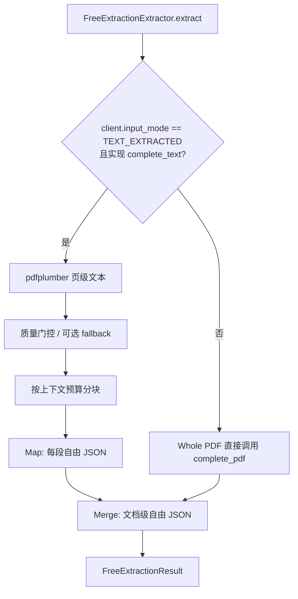
```mermaid
flowchart TD
    A["FreeExtractionExtractor.extract"] --> B{"client.input_mode == TEXT_EXTRACTED<br/>且实现 complete_text?"}
    B -->|"是"| C["pdfplumber 页级文本"]
    C --> D["质量门控 / 可选 fallback"]
    D --> E["按上下文预算分块"]
    E --> F["Map: 每段自由 JSON"]
    F --> G["Merge: 文档级自由 JSON"]
    B -->|"否"| H["Whole PDF 直接调用 complete_pdf"]
    H --> G
    G --> I["FreeExtractionResult"]
```

当前 home Sampling Harness 的 `input_mode` 固定为 `TEXT_EXTRACTED`，因为它组合的模型都声明 `text_extraction=true`。PDF-direct 仍是 adapter 能力，但不是当前 Sampling 主路径。

### 11.4 Map/merge Token 预算

默认资源参数：

| 配置 | 默认值 | 用途 |
| --- | ---: | --- |
| `sampling_maximum_chunks` | 3 | 每篇最多代表性 chunks |
| `sampling_chunk_output_tokens` | 1536 | 单 map 输出预算 |
| `sampling_merge_output_tokens` | 2560 | 文档 merge 输出预算 |
| `sampling_prompt_reserve_tokens` | 2200 | system/profile/schema 预留 |

输入预算：

```text
chunk_budget = max(
    512,
    context_window_tokens - chunk_output_tokens - prompt_reserve_tokens
)
```

Harness 对外暴露候选模型中最小 context window，防止首选模型能接收而 fallback 模型溢出。

### 11.5 代表性 Chunk 选择

分块保持 PDF 页边界。若单页超过预算，在页内截断并标记 `[ATLAS_PAGE_TEXT_TRUNCATED]`。若 chunk 总数超过上限：

1. 总是保留第一组；
2. 将剩余范围分桶；
3. 在每个桶内按研究信号、可见字符、免责声明惩罚评分；
4. 选择高分且靠近目标位置的组；
5. 写入 `TEXT_COVERAGE_TRUNCATED_BY_CHUNK_BUDGET`。

研究信号包括产业链、上下游、产品、技术、客户、供应商、竞争、政策、供需、产能、利润、预测和风险；免责声明、分析师声明、联系方式等被强烈惩罚。

### 11.6 Map Prompt 契约

每段 Prompt 必须说明：

- 文档 ID、标题、报告类型和子类型；
- 当前为第 `index/total` 段及精确页码；
- 只依据提供文本，不猜测未提供页面；
- 只返回一个 JSON object；
- 自由组织结构，但优先产业链、主体、产品、技术、应用、供需、政策、风险、经营和因果；
- 不返回“任务完成”等元响应；
- 不复述任务或 Prompt。

### 11.7 自由 JSON 解析与恢复

解析器接受裸 JSON object，可剥离单层 Markdown JSON fence。以下情况失败：

- 根不是 object；
- 只有 `status/message/done/success` 等元响应 key；
- 模型明确声明 chunk 无研究内容；
- 无法找到完整 JSON object。

输出截断时，只恢复已经完整闭合的属性或数组项，未完成尾部值绝不接受。成功恢复写 `TRUNCATED_JSON_RECOVERED`。若某些 chunk 失败而另一些成功，写 `PARTIAL_CHUNK_FAILURE`；所有 chunk 都失败则文档 `UNREADABLE`。

### 11.8 Merge 语义

多个 map 结果以 `{pages, content}` 数组提交 merge Prompt。Merge 负责：

- 合并重复主体和概念；
- 保持不同页面互补事实；
- 输出一份可独立阅读的文档 JSON；
- 不创造分段中没有的事实。

Merge 失败时不会丢弃已付费 map 结果，而是回退为：

```json
{
  "文档分段理解结果": [
    {"页码范围": [1, 2], "内容": {}},
    {"页码范围": [8, 9], "内容": {}}
  ]
}
```

并记录 `DOCUMENT_MERGE_FALLBACK`。

### 11.9 Provider Provenance

Harness 成功 provider 通过 ContextVar 聚合，最终进入：

```text
LLM_PROVIDER_USED:<configured-model>
LLM_PROVIDER_USED:<configured-model>-><actual-routed-model>
```

OpenRouter Free Router 的实际模型因此可以追溯，而不是只看到 `openrouter/free`。

---

## 12. Document Parser Harness：PDF / Layout / OCR

### 12.1 Harness 在 Atlas 中不是一个类

网页讨论中对 Harness 的核心定义是“执行环境 + 控制循环”：模型负责理解和决策，工具负责执行，Harness 负责把输入、工具、观察、重试、状态和验证组织成可持续运行的系统。Atlas 借鉴这个思想，但不把 Coding Agent 的 Shell/Browser/Memory 全套概念机械搬入文档抽取。

Atlas 当前把 Harness 分成三个协作层：

| 层 | 当前代码 | 职责 | 状态 |
| --- | --- | --- | --- |
| Document Parser Harness | `pdf_preprocessor/document_harness.py` | 读取 PDF 文本层、质量门、按需 layout/OCR、改善判定、页码与覆盖信息 | **Implemented** |
| Stage LLM Harness | `core/llm/harness.py` + `key_pool.py` | provider/model/key 路由、业务 validator、failover、冷却、provenance | **Implemented for Sampling** |
| Sampling Workflow Harness | `SemanticDiscoveryService` + runner/extractor/reviewer | 选择样本、逐文档 map/merge、checkpoint、字段 Review、质量门、状态与事件 | **Implemented** |
| Production Workflow Harness | strict extraction → entity → claim → graph | 正式全量运行的统一事件与策略编排 | **Partial / Planned** |

`FailoverLLMClient` 因此不是 Atlas Harness 的全部，只是其中的 Stage LLM Router。一个完整 Sampling run 的执行闭环如下：

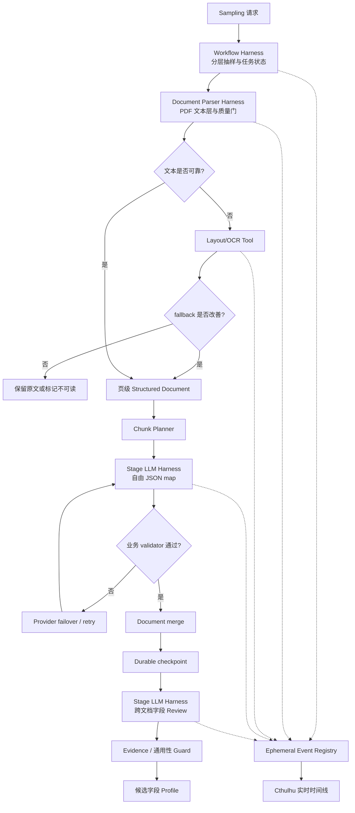
```mermaid
flowchart TD
    A["Sampling 请求"] --> B["Workflow Harness<br/>分层抽样与任务状态"]
    B --> C["Document Parser Harness<br/>PDF 文本层与质量门"]
    C --> D{"文本是否可靠?"}
    D -->|"否"| E["Layout/OCR Tool"]
    E --> F{"fallback 是否改善?"}
    F -->|"否"| G["保留原文或标记不可读"]
    F -->|"是"| H["页级 Structured Document"]
    D -->|"是"| H
    H --> I["Chunk Planner"]
    I --> J["Stage LLM Harness<br/>自由 JSON map"]
    J --> K{"业务 validator 通过?"}
    K -->|"否"| L["Provider failover / retry"]
    L --> J
    K -->|"是"| M["Document merge"]
    M --> N["Durable checkpoint"]
    N --> O["Stage LLM Harness<br/>跨文档字段 Review"]
    O --> P["Evidence / 通用性 Guard"]
    P --> Q["候选字段 Profile"]
    B -.-> R["Ephemeral Event Registry"]
    C -.-> R
    E -.-> R
    J -.-> R
    O -.-> R
    R --> S["Cthulhu 实时时间线"]
```

### 12.2 为什么是 Harness 而不是替换 pdfplumber

PDF 的失败类型不同：

- 有文本层但多栏顺序混乱；
- 图表标签很多但正文仍可读；
- 页面扫描、完全没有文本层；
- 表格结构重要但普通文本足以支持语义发现；
- 文档本身可读，实际失败来自 Prompt 或模型。

把所有 PDF 统一 OCR 会显著增加内存、时间和依赖，却不保证业务语义更好。Parser Harness 必须先衡量原文本，再决定是否升级，并比较 fallback 是否真的改善。

### 12.3 页级文本模型

`PDFTextPage` 保留 authoritative page number；渲染格式：

```xml
<atlas_pdf_page number="7">
页面文本
</atlas_pdf_page>
```

页面 ID 在分块、Prompt、evidence 和质量诊断中保持一致。

### 12.4 质量指标

`PDFTextQuality` 包含：

| 指标 | 说明 |
| --- | --- |
| `page_count` | 总页数 |
| `empty_page_count` | 无可见文本页 |
| `low_text_page_count` | 去空白后少于 80 字符页 |
| `visible_characters` | 全文可见字符数 |
| `research_signal_count` | 产业链/业务/政策/风险等命中数 |
| `suspicious_axis_page_count` | 百分比坐标密集、无研究信号的页数 |
| `escalation_reasons` | 触发 fallback 的原因 |

### 12.5 当前门控规则

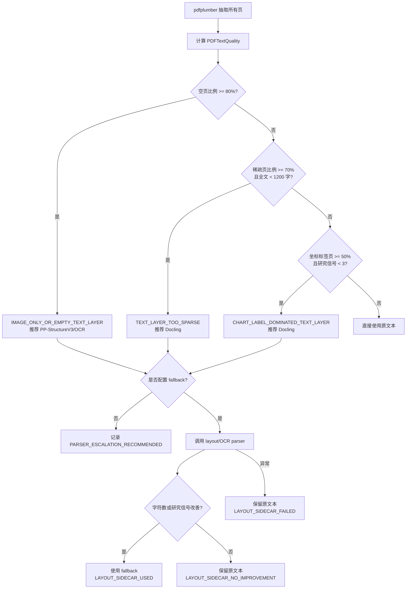
```mermaid
flowchart TD
    A["pdfplumber 抽取所有页"] --> B["计算 PDFTextQuality"]
    B --> C{"空页比例 >= 80%?"}
    C -->|"是"| D["IMAGE_ONLY_OR_EMPTY_TEXT_LAYER<br/>推荐 PP-StructureV3/OCR"]
    C -->|"否"| E{"稀疏页比例 >= 70%<br/>且全文 < 1200 字?"}
    E -->|"是"| F["TEXT_LAYER_TOO_SPARSE<br/>推荐 Docling"]
    E -->|"否"| G{"坐标标签页 >= 50%<br/>且研究信号 < 3?"}
    G -->|"是"| H["CHART_LABEL_DOMINATED_TEXT_LAYER<br/>推荐 Docling"]
    G -->|"否"| I["直接使用原文本"]
    D --> J{"是否配置 fallback?"}
    F --> J
    H --> J
    J -->|"否"| K["记录 PARSER_ESCALATION_RECOMMENDED"]
    J -->|"是"| L["调用 layout/OCR parser"]
    L --> M{"字符数或研究信号改善?"}
    M -->|"是"| N["使用 fallback<br/>LAYOUT_SIDECAR_USED"]
    M -->|"否"| O["保留原文本<br/>LAYOUT_SIDECAR_NO_IMPROVEMENT"]
    L -->|"异常"| P["保留原文本<br/>LAYOUT_SIDECAR_FAILED"]
```

百分比标签本身不会触发 OCR；必须同时满足页占比、低研究信号和短文本条件。

### 12.6 `DocumentParserHarness.parse` 契约

输入是 PDF bytes 和 filename，输出 `DocumentParseResult`：

```text
pages                   authoritative page-numbered text
parser                  最终采用的 parser 名称
source_page_count       原 PDF 页数
coverage_truncated      fallback 是否只覆盖代表页
primary_quality         pdfplumber 质量指标
final_quality           最终文本质量指标
quality_issues          升级、失败、无改善等机器码
```

文本模型收到的输入带有 parser envelope：

```xml
<atlas_document_parse parser="RapidOCRLayoutParser"
  source_page_count="38" coverage="partial" />
```

Production validator 因而不能把 OCR 代表页当成整份覆盖；parser signature 也进入 extraction cache signature，切换 OCR 配置后不会错误复用旧的低质量抽取结果。

### 12.7 Parser 插件接口

```python
class LayoutParserSidecar(Protocol):
    async def extract_pages(
        self, pdf: bytes, *, filename: str
    ) -> list[PDFTextPage]: ...
```

当前实现：

- `HTTPLayoutParserSidecar`：向 `{base_url}/v1/parse-pdf` 上传 PDF，期望 `pages[{page_number,text}]`；可由 Docling 或 PP-StructureV3 sidecar 实现。
- `RapidOCRLayoutParser`：PyMuPDF 渲染 + RapidOCR/ONNX Runtime；只在配置开启时延迟 import，按最大页数限制并在单 worker 中运行。

HTTP sidecar 优先于本地 OCR；两者不会同时启用。

### 12.8 Sampling 与 Production 的正确边界

**Sampling API、自由 JSON 和字段发现是 development-only；Document/OCR Harness 不是。** Production 使用审核后的字段做严格抽取，但仍面对相同的扫描件、稀疏文本层和图表乱序问题，所以所有 text-extraction provider 都必须先经过共享 `DocumentParserHarness`。

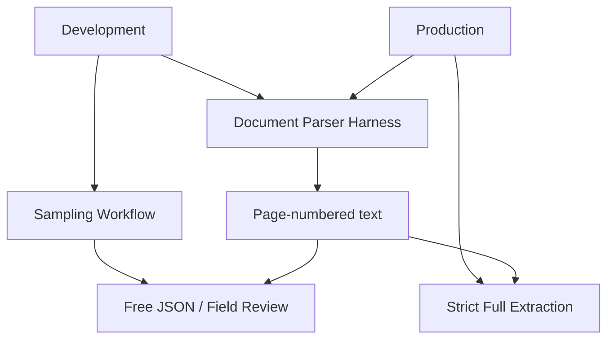
```mermaid
flowchart TD
    A["Development"] --> B["Sampling Workflow"]
    A --> C["Document Parser Harness"]
    D["Production"] --> E["Strict Full Extraction"]
    D --> C
    B --> F["Free JSON / Field Review"]
    C --> G["Page-numbered text"]
    G --> F
    G --> E
```

当前生产镜像安装 `requirements-ocr.txt`；默认仍先走 pdfplumber，只有质量门触发才延迟加载 RapidOCR。Docling/PP-StructureV3 继续建议作为独立 sidecar，而非把重依赖塞入 Atlas 主进程。

### 12.9 依赖与部署

主依赖只有 `pdfplumber`、`pikepdf` 等轻量组件。OCR 通过：

```text
requirements-ocr.txt
pyproject.toml -> [project.optional-dependencies].ocr
```

显式安装 `rapidocr-onnxruntime` 和 `PyMuPDF`。Home venv 已安装；`Dockerfile-atlas-base` 同时安装主 requirements 与 OCR requirements，部署脚本将两者共同纳入 base image hash 并上传。Docling/PP-StructureV3 应放在独立 venv/容器，避免模型权重和二进制依赖进入 Atlas 主镜像。

### 12.10 实测基线

- 九州通 born-digital canary：pdfplumber 5 页、5,308 字符、45 个研究信号；layout 无增益，说明旧失败不能简单归因于图表。
- 无文本层 morning report：RapidOCR 1 页、1,632 字符，约 7.1 秒、峰值 RSS 约 566 MiB；后续生成 1,795 字符自由 JSON。

### 12.11 Docling / PP-StructureV3 引入 Gate

新 parser 只有满足下列条件才应成为默认 fallback：

1. 在固定失败集上显著提高可读文档比例；
2. 新增的是业务语义，不只是字符数量；
3. 峰值内存适配 home 环境；
4. 单页/单文档耗时可接受；
5. 页面编号和文本顺序可追溯；
6. sidecar 故障不会拖垮 Atlas 主进程。

比较指标为“新增有效业务语义/秒、增量成功率、峰值 RSS”，而不是只比较 OCR 字符数。

---

## 13. 多模型 LLM Harness

### 13.1 设计动机

当前可用资源具有不同故障模式：

- NVIDIA 免费 NIM：模型能力好，但额度、并发和模型生命周期不可控；
- OpenRouter `openrouter/free`：随机选择满足能力的免费模型，实际模型变化；
- 固定 OpenRouter 免费模型：可能下线返回 404；
- Zhipu 免费模型：可能 429；
- 本地 Ollama 14B：相对稳定但速度慢、上下文和能力有限；
- 某些模型 HTTP 200，却返回 Markdown、元响应、截断 JSON 或无证据字段。

因此 Harness 的成功定义必须是“transport + business validation 成功”，而不是 HTTP 200。

### 13.2 LLM Harness 的边界

`FailoverLLMClient` 是**阶段级模型执行器**，不负责抽样、不解析 PDF、不决定字段是否跨文档通用，也不持久化业务状态。调用者必须提供：

- stage 名称，例如 `sampling_extraction` 或 `sampling_review`；
- 可调用的 model adapters；
- 业务请求参数；
- 可选 validator，用于把“HTTP 200 但 JSON/证据无效”转为 failover；
- run context，用于把事件关联到当前 Sampling run。

它返回第一个通过业务验证的响应；所有 provider 失败时才抛出聚合错误。

### 13.3 配置模型

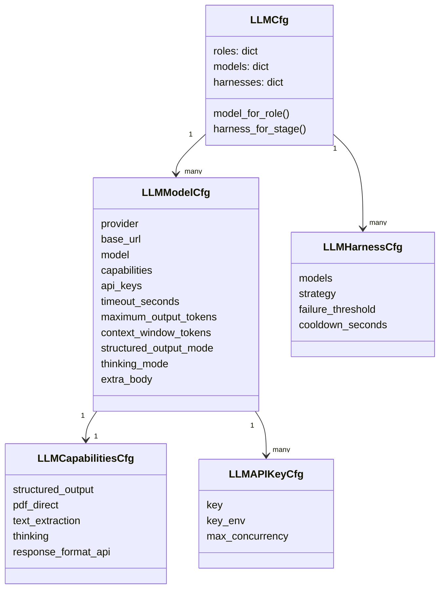
```mermaid
classDiagram
    class LLMCfg {
      roles: dict
      models: dict
      harnesses: dict
      model_for_role()
      harness_for_stage()
    }
    class LLMModelCfg {
      provider
      base_url
      model
      capabilities
      api_keys
      timeout_seconds
      maximum_output_tokens
      context_window_tokens
      structured_output_mode
      thinking_mode
      extra_body
    }
    class LLMCapabilitiesCfg {
      structured_output
      pdf_direct
      text_extraction
      thinking
      response_format_api
    }
    class LLMAPIKeyCfg {
      key
      key_env
      max_concurrency
    }
    class LLMHarnessCfg {
      models
      strategy
      failure_threshold
      cooldown_seconds
    }
    LLMCfg "1" --> "many" LLMModelCfg
    LLMCfg "1" --> "many" LLMHarnessCfg
    LLMModelCfg "1" --> "1" LLMCapabilitiesCfg
    LLMModelCfg "1" --> "many" LLMAPIKeyCfg
```

### 13.4 Provider 枚举和适配器

| Provider | Adapter | Endpoint 特征 |
| --- | --- | --- |
| `ollama` | `OllamaChatClient` / structured client | native `/api/chat`；`think:false` |
| `openai_compatible` | `OpenAICompatibleTextPDFClient` | `/chat/completions` |
| `openai_compatible_pdf` | `OpenAICompatiblePDFClient` | PDF data URL / compatible gateway |
| `zhipu_text` | `ZhipuTextPDFClient` | Zhipu thinking 结构 |
| `openrouter` | `OpenRouterTextPDFClient` | OpenRouter reasoning/provider 扩展 |
| `nvidia_nim` | `OpenAICompatibleTextPDFClient` | NVIDIA NIM OpenAI-compatible API |

业务层不针对 `glm-5.2`、Nemotron 或 Muse 写分支。provider 差异由 adapter 和 `extra_body` 承载。

### 13.5 Capability 校验

启动时校验：

- Harness 中每个模型必须存在；
- `sampling_extraction`、`sampling_review` 的模型必须 `text_extraction=true`；
- `roles.extraction` 必须支持 `pdf_direct` 或 `text_extraction`；
- `roles.agent` 必须 `structured_output=true`；
- `extra_body` 不得覆盖 `model/messages/stream`。

能力错误在启动时暴露，而不是运行几个小时后才失败。

### 13.6 Role 与 Stage Harness

`roles` 用于稳定单模型职责：

- `extraction`：正式严格抽取的默认模型；
- `agent`：Query、Crosswalk、Entity rerank 等结构化 Chat。

`harnesses` 用于昂贵且易失败的阶段：

- `sampling_extraction`：单 PDF 自由理解；
- `sampling_review`：同类跨文档字段 Review 和 catalog 可选模型阶段。

这种区分避免把“Production 默认模型”和“Development 免费资源池”绑在一起。

### 13.7 当前 Home 模型注册

| 名称 | Provider / 模型 | 主要用途 | 当前备注 |
| --- | --- | --- | --- |
| `nvidia-glm52` | NVIDIA / `z-ai/glm-5.2` | extraction/review | 真 canary 返回有效 JSON |
| `openrouter-free` | OpenRouter / `openrouter/free` | 弹性 extraction/review | 记录实际 routed model；关闭 reasoning |
| `nvidia-nemotron35` | NVIDIA / `nvidia/nemotron-3.5-lightning-30b-a3b` | extraction/review | 真 canary 可用 |
| `nvidia-muse-glimmer` | NVIDIA / `meta/muse-glimmer-30b` | 可选 fallback | canary 曾输出截断 |
| `openrouter-ling` | OpenRouter / `inclusionai/ling-3.0-flash:free` | fallback | 曾返回 404 |
| `glm-flash` | Zhipu / `glm-4.7-flash` | fallback | 曾观察 429 |
| `ollama-qwen3-extraction` | Ollama / `qwen3:14b-q4_K_M` | 本地最终 fallback | 慢但不依赖远程免费额度 |
| `ollama-qwen3` | Ollama / same model | structured agent | JSON Schema 模式 |

这些是 `config-home.yaml` 的当前资源，不是硬编码保证。任何 provider 都可以从 Harness 移除而不改变 Sampling 业务代码。

### 13.8 当前 Stage 顺序

`sampling_extraction`：

```text
nvidia-glm52
→ openrouter-free
→ nvidia-nemotron35
→ nvidia-muse-glimmer
→ openrouter-ling
→ glm-flash
→ ollama-qwen3-extraction
```

策略为 `balanced_failover`：每个新请求轮换起始位置，在健康 provider 间摊开免费容量；请求内失败仍按链继续。

`sampling_review` 使用同一资源集合的 `priority_failover`：每次从高优先级开始，因为跨文档 Review 更看重一致性；失败或业务无效再向后切换。

### 13.9 单次请求算法

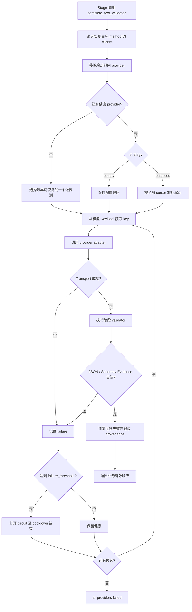
```mermaid
flowchart TD
    A["Stage 调用 complete_text_validated"] --> B["筛选实现目标 method 的 clients"]
    B --> C["移除冷却期内 provider"]
    C --> D{"还有健康 provider?"}
    D -->|"否"| E["选择最早可恢复的一个做探测"]
    D -->|"是"| F{"strategy"}
    F -->|"priority"| G["保持配置顺序"]
    F -->|"balanced"| H["按全局 cursor 旋转起点"]
    E --> I["从模型 KeyPool 获取 key"]
    G --> I
    H --> I
    I --> J["调用 provider adapter"]
    J --> K{"Transport 成功?"}
    K -->|"否"| L["记录 failure"]
    K -->|"是"| M["执行阶段 validator"]
    M --> N{"JSON / Schema / Evidence 合法?"}
    N -->|"否"| L
    N -->|"是"| O["清零连续失败并记录 provenance"]
    L --> P{"达到 failure_threshold?"}
    P -->|"是"| Q["打开 circuit 至 cooldown 结束"]
    P -->|"否"| R["保留健康"]
    Q --> S{"还有候选?"}
    R --> S
    S -->|"是"| I
    S -->|"否"| T["all providers failed"]
    O --> U["返回业务有效响应"]
```

### 13.10 validator 驱动的 failover

同一个模型调用有三种失败层：

| 层 | 示例 | Harness 行为 |
| --- | --- | --- |
| Transport | timeout、429、404、5xx | 记录失败，尝试下一 provider |
| Protocol | 空响应、输出截断、非 JSON | adapter/parser 抛错，尝试下一 provider |
| Business | 元响应、Schema 错、字段无 evidence、Review 为空 | validator 拒绝，按 provider failure 处理 |

Sampling extraction 用自由 JSON parser 作为 validator；Field Review 使用 `CategoryFieldReview`、evidence ownership 和通用性规则。免费 provider 返回得快但内容不可用时，不会污染后续字段目录。

### 13.11 Circuit Breaker 状态

每模型状态：

```text
consecutive_failures
unavailable_until
```

连续失败达到 `failure_threshold` 后，`unavailable_until = now + cooldown_seconds`。成功会清零状态。若所有 provider 都开路，Harness 选择最早恢复的一个做单次探测，避免永远没有候选。

当前 circuit breaker 是进程内、按模型名的轻量保护，不持久化，不跨多进程共享。

### 13.12 KeyPool 设计

每个 model name 只构建一个共享 `KeyPool`，即使多个 role/stage 使用同一模型也共享并发约束。

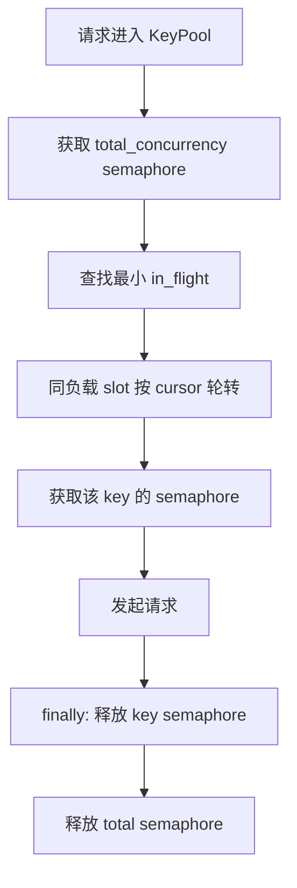
```mermaid
flowchart TD
    A["请求进入 KeyPool"] --> B["获取 total_concurrency semaphore"]
    B --> C["查找最小 in_flight"]
    C --> D["同负载 slot 按 cursor 轮转"]
    D --> E["获取该 key 的 semaphore"]
    E --> F["发起请求"]
    F --> G["finally: 释放 key semaphore"]
    G --> H["释放 total semaphore"]
```

一个 key 的 `max_concurrency` 防止单账号被猛烈调用；全局 `llm_concurrency` 是跨该模型 key 的额外上限。空 key 合法，用于本地无鉴权 Ollama。

**限制：** KeyPool 只约束一个 Python 进程。多个 Atlas/离线脚本共用账号会绕过计数。当前 home 约束是一次一个主要 Sampling run，re-review/catalog 顺序运行。未来确需多进程时才增加 Redis/数据库 lease，不通过盲目放大并发解决。

### 13.13 Structured Output 和 Thinking

- `json_schema`：provider 支持时发送完整 response schema；
- `json_object`：只要求 JSON object，Atlas 再做 Pydantic/业务校验；
- `response_format_api=false`：不发送 provider 不支持的参数，但仍在 Prompt 和本地 validator 强制 JSON。

Reasoning 参数按 provider 区分：

- OpenRouter：只在显式 enabled 时发送 `reasoning: {enabled: true}`；
- Zhipu 风格：发送 `thinking: {type: enabled|disabled}`；
- Ollama native `/api/chat`：固定 `think:false`，避免 Qwen3 reasoning 污染 JSON。

Sampling 的 Free Router 关闭 reasoning，因为隐藏思考会占用输出预算、增加截断和延迟。若未来某 Review 阶段开启，必须通过 A/B 证明字段质量收益。

### 13.14 OpenRouter Free Router

`openrouter/free` 根据请求需要随机选择免费模型。Atlas：

- 发送 `provider.require_parameters=true`；
- 尽量发送 JSON Schema；
- 读取响应 `model` 并记录 `configured->actual`；
- 不信任路由器选择本身，仍运行业务 validator；
- 不把它作为生产可靠性或最终字段审批边界。

真实 canary 曾路由到 `google/gemma-4-26b-a4b-it:free` 并返回有效 JSON，但该结果只证明当时可用。

### 13.15 扩展新 Provider

新增 OpenAI-compatible 模型的步骤：

1. 在 `llm.models` 注册名称、provider、URL、model、capabilities 和 keys；
2. 用 `extra_body` 表达非核心 provider 参数；
3. 加入一个或多个 stage harness；
4. 写 adapter payload/response canary；
5. 写 transport failure 和 business invalid failover 测试；
6. 记录模型实际 provenance；
7. 不在业务 service 中判断具体模型名。

只有 endpoint 协议确实不兼容现有 adapter 时才新增 provider adapter。

### 13.16 Python SDK 边界

Atlas 产品运行时使用 `httpx`，不依赖 `openai` Python SDK。`app/tools/py/nvdia/glm52.py` 是独立手工探针，使用 `from openai import OpenAI`；只有执行该工具时才需要额外安装 SDK。工具目录不进入 Atlas requirements，也不属于本次产品代码暂存范围。

### 13.17 Harness 实时事件与 Cthulhu

`HarnessEventRegistry` 是有界、进程内、非持久化的观测日志。默认每个 run 最多 400 条、最多保留 20 个 run，服务重启后自然清空；PhoenixA 的 run/document/category 记录仍是持久化事实。

事件结构：

```text
sequence / timestamp / run_id
stage / event_type / level / message
document_id / report_type
provider / parser
details (受限白名单式标量元数据)
```

禁止写入 Prompt、PDF 文本、模型原始 content、API key、secret 或 password。典型事件包括：

- `SAMPLE_SELECTION_COMPLETED`
- `DOCUMENT_READ_STARTED/COMPLETED`
- `PRIMARY_PARSER_COMPLETED`
- `PARSER_ESCALATION_REQUESTED`
- `PARSER_FALLBACK_ACCEPTED/FAILED`
- `CHUNK_PLAN_CREATED`
- `PROVIDER_ATTEMPT_STARTED/FAILED/ACCEPTED`
- `PROVIDER_CIRCUIT_OPENED`
- `DOCUMENT_MERGE_STARTED/ACCEPTED/FALLBACK`
- `FIELD_REVIEW_STARTED/COMPLETED`
- `SAMPLE_QUALITY_GATE_PASSED/FAILED`

API 使用 cursor 增量读取：

```http
GET /api/v1/atlas-kg/sample-runs/active

GET /api/v1/atlas-kg/sample-runs/{run_id}/harness-events
    ?after_sequence=120&limit=200
```

Cthulhu 页面打开后每三秒读取进程内 active task 列表，自动接管首个正在运行的 Sampling，并允许在多个活跃任务之间切换；接管后再随 run 状态增量读取事件，按时间线显示 stage、parser、provider 和安全 details，并可自动滚动。任务进入终态时额外读取一次尾部事件，避免漏掉最后的 Review/质量门。缓冲区滚动或服务重启不会被解释为任务失败。

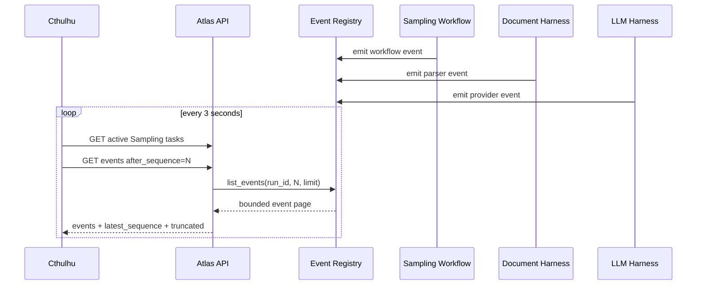
```mermaid
sequenceDiagram
    participant UI as Cthulhu
    participant API as Atlas API
    participant REG as Event Registry
    participant WF as Sampling Workflow
    participant DOC as Document Harness
    participant LLM as LLM Harness
    WF->>REG: emit workflow event
    DOC->>REG: emit parser event
    LLM->>REG: emit provider event
    loop every 3 seconds
        UI->>API: GET active Sampling tasks
        UI->>API: GET events after_sequence=N
        API->>REG: list_events(run_id, N, limit)
        REG-->>API: bounded event page
        API-->>UI: events + latest_sequence + truncated
    end
```

当前实时 UI 只服务 Sampling。未来 Production 全量运行若需要同样能力，应复用事件契约并增加跨进程/实例聚合，而不是依赖当前进程内 registry。

## 14. 跨文档字段 Review 与目录治理

### 14.1 Review 输入为什么必须按类型分组

字段价值与报告类型相关。`宏观经济指标` 对 macro 是核心信息，对 stock 通常只是背景；`财务与盈利预测` 对 stock 有价值，对 morning report 不应成为强制字段。六类结果不能先混合再让模型总结，否则会得到一个过宽但每篇都稀疏的 Schema。

每个 `report_type` 独立得到 `CategoryFieldReview`，跨类型 catalog 只做共享语义族和治理视图，不覆盖类型 profile。

### 14.2 Review 输入压缩

自由 JSON 可能很大。`FreeFieldReviewSummariser` 不把所有原 JSON 无界拼接，而是：

1. 遍历叶节点，保留精确 JSON path；
2. 对业务信号 path 加分，对元数据和免责声明降权；
3. 每文档最多保留配置数量 observations；
4. 每个 observation 截断展示值但不改变 path；
5. 按 `sampling_field_review_batch_size` 分批 Review；
6. 多批次时两两合并 Review 结果，形成树形归并。

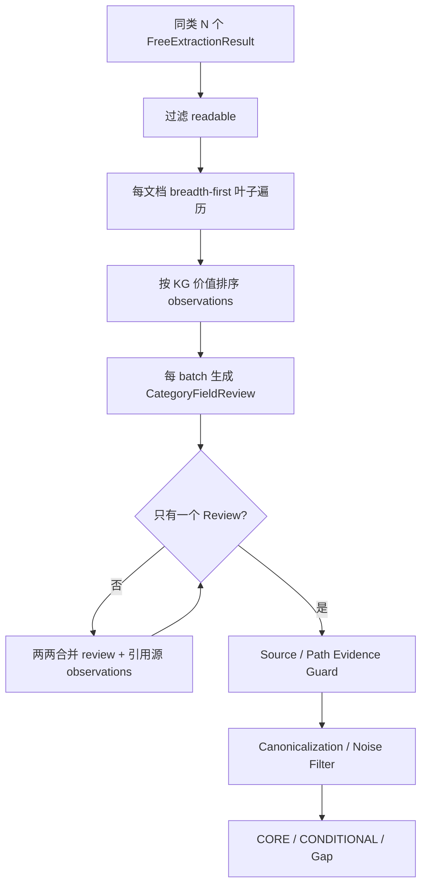
```mermaid
flowchart TD
    A["同类 N 个 FreeExtractionResult"] --> B["过滤 readable"]
    B --> C["每文档 breadth-first 叶子遍历"]
    C --> D["按 KG 价值排序 observations"]
    D --> E["每 batch 生成 CategoryFieldReview"]
    E --> F{"只有一个 Review?"}
    F -->|"否"| G["两两合并 review + 引用源 observations"]
    G --> F
    F -->|"是"| H["Source / Path Evidence Guard"]
    H --> I["Canonicalization / Noise Filter"]
    I --> J["CORE / CONDITIONAL / Gap"]
```

### 14.3 CategoryFieldReview 契约

| 字段 | 说明 |
| --- | --- |
| `report_type` | 当前类型 |
| `reviewed_document_count` | 系统覆盖的可读文档数；不能信任模型随意填写 |
| `core_fields` | 多文档支持、该类型优先的 KG 语义 |
| `conditional_fields` | 仅特定内容/子类存在时抽取 |
| `rejected_over_specific_fields` | 被拒绝的具体字段及泛化目标 |
| `document_type_insights` | 该类型信息结构和提取建议 |
| `coverage_gaps` | 当前样本无法证明的能力 |
| `review_notes` | 截断恢复、模型说明等 |

每个 `GeneralFieldRecommendation` 必须包括：

- `field_name`
- `description`
- `scope`
- `knowledge_graph_role`
- `value_shape`
- `applicability`
- `rationale`
- `priority`
- `source_document_ids`
- `observed_json_paths`

模型给出的 example value 不作为证据；系统清空它们，真实值保留在原自由 JSON。

### 14.4 Transport 成功后的业务验证

Review 使用 `complete_text_validated`。Validator 先解析 `CategoryFieldReview`，再检查：

- 至少保留一个 CORE 或 CONDITIONAL 字段；
- `source_document_ids` 属于本 batch；
- `observed_json_paths` 确实存在；
- path 的拥有文档和 source ID 有交集；
- 字段语义与证据 path 兼容；
- 字段不是元数据、表头、raw JSON path 或 snake_case 叶 key；
- 字段名不含年份或 `_E`。

任何一项失败都算当前 provider 失败，Harness 切换模型。该机制是 Harness 与业务层的关键接口：Harness 不懂字段业务，但允许调用方注入 validator。

### 14.5 Evidence Ownership

不能把 source IDs 和 paths 当成两个独立列表。模型可能引用文档 A 的字段，同时列出 B/C 作为支持，伪造跨文档证据。系统建立：

```text
path -> set(document_id)
```

最终 source support 只保留真正拥有引用 path 的文档。这一规则决定 CORE 是否成立。

### 14.6 CORE 降级规则

以下字段强制为 CONDITIONAL：

- 财务、盈利预测、估值、投资建议；
- 价格、库存、开工率、产量、销量、市场表现；
- 财政、货币、通胀、就业、地产、PMI/GDP 等宏观指标；
- 只有一个真实支持文档的任何字段。

若整个 Review 只有一个可读文档，则所有字段降为 CONDITIONAL，并增加 coverage gap。Canonical merge 后如果支持文档数降到 1，也再次降级。

### 14.7 字段通用化

| 观察 | 错误做法 | 正确字段族 |
| --- | --- | --- |
| `污泥处理量` | 字段名直接进入 Schema | `关键经营指标[{metric_name,period,value,unit,business_segment}]` |
| `芯片出货量` | 全行业新增一个字段 | 同上，metric_name=芯片出货量 |
| `2026净利润` | 年份写入 key | `财务与盈利预测[{metric,period,value,...}]` |
| `每股收益-最新股本摊薄_E` | 表头后缀进入 key | 财务指标 + period + forecast flag |
| `光伏组件及相关设备应收` | 产品和会计项目组合成字段 | 财务/经营风险中的 metric + qualifier |
| 某客户名称 | 创建客户专属字段 | `上下游关系[{direction,entity_or_category,...}]` |

通用化不是删除原信息：具体观察保留在逐 PDF JSON；字段层只定义以后如何承载这种信息。

### 14.8 类型噪声规则

系统使用有限的 type/field exclusion，而不是完整 allowlist：

- macro 只保留宏观指标、政策/事件、风险/传导等语义；
- industry 去除偶发的纯估值/宏观/市场表现字段；
- strategy 去除栏目名 `行业重点新闻`；
- new_stock 去除 `市场表现与估值`。

这些规则防止已知噪声进入 profile，同时允许未来样本发现新的可复用语义族。

### 14.9 数量边界

- Review 模型 schema 最多 24 个 CORE、30 个 CONDITIONAL；
- Guard 后每类最多 8 CORE、8 CONDITIONAL；
- 总数超过 12 时按 scope、priority、名称稳定排序截断；
- 跨类型 catalog 最多 20 个字段，当前脚本业务 Prompt 建议不超过 16。

边界防止免费模型把所有 JSON path 变成字段清单。

### 14.10 最终 Catalog

`build_sampling_field_catalog.py` 读取多个已完成 run 的 category summaries，建立 `source_field_id`：

```text
{sample_run_id}:{report_type}:{field_name}
```

然后归并语义族，补全：

- applicable report types；
- evidence document IDs；
- observed JSON paths；
- support document count；
- `CROSS_DOCUMENT/PROVISIONAL` evidence grade；
- 每种 report type 的 extraction profile。

推荐 `--deterministic`：输入已经经过 Review 和 Evidence Guard，确定性合并能避免随机免费模型遗漏已有字段。可选 LLM 总审只能引用已有 `source_field_ids`，不能创造来源。

### 14.11 Candidate 到 Production 的发布门槛

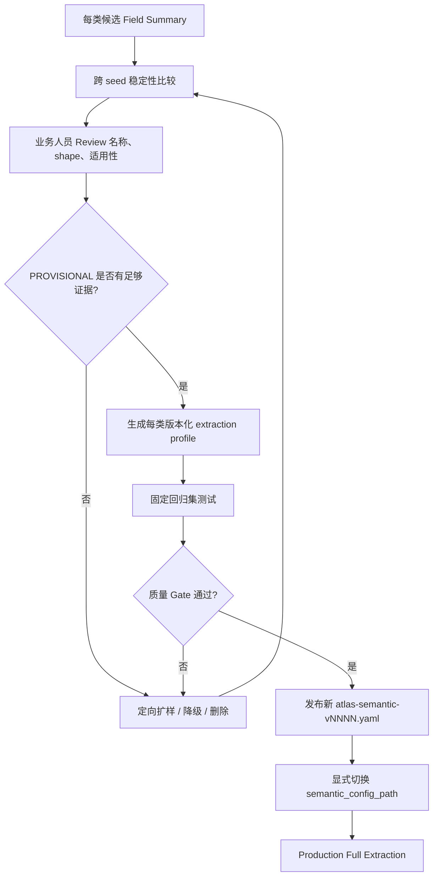
```mermaid
flowchart TD
    A["每类候选 Field Summary"] --> B["跨 seed 稳定性比较"]
    B --> C["业务人员 Review 名称、shape、适用性"]
    C --> D{"PROVISIONAL 是否有足够证据?"}
    D -->|"否"| E["定向扩样 / 降级 / 删除"]
    E --> B
    D -->|"是"| F["生成每类版本化 extraction profile"]
    F --> G["固定回归集测试"]
    G --> H{"质量 Gate 通过?"}
    H -->|"否"| E
    H -->|"是"| I["发布新 atlas-semantic-vNNNN.yaml"]
    I --> J["显式切换 semantic_config_path"]
    J --> K["Production Full Extraction"]
```

**Planned gap：** 当前有 immutable Semantic YAML 发布器，也有候选 catalog builder，但尚未形成 catalog → approved per-type extraction profile 的完整、无歧义自动转换与 UI 审批闭环。

---

## 15. Sampling 持久化、恢复与工具

### 15.1 Checkpoint 时机

每个文档完成后，在下一次模型调用前：

1. 创建/更新 `sample_document_result`；
2. 把当前类型已完成文档重建为 `raw_results`；
3. upsert `sample_category_result`；
4. 更新 sample run 进度和 Cronjob callback。

因此 Reviewer 失败、服务暂停或后续类型失败都不会丢失已经付费的自由 JSON。

### 15.2 缓存键

自由或严格抽取可复用条件至少包括：

- `source_document_id`
- `semantic_version`
- `pipeline_version`
- `prompt_signature`

Prompt signature 包括 Prompt version、semantic version、report profile 和 model id。`force=true` 才显式绕过复用。

### 15.3 最低可读率

`sampling_minimum_success_ratio` 默认 0.6。Run 可以保留所有逐文档结果和字段诊断，但若整体可读成功率低于阈值，最终状态应失败，不能把少数成功样本伪装为类型充分覆盖。

### 15.4 离线工具

| 脚本 | 用途 | 是否重新跑 PDF/LLM |
| --- | --- | --- |
| `run_sampling_canary.py` | 提交和跟踪真实 run | 是 |
| `rereview_sampling_run.py` | 复用 raw JSON 重做类型 Review | 只跑 Review LLM |
| `audit_sampling_run.py` | 自动业务审计 evidence、字段名和 coverage | 否 |
| `build_sampling_field_catalog.py` | 多 run 构建候选 catalog | deterministic 时否 |
| `benchmark_sampling.py` | 单 PDF 无数据库 benchmark | 是 |
| `benchmark_pdf_parsers.py` | 比较标准/layout/OCR | Parser 相关 |

离线脚本应与主服务顺序使用共享免费 key，避免绕过进程内 KeyPool。

---

## 16. Semantic Control Plane

### 16.1 Semantic Version 的职责

Semantic YAML 是 Production 抽取的治理输入，包含：

- `version`
- `extraction_schema_version`
- 六类 `report_types` assessment 和 `prompt_profile_key`
- accepted predicates
- accepted concepts
- assertion types
- industry crosswalk runs
- 发布 metadata

Bootstrap `atlas-semantic-v0001.yaml` 六类均 `enabled_for_production=false`。它是一份安全空配置，不是候选字段已经上线。

### 16.2 ReportTypeAssessment

| 字段 | 语义 |
| --- | --- |
| `sampled_document_count` | 抽样总数 |
| `readable_document_count` | 可读数 |
| `useful_document_count` | 对图谱有用数 |
| `useful_ratio` | 有用占比 |
| `enabled_for_production` | 是否允许 Production consumer 处理 |
| `prompt_profile_key` | 绑定的 production prompt profile |
| `rationale` | 启用或禁用原因 |

启用类型必须有 prompt profile，否则 Pydantic 校验失败。

### 16.3 Predicate Proposal

Predicate 不是在启动前人工穷举，也不是模型随意写图边。Proposal 包括：

- canonical UPPER_SNAKE_CASE name；
- display name、description、aliases；
- allowed subject/object types；
- inverse predicate；
- evidence document IDs 和 occurrence count；
- `PROPOSED/ACCEPTED/REJECTED`。

Production Prompt 只能从 semantic predicates 选择 `canonical_predicate_hint`；没有适合项时返回 null。Discovery mode 可以建议新 predicate，随后进入治理。

### 16.4 Concept Proposal

Concept 用于行业、价值链等可治理概念；包含 type、canonical/display name、description、aliases、evidence 和 status。它不同于 Entity：Concept 定义语义分类，Entity 表示现实主体。

### 16.5 发布状态

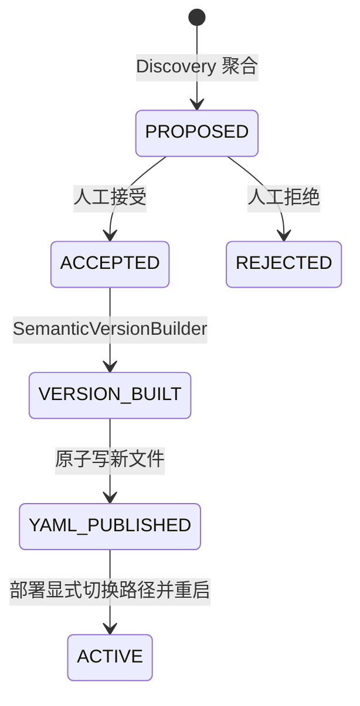
```mermaid
stateDiagram-v2
    [*] --> PROPOSED: Discovery 聚合
    PROPOSED --> ACCEPTED: 人工接受
    PROPOSED --> REJECTED: 人工拒绝
    ACCEPTED --> VERSION_BUILT: SemanticVersionBuilder
    VERSION_BUILT --> YAML_PUBLISHED: 原子写新文件
    YAML_PUBLISHED --> ACTIVE: 部署显式切换路径并重启
```

`SemanticYamlPublisher` 要求版本名 `atlas-semantic-v\d{4,}`，目标文件已存在则拒绝覆盖；先写同目录 `.tmp` 再原子 replace。创建 YAML 不等于激活。

### 16.6 当前治理数据模型

当前 PhoenixA 没有旧 V2 规划的 `semantic_discovery_run / semantic_proposal / semantic_version_entry` 多张独立表，而是使用：

```text
atlas_kg.governance_record
  kind: discovery | semantic-version | crosswalk
  version
  status
  payload JSONB
```

这符合当前小规模“最小持久化”原则。若未来需要多人审批、逐 proposal 审计和环境激活历史，再拆表；在此之前文档和代码都应以 `governance_record` 为事实。

---

## 17. Taxonomy 与 Industry Crosswalk

### 17.1 行业分类不等于产业链

- Taxonomy 回答“主体属于什么行业分类”；
- Crosswalk 回答“不同分类体系的节点如何对应”；
- 产业链回答“材料、技术、产品、公司、应用之间是什么关系”。

不能把行业父子节点当作上下游，也不能用 Crosswalk 代替研报抽取的供应/客户/应用关系。

### 17.2 当前 Scheme

默认配置：

- `SW2021`：来自 amazing_data/swhy，作为 canonical seed；
- `EastMoneyIndustry`；
- `EastMoneyConcept`；
- 运行时目标 `ATLAS_CANONICAL`。

### 17.3 Canonical Seed

当 `SW2021 → ATLAS_CANONICAL` 时，系统确定性生成 EXACT mapping：

```text
target_code = SW2021:{source_code}
confidence = 1
```

其他体系由模型产生候选映射，再做完整性校验和人工 Review。

### 17.4 Mapping Relation

- `EXACT`
- `CLOSE`
- `BROADER`
- `NARROWER`
- `RELATED`
- `NO_CANONICAL_MAPPING`

每条 mapping 有 source/target scheme/code、confidence、rationale 和 exception reason。

### 17.5 Crosswalk 流程

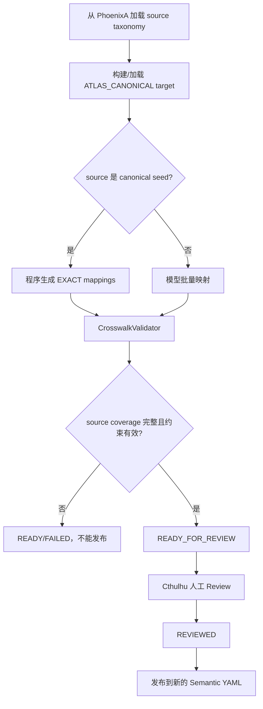
```mermaid
flowchart TD
    A["从 PhoenixA 加载 source taxonomy"] --> B["构建/加载 ATLAS_CANONICAL target"]
    B --> C{"source 是 canonical seed?"}
    C -->|"是"| D["程序生成 EXACT mappings"]
    C -->|"否"| E["模型批量映射"]
    D --> F["CrosswalkValidator"]
    E --> F
    F --> G{"source coverage 完整且约束有效?"}
    G -->|"否"| H["READY/FAILED，不能发布"]
    G -->|"是"| I["READY_FOR_REVIEW"]
    I --> J["Cthulhu 人工 Review"]
    J --> K["REVIEWED"]
    K --> L["发布到新的 Semantic YAML"]
```

`run_required` 还会把当前 Semantic 中 `INDUSTRY_CLASS/VALUE_CHAIN` broker concepts 作为 `BROKER_DISCOVERY` source 映射到 canonical。

---

## 18. Production Full Extraction

### 18.1 入口

- 手工单文档：`POST /api/v1/atlas-kg/extractions`；
- 批次：`POST /api/v1/atlas-kg/extraction-batches`；
- 状态：Atlas 单 run 查询，PhoenixA 列表查询；
- 后台消费：`ReportConsumer` 根据 active semantic 的 enabled report types 读取目录。

### 18.2 生产前置 Gate

- `sampling_enabled=false`；
- active semantic 不是未批准候选；
- report type `enabled_for_production=true`；
- report type 有有效 prompt profile；
- extraction role 的模型 capability 合法；
- MinIO 和 PhoenixA 可用；
- `force=false` 时先检查已完成/可复用 run。

### 18.3 端到端流程

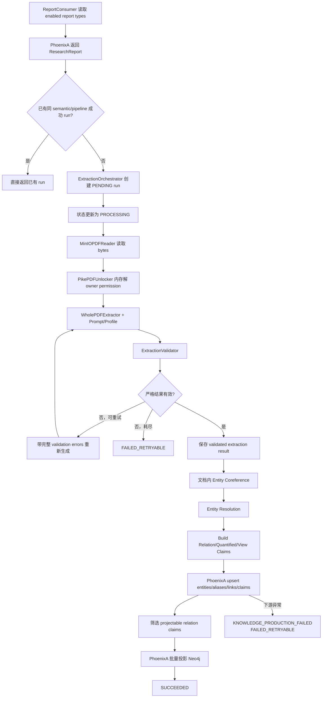
```mermaid
flowchart TD
    A["ReportConsumer 读取 enabled report types"] --> B["PhoenixA 返回 ResearchReport"]
    B --> C{"已有同 semantic/pipeline 成功 run?"}
    C -->|"是"| D["直接返回已有 run"]
    C -->|"否"| E["ExtractionOrchestrator 创建 PENDING run"]
    E --> F["状态更新为 PROCESSING"]
    F --> G["MinIOPDFReader 读取 bytes"]
    G --> H["PikePDFUnlocker 内存解 owner permission"]
    H --> I["WholePDFExtractor + Prompt/Profile"]
    I --> J["ExtractionValidator"]
    J --> K{"严格结果有效?"}
    K -->|"否，可重试"| L["带完整 validation errors 重新生成"]
    L --> I
    K -->|"否，耗尽"| M["FAILED_RETRYABLE"]
    K -->|"是"| N["保存 validated extraction result"]
    N --> O["文档内 Entity Coreference"]
    O --> P["Entity Resolution"]
    P --> Q["Build Relation/Quantified/View Claims"]
    Q --> R["PhoenixA upsert entities/aliases/links/claims"]
    R --> S["筛选 projectable relation claims"]
    S --> T["PhoenixA 批量投影 Neo4j"]
    T --> U["SUCCEEDED"]
    R -->|"下游异常"| V["KNOWLEDGE_PRODUCTION_FAILED<br/>FAILED_RETRYABLE"]
```

### 18.4 PDF 解保护

`PikePDFUnlocker` 在内存中读取和重写 PDF，用于解除 owner permission 等允许读取但限制复制的情形。它不覆盖 MinIO 原对象，不把临时副本持久化。run 记录：

- `pdf_size_bytes`
- `pdf_page_count`
- `pdf_unlock_status`
- `pdf_unlocker_version`

### 18.5 输入模式

生产 extraction adapter 可以：

- `PDF_DIRECT`：把 PDF 传给兼容 gateway；
- `TEXT_EXTRACTED`：先抽文本，再交给 text model。

这由 extraction role 模型 capability 决定。旧 V2 的“所有文档整份直接交给固定 Qwen”已不是架构约束。

## 19. 严格抽取 Prompt 与输出契约

### 19.1 Prompt 组成

`PromptBuilder` 将以下内容组合：

1. 固定 `SYSTEM_PROMPT`；
2. 文档 ID、expected title、report type；
3. active `semantic_config`；
4. resolved `report_profile`；
5. `FIELD_DICTIONARY`；
6. `ExtractionResult.model_json_schema()`；
7. 财务和经营指标策略；
8. Production/Discovery predicate constraint；
9. 上一次完整 validation errors（重生成时）。

Prompt signature 是以上稳定内容、semantic version、profile、model id 的 SHA-256，用于缓存和重跑边界。

### 19.2 不可协商的模型约束

- 只输出一个 JSON object，无 Markdown/解释/推理；
- 只依据提供 PDF/文本，不用常识补全；
- 每条 Claim/View 必须有最短原文 evidence 和合法 page；
- 事实、披露、计划、估计、观点、预测、情景必须区分；
- ticker、代码、数值、单位、日期只能来自文档；
- relation direction 按 predicate 定义；不确定则 canonical hint 为 null；
- 不可读必须明确 `UNREADABLE`，不能以空数组伪装；
- 顶层只能是 schema 规定的 9 个字段；
- 不复述 Prompt、Schema、field dictionary 或 semantic config。

### 19.3 ExtractionResult

```text
ExtractionResult
├── schema_version
├── semantic_version
├── document_id
├── document_assessment
├── entity_mentions[]
├── relation_claims[]
├── quantified_claims[]
├── analyst_views[]
└── unknown_semantic_terms[]
```

### 19.4 DocumentAssessment

| 字段 | 规则 |
| --- | --- |
| `readability` | `READABLE/UNREADABLE` |
| `readability_reason` | UNREADABLE 时必填 |
| `observed_title` | 用于证明读到目标文档 |
| `primary_language` | 默认 zh |
| `possible_truncation` | 模型怀疑未覆盖完整文档 |
| `last_page_referenced` | 最大引用页 |

### 19.5 EntityMention

实体类型：

- `COMPANY`
- `PRODUCT`
- `MATERIAL`
- `TECHNOLOGY`
- `MARKET`
- `INDUSTRY_CLASS`
- `VALUE_CHAIN`
- `ASSET`
- `OTHER`

字段包括局部 `mention_id`、原始 mention、type、country/ticker hint、context、attributes、page。模型先保留原称呼，不自行替换为数据库 canonical name。

### 19.6 RelationClaimCandidate

| 字段族 | 字段 |
| --- | --- |
| 标识 | `candidate_id` |
| 主体 | `subject_mention_id`, `subject_mention` |
| 关系 | `raw_predicate`, `predicate_family`, `canonical_predicate_hint` |
| 客体 | `object_mention_id`, `object_mention` |
| 语义 | `assertion_type`, `polarity`, `qualifiers`, `valid_from/to` |
| 证据 | `evidence_quote`, `page_number`, `extraction_confidence` |

`canonical_predicate_hint` 必须是 UPPER_SNAKE_CASE 或 null。ExtractionResult 校验 subject/object mention ID 必须存在。

### 19.7 QuantifiedClaimCandidate

量化项必须保留原始口径：

- `metric_raw_name`
- 可选 `metric_hint`
- 可解析 `value` 和必有 `value_text`
- `unit`, `period`
- `change_type`, `base_value`, `target_value`
- `qualifiers`
- `assertion_type`
- evidence/page/confidence

标准财务表可以直接从 PhoenixA 获取或计算的历史指标不应重复构造成知识关系；保留研报特有的产能、利用率、订单、价格、项目进度和前瞻估计。

### 19.8 AnalystViewCandidate

观点与事实分表意：subject 可空，包含 view type、stance、summary、time horizon、attributes 和 evidence。默认 assertion 为 `ANALYST_OPINION`，也可明确为 estimate/forecast。

### 19.9 UnknownSemanticTerm

重要但无法映射当前 YAML 的 raw term、context 和 page 进入 unknown 列表，供下一轮 semantic discovery；不能为了“没有 unknown”强行匹配错误 predicate/concept。

---

## 20. 严格验证与重生成

### 20.1 验证层级

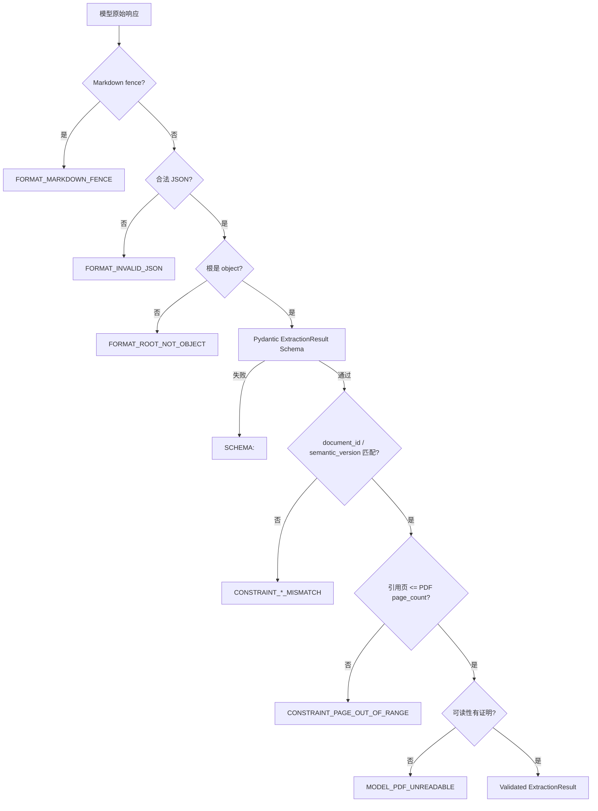
```mermaid
flowchart TD
    A["模型原始响应"] --> B{"Markdown fence?"}
    B -->|"是"| X["FORMAT_MARKDOWN_FENCE"]
    B -->|"否"| C{"合法 JSON?"}
    C -->|"否"| Y["FORMAT_INVALID_JSON"]
    C -->|"是"| D{"根是 object?"}
    D -->|"否"| Z["FORMAT_ROOT_NOT_OBJECT"]
    D -->|"是"| E["Pydantic ExtractionResult Schema"]
    E -->|"失败"| F["SCHEMA:<path>:<type>"]
    E -->|"通过"| G{"document_id / semantic_version 匹配?"}
    G -->|"否"| H["CONSTRAINT_*_MISMATCH"]
    G -->|"是"| I{"引用页 <= PDF page_count?"}
    I -->|"否"| J["CONSTRAINT_PAGE_OUT_OF_RANGE"]
    I -->|"是"| K{"可读性有证明?"}
    K -->|"否"| L["MODEL_PDF_UNREADABLE"]
    K -->|"是"| M["Validated ExtractionResult"]
```

### 20.2 可读性证明

以下情况视为不可读：

- 模型声明 `UNREADABLE`；
- Entity/Relation/Quantified/View 全空，且 observed title 不能与 expected title 互相包含。

这避免模型返回合法空 Schema 伪装成功。

### 20.3 重生成

失败不是局部修补 JSON。`WholePDFExtractor` 将完整 validation error codes 附回 Prompt，要求重新阅读同一输入并生成全新完整 JSON。总尝试数由 `maximum_total_attempts` 限制；耗尽后 `ExtractionValidationError` 进入 run。

### 20.4 Run 状态

```mermaid
stateDiagram-v2
    [*] --> PENDING: create_extraction_run
    PENDING --> PROCESSING: 开始读 PDF
    PROCESSING --> SUCCEEDED: 抽取、知识生产和投影成功
    PROCESSING --> FAILED_RETRYABLE: 模型/PDF/验证/下游失败
    SUCCEEDED --> SUPERSEDED: 新 generation/version 替代（状态预留）
    FAILED_RETRYABLE --> PROCESSING: 外部重试
    PROCESSING --> FAILED_PERMANENT: 明确不可恢复（状态预留）
```

当前异常多数落 `FAILED_RETRYABLE`；`FAILED_PERMANENT/SUPERSEDED` 在模型中存在，但自动分类和转换尚未形成完整策略。

---

## 21. Entity Resolution

### 21.1 为什么名称不能作为 ID

同一主体可能有中文全称、简称、英文名、股票简称和历史名称；相同文本也可能指不同公司或产品。Entity 使用 UUID，名称和 alias 是可更新属性。

### 21.2 状态

- `RESOLVED_SECURITY`
- `RESOLVED_KNOWLEDGE_ENTITY`
- `PROVISIONAL`
- `AMBIGUOUS`

### 21.3 文档内 Coreference

如果配置 clusterer，先让 structured model 将同一文档 mentions 聚类，选择 canonical mention；只解析代表 mention，再把结果复制给 cluster 内其他 mentions，method 标记 `DOCUMENT_COREFERENCE:<method>`。模型输出必须经过 cluster 覆盖/引用验证。

### 21.4 跨库解析流程

```mermaid
flowchart TD
    A["EntityMention"] --> B["normalize_entity_name"]
    B --> C{"规范名为空?"}
    C -->|"是"| D["拒绝"]
    C -->|"否"| E["PhoenixA 候选召回<br/>entity + alias + security_registry"]
    E --> F{"唯一 exact alias/security match?"}
    F -->|"是"| G["EXACT_ALIAS"]
    F -->|"否"| H{"有候选和 reranker?"}
    H -->|"是"| I["模型 rerank"]
    H -->|"否"| J["保持原候选排序"]
    I --> K{"top score >= 0.92<br/>且与第二名 margin >= 0.05?"}
    J --> K
    K -->|"是"| L["MODEL_RERANK"]
    K -->|"否且无候选"| M["创建 PROVISIONAL Entity"]
    K -->|"否且有候选"| N["创建 AMBIGUOUS Entity"]
    G --> O["ResolvedMention"]
    L --> O
    M --> O
    N --> O
```

### 21.5 Alias 与 Security Link

每个 resolved mention 生成 alias：

- `alias`：PDF 原称呼；
- `normalized_alias`；
- `source=REPORT_<SOURCE>`；
- 以 `(entity_id, normalized_alias)` 去重。

有 `security_id` 时 upsert `security_entity_link`，保存 confidence 和 method。一个 security 只能链接一个 entity。

### 21.6 不确定性原则

有候选但无法拉开 margin 时不能选 top-1；创建 `AMBIGUOUS` 状态供治理。没有候选时创建 `PROVISIONAL`，使海外和非上市主体可以进入 Claim 层，但不代表已被人工确认。

---

## 22. Claim 构建与接受规则

### 22.1 为什么 Claim 先于 Graph

Graph edge 无法完整表达：

- 来源文档和原文 evidence；
- assertion type；
- polarity；
- 时间范围；
- 数值口径；
- 分析师观点和预测；
- 审核状态和模型版本。

因此 PostgreSQL Claim 是事实源，Neo4j 只是可重建视图。

### 22.2 Claim 类型

| Claim | 内容 | Graph 投影 |
| --- | --- | --- |
| `RelationClaim` | entity-predicate-entity | 只有满足 projectability 才投影 |
| `QuantifiedClaim` | entity-metric-value-period | 当前保留在 Claim 层 |
| `AnalystView` | subject/view/stance/horizon | 不作为事实边投影 |

### 22.3 Assertion Type

- `OBSERVED_FACT`
- `COMPANY_DISCLOSURE`
- `MANAGEMENT_PLAN`
- `ANALYST_ESTIMATE`
- `ANALYST_OPINION`
- `FORECAST`
- `SCENARIO_ASSUMPTION`

### 22.4 Relation Claim 状态

`build_relation_claims` 的规则：

1. `canonical_predicate_hint=null`：不构造标准 RelationClaim；
2. subject/object resolution 缺失：跳过；
3. semantic predicates 非空但没有该 predicate：`REVIEW_REQUIRED`；
4. subject/object type 不符合 predicate definition：`REJECTED`；
5. polarity 非 `AFFIRMED`：`REJECTED`；
6. document possible truncation 且原本 accepted：`REVIEW_REQUIRED`；
7. 否则 `ACCEPTED`。

### 22.5 去重

同一次输出按以下 key 去重：

```text
subject_entity_id
canonical_predicate
object_entity_id
assertion_type
polarity
canonical_json(qualifiers)
```

重复时保留 confidence 更高的一条。跨文档不去重为一条，因为 evidence 和时间可能不同。

### 22.6 Quantified / View 状态

正常文档为 `ACCEPTED`；possible truncation 时为 `REVIEW_REQUIRED`。它们不因高 confidence 自动转成事实图边。

### 22.7 Confidence 的定位

模型 confidence 只是抽取/分类自评，不是真实概率。接受规则必须结合：

- Schema；
- evidence/page；
- semantic predicate；
- entity resolution；
- polarity/assertion；
- document truncation；
- 业务规则。

---

## 23. Neo4j Graph Projection

### 23.1 Projectability

当前 `is_projectable` 只有四个条件：

```text
claim.status == ACCEPTED
polarity == AFFIRMED
assertion_type in {OBSERVED_FACT, COMPANY_DISCLOSURE}
canonical_predicate 非空
```

管理层计划、分析师估计、观点、预测和 scenario 不投影为事实边。

### 23.2 Projection 流程

```mermaid
flowchart TD
    A["Relation Claims"] --> B["is_projectable"]
    B --> C["只收集 projectable claims"]
    C --> D["收集其 subject/object entity IDs"]
    D --> E["过滤需要的 entities"]
    E --> F["PhoenixA /atlas-graph/projection:batch"]
    F --> G["Neo4j nodes + relationships"]
```

### 23.3 Graph 所有权

- Atlas 决定哪些 Claim 可投影；
- PhoenixA 执行图写入；
- Neo4j 不作为 Claim 真相源；
- Graph 损坏或规则变化时，从 PostgreSQL Entity/Claim 重建；
- 当前迁移没有旧 V2 规划的 `graph_projection_run` 独立表，运行审计依赖 API/日志和现有数据；若未来需要逐次重建审计再扩展。

### 23.4 修改与删除

修正 Claim 时应先更新/撤销 Claim 状态，再重建相关投影。不得只手工删除 Neo4j 边而保留 PostgreSQL accepted Claim，否则下一次重建会恢复错误边。

---

## 24. PostgreSQL 数据设计

### 24.1 当前真实表

PhoenixA migrations 当前为 Atlas 创建 9 张表：

```text
atlas_kg.extraction_run
atlas_kg.governance_record
atlas_kg.knowledge_entity
atlas_kg.entity_alias
atlas_kg.security_entity_link
atlas_kg.claim
atlas_kg.sample_run
atlas_kg.sample_category_result
atlas_kg.sample_document_result
```

旧 V2 规划的 `document_extraction_run`、多种独立 claim 表、semantic proposal/version entry、taxonomy 和 graph projection run 表不是当前 Schema，不应按旧名称开发。

### 24.2 extraction_run

物理列：

| 列 | 作用 |
| --- | --- |
| `id` | UUID run ID |
| `source_document_id` | 文档稳定 ID |
| `source_report_type` | 六类之一 |
| `status` | run 状态 |
| `payload JSONB` | `ExtractionRun` 完整运行元数据 |
| `result JSONB` | validated strict 或 free extraction result |
| timestamps | 创建/更新 |

结构化字段放 payload，方便当前快速演进；常用查询列独立索引。

### 24.3 governance_record

| 列 | 作用 |
| --- | --- |
| `kind` | `discovery/semantic-version/crosswalk` |
| `version` | 有版本产物的唯一标识 |
| `status` | proposal/review/publish 状态 |
| `payload JSONB` | 完整领域对象 |

同 kind 的非空 version 唯一。

### 24.4 knowledge_entity / alias / security link

`knowledge_entity` 保存 canonical/normalized name、entity type、country、resolution state 和 attributes。`entity_alias` 以 entity + normalized alias 唯一。`security_entity_link` 一对一链接 `ods.security_registry`，保存 confidence 和 resolution method。

### 24.5 claim

三种逻辑 Claim 共表：

| 列 | 说明 |
| --- | --- |
| `claim_type` | `RELATION/QUANTIFIED/ANALYST_VIEW` |
| `source_document_id` | 来源 |
| `subject_entity_id` | 可空主体 |
| `object_entity_id` | Relation 客体 |
| `canonical_predicate` | Relation predicate，其他类型可空串 |
| `assertion_type` | 断言语义 |
| `status` | accepted/review/rejected |
| `payload JSONB` | 各 Claim 完整字段 |

共表避免早期 Schema 过度拆分，同时对 subject/object/predicate/document 建索引。

### 24.6 Sampling 三表

```mermaid
erDiagram
    SAMPLE_RUN ||--o{ SAMPLE_DOCUMENT_RESULT : contains
    SAMPLE_RUN ||--o{ SAMPLE_CATEGORY_RESULT : groups
    EXTRACTION_RUN ||--o{ SAMPLE_DOCUMENT_RESULT : traces

    SAMPLE_RUN {
      uuid id PK
      jsonb request_payload
      string status
      bigint cronjob_run_id
      text_array sampled_document_ids
      int current
      int total
      text progress_message
      text error_code
      text error_message
    }
    SAMPLE_DOCUMENT_RESULT {
      uuid id PK
      uuid sample_run_id FK
      text document_id
      text report_type
      uuid extraction_run_id FK
      string status
      int duration_ms
      text error_code
      text error_message
    }
    SAMPLE_CATEGORY_RESULT {
      uuid id PK
      uuid sample_run_id FK
      text report_type
      int document_count
      jsonb raw_results
      jsonb field_summary
      timestamp generated_at
    }
```

删除 sample run 会 cascade 删除 category/document records，但不删除被引用的 extraction run。

### 24.7 最小持久化原则

当前将变化快、读取频率低的领域对象放 JSONB，将 ID、状态、常用过滤条件和关系键放列。只有出现以下证据才拆表：

- 高频按子字段过滤或 join；
- 独立生命周期/审批；
- 数据完整性必须由数据库 FK/check 表达；
- JSONB 迁移和查询成本成为真实瓶颈。

---

## 25. HTTP API 设计

### 25.1 Atlas API 前缀

Atlas 自身路由统一为：

```text
/api/v1/atlas-kg
```

### 25.2 Sampling API（Development only）

| Method | Path | 说明 |
| --- | --- | --- |
| POST | `/sample-runs` | 异步创建，202 |
| GET | `/sample-runs` | 最近 run 列表 |
| GET | `/sample-runs/active` | 当前 Atlas 进程的运行任务；供晚打开页面接管，不持久化 |
| GET | `/sample-runs/{id}` | 详情/进度 |
| GET | `/sample-runs/{id}/harness-events` | 有界内存事件，支持 `after_sequence` 增量读取 |
| GET | `/sample-runs/{id}/document-results` | 逐文档状态 |
| GET | `/sample-runs/{id}/category-results` | 六类结果 |
| GET | `/sample-runs/{id}/category-results/{type}` | 类型详情与 raw JSON |
| PUT | `/sample-runs/{id}/category-results/{type}/field-summary` | 人工更新 summary |

### 25.3 Extraction API

| Method | Path | 说明 |
| --- | --- | --- |
| POST | `/extractions` | 手工一篇，返回 run |
| POST | `/extraction-batches` | 批次消费目录 |
| GET | `/extraction-runs/{id}` | 单 run 状态 |

### 25.4 Governance API

| Method | Path | 说明 |
| --- | --- | --- |
| POST | `/discovery-runs` | 旧 semantic discovery；仅开发 |
| PUT | `/discovery-runs/{id}/review` | Proposal Review |
| POST | `/semantic-versions:publish` | immutable YAML |
| POST | `/crosswalk-runs` | 两体系 mapping |
| POST | `/crosswalk-runs:required` | 所有必需体系 |
| PUT | `/crosswalk-runs/{id}/review` | Review |
| POST | `/crosswalk-semantic-versions:publish` | 将 crosswalk 发布进新 semantic |

### 25.5 Query API

| Method | Path | 说明 |
| --- | --- | --- |
| POST | `/query` | 受控 Query Agent |
| POST | `/company-reviews` | 公司产业链 Review |

### 25.6 PhoenixA API 依赖

Atlas client 依赖：

- `/api/v2/research-report/{source}`
- `/api/v1/atlas-kg/extraction-runs...`
- `/api/v1/atlas-kg/governance/{kind}`
- `/api/v1/atlas-kg/entities...`
- `/api/v1/atlas-kg/claims...`
- `/api/v1/atlas-kg/sample-runs...`
- `/api/v1/atlas-graph/search`
- `/api/v1/atlas-graph/entities/{id}/neighborhood`
- `/api/v1/atlas-graph/projection:batch`
- `/api/v2/securities/search`
- `/api/v2/financial/...`
- `/api/v2/taxonomy/...`

Atlas 与 PhoenixA 是显式 HTTP contract；修改路径或 DTO 必须两端同步测试。

---

## 26. Cthulhu Atlas 工作台

### 26.1 路由信息架构

```text
概览与采样
├── Overview
├── Sample Runs                # dev only
└── Sample Extractions         # dev only

语义治理
├── Semantic Governance
└── Industry Crosswalk

正式运行
├── Extraction Runs
└── Entity Review

查询与审核
├── Graph & Query
└── Company Review
```

### 26.2 Sample Runs 页面

应支持：

- 创建 run：类型、样本数、日期、seed、force；
- 查看状态、current/total、progress message、错误；
- 选择已有 run；
- 跳转逐 PDF 和 category review；
- 清楚显示开发期能力，生产 bundle 不包含 route。

### 26.3 Sample Extractions 页面

应同时展示：

- 每个类型的 `raw_results`；
- 每篇 `free_extraction_result.content` 原结构；
- document/title/subtype/model/provider/pages/quality issues；
- category `field_summary`；
- CORE、CONDITIONAL、rejected、gaps；
- 人工修改和保存 field summary。

不能只展示打散字段，因为逐 PDF 可读 JSON 是 Sampling 业务 Review 的第一手材料。

### 26.4 Semantic Governance

负责旧 discovery proposals、类型 enable/profile、predicate/concept 状态和 Semantic 发布。未来应接入新候选 catalog 的审批转换，而不是另建一套不关联 evidence 的表单。

### 26.5 Extraction / Entity / Graph

- Extraction Runs：批次提交、run 状态、模型/semantic/prompt/错误；
- Entity Review：查询 provisional/ambiguous entity、aliases 和 security link；
- Graph Query：结构化图搜索和自然语言 Query Agent；
- Company Review：以 allowlisted tools 生成 evidence-grounded 公司产业链综述。

---

## 27. Query Agent

### 27.1 工具集合

仅允许：

- `search_entities`
- `get_entity_neighborhood`
- `get_claims`
- `get_security_profile`
- `get_financial_metrics`

每个工具有严格 Pydantic 参数：query/limit、UUID、predicate UPPER_SNAKE_CASE、security ID、日期格式等。

### 27.2 执行流程

```mermaid
flowchart TD
    A["用户问题"] --> B["模型生成 QueryPlan"]
    B --> C{"call count <= 8?"}
    C -->|"否"| D["拒绝"]
    C -->|"是"| E["逐 call 检查 allowlist"]
    E -->|"非法 tool"| D
    E -->|"合法"| F["Pydantic 校验 arguments"]
    F --> G["PhoenixA Toolbox 执行"]
    G --> H["收集 observations"]
    H --> I["模型基于 observations 回答"]
    I --> J{"每个 citation 能在 observations 中逐字段匹配?"}
    J -->|"否"| D
    J -->|"是"| K["返回 answer + citations + tool_trace"]
```

### 27.3 安全边界

- 不接受任意 SQL/Cypher；
- 模型不能增加工具；
- 工具参数 `extra=forbid`；
- 最大 8 calls；
- citation 必须在 observation 递归字典中精确 grounded；
- 回答保留 tool trace。

---

## 28. 配置设计

### 28.1 加载顺序

1. 显式 `-c` 或 `CHAOS_CONFIG_PATH`；
2. 默认 config path；
3. 读取 base YAML；
4. 按 `env` 合并同目录 `config-{env}.yaml`；
5. 导入 MinIO credential source；
6. Pydantic 严格校验；
7. 将 semantic/prompt mapping 相对路径解析为绝对路径。

### 28.2 配置主结构

```yaml
env: development
server: {}
http_client: {}
dept_services:
  phoenixA: {}
  cronjob: {}
  sampling_catalog_phoenixA: null
minio:
  endpoints: {}
  buckets: {}
  source_bucket: source
  sampling_source_bucket: null
llm:
  roles: {}
  harnesses: {}
  models: {}
taxonomy:
  canonical_seed_scheme: SW2021
  schemes: {}
engine:
  knowledge_engine:
    sampling_enabled: true
    document_layout_sidecar_url: null
    document_local_ocr_enabled: true
    document_local_ocr_dpi: 160
    document_local_ocr_maximum_pages: 12
    harness_event_buffer_size: 400
    harness_event_maximum_runs: 20
```

### 28.3 密钥原则

- 默认可提交配置不得包含真实 key；
- home key 放 ignored `config-home.yaml` 或环境变量；
- 一个 model 可配置多条 `api_keys`；
- `key_env` 优先于 YAML `key`；
- 日志、文档、run payload 不保存 key；
- Artemis credential source 只解决连接信息复用，不替代只读 IAM。

### 28.4 示例 Harness 配置

```yaml
llm:
  harnesses:
    sampling_extraction:
      models:
        - nvidia-glm52
        - openrouter-free
        - nvidia-nemotron35
        - ollama-qwen3-extraction
      strategy: balanced_failover
      failure_threshold: 2
      cooldown_seconds: 180
    sampling_review:
      models:
        - nvidia-glm52
        - openrouter-free
        - nvidia-nemotron35
        - ollama-qwen3-extraction
      strategy: priority_failover
  models:
    nvidia-glm52:
      provider: nvidia_nim
      base_url: https://integrate.api.nvidia.com/v1
      model: z-ai/glm-5.2
      capabilities:
        structured_output: true
        pdf_direct: false
        text_extraction: true
        thinking: false
      api_keys:
        - key_env: NVIDIA_API_KEY
          max_concurrency: 1
      structured_output_mode: json_object
      thinking_mode: disabled
```

配置示例不承诺 endpoint 永久可用；可用性由 canary 和 Harness 状态判断。

---

## 29. 失败处理与恢复

### 29.1 故障分层

| 层 | 典型错误 | 记录/动作 |
| --- | --- | --- |
| Catalog | type 无文档、metadata 缺失 | coverage gap，不借类型 |
| MinIO | object 不存在、权限、网络 | document/run failed |
| PDF | 加密、空文本、稀疏、乱序 | unlock 或 parser fallback |
| LLM Transport | timeout、404、429、5xx | provider failover / circuit |
| LLM Business | 元响应、Markdown、截断、错 Schema | validator failure / failover |
| Field Review | 假 path、假 support、字段过细 | Guard 删除或降级 |
| Entity | 空规范名、候选歧义 | reject / ambiguous/provisional |
| Claim | predicate/type/polarity/truncation | skip/reject/review required |
| Persistence | PhoenixA 写入失败 | run retryable，复用 extraction |
| Graph | projection 失败 | Claim 保留，后续重投影 |
| Query | forbidden tool/unsupported citation | 422，不返回无依据答案 |

### 29.2 Sampling 失败恢复

```mermaid
flowchart TD
    A["Sampling 中断"] --> B["PhoenixA 已有逐文档 checkpoint"]
    B --> C{"只是 Review/Catalog 失败?"}
    C -->|"是"| D["rereview / deterministic catalog<br/>不重跑 PDF"]
    C -->|"否"| E{"服务进程重启?"}
    E -->|"是"| F["orphan status -> FAILED"]
    F --> G["新 run 可复用 matching extraction result"]
    E -->|"否"| H["按失败文档/类型定向重试"]
```

### 29.3 Production 失败恢复

严格 extraction result 在实体/Claim/Graph 下游失败前已经持久化。新的相同 document/semantic/pipeline/prompt run 可复用 validated result，从知识生产继续，避免重新调用模型。

### 29.4 不可恢复条件

当前多数错误仍标 `FAILED_RETRYABLE`。未来需要明确永久失败 taxonomy，例如：

- 对象永久删除；
- PDF 损坏且所有 parser 失败；
- 文档类型永久禁用；
- semantic/profile 本身非法。

在自动 `FAILED_PERMANENT` 策略完成前，不应假设该状态已经被正确使用。

---

## 30. 可观测性与审计

### 30.1 Run 维度

至少记录：

- run/document/report type；
- pipeline、semantic、schema、prompt signature；
- model id / Harness candidates / provider used / actual routed model；
- request attempt count；
- PDF bytes/pages/unlock/input mode；
- parser path和 quality issues；
- relation/quantified/view count；
- error code、summary、validation codes；
- started/completed/duration。

### 30.2 Sampling 维度

- requested/actual sample IDs；
- current/total/progress；
- 每类 document/readable counts；
- CORE/CONDITIONAL/rejected/gaps；
- evidence source IDs/paths/support count；
- seed 和 subtype distribution；
- provider failover 和 OCR 使用率。

### 30.3 Harness 状态

`FailoverLLMClient.status()` 返回每模型：

- `consecutive_failures`
- `circuit_open`
- `retry_after_seconds`

**Planned：** 将状态暴露为只读健康/metrics endpoint，并增加 latency、success by stage/provider、business invalid rate。当前主要通过日志和 run quality issues 查看。

### 30.4 质量指标

| 领域 | 指标 |
| --- | --- |
| PDF | readable rate、fallback rate、parser improvement、RSS/time |
| Sampling | free JSON usefulness、cross-seed field stability、gap closure |
| Model | transport success、business validation success、truncation、429 |
| Entity | exact/rerank/provisional/ambiguous rate |
| Claim | accepted/review/rejected、evidence/page completeness |
| Graph | projectable ratio、projection failures、orphan relation |
| Query | forbidden plan、unsupported citation、tool count/latency |

---

## 31. 资源与性能策略

### 31.1 Home 约束

- 本地 Qwen3 14B 是可用底座，但一次推理慢；
- 免费远程 provider 尽量承担并行容量，但不可假设稳定；
- OCR 单 worker，限制页面和 DPI；
- Sampling 文档并发受 `llm_concurrency` 和 KeyPool 双重约束；
- map/merge 限制输出 tokens 和 chunks；
- checkpoint/re-review/deterministic catalog 避免重复成本。

### 31.2 成本优先级

```mermaid
flowchart TD
    A["便宜元数据筛选"] --> B["pdfplumber 文本层"]
    B --> C["有限代表 chunks"]
    C --> D["免费远程 Harness"]
    D --> E["本地 Ollama fallback"]
    B -->|"质量 Gate"| F["限页 OCR/Layout"]
    E --> G["立即 checkpoint"]
    F --> C
    G --> H["Review 可独立重跑"]
    H --> I["Catalog 确定性构建"]
```

### 31.3 扩容顺序

1. 增加 provider/key 配置；
2. 提升元数据多样性，而非盲目增大 PDF 并发；
3. 依据 metrics 调整模型阶段顺序；
4. 分离 OCR sidecar；
5. 有真实多进程需求再做全局 limiter；
6. 有证据再提高 batch/concurrency。

---

## 32. 测试与业务验收

### 32.1 自动测试边界

Atlas 测试覆盖：

- Config 生产 fail closed 和只读 Sampling endpoint；
- credential source 只导入 MinIO；
- KeyPool 并发与轮转；
- Harness priority/balanced、circuit 和业务 invalid failover；
- provider payload、reasoning/thinking 和实际模型 provenance；
- PDF quality、chunk、OCR sidecar；
- free JSON 解析、截断恢复、map/merge；
- field evidence ownership、通用化、类型噪声和 catalog；
- async Sampling routes、production route absence；
- strict extraction、entity、claim、query 和 runtime wiring。

PhoenixA 测试覆盖 controller/service/DAO 和 migration；Cthulhu 需要 development-home 和 production 两种构建。

### 32.2 运行命令

```bash
cd /home/machine/projects/chaos/app/projects/atlas
PYTHONPATH=. ../../../venv/bin/python -m pytest tests -q
```

### 32.3 业务验收问题

自动测试通过后必须人工回答：

1. 未读 PDF 的人是否能只看自由 JSON 理解报告主体、事实和逻辑？
2. 产品、材料、技术、应用和上下游是否被财务表/免责声明淹没？
3. 推荐字段能否跨公司、跨行业复用？
4. 具体指标是否进入通用 value shape，而不是字段名？
5. 每个字段是否有真实 document/path evidence？
6. CORE 是否至少有两篇独立支持？
7. 不同 seed 是否趋于稳定？
8. coverage gap 是否真实收敛，而不是被规则隐藏？
9. Provider/OCR 增加的是否是业务语义，而不只是字符或 JSON 长度？

HTTP 200、JSON 合法、单测通过都不能代替业务 Review。

### 32.4 当前真实验证

截至 2026-08-13：

- 两个 seed；
- 六种类型；
- 每类 4+4 篇；
- 共 48 个逐 PDF 自由 JSON；
- 第二组六类均通过自动业务审计；
- Catalog 15 个字段族、41 个来源字段；
- 11 个字段有跨文档证据；
- `产业链定位`、`产能与项目布局`、`研究对象`、`竞争格局` 仍 provisional；
- Atlas 131 tests passed；
- PhoenixA tests 和 Cthulhu development-home/production build 已通过。

详细 run IDs 和人工观察见 `2026-08-13 ATLAS_SAMPLING_VALIDATION.md`。

---

## 33. 当前候选字段（未批准生产）

| 类型 | 候选字段族 |
| --- | --- |
| `stock` | 上下游关系；产能与项目布局；关键经营指标；关键风险与传导；投资建议与评级；政策事件及影响；财务与盈利预测 |
| `industry` | 核心技术与研发能力；供需格局与驱动；关键风险与传导；投资建议与评级；政策事件及影响；竞争格局 |
| `macro` | 宏观经济指标；政策事件及影响；关键风险与传导 |
| `strategy` | 市场表现与市场信号；供需格局与驱动；投资建议与评级；政策事件及影响；关键风险与传导 |
| `morning_report` | 研究对象；业务板块与主营产品/服务；核心技术与研发能力；上下游关系；供需格局与驱动；关键风险与传导 |
| `new_stock` | 业务板块与主营产品/服务；核心技术与研发能力；产业链定位；上下游关系；供需格局与驱动；关键经营指标 |

机器可读证据见 `2026-08-13 ATLAS_SAMPLING_CANDIDATE_FIELD_CATALOG_V1.json`，其状态必须保持 `CANDIDATE_NOT_APPROVED_FOR_PRODUCTION`。

当前 gap：

- stock 样本仍偏财报点评，主营产品、技术、客户和产业链定位不足；
- morning report 内容天然混合，应保持条件 profile；
- 产品/技术/应用三元关系尚未形成充分跨行业证据；
- 免费 provider 仍会截断或返回错误 Schema；
- MinIO key 仍需替换为服务端只读身份；
- candidate → production profile 的审批转换未完成。

---

## 34. 部署与运行

### 34.1 开发启动

```bash
cd /home/machine/projects/chaos
PYTHONPATH=app/projects/atlas venv/bin/python -m atlas.main \
  -c app/projects/atlas/config/config-home.yaml
```

### 34.2 生产约束

- `config-production.yaml` 必须覆盖 `sampling_enabled: false`；
- Production bundle `atlasSamplingEnabled=false`；
- 使用已批准 Semantic YAML；
- Atlas 容器不配置 PostgreSQL/Neo4j 凭据；
- 生产镜像安装轻量 `RapidOCR + PyMuPDF` fallback；Docling / PP-StructureV3 等重型 parser 保持独立 sidecar；
- 修改 active YAML path 后必须重启；
- 发布脚本默认不覆盖远端持久配置，除非显式 `ATLAS_UPLOAD_CONFIG=1`。

完整镜像、Compose 和部署脚本操作见 `DEPLOYMENT.md`。

---

## 35. 实施状态与后续路线

### 35.1 已实现

- 六类型 Development Sampling；
- 逐 PDF 自由 JSON、代表 chunk map/merge、checkpoint；
- 同类字段 Review、证据 Guard、确定性 catalog；
- NVIDIA/OpenRouter/Zhipu/Ollama 可插拔模型注册；
- balanced/priority failover、KeyPool、business validator、circuit；
- pdfplumber gate、HTTP parser、RapidOCR fallback；
- 只读生产目录/MinIO 输入和开发写入隔离；
- Sampling 后端/API/PhoenixA 表/Cthulhu 页面；
- 严格 extraction、entity resolution、Claim 和 Graph projection；
- Semantic YAML 和 Crosswalk 发布；
- 受控 Query Agent；
- 两轮六类型真实 Sampling 验证。

### 35.2 生产 Sampling 交接必须完成

1. 对主要行业和报告子类型继续扩样；
2. 处理 provisional 字段；
3. 定义 candidate catalog → per-type production profile 的正式 DTO；
4. Cthulhu 增加基于 evidence 的批准流程；
5. 生成六类 prompt/profile 回归集；
6. 发布非 bootstrap Semantic YAML；
7. 用 shadow extraction 验证字段值填充和 evidence；
8. 明确版本回滚和 profile diff；
9. 再开启 Production 全量批次。

### 35.3 Parser 路线

- 积累空文本、多栏、图表密集、复杂表格真实失败集；
- Docling 与 PP-StructureV3 各做 sidecar A/B；
- 以业务语义增量、耗时、RSS、页码准确性评估；
- 只把胜出的 parser 放入对应 quality reason 路径。

### 35.4 Harness 路线

- 增加 provider/key 可观测 metrics；
- 增加可配置阶段权重/成本/健康评分；
- 真有多进程后实现分布式 key lease；
- 定期 canary 标记模型能力和下线状态；
- 不把供应商探针 SDK 合入产品依赖。

### 35.5 后续但非当前范围

- EventMention / CanonicalEvent / EventRevision；
- 市场价格/期货与研报事件关联；
- 持久化 Chunk 与 Embedding；
- Impact Engine；
- 实体人工合并/拆分闭环；
- 跨 Atlas/Artemis/PhoenixA Agent Orchestrator。

这些能力必须复用 Entity、Claim、Semantic 和 PhoenixA 边界，不能绕开当前治理链路。

---

## 36. 验收标准

### 36.1 架构验收

- Atlas 无 PostgreSQL/Neo4j 直连；
- 生产不能启用或访问 Sampling；
- 开发读取生产语料时只有 MinIO Get/List 和 catalog read；
- 新模型通过配置加入 Harness，不修改字段发现业务代码；
- Provider HTTP 200 但业务无效会 failover；
- PDF fallback 只在 Gate 后调用；
- Candidate catalog 不会自动激活生产。

### 36.2 Sampling 验收

- 六类都有独立 raw JSON 和 field summary；
- 每篇自由 JSON 可独立阅读；
- 具体字段被正确上卷；
- 所有推荐字段有真实 evidence document/path；
- 单文档字段不是 CORE；
- 不可读、截断、部分失败和 parser 使用可见；
- Review/Catalog 可在不重跑 PDF 的情况下复用。

### 36.3 Production 验收

- disabled report type 不被批量消费；
- 严格 Schema、ID/version/page/reference 校验有效；
- 失败有界重生成；
- Entity ambiguity 不被强绑；
- Claim 保留 evidence/assertion/polarity；
- 只有 accepted affirmed fact/disclosure relation 进图；
- 下游失败可复用 extraction；
- Query Agent 无任意 SQL/Cypher 且 citation grounded。

---

## 37. 端到端示例

以一篇 `industry` 半导体产业链报告为例：

1. Artemis 下载到生产 MinIO，并在 PhoenixA 登记 `report_type=industry`。
2. Development Sample Run 通过只读 catalog 选中该报告。
3. Sampling reader 只读取得 PDF，pikepdf 在内存检查/解保护。
4. pdfplumber 得到页级文本；质量足够，不触发 OCR。
5. 依据 Harness 最小 context window 形成 3 个代表 chunks。
6. 每个 chunk 分别通过可用 provider 生成自由 JSON；若 NVIDIA 响应 Schema 无效，同请求切到 OpenRouter/Nemotron/本地 Ollama。
7. Merge 得到包含研究对象、材料、工艺、设备、参与公司、下游应用、供需和风险的文档 JSON。
8. 结果立即写 extraction run 和 category raw checkpoint。
9. 同批其他 industry 文档完成后，Field Review 归纳 `核心技术与研发能力`、`供需格局与驱动`、`上下游关系` 等字段。
10. Evidence Guard 检查每个字段引用的 JSON path 确实属于所列文档；只有一篇支持的竞争格局降为 provisional/conditional。
11. 多 seed catalog 合并字段族，人工决定继续扩样或批准。
12. 批准后生成新的 industry production profile 和 immutable Semantic YAML，回归通过后显式激活。
13. Production consumer 再处理该报告，输出严格 Entity/Relation/Quantified/View JSON。
14. Entity resolver 将上市公司链接 security registry，把未上市设备商创建 provisional entity。
15. Claim builder 接受有 evidence 的事实关系，保留供需预测为 forecast/analyst view。
16. 只有 accepted、affirmed 的 observed/company disclosure relations 投影到 Neo4j。
17. Query Agent 通过实体、neighborhood 和 claims 工具回答产业链问题，并引用 PhoenixA observations。

---

## 38. 最终设计总结

Atlas 当前由四条相互约束的链组成：

1. **Development Semantic Discovery**：真实语料 → 自由 JSON → 同类字段 Review → 候选目录 → 人工发布。
2. **Document/Model Harness**：低成本 PDF 门控 + 可插拔 parser + 多 provider/key failover + 业务 validator。
3. **Production Knowledge Production**：approved profile → 严格 extraction → Entity → Claim → 受控 Graph。
4. **Governed Intelligence**：PhoenixA allowlisted tools → grounded Query/Company Review。

最关键的不变量是：

- 自由理解与生产严格结构分阶段；
- 六类报告不被粗暴拉平；
- 模型是可替换资源，不是架构中心；
- HTTP 成功不代表业务成功；
- OCR 是补救，不是默认；
- Candidate 不等于 Approved；
- Claim 是事实源，Graph 可重建；
- Atlas 不绕过 PhoenixA；
- 所有重要输出都有版本、来源、证据和失败语义。

后续优化应首先定位自己改变的是哪一层：抽样多样性、PDF 可读性、模型可用性、字段治理、生产抽取、实体解析、Claim 接受还是查询。任何优化都不能用提高某一层的“成功率”来破坏下一层的可审计性。

---

## 39. 文档治理

- 当前总体架构只维护本文件：`YYYY-MM-DD ARCHITECTURE_DESIGN_FOR_ATLAS_Vn.md`。
- 旧 V1/V2 由 Git 历史保存，不在 docs 中维持多个互相覆盖的“现行”入口。
- 一次性验证使用 `YYYY-MM-DD ATLAS_<SUBJECT>_VALIDATION.md`。
- 机器产物名称必须包含日期、主题和 `CANDIDATE/APPROVED` 状态。
- 临时 Sampling/Harness 分析稿合入本文件后删除。
- 修改核心流程、DTO、状态机、表、Harness 或环境边界时，代码和本文件必须同一 change 更新。
