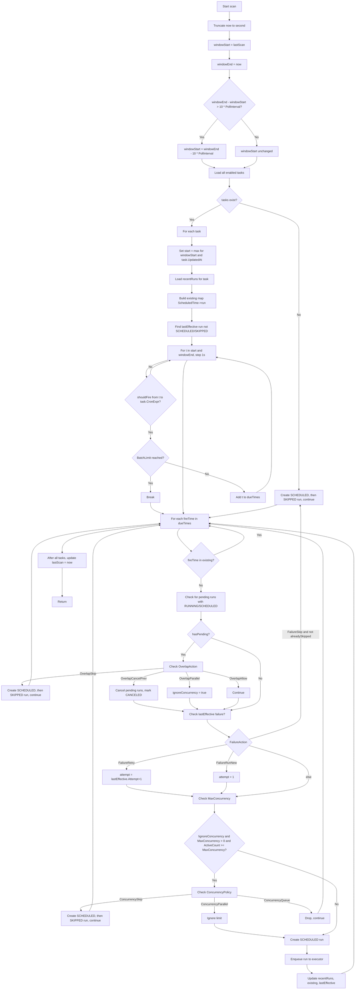

# CronJob 服务设计方案

> 状态：Updated (misfire 追赶逻辑已移除)
> 目标：提供一个可配置、可扩展、支持同步/未来异步回调的内部 HTTP 定时任务调度服务。

## 1. 背景与目标
内部系统存在大量周期性调用下游服务(API)需求。平台化后：
- Web API 创建/管理定时任务
- 支持同步（一次请求完成）与未来异步回调模式
- 持久化任务与运行记录（MySQL）
- 支持重试、并发控制、超时、（异步回调预留）
- 设计兼容未来分布式调度、任务依赖、告警

## 2. 术语定义
| 术语 | 说明 |
|------|------|
| 任务 Task | 用户配置的调度条目（含 URL、Cron、执行方式等） |
| 调度 | 根据 Cron 计算当前秒是否触发并生成运行实例 |
| 运行实例 TaskRun | 一次实际运行（含状态、耗时、请求/响应信息） |
| 同步任务 | 发起 HTTP 调用等待响应判定结果 |
| 异步任务 | 初始调用后进入等待回调阶段（Phase2 预留） |
| 回调 | 外部服务处理完成后调用平台提供接口关闭环路 |

(已移除 Misfire 术语：不再补偿轮询间隔内丢失的秒级触发)

## 3. 功能范围
### 核心功能
- 任务 CRUD（创建、查询、修改、启用/停用、删除）
- 秒级 Cron 表达式解析（6 字段：`sec min hour dom mon dow`；兼容5字段自动补秒）
- 定时调度（仅当前秒判定，不追赶丢失触发）
- 同步执行：HTTP 请求完成判定成功/失败/超时
- 手动触发（受并发策略限制）
- 运行实例查询
- 重试策略（占位设计，后续扩展）
- 超时控制
- 并发控制：最大并发 + 策略（QUEUE / SKIP / PARALLEL）
- 回调 token 校验（异步预留）
- 状态机管理

### 数据持久化
- MySQL 存储任务 & 运行记录
- JSON 字段用于 headers / 模板等动态内容

### 非功能要求
- 单实例可用，未来可扩展 HA
- 设计兼容未来分布式（DB 锁占位）
- 可观测性：日志 + 指标 + Trace ID

### 不在当前范围
- 鉴权 / 多租户
- UI 控制台（仅 API）
- 任务依赖编排 / DSL
- 告警（预留 Hook）
- 分布式一致性（除轻量锁）

## 4. 架构概览
```
+-------------------+        +------------------+
| REST API (HTTP)   |<------>|  Client (Ops)    |
+---------+---------+        +------------------+
          |                           External Services
          v                                     ^
+-------------------+      Execute HTTP        |
|  Service Layer    |--------------------------+
+---------+---------+                          |
          |                                    |
          v                                    |
+-------------------+                          |
|  Scheduler Core   |                          |
+---------+---------+                          |
          |                                    |
          v                                    |
+-------------------+                          |
|   Executor Pool   |                          |
+---------+---------+                          |
          |                                    |
          v                                    |
+-------------------+                          |
| Persistence (MySQL)|                         |
+-------------------+                          |
```

## 5. 调度引擎 (Scheduler Engine) 工作流程

### 1. Start 阶段
Engine.Start() 关键步骤：
1. 组件激活，记录当前时间截断到秒 `lastScanSec = now.Truncate(second)`。
2. 创建后台 goroutine：使用 ticker（周期 `cfg.PollInterval`，默认 1s）。
3. 每次 ticker tick 调用 `scan(loopCtx, now)`。
4. Stop() 时取消 context，等待 goroutine 退出。

ASCII 示意：
```
+--------------------+          +---------------------+
| application start  |          | Engine.Start        |
+----------+---------+          +----------+----------+
           |                               |
           v                               v
    init components                lastScanSec = now(sec)
           |                               |
           v                               v
   start executor                 spawn scan loop goroutine
           |                               |
           v                               v
      ticker tick ------------------> scan()
```

### 2. scan() 调度流程
scan(now) 目标：找出从上次扫描到本次扫描之间“应该触发”的时间点，并为每个任务生成对应的 Run（或跳过/取消）。

核心步骤：
1. `sec = now.Truncate(second)` 获取当前秒。
2. 构造时间窗口：`candidateSeconds = (lastScanSec+1s ... sec)`，包括当前秒，避免漏掉间隔内的触发。
3. 更新 `lastScanSec = sec`。
4. 查询所有 ENABLED 任务。
5. 对每个任务：
  - 遍历 candidateSeconds，使用简化 cron 匹配函数 `shouldFire(ts, cron_expr)` 收集匹配秒列表 `matched`。
  - 根据 `misfire_policy` 转换为最终调度列表：`toSchedule`。
  - 查询最近一次运行（ListByTask limit=1）获取 lastRun，用于 overlap/failure 策略判断。
  - 对于每一个 fireTime in toSchedule：
    1. 检测 overlap: `lastRun.Status == RUNNING`。
    2. 检测 failure: `lastRun.Status in {FAILED, TIMEOUT, FAILED_TIMEOUT, CANCELED}`。
    3. 应用 OverlapAction：可能 SKIP / CANCEL_PREV / PARALLEL / ALLOW。
    4. 应用 FailureAction：决定 attempt（RUN_NEW=1, RETRY=lastRun.Attempt+1, SKIP=直接标记跳过）。
    5. 应用 ConcurrencyPolicy（除非被 PARALLEL 覆盖 ignoreConcurrency=true）：
      - 超过并发上限且 policy=SKIP => SCHEDULED+SKIPPED。
      - 超过并发上限且 policy=QUEUE => 仍入队（当前简单实现）。
    6. CreateScheduled() 写入 run，记录 attempt。
    7. 入队 Executor.Enqueue(run)（如果不是跳过）。
    8. 更新 lastRun=run 以便同一个 scan 内后续触发秒继续参考最新运行。




## 6. 模块划分
```
internal/
  api/        # Handler, request/response DTO
  service/    # 业务逻辑聚合（Task, Run, Executor, Scheduler）
  callback/   # 回调处理（预留）
  dao/ # DAO 与 MySQL 交互
  model/      # 领域模型 & 状态枚举
  config/     # 配置加载 & 校验
  lock/       # 分布式锁抽象（预留）
migrations/   # SQL 迁移
```

## 7. Cron 支持
- 6 字段（含秒）表达式；输入 5 字段自动补前导秒 0
- 支持：`*`、单个数字、逗号列表、步进 `*/N`
- 暂不支持范围 `1-10` 与范围步进 `1-10/2`
- 校验阶段规范化存储为 6 字段

## 8. 调度循环行为（无追赶）
- 每次轮询只判断“当前秒”是否匹配任务 Cron；之前错过的秒不补偿
- 高频任务（例如 `*/15 * * * * *`）若 `poll_interval=1m` 将只执行每分钟一次（丢失 3 次触发）
- 推荐：`poll_interval <= 1s` 以保证秒级精度；或者未来通过可选“补偿策略”再扩展

### Overlap & Failure 策略
- OverlapAction：当仍存在 RUNNING/SCHEDULED 实例
  - SKIP：创建一次占位 run 并标记 SKIPPED
  - CANCEL_PREV：取消所有 RUNNING 实例后继续
  - PARALLEL：忽略并发上限强制并行
  - ALLOW：按并发策略继续
- FailureAction：上一“有效执行”失败/超时/取消时的处理
  - SKIP：仅跳过一次（记录一个 SKIPPED 尝试），下一次正常执行 attempt = prev+2
  - RETRY：attempt = prev+1
  - RUN_NEW：attempt 重置为 1

### 并发策略
- MaxConcurrency > 0 时生效
- QUEUE（当前简化：直接丢弃本次触发，不创建记录，后续可实现真正排队）
- SKIP：创建并标记 SKIPPED
- PARALLEL：忽略上限继续执行

## 9. 数据库设计
### 表：tasks
| 字段 | 类型 | 说明 |
|------|------|------|
| id | BIGINT PK | 任务 ID |
| name | VARCHAR(128) | 唯一名称 |
| description | VARCHAR(512) | 描述 |
| cron_expr | VARCHAR(64) | 标准化 6 字段 Cron |
| timezone | VARCHAR(64) | 时区 |
| exec_type | ENUM('SYNC','ASYNC') | 执行类型 |
| http_method | VARCHAR(8) | HTTP 方法 |
| target_url | VARCHAR(512) | 目标 URL |
| headers_json | JSON | 额外请求头 |
| body_template | TEXT | 请求体模板 |
| timeout_seconds | INT | 请求超时秒数 |
| retry_policy_json | JSON | 重试策略 JSON（预留） |
| max_concurrency | INT | 并发上限 |
| concurrency_policy | ENUM('QUEUE','SKIP','PARALLEL') | 并发策略 |
| callback_method | VARCHAR(8) | 回调方法（预留） |
| callback_timeout_sec | INT | 回调等待超时（预留） |
| overlap_action | ENUM('ALLOW','SKIP','CANCEL_PREV','PARALLEL') | 重叠策略 |
| failure_action | ENUM('RUN_NEW','SKIP','RETRY') | 失败策略 |
| status | ENUM('ENABLED','DISABLED') | 状态 |
| version | INT | 乐观锁版本 |
| created_at | DATETIME | 创建时间 |
| updated_at | DATETIME | 更新时间 |
| deleted | TINYINT | 逻辑删除 |

### 表：task_runs（略，同现有字段）

## 10. API 概要（示例创建请求已移除 misfire 字段）
POST `/api/v1/tasks`
```
{
  "name":"sync_stats",
  "description":"统计同步",
  "cron_expr":"*/15 * * * * *",
  "exec_type":"SYNC",
  "http_method":"POST",
  "target_url":"http://svc.internal/api/sync",
  "headers_json":"{\"Content-Type\":\"application/json\"}",
  "body_template":"{\"run_id\":\"{{run_id}}\"}",
  "timeout_seconds":10,
  "max_concurrency":1,
  "concurrency_policy":"QUEUE",
  "overlap_action":"SKIP",
  "failure_action":"RUN_NEW"
}
```

## 11. 调度精度与取舍说明
- 当前实现不补偿丢失触发（简化，避免批量瞬时创建多 run）
- 若需要保证严格“每次 cron 都执行”：需采用更短 poll_interval 或引入追赶算法：
  - 算法示例：保存 last_scan_second；对区间 [last+1, now] 每秒匹配；对每秒按并发/失败策略去重
  - 风险：可能在长间隔后批量生成多个 run 造成瞬时压力
- 可选改进（后续）：引入 `catch_up_mode`（NONE, COMPACT, FULL）

## 12. 迁移兼容
- 新部署：使用更新后的 `0001_init.sql`
- 既有部署：执行新增迁移 `0002_drop_misfire.sql` 删除 `misfire_policy` 与 `catchup_limit`

## 13. 现状与下一步
已实现：同步任务调度、Overlap/Failure/并发策略、跳过一次失败占位、基础查询。
建议后续：
1. 真正的 QUEUE 队列（持久化等待）
2. 可选补偿模式（配置化）
3. 重试策略细化（指数/抖动）
4. 异步回调全链路
5. 范围 Cron 表达式
6. 分布式主节点选举

## 14. 配置示例 (YAML)
```
scheduler:
  poll_interval: 1s   # 建议 <=1s, 否则高频任务触发会被抽样
executor:
  worker_pool_size: 16
  request_timeout: 15s
```

## 15. 精度建议
- 若任务存在 `*/N` 秒级频率，选择 poll_interval <= min(N,1s)
- 若无法降低 poll_interval，可接受抽样执行或启用未来 catch-up 机制

---