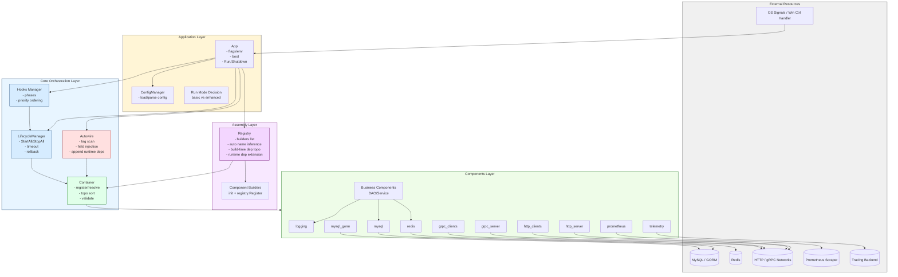
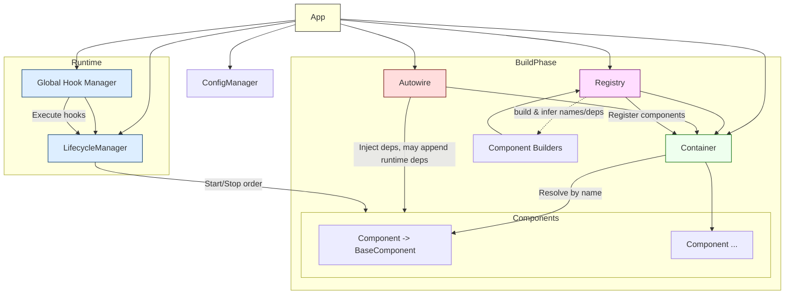
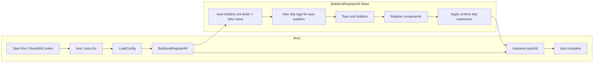
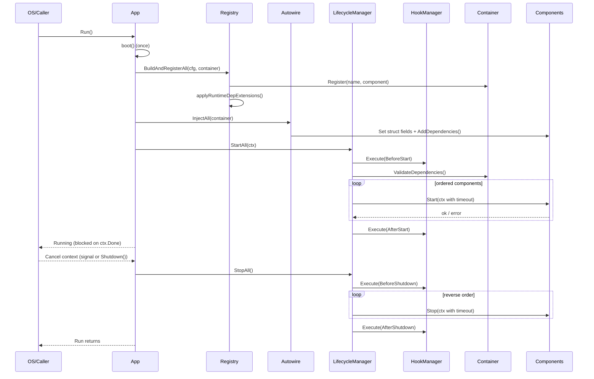
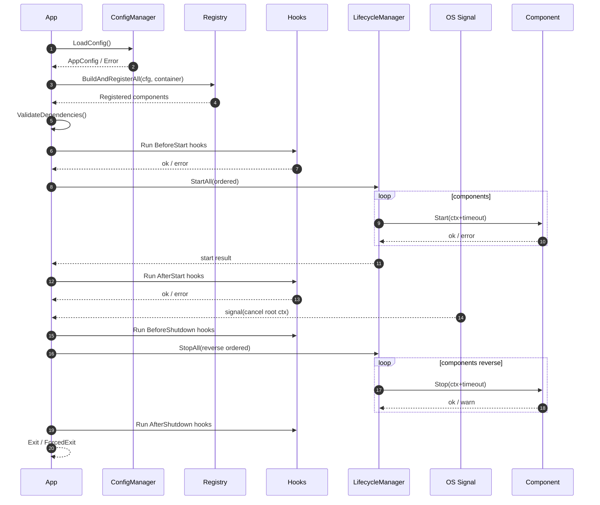

# Infrastructure

> 本文档详细说明 Go Infra 子项目的架构设计、模块职责、组件关系、生命周期、配置规范、使用方式、扩展模式与最佳实践。
>
> This document is a definitive guide to the Go infrastructure layer: architecture, modules, components, lifecycle, configuration, usage, extension and best practices.

---

## 目录 (Table of Contents)
1. 背景 & 设计目标 (Background & Goals)
2. 架构总览 (High-Level Architecture)
3. 核心模块职责 (Core Modules Responsibilities)
4. 组件模型 (Component Model)
5. 依赖与生命周期 (Dependencies & Lifecycle)
6. Registry 机制 (Self-Registration Builders)
7. 配置系统 (Configuration System)
8. 组件目录与配置详解 (Component Catalog & Config Fields)
9. 启动流程 (Boot & Run Flow)
   9.1 分阶段总览  9.2 模式决策  9.3 时序图  9.4 伪代码  9.5 回滚策略  9.6 依赖验证  9.7 Hooks 保证  9.8 扩展点  9.9 性能  9.10 异常诊断  9.11 调试  9.12 拓扑层级  9.13 成功判据  9.14 启动摘要
10. 优雅停机 (Graceful Shutdown / Windows 支持)
    10.1 触发源  10.2 时间线  10.3 顺序细化  10.4 Stop 规范  10.5 超时与强退  10.6 流程图  10.7 问题与解决  10.8 最佳实践  10.9 耗时指标  10.10 Hooks 交互  10.11 强退日志  10.12 退出码  10.13 校验  10.14 伪代码  10.15 增强  10.16 摘要
11. 健康检查 & 监控 (Health / Metrics / Telemetry)
12. 测试与可替换性 (Testing & Replace)
13. 扩展示例：新增组件 (How to Add a Component)
    1. 用户自定义业务组件 (taskDao / taskService)
    2. 使用 App.RegisterCustomBuilder 动态注册组件
    3. 使用 ProvideComponent 直接提供实例
    4. Service 业务服务组件示例 (依赖多个 DAO / 分层依赖实践)
14. 常见错误与排查 (Troubleshooting)
15. 环境变量与运行参数 (Environment Variables)
16. 最佳实践 (Best Practices)
17. 未来增强路线 (Future Enhancements)

---
## 1. 背景 & 设计目标 (Background & Goals)
### 1.1 背景痛点 (Problems in typical Go service bootstrapping)
常见中大型 Go 服务在基础设施层面易出现：
- 启动脚本臃肿：main.go 中硬编码创建顺序，耦合全部组件。
- 依赖混乱：组件间显式/隐式依赖混在一起，顺序不确定，偶发“有时启动成功”。
- 横切能力散落：日志、Tracing、Metrics、健康检查分散在各自初始化片段中，难以统一治理。
- 不易测试：无法在未激活状态替换组件，集成测试需真实资源（MySQL/Redis），成本高。
- 扩展成本高：新增一个组件需要修改多个集中式文件（违背开放封闭原则）。
- 停机不可控：缺乏统一生命周期与优雅回滚策略，Windows 平台兼容性差。

### 1.2 设计策略 (Design Strategies)
为解决上述问题，框架强调：
- 显式依赖图：构建 + 运行时分离，拓扑排序确定性；缺失/环检测前置失败。
- 自注册 & 去中心化：组件通过 registry + init() 注册，主流程只“触发”构建与启动。
- 生命周期钩子分层：BeforeStart/AfterStart/BeforeShutdown/AfterShutdown 分阶段插入扩展逻辑。
- 组件最小职责：资源管理 + 健康检查；不混入装配逻辑。
- 可替换性：启动前允许 Replace mock/stub，缩小测试域。
- 观测内聚：日志、指标、Tracing 都是独立组件，按需启用。
- 错误即回滚：部分启动失败立即停止已激活组件，保证系统处于一致状态。

### 1.3 设计目标总览 (Goals Overview)
| 目标 | 说明 | 价值 (Why) |
|------|------|-----------|
| 模块化 | 日志/HTTP/gRPC/DB/缓存/监控独立启用 | 降低冷启动资源占用，加速按需裁剪 |
| 可组合 | 声明式依赖统一排序 | 避免隐式顺序与偶发启动失败 |
| 自描述装配 | init()+registry.Register | 新增能力零修改主入口，OCP |
| 可测试 | Container.Replace | 单测用内存/假实现替换真实资源 |
| 确定性 | 排序策略固定（名称排序+DFS） | 线上行为稳定可复现，易排查 |
| 平台友好 | Windows/*nix 停机流程统一 | 跨平台部署一致体验 |
| 可观测 | Prometheus + Telemetry 正交启用 | 快速定位性能与链路问题 |
| 扩展点简洁 | Hooks + Runtime Dep Extension | 最少概念满足多样化装配需求 |

### 1.4 成功判据 (Success Criteria)
- 新增一个组件 = 新建包 + init() 注册，不编辑已有文件。
- 依赖环或缺失在启动前即时报错，日志含详细路径。
- 替换组件进行集成测试 < 5 行额外代码。
- 部署与本地差异仅限配置文件变化，不触及代码。

---
## 2. 架构总览 (High-Level Architecture)
### 2.1 分层结构 (Layered View)
```
+-------------------- Application Layer --------------------+
| application.App                                         |
|  - 解析启动参数 / env                                   |
|  - 加载 & 校验配置 (ConfigManager)                      |
|  - 触发 registry.BuildAndRegisterAll                    |
|  - 委托 LifecycleManager Start/Stop                      |
+------------------------+---------------------------------+
                         v
+-------------------- Core Layer ---------------------------+
| Container | LifecycleManager | Hooks Manager             |
|  - 组件存储  - 顺序 & 回滚    - 四阶段钩子               |
|  - 依赖校验  - 超时封装       - 优先级排序                |
+-------+-------------+-------------+-----------------------+
        |             | (hooks 调用) 
        v             v
+-------------------- Components Layer ---------------------+
| logging | http_server | http_clients | grpc_server | ... |
|  builder -> component -> Start/Stop/Health               |
|  声明 Dependencies() 决定启动顺序                        |
+----------------------------------------------------------+
```








### 2.2 启动数据流 (Boot Sequence Flow)
1. App: 读取配置文件 -> 构造 Container & LifecycleManager。
2. Registry: 遍历已注册 builders -> 构建组件实例 -> 注册入 Container。
3. LifecycleManager: ValidateDependencies() -> 排序 -> StartAll 顺序启动。
4. Hooks: 在各阶段插入扩展逻辑（路由注册、预热数据等）。
5. 失败任意一步：立即执行回滚逻辑 (stop 已激活组件)。

### 2.3 关键区分 (Build-Time vs Runtime)
| 阶段 | 发生内容 | 侧重点 | 不做的事 |
|------|----------|--------|----------|
| Build | 创建内存结构 | 不触发 I/O | 不连接外部网络/DB |
| Runtime Start | 真实资源初始化 | 顺序 & 超时 & 回滚 | 不再修改依赖图 |
| Runtime Stop | 释放资源 | 逆序停止 | 不启动新组件 |

### 2.4 可替换性与扩展点
- 替换：在 StartAll 前调用 `Container.Replace(name, mock)`。
- 路由/任务注册：使用 Hooks BeforeStart，保证组件尚未激活。
- 运行时依赖扩展：`registry.ExtendRuntimeDependencies(target, deps...)` 增加启动顺序约束（不改变 builder 构建顺序）。

---
## 3. 核心模块职责 (Core Modules Responsibilities)
### 3.1 总览表 (Responsibilities Matrix)
| 模块 | 职责 | 输入 | 输出 | 不负责 |
|------|------|------|------|--------|
| application.App | 启动编排 | config path/env | 正常退出/错误 | 组件具体实现 |
| registry | 构建与注册组件 | AppConfig, Container | 已注册组件集合 | 生命周期控制 |
| core.Container | 存储实例 + 依赖校验 | builders 产物 | Resolve/Validate 排序结果 | Start/Stop |
| core.LifecycleManager | 顺序启动 & 回滚 & 停止 | Container 排序结果 + Hooks | 稳定运行的激活组件 | 构建组件/解析配置 |
| hooks.Manager | 管理钩子 | Hook 注册请求 | 按阶段执行结果 | 业务逻辑本身 |
| components/* | 管理协议/资源 | 配置/依赖实例 | 资源连接 & 健康逻辑 | 全局排程 |

### 3.2 交互关系 (Interactions)
```
App -> Registry -> Container -> LifecycleManager -> Components
  |          |            ^              |                ^
  |          |            |              |                |
  |          +----(Register)-------------+----(Start/Stop)+
  +--(AddHook)--> Hooks.Manager <---------------------------
```

### 3.3 Container 细节
- 线程安全：内部使用 RWMutex；注册与替换互斥。
- 拓扑排序：`SortComponentsByDependencies` 采用 DFS + 名称字典序的稳定顺序。
- 校验：`ValidateDependencies` 先缺失依赖收集再调用排序进行环检测。
- 替换约束：只能替换未激活组件；激活后拒绝，确保运行时一致性。

### 3.4 LifecycleManager 细节
- 四阶段：BeforeStart -> StartAll -> AfterStart -> (运行期) -> BeforeShutdown -> StopAll -> AfterShutdown。
- 超时：每个组件 Start/Stop 包裹 `context.WithTimeout`（默认 30s，可通过 `SetTimeout` 调整）。
- 回滚：任一组件 Start 失败 -> 停止已激活的前序组件 + 尝试停止失败组件自身（若部分激活）。
- ShutDown 幂等：多次调用仅执行一次。

### 3.5 Hooks Manager
- 注册：`AddHook(name, phase, func, priority)`；priority 数值小先执行。
- 执行策略：同一 phase 内按 priority 升序；出现错误立即终止该 phase。
- 典型用途：预注册路由 / 延迟数据预热 / 输出启动 banner / 注入调试探针。

### 3.6 Registry
- 手动注册：`registry.Register(name, fn)` 显式命名。
- 自动注册：`registry.RegisterAuto(fn)` 在 Build 阶段先构建一次以推断名称与 tag 依赖。
- 运行时依赖扩展：构建完成后调用 `applyRuntimeDepExtensions` 为支持 `AddDependencies` 的组件追加依赖。

### 3.7 组件包 (components/*) 设计约束
- Builder 返回三元组 `(enabled, component, error)`；未启用或返回 nil 跳过。
- Start 阶段才做外部 I/O（避免构建阶段阻塞或失败污染装配）。
- HealthCheck 保证当 active=true 时基本可用；未激活时允许返回错误。

---
## 4. 组件模型 (Component Model)
### 4.1 接口定义
```
type Component interface {
  Name() string
  Start(ctx context.Context) error
  Stop(ctx context.Context) error
  HealthCheck() error
  Dependencies() []string
  IsActive() bool
}
```
对应实现参考 `core/component.go` 中 `BaseComponent`：提供 active 状态与默认 `HealthCheck` 行为。

### 4.2 方法语义
| 方法 | 语义 | 约束/建议 |
|------|------|-----------|
| Name | 稳定唯一名 | 用于排序/日志/替换；常量化 |
| Start | 激活资源 | 幂等；部分失败需清理内部状态（active=false）|
| Stop | 释放资源 | 幂等；失败写日志不 panic |
| HealthCheck | 活性检测 | 只检查关键依赖；避免重度操作 |
| Dependencies | 运行时硬依赖 | 缺失即启动前失败；不含可选依赖 |
| IsActive | 当前激活标志 | 写操作仅在 Start/Stop 内发生 |

### 4.3 状态机 (Lifecycle State Machine)
```
Registered -> (Start OK) -> Active -> (Stop) -> Inactive
           -> (Start Fail) -> Error -> Rollback others -> Inactive
```
并发策略：框架当前串行启动；避免并发交织复杂回滚。后续可拓展并发拓扑层级启动。

### 4.4 构建 vs 启动职责分离
- 构建（Builder）阶段：仅创建 struct + 填充配置，不访问网络/磁盘，不启动 goroutine；可安全、快速、可预测。
- 启动（Start）阶段：执行 I/O（dial/listen/ping）、注册路由、启动后台协程、建立池。
- 益处：构建失败 = 逻辑/配置错误；启动失败 = 外部依赖故障；日志含语义分离更易排查。

### 4.5 自定义组件示例 (Minimal Custom Component)
```
type MyCache struct { *core.BaseComponent; store map[string]string }

func NewMyCache() core.Component {
  return &MyCache{ BaseComponent: core.NewBaseComponent("my_cache"), store: make(map[string]string) }
}

func (m *MyCache) Start(ctx context.Context) error {
  // 轻量初始化，不做外部 I/O
  m.SetActive(true)
  return nil
}
func (m *MyCache) Stop(ctx context.Context) error {
  m.store = nil
  m.SetActive(false)
  return nil
}
```
注册：
```
func init(){
  registry.Register("my_cache", func(cfg *config.AppConfig, c *core.Container)(bool, core.Component, error){
    return true, NewMyCache(), nil
  })
}
```

### 4.6 可选依赖与动态扩展
- 可选依赖：不在 `Dependencies()` 中声明；在 `Start()` 或 hook 中 `c.Resolve(name)`，失败降级。例如：缓存组件可尝试解析 telemetry，未启用则仅记录本地指标。
- 动态追加：使用 `registry.ExtendRuntimeDependencies(target, extra...)` 在运行时拓扑排序前补充硬依赖；适合后期才决定的顺序关系（例如某业务组件需要确保在 http_server 之前启动做路由预注册）。

### 4.7 健康检查策略
| 分类 | 建议实现 | 不建议 |
|------|----------|--------|
| DB | `db.PingContext(ctx)` | 全量查询 / schema diff |
| Redis | `PING` | KEYS * / 大量脚本执行 |
| HTTP 下游 | 可选：跳过或 HEAD 探测 | GET 复杂正文解析 |
| 自定义缓存 | 检查 `IsActive()` + 关键 map 非 nil | 深度遍历/大对象序列化 |

特性：HealthCheck 不应修改内部状态，也不应依赖慢操作 (>50ms)。

---
## 5. 依赖与生命周期 (Dependencies & Lifecycle)
### 5.1 校验流程
1. 收集缺失依赖：任一组件声明的名称在容器中未注册 -> 汇总错误并终止启动。
2. 环检测：基于 `SortComponentsByDependencies()` 的 DFS 访问栈；发现回路立即返回错误。
3. 顺序生成：按组件名称字典序遍历，稳定 DFS 结果得到拓扑启动顺序数组。

### 5.2 启动顺序示例
假设：
```
logging: []
telemetry: [logging]
http_server: [logging, telemetry]
redis: [logging]
```
字典序: http_server, logging, redis, telemetry
DFS 排序结果（拓扑）：logging -> telemetry -> http_server; logging -> redis
最终启动序列：logging, telemetry, http_server, redis （redis 与 telemetry 无依赖关系，排序由初始名称顺序+DFS 路径决定，保持确定性）。

### 5.3 启动算法伪代码
```
ordered = container.ValidateDependencies()
execute hooks(BeforeStart)
for comp in ordered:
  startCtx = withTimeout(globalTimeout)
  err = comp.Start(startCtx)
  if err:
    if comp.IsActive(): comp.Stop(bg)
    rollback(reverse(alreadyStarted))
    return error
execute hooks(AfterStart)
```

### 5.4 回滚策略
- 仅在某组件 Start 返回 error 时触发。
- 已成功激活的组件逆序调用 Stop（带超时）。
- 失败组件若部分设置 active，尝试 Stop 进行自清理。
- 回滚过程中 Stop 错误仅记录日志，不影响继续回滚其余组件。

### 5.5 停止算法伪代码
```
execute hooks(BeforeShutdown)
ordered = container.SortComponentsByDependencies()
for comp in reverse(ordered):
  if comp.IsActive(): comp.Stop(withTimeout)
execute hooks(AfterShutdown)
```

### 5.6 Hooks 使用模式
| Phase | 场景示例 | 注意 |
|-------|---------|------|
| BeforeStart | 注册路由 / 构造内存索引 / 打印启动参数 | 避免重 IO / 长阻塞 |
| AfterStart | 异步预热 / metrics 注册 / banner | 不再修改依赖或替换组件 |
| BeforeShutdown | 停止接收新请求 / flush 队列 | 严控耗时 < timeout |
| AfterShutdown | 输出统计 / 释放额外内存快照 | 不再产生新 goroutines |

### 5.7 错误示例
| 场景 | 日志示例 | 修复 |
|------|---------|------|
| 缺失依赖 | missing component dependencies: http_server -> [telemetry] | 启用 telemetry 或移除依赖 |
| 环依赖 | circular dependency detected involving component mysql | 拆分依赖 / 引入事件回调替代硬依赖 |
| 启动失败 | failed to start component redis: dial timeout | 检查地址/网络/鉴权 |

### 5.8 超时与性能建议
- 单组件启动推荐 < 3s；超过需分析能否拆分：连接建立与预热（预热放 AfterStart）。
- 使用独立 goroutine 做长耗时缓存预热；主 Start 仅设置活跃标志与轻量连接。

### 5.9 未来增强方向
- 并行批启动：无依赖关系组件并行启动，记录耗时指标。
- Readiness 与 Liveness 分离：支持对外两个健康端点。
- 启动耗时指标：Prometheus Histogram 按组件名打标签。

---
## 6. Registry 机制 (Self-Registration Builders)
### 6.1 目标
去除集中式“手工 new”装配；新增组件零侵入主入口；允许自动推断名称和构建期依赖。

### 6.2 核心概念
| 概念 | 描述 |
|------|------|
| BuilderFunc | `func(cfg *config.AppConfig, c *core.Container)(bool, core.Component, error)` 返回启用标志与实例 |
| 手动注册 | `registry.Register(name, fn)` 明确名称，无构建期依赖推断 |
| 自动注册 | `registry.RegisterAuto(fn)` 预构建推断名称 + struct tag 提取依赖 |
| 构建期依赖 | 仅决定 builder 排序；保证在 builder 中 `c.Resolve(dep)` 成功 |
| 运行期依赖 | `Component.Dependencies()` 决定 Start/Stop 顺序 |
| 运行期扩展 | `registry.ExtendRuntimeDependencies(target, extra...)` 追加硬依赖 |

### 6.3 自动注册流程
1. 预构建：执行 auto builder，缓存 `(enabled, component)`。
2. 名称推断：使用 `component.Name()` 作为最终名称；重复名称报错。
3. Tag 解析：扫描公开字段 `infra:"dep:<name>"` 收集构建期依赖；带 `?` 结尾视为可选存在则排序。
4. 拓扑排序：基于构建期依赖的有向图 + 名称字典序出确定序列。
5. 注册：复用缓存实例（避免二次构建）或执行手动 builder；跳过 disabled。
6. 追加运行期扩展：调用 `applyRuntimeDepExtensions` 为支持 `AddDependencies` 的组件补边。

### 6.4 扩展示例
```
func init(){
  registry.ExtendRuntimeDependencies("http_server", "telemetry", "logging")
}
```
使得 http_server 在运行期排序上依赖 telemetry 与 logging（即便其自身 `Dependencies()` 未声明）。

### 6.5 常见陷阱
| 问题 | 原因 | 解决 |
|------|------|------|
| duplicate builder name | 两个 builder 推断或声明同名 | 修改其中一个名称 |
| auto builder 返回 nil | 构建逻辑过重/失败 | 降级：仅做 struct 初始化，不连外部 |
| Resolve 失败 | 构建期依赖未声明 | 使用 RegisterWithDeps 或 tag 声明 |
| 运行期扩展无效 | 调用时机晚于 BuildAndRegisterAll | 确保在 init 中调用 |

### 6.6 最佳实践
- builder 中避免任何耗时网络操作；只做配置解析与依赖引用绑定。
- 将所有运行期依赖显式放入 `BaseComponent` 初始化参数，便于阅读。
- 使用 tag 声明构建期依赖使结构与声明同处一处，减少分散。
- 复杂扩展统一放在单独 `deps_ext.go` 文件中，集中管理。

### 6.7 代码片段：标准 Logging 注册
```
func init(){
  registry.Register(consts.COMPONENT_LOGGING, func(cfg *config.AppConfig, c *core.Container)(bool, core.Component, error){
    if cfg.Logging==nil || !cfg.Logging.Enabled { return false, nil, nil }
    comp, err := logging.NewFactory().Create(cfg.Logging)
    if err!=nil { return true, nil, err }
    return true, comp, nil
  })
}
```

---
## 7. 配置系统 (Configuration System)

### 7.1 设计目标 (Goals)
配置系统提供一个“稳定、分层、可扩展”的方式加载应用 + 基础设施 + 业务自定义配置，做到：
- 可插拔业务配置：基础设施不需要知道具体业务结构，通过 `BizConfig any` 保持抽象。
- 强类型访问：业务方提供指针，框架完成解码填充，后续无需再做 map 转换或手动反序列化。
- 分层与扩展：支持未来环境变量覆盖、命令行覆盖、动态热更新预留点。
- 惰性并确定：一次 Load 后配置对象只读，不允许运行期被组件修改（避免隐性竞态）。

### 7.2 组成组件 (Modules)
| 组件 | 职责 | 关键方法 |
|------|------|----------|
| Loader | 读取文件 + 解析 + 二次解码 biz_config + 未来 env 合并 | `LoadConfig()` / `SetBizConfig()` |
| Validator | 基础合法性校验（存在性、路径、环境合法性） | `ValidateAppConfig()` |
| ConfigManager | 编排 Loader + Validator；暴露最终 `AppConfig` | `LoadConfig()` / `BizConfig()` / `SetBizConfig()` |
| schema.go | 定义强类型 `AppConfig` 与各组件配置结构 | struct definitions |

### 7.3 AppConfig 分层结构 (Layering)
```
AppConfig {
  APPInfo     *APPInfo           // 基础元数据 (app_name/env)
  BizConfig   any                // 业务自定义结构 (指针) 已被二次解码填充
  Logging     *LoggingConfig
  GRPCClients *GRPCClientsConfig
  GRPCServer  *grpc_server.Config
  MySQL       *mysql.MySQLConfig
  MySQLGORM   *mysqlgorm.Config
  HTTPServer  *HTTPServerConfig
  HTTPClient  *HTTPClientsConfig
  Redis       *redis.Config
  Prometheus  *prometheus.Config
  Telemetry   *telemetry.Config
}
```
特征：所有基础设施字段都可为 nil（表示未启用）。业务配置可为 nil 或具体指针。

### 7.4 文件解析与格式支持 (File Resolution)
算法：
1. 归一化 env：空值 => `development` (可通过传入自定义 env 覆盖)。
2. 归一化路径：空值 => `config.yaml`。
3. 读取文件：支持 `.yaml` / `.yml` / `.json`，不支持其他扩展名（报错）。
4. 反序列化到临时 `AppConfig`（此时 `BizConfig` 仍是 `map[string]any`）。
5. 如业务方提供了指针 `bizPtr` 且文件中存在 `biz_config`：
    - 将 `cfg.BizConfig` 原始 map 再次序列化为对应格式 bytes。
    - 反序列化到指针（保持指针已有默认值）。
    - 覆盖 `cfg.BizConfig = bizPtr`。
6. 若业务方提供指针但文件缺失 `biz_config`：直接将指针挂载，允许其默认值生效。
7. 合并环境变量（当前为占位 TODO，不会改变配置）。
8. 校验基础合法性；成功后返回 `AppConfig`。

### 7.5 BizConfig 设计与二次解码 (BizConfig Deep Dive)
为何需要二次解码？
- 直接在第一次 Unmarshal 时让 yaml/json 填充一个 `interface{}` 指针并不能得到结构体字段覆盖效果，YAML 库会生成 `map[string]any`。
- 通过“再序列化 + 再反序列化”保证：文件中出现的字段覆盖指针中的默认值；未出现的字段保留指针内自定义默认值。

指针要求：`SetBizConfig(b any)` 必须传入指针，否则 panic。这样能：
- 保持调用者清晰知道 BizConfig 是可被填充的写目标。
- 避免值类型导致的拷贝与默认值丢失。

双入口：
- Loader.SetBizConfig(ptr) （底层实现）
- ConfigManager.SetBizConfig(ptr) （更上层的包装，调用前需创建 ConfigManager）
- 快捷构造：`NewConfigManagerWithBiz(env, path, &MyBizCfg{})`

访问：
- 业务组件 builder 中通过传入的 `cfg.BizConfig` 强制类型断言为具体结构。
- 或在运行期（未启动前）通过 `app.ConfigManager().BizConfig()` 获取并断言。

### 7.6 使用示例 (Usage Examples)
#### 7.6.1 定义业务配置结构
```go
// internal/config/biz.go
package configx

type BizConfig struct {
  FeatureToggle struct {
    EnableCache bool `yaml:"enable_cache"`
    EnableBeta  bool `yaml:"enable_beta"`
  } `yaml:"feature_toggle"`
  Limits struct {
    MaxItems int `yaml:"max_items"`
  } `yaml:"limits"`
  // 默认值
  TimeoutSeconds int `yaml:"timeout_seconds"`
}

func NewDefaultBizConfig() *BizConfig {
  c := &BizConfig{}
  c.Limits.MaxItems = 100
  c.TimeoutSeconds = 5
  return c
}
```

#### 7.6.2 YAML 文件
```yaml
app_info:
  app_name: example-service
  env: development
biz_config:
  feature_toggle:
    enable_cache: true
  limits:
    max_items: 500
  timeout_seconds: 10
logging:
  enabled: true
  level: info
```
缺失字段：`feature_toggle.enable_beta` 未出现 -> 仍保持默认 false；`limits.max_items` 被覆盖为 500；`timeout_seconds` 覆盖默认 5 => 10。

#### 7.6.3 加载配置
```go
biz := configx.NewDefaultBizConfig()
cm  := config.NewConfigManagerWithBiz("development", "config.yaml", biz)
if err := cm.LoadConfig(); err != nil { panic(err) }
appCfg := cm.GetConfig()
realBiz := appCfg.BizConfig.(*configx.BizConfig)
fmt.Println(realBiz.Limits.MaxItems) // 500
```

#### 7.6.4 在组件 builder 中访问
```go
registry.Register("cache", func(cfg *config.AppConfig, c *core.Container)(bool, core.Component, error){
  bc, ok := cfg.BizConfig.(*configx.BizConfig)
  if !ok { return false, nil, fmt.Errorf("biz config type mismatch") }
  if !bc.FeatureToggle.EnableCache { return false, nil, nil } // 按业务开关启用组件
  // 创建组件...
  return true, NewCache(bc.Limits.MaxItems, bc.TimeoutSeconds), nil
})
```

### 7.7 优先级与覆盖顺序 (Precedence)
当前已实现：File 内容 > 指针内默认值。
未来计划引入：Environment Variables > Command-Line Flags > File > Pointer Defaults。
顺序越靠前优先级越高；所有覆盖只做“浅键覆盖”不做复杂 merge。

### 7.8 错误与边界 (Errors & Edge Cases)
| 场景 | 行为 | 解决 |
|------|------|------|
| 配置文件不存在 | Load 失败返回 error | 确认路径/工作目录或传入绝对路径 |
| 不支持扩展名 | 返回 `unsupported config file format` | 使用 .yaml/.yml/.json |
| BizConfig 非指针 | panic | 传入指针: `&MyBiz{}` |
| 文件含 biz_config 但结构字段类型不匹配 | 二次反序列化失败 | 修正文档或字段类型 |
| Validator 返回错误 (env/path) | LoadConfig 中断 | 修改对应值 |
| 多次调用 LoadConfig | 覆盖 `appConfig` 引用 | 建议仅启动前一次调用 |
| 并发读取 BizConfig | 安全（只读） | 不要在运行期修改其字段 |
| 运行期想热更新 | 当前不支持 | 计划通过增量 watcher + 原子替换实现 |

### 7.9 最佳实践 (Best Practices)
- 将业务配置单独放在 `internal/config` 包并提供 `NewDefaultBizConfig()` 构造函数。
- 默认值写在构造函数中，不要依赖零值（提高可读性）。
- Builder 中严禁修改 BizConfig 内容，只读访问（保持不可变性）。
- 复杂 map 或 slice 默认值尽量在构造函数中初始化，避免 nil 判断分散。
- 对需要类型安全的下游模块（例如缓存大小、速率限制）直接传具体字段数值，不再传整个结构。
- 避免在不同组件间共享对 BizConfig 的写操作；如果必须动态值，改走独立原子参数组件。

### 7.10 Validator 扩展 (Extending Validation)
当前 Validator 仅做空指针与路径校验，可扩展：
```go
func (v *Validator) ValidateAppConfig(c *AppConfig) error {
  if c == nil { return errors.New("config nil") }
  if c.Logging!=nil && c.Logging.Level=="" { return errors.New("logging.level empty") }
  if biz, ok := c.BizConfig.(*configx.BizConfig); ok {
    if biz.Limits.MaxItems <=0 { return errors.New("biz.limits.max_items must > 0") }
  }
  return nil
}
```
建议在不改变核心 infra 包的情况下，通过 fork 或 PR 引入更强验证；避免在 builder 中做重复校验。

### 7.11 环境变量覆盖 (Environment Variable Override) — 规划
`Loader.mergeEnvVars()` 目前为空。未来策略：
- 映射格式：`CHAOS_LOGGING_LEVEL=debug` -> `Logging.Level`。
- 数组分隔：使用 `,` 或 JSON 字符串。
- BizConfig 覆盖：同样支持前缀 `CHAOS_BIZ_` 加下划线路径。
- 冲突处理：env 覆盖文件，只记录一次覆盖日志。

### 7.12 与测试集成 (Testing Integration)
在测试中常见模式：
1. 创建临时配置文件（或使用内存字符串写入临时路径）。
2. 提供默认 BizConfig 指针 + 修改测试所需字段。
3. 调用 `LoadConfig()` 后直接断言 builder 启用状态或组件参数。

示例：
```go
func TestCacheEnable(t *testing.T){
  tmp := t.TempDir() + "/config.yaml"
  os.WriteFile(tmp, []byte("biz_config:\n  feature_toggle:\n    enable_cache: true\n"), 0644)
  biz := &configx.BizConfig{} // 默认 false -> 被文件 true 覆盖
  cm := config.NewConfigManagerWithBiz("development", tmp, biz)
  require.NoError(t, cm.LoadConfig())
  bc := cm.BizConfig().(*configx.BizConfig)
  require.True(t, bc.FeatureToggle.EnableCache)
}
```

### 7.13 线程安全与不变性 (Thread-Safety & Immutability)
- 加载完成后 `AppConfig` 及其中各指针不应被修改；框架不做写保护，依赖约定。
- 如需在运行期改变行为（例如动态限流阈值），请实现独立的“可热更新组件”，将阈值存储在 `atomic.Value`；初始值来源于配置。

### 7.14 多环境策略建议 (Multi-Environment Strategy)
- 按环境拆分不同文件：`config.development.yaml`, `config.staging.yaml`, `config.production.yaml`。
- 入口根据启动参数或 env 组装路径：例如 `fmt.Sprintf("config.%s.yaml", env)` 并传给 ConfigManager。
- 仅将差异字段放入特定环境文件，公共默认值在基础文件，然后使用浅覆盖合并（后续功能）。

### 7.15 常见 FAQ
| 问题 | 回答 |
|------|------|
| 能否直接把 BizConfig 写成 interface 然后自己反序列化? | 可以，但失去统一二次解码与默认值保留能力；推荐使用指针注入。 |
| 是否支持多个 BizConfig? | 当前仅一个入口；可在自定义结构中分组字段。 |
| 想要热更新怎么办? | 目前不支持；规划通过文件 watcher + 原子替换 + 再次拓扑检查（可能需要停机窗口）。 |
| 可以在组件启动后修改配置提高日志级别? | 不建议；应实现日志组件自己的动态级别接口（独立于配置对象）。 |

### 7.16 后续增强路线 (Planned Enhancements)
- 环境变量/命令行覆盖。
- 支持多文件层叠 (`base.yaml` + `env.yaml`).
- Schema 校验（利用 jsonschema/yamlschema 生成 + 预检测）。
- 热更新触发 Hooks：`OnConfigReload`。
- 观测：加载耗时指标、字段缺失警告计数。

### 7.17 摘要 (Summary)
配置系统通过 `ConfigManager` 协调 `Loader` & `Validator`，并提供业务指针二次解码机制，确保业务逻辑以强类型 + 默认值友好的方式获取定义数据。`SetBizConfig` 是整个“可定制入口”的关键；其指针要求保证默认值保留与类型安全。后续增强将进一步补齐覆盖与热更新能力。

### 7.18 原有示例 (Original Basic Example) — 保留
下方示例展示最简单的顶层 YAML 结构：
```yaml
app_info:
  app_name: example-service
  env: development
logging:
  enabled: true
  level: info
  format: json
  output: stdout
http_server:
  enabled: true
  address: ":8080"
prometheus:
  enabled: true
  address: ":9090"
  path: /metrics
telemetry:
  enabled: true
  exporter: stdout
mysql:
  enabled: true
  data_sources:
    main:
      host: 127.0.0.1
      port: 3306
      user: root
      password: secret
      database: appdb
redis:
  enabled: true
  mode: single
  addresses: ["127.0.0.1:6379"]
```

---
## 8. 组件目录与配置详解 (Component Catalog)
以下字段均来源于实际源码 config structs，未擅自虚构。

### 8.1 Logging (`components/logging`)
| 字段 | 类型 | 说明 |
|------|------|------|
| enabled | bool | 启用日志组件 |
| level | string | 日志等级 (info/debug/warn/error...) |
| format | string | 输出格式 (json / text) |
| output | string | 输出目标 (stdout / file / 自定义 writer) |
| file_config.dir | string | 文件目录 |
| file_config.filename | string | 文件名前缀 |
| rotate_config.enabled | bool | 是否启用滚动 |
| rotate_config.rotate_daily | bool | 是否按日滚动 |
| rotate_config.max_age | duration | 保留时长 |
| rotate_config.cleanup_enabled | bool | 是否清理 |

### 8.2 HTTP Server (`components/http_server`)
| 字段 | 说明 |
|------|------|
| enabled | 是否启动 HTTP 服务 |
| address | 监听地址，如 `:8080` |
| read_timeout / write_timeout / idle_timeout | 服务端超时保护 |
| graceful_timeout | 停机等待正在处理请求的上限 |
| enable_health | 内置 `/healthz` |
| enable_pprof | 是否暴露 pprof *(当前版本仅预留配置字段，尚未在组件内自动注册，需要后续实现或手动注册)* |

#### 8.2.1 快速启用示例
```yaml
http_server:
  enabled: true
  address: ":8080"
  enable_health: true
  enable_pprof: false
```
启动后（`enable_health: true`）自动暴露：`GET /healthz -> 200 ok`。

#### 8.2.2 路由注册模型概览
HTTP Server 使用 `github.com/go-chi/chi/v5` 作为路由，支持两种“预启动”注册方式：
1. 全局注册：`http_server.RegisterRoutes(fn)` （推荐，简单直接）
2. 实例注册：通过生命周期 `BeforeStart` Hook 获取组件实例并调用 `AddRouteRegistrar(fn)`（适合需要按条件动态注册或依赖其他已构造组件但尚未启动的场景）

组件在 `Start()` 阶段会：
- 构造新的 `chi.NewRouter()`
- 安装中间件（RealIP / Recoverer / Timeout / otelchi tracing / 访问日志）
- 注入健康检查路由（可选）
- 汇总所有注册器：`global snapshot()` + `extras`（由 `AddRouteRegistrar` 添加）并依次执行，将路由写入该 Router。

> 注意：`AddRouteRegistrar` 若在组件启动后调用会返回错误：`cannot register route: http_server already started (use BeforeStart hook)`。

#### 8.2.3 全局注册示例（在 `init()` 中）
```go
// controllers/user_controller.go
func init() {
  http_server.RegisterRoutes(func(r chi.Router, c *core.Container) error {
    // 解析其他组件（例如 mysql）
    comp, err := c.Resolve("mysql")
    if err != nil { return err }
    mysqlComp := comp.(*appmysql.MysqlComponent)
    db, err := mysqlComp.GetDB("primary")
    if err != nil { return err }

    // 路由分组
    r.Route("/users", func(r chi.Router) {
      r.Get("/{id}", getUserHandler(db))
    })
    return nil
  })
}
```
特点：
- 写法最简单；只要文件被编译，`init()` 执行即完成注册。
- 与业务控制器代码自然耦合，方便查看。
- 需保证在 `application.App.Run()` 触发组件启动前完成（Go 的 `init()` 顺序满足这一点）。

#### 8.2.4 通过 Hook 动态注册示例
当需要读取配置、环境变量或构造复杂依赖后再决定路由时，可使用生命周期钩子：
```go
app.AddHook("register_extra_routes", hooks.BeforeStart, func(ctx context.Context) error {
  comp, err := app.GetComponent(consts.COMPONENT_HTTP_SERVER)
  if err != nil { return err }
  h := comp.(*http_server.HTTPServerComponent)
  return h.AddRouteRegistrar(func(r chi.Router, c *core.Container) error {
    r.Get("/version", func(w http.ResponseWriter, r *http.Request) {
      w.Write([]byte("1.0.0"))
    })
    return nil
  })
}, priority /* 数值越小越先执行 */)
```
特点：
- 适用于需要读取配置、环境变量或构造复杂依赖后再决定路由的场景。
- 仍保证在 HTTP 服务器真正 `ListenAndServe` 前注册。

#### 8.2.5 中间件管理与顺序
框架内置以下中间件（顺序固定）：
1. `middleware.RealIP` — 解析真实客户端 IP
2. `middleware.Recoverer` — panic 保护
3. `middleware.Timeout(60s)` — 请求超时（顶层）
4. `otelchi.Middleware(serviceName)` — 分布式追踪（提取/创建 Span）
5. 自定义访问日志包装器（写入 traceparent/header + zap 结构化日志）

在你的路由注册函数中可以添加额外中间件：
```go
http_server.RegisterRoutes(func(r chi.Router, c *core.Container) error {
  r.Use(customAuthMiddleware)
  r.Get("/ping", func(w http.ResponseWriter, r *http.Request){ w.Write([]byte("pong")) })
  return nil
})
```
若只想作用于子路由：
```go
r.Route("/api", func(sr chi.Router){
  sr.Use(perRouteMiddleware)
  sr.Get("/items", listHandler)
})
```
> 建议：认证/限流/业务统计等放在更靠近业务的分组上，避免对所有内部健康或指标端点造成开销。

#### 8.2.6 访问日志与 Trace 头
访问日志字段：`method,path,remote,status,dur,trace_id,span_id`。
框架额外设置响应头：`traceparent`（W3C 格式），便于无 OTel 客户端调试。
自定义返回头部或日志附加字段：在你自己的中间件中读取 `trace.SpanContextFromContext(r.Context())` 并添加。

#### 8.2.7 依赖其他组件
在路由注册器中通过 `c.Resolve(name)` 获取其他已注册组件（它们尚未启动，但可读取配置或准备数据结构）。
避免耗时外部 I/O（例如主动查询数据库）——建议放到请求处理阶段或组件自身 `Start` 中。

#### 8.2.8 常见错误与排查
| 场景 | 现象 | 解决 |
|------|------|------|
| 注册函数返回错误 | 启动失败并回滚已启动组件 | 检查依赖组件名称或类型断言是否正确 |
| 在组件启动后调用 `AddRouteRegistrar` | 报错 `cannot register route...` | 改为在 `init()` 或 `BeforeStart` Hook 中注册 |
| 路由未匹配 | 404 | 确认分组前缀与最终请求路径拼接是否正确（`r.Route("/users"...)` + `GET /{id}` => `/users/{id}`） |
| trace 字段缺失 | 日志中无 `trace_id` | 确认 Telemetry 组件已启用 & 客户端是否传递 `traceparent` 头 |
| pprof 无效 | 访问 `/debug/pprof` 404 | 当前实现未自动注册，需要自行在注册器中 `import _ "net/http/pprof"` 并手动挂载 |

#### 8.2.9 最佳实践
- 单一控制器文件只注册相近资源（RESTful 分组）。
- 使用 `Route("/resource", func(r chi.Router){ ... })` 代替硬编码重复前缀。
- 将可复用中间件封装为函数（避免闭包捕获过多变量导致 GC 压力）。
- 避免在注册阶段做阻塞 I/O；启动速度更快，可观测性更好。
- 如果需要延迟加载较大数据，可在首次请求处理时通过 `sync.Once` 初始化。

#### 8.2.10 何时使用 AddRouteRegistrar vs RegisterRoutes
| 方式 | 适用场景 | 优点 | 注意 |
|------|------|------|------|
| RegisterRoutes | 绝大多数静态路由 | 简洁；文件即注册 | 不易按条件跳过（需在函数内部判断） |
| AddRouteRegistrar | 条件/动态、插件式扩展 | 可根据运行态决定是否添加 | 必须在启动前（Hook）调用；多次调用顺序由添加先后决定 |

#### 8.2.11 获取 Router（高级用法）
在 `AfterStart` Hook 中可以访问已启动的 Router（不推荐再增删路由，只做只读或调试）：
```go
app.AddHook("inspect_routes", hooks.AfterStart, func(ctx context.Context) error {
  comp, _ := app.GetComponent(consts.COMPONENT_HTTP_SERVER)
  h := comp.(*http_server.HTTPServerComponent)
  router := h.Router()
  // 只能做只读反射 / 输出调试，不要再注册新路由（运行期修改可能产生竞态）。
  _ = router
  return nil
}, 100)
```

#### 8.2.12 后续增强计划（与该组件相关）
- 自动挂载 pprof (`/debug/pprof/*`)。
- 增加路由列表调试输出（仅开发环境）以便确认注册结果。
- 增加一个示例 metrics 中间件（记录请求耗时直方图）。

---
## 8.3 HTTP Clients (`components/http_client`)
| 层级 | 字段 | 说明 |
|------|------|------|
| root | enabled | 是否启用统一客户端管理 |
| root | default | 默认客户端名字 |
| client | base_url | 基础 URL（结尾 `/` 自动剔除） |
| client | timeout | 超时默认 10s |
| client | max_idle_conns / max_idle_conns_per_host | 连接池配置 |
| client | idle_conn_timeout | 空闲连接回收 |
| client | default_headers | 附加默认头 |
| client.retry | enabled | 是否启用重试 |
| client.retry | max_attempts | 重试次数 (>=1) |
| client.retry | initial_backoff / max_backoff | 回退窗口 |
| client.retry | backoff_multiplier | 指数递增倍数 |

---
## 8.4 gRPC Server (`components/grpc_server`)
| 字段 | 说明 |
|------|------|
| enabled | 是否启动 gRPC 服务 |
| address | 监听地址，如 `:50051` |
| max_recv_msg_size / max_send_msg_size | 消息大小限制 |
| graceful_timeout | 停机优雅等待 |
| enable_reflection | 是否注册 reflection 服务 |
| enable_health | 是否注册健康服务 |

---

当前使用 OTel StatsHandler + 自定义 Unary 拦截器链：
- grpc.StatsHandler(otelgrpc.NewServerHandler()) 负责生成/传播 trace + metrics。
- 自定义 Unary 拦截器顺序：
    1. recoveryInterceptor (panic 保护)
    2. traceHeaderInjectorInterceptor (在 handler 执行后注入非标准 trace_id 响应头)
    3. loggingInterceptor (访问日志，自动携带 trace_id/span_id)

说明：
- 由于当前依赖版本未暴露 `otelgrpc.UnaryServerInterceptor`，使用 StatsHandler 方式同样可以获得 trace 与基础指标。
- 如果未来升级依赖并提供官方 Unary 拦截器，可把 tracing 逻辑迁移到拦截器层（可获得更细粒度控制）。

#### 客户端 (grpc_client)
- 拨号时安装：
    - grpc.WithChainUnaryInterceptor(loggingUnaryClientInterceptor)
    - grpc.WithStatsHandler(otelgrpc.NewClientHandler())
- StatsHandler 生成 / 关联 span 并处理上下游 context 传播；logging 拦截器记录 method/duration/status。

#### Telemetry 依赖
- grpc_server / grpc_client 都声明依赖 telemetry + logging，保证全局 TracerProvider 在建连或接受请求之前已注册。

#### trace_id 响应头
- 非标准 `trace_id` header 由 traceHeaderInjectorInterceptor 写入，便于非 OTel 客户端快速调试。
- 正式链路依赖 W3C traceparent / baggage（由 StatsHandler 自动处理）。

#### 上下文 (context) 策略
- 组件内部操作（健康检查、延迟拨号）使用启动时捕获的 baseCtx，避免滥用 context.Background()。
- 业务调用必须传入入口 ctx 以延续调用链；客户端延迟拨号时也在该 ctx 上派生 span（由 StatsHandler 处理）。

#### 访问日志字段
- 已输出: method, dur, grpc_status, trace_id, span_id。
- 可扩展: peer_ip, req_size, resp_size, user_agent。

---
#### FAQ
**如何验证 trace 关联?** 在客户端 request 日志与服务端访问日志中查看相同 trace_id；导出到后端后查看同一 trace 内是否含 client->server 两段 span。

**StatsHandler 与拦截器能否同时使用?** 可以；当前未使用 OTel Unary 拦截器（版本缺失），StatsHandler 已足够。升级后若添加官方 Unary 拦截器，请移除重复的 StatsHandler（避免重复 span）。

**traceHeaderInjectorInterceptor 可否删除?** 纯 OTel 客户端环境可删；删除后只保留标准 traceparent。

---
#### 后续可选改进（未在本次实现）
1. Streaming (Server/Client) 拦截器 + 日志。
2. 更丰富的 span attributes（消息大小、peer 信息）。
3. 统一重试策略使用 ServiceConfig。
4. 指标：请求数/错误数/直方图分桶自定义。

---
#### 升级注意
- 升级 otelgrpc 后若出现 `UnaryServerInterceptor` / `UnaryClientInterceptor` 可用，可将 StatsHandler 替换为拦截器方式（避免重复）。
- 确保 Telemetry 组件仍最先初始化。


### 8.5 gRPC Clients (`components/grpc_client`)
根结构：

| 字段 | 说明 |
|------|------|
| enabled | 是否启用管理器 |
| clients | map[name]*clientConfig |
| default_timeout | 默认调用超时 |
| enable_health_check | 是否启用周期健康检查 |
| health_check_interval | 健康检查间隔 |

单 client：

| 字段 | 说明 |
|------|------|
| name | 客户端标识 |
| host / port | 目标地址 |
| secure | 是否 TLS |
| credentials_path | 证书路径 (可选) |
| max_receive_message_length / max_send_message_length | 限制 |
| compression | 压缩算法 (可选) |
| timeout | 单独超时覆盖 |
| retry_policy.* | 重试策略 |
| keepalive_options.* | KA 选项 |
| connect_on_start | 启动时就拨号（否则 lazy） |

### 8.6 MySQL (`components/mysql`)
顶层：

| 字段 | 说明 |
|------|------|
| enabled | 是否启用 |
| data_sources | 多数据源 map |

DataSource：

| 字段 | 说明 |
|------|------|
| dsn | 完整 DSN（存在则优先） |
| host/port/user/password/database | 连接组件 |
| params | 额外参数键值 |
| max_open_conns / max_idle_conns | 连接池 |
| conn_max_life / conn_max_idle | 生命周期控制 |
| ping_on_start | 启动是否 ping 验证 |
| migrate_enabled | 是否在启动时执行该数据源的 SQL 迁移 |
| migrate_dir | .sql 文件所在目录（非递归，按文件名字典序执行） |

迁移执行策略：
- 若 `migrate_enabled: true` 但 `migrate_dir` 为空 => 启动失败并关闭该数据源连接。
- 读取目录中所有直接子文件（忽略子目录），筛选后缀 `.sql`（大小写不敏感）。
- 按文件名字典序排序，逐个读取与分号 (`;`) 拆分语句；空白语句跳过。
- 失败立即返回错误，组件整体启动失败并触发回滚。
- 语句拆分简单，不支持存储过程内含分号的复杂场景（需要时建议切换 Goose / golang-migrate）。

示例：
```yaml
mysql:
  enabled: true
  data_sources:
    main:
      host: 127.0.0.1
      port: 3306
      user: root
      password: secret
      database: appdb
      ping_on_start: true
      migrate_enabled: true
      migrate_dir: migrations/sql/main
```
目录结构：
```
migrations/sql/main/
  0001_init.sql
  0002_add_index.sql
  0003_seed_data.sql
```
执行顺序：`0001_init.sql -> 0002_add_index.sql -> 0003_seed_data.sql`。

最佳实践：
- 文件命名使用零填充递增序号 + 描述：`0004_add_user_table.sql`。
- 语句内部使用 `IF NOT EXISTS` 保持幂等；重复执行不报错。
- 大事务拆分多文件，避免单文件过大导致排查困难。
- 不在迁移中放置长耗时批量写入，可通过业务逻辑或独立任务处理。

---
### 8.7 MySQL GORM (`components/mysqlgorm`)
与原生 mysql 类似 + GORM 级别拓展：

| 字段 | 说明 |
|------|------|
| enabled | 启用 |
| log_level | gorm 日志等级 (silent/error/warn/info/debug -> debug 映射为 info + trace 级 Debugf) |
| slow_threshold | 慢查询阈值 (duration) |
| data_sources | map[name]DataSourceConfig |
| data_sources.* 与 mysql 相同 | 同 8.6 中连接池/基础字段 |
| per-ds: skip_default_tx | 跳过默认事务（提升性能） |
| per-ds: prepare_stmt | 启用预编译语句缓存 |
| per-ds: migrate_enabled | 启动迁移开关（同 MySQL 原生） |
| per-ds: migrate_dir | 迁移目录 |

GORM 日志：自定义 logger 映射到统一 logging 组件；Slow SQL 检测通过 `slow_threshold` 报告 warn；普通 SQL 在 `info/debug` 级输出 debug 行（含耗时、rows）。

迁移实现：与原生 mysql 组件的逻辑等价，基于底层 `sql.DB` 执行纯 SQL 文件，不使用 `AutoMigrate`：
- 适合团队希望保持明确 SQL 版本历史。
- 可与未来 goose/migrate 工具平滑替换。

示例：
```yaml
mysql_gorm:
  enabled: true
  log_level: info
  slow_threshold: 250ms
  data_sources:
    main:
      host: 127.0.0.1
      port: 3306
      user: root
      password: secret
      database: appdb
      skip_default_tx: true
      prepare_stmt: true
      ping_on_start: true
      migrate_enabled: true
      migrate_dir: migrations/sql/main
```

慢查询调优建议：
- 将 `slow_threshold` 设置为满足 SLO 的阈值（例如 200ms）；过低会产生噪音。
- 若出现大量慢查询日志，结合 `EXPLAIN` 与索引迁移文件新增索引，然后重新部署。

最佳实践补充：
- 避免在迁移中使用 `FOREIGN KEY` 约束（已通过 `DisableForeignKeyConstraintWhenMigrating: true` 禁用 GORM 自动 FK）。
- 采用 `ENUM` / 业务码表时应通过独立迁移进行插入，保证幂等：`INSERT IGNORE`。
- 大批量数据初始化放置在后置 Hook 或单次脚本执行，不放在框架启动迁移路径。

### 8.9 Prometheus (`components/prometheus`)
| 字段 | 说明 |
|------|------|
| enabled | 启用指标暴露 |
| address | 监听地址 (":9090") |
| path | 指标路由 (默认 /metrics) |
| namespace / subsystem | 前缀分类 |
| collect_go_metrics / collect_process | 是否采集 Go / 进程默认指标 |

### 8.10 Telemetry (Tracing) (`components/telemetry`)
| 字段 | 说明 |
|------|------|
| enabled | 启用追踪 |
| service_name | 服务标识 (resource attr) |
| exporter | stdout / otlp |
| sample_ratio | 采样率 (0<ratio≤1) |
| stdout_pretty | stdout exporter 是否格式化 |
| stdout_file | 输出到文件（非空表示追加文件） |
| otlp.endpoint | OTLP gRPC/HTTP 端点 |
| otlp.insecure | 是否跳过 TLS |
| otlp.timeout | OTLP 发送超时（默认 5s） |

---
## 9. 启动流程 (Boot Sequence)

### 9.1 分阶段总览 (Phases Overview)
| 阶段 | 发生内容 | 主要参与者 | 失败行为 |
|------|----------|------------|----------|
| Pre-Init | App 对启动参数(env, configPath) 归一化 | application.App | 直接返回错误 (命令行参数问题) |
| LoadConfig | 读取 + 解析 + 校验配置 | ConfigManager (Loader/Validator) | 返回错误，不进入构建 |
| Build (Registry) | 遍历所有已注册 builder 构建组件实例并注册 | registry + builders + core.Container | 首次失败立即终止；已注册的成功组件留在容器（未启动） |
| Runtime Topo | 依赖完整性验证 + 拓扑排序 | core.Container | 收集/输出缺失依赖或环错误，停止启动 |
| Hooks.BeforeStart | 执行前置钩子 (路由注册、预热索引) | hooks.Manager | 任一错误终止启动且不调用 Start |
| Start Components | 按拓扑顺序逐个 Start | LifecycleManager | 失败触发回滚 (Stop 已启动组件) |
| Hooks.AfterStart | 后置钩子 (异步预热、banner、指标注册) | hooks.Manager | 错误记录日志（可选策略：终止或忽略，当前建议终止并回滚） |
| Running | 正常服务运行 | 全部激活组件 | 发生组件级运行时故障 -> 组件内部自处理/暴露健康错误 |
| Shutdown (Signal) | 捕获信号/事件，取消根 ctx | application.App | 进入优雅停机流程 |
| Hooks.BeforeShutdown | 提交停止前钩子 (停止接收新请求、flush 队列) | hooks.Manager | 错误继续执行 StopAll |
| Stop Components | 逆序 Stop 已激活组件 | LifecycleManager | 个别 Stop 错误写日志，继续其余 |
| Hooks.AfterShutdown | 后置钩子 (输出统计、转储内存等) | hooks.Manager | 错误写日志（不再有回滚） |

### 9.2 模式决策 (Basic vs Enhanced Mode)
```
+----------------------------+
| Parse ENV / Flags          |
+-------------+--------------+
              v
      Is Enhanced Mode?
        /          \
      Yes          No
      |             |
  runEnhanced()   runBasic()
      |             |
  install WinCtrl  install SIGINT/SIGTERM handler
      |             |
   proceed boot     proceed boot
```
决策来源：
- 环境变量：`GOINFRA_FORCE_ENHANCED=1` 强制增强；`GOINFRA_DISABLE_ENHANCED=1` 禁用增强。
- 平台：Windows 默认增强。

### 9.3 ASCII 时序图 (Detailed Sequence)
```
App.Run()
  |--> normalizeConfigArgs(env, path)
  |--> cm.LoadConfig() ----------------------X (error? abort)
  |--> registry.BuildAndRegisterAll(cfg, container)
  |       |--> for builder in sorted(builders):
  |       |       (enabled?, instance?) -> container.Register()
  |       |       (failure -> abort build phase)
  |--> ordered, err = container.ValidateDependencies() --X (missing/cycle? abort)
  |--> hooks.Execute(BeforeStart) ---------------------X (error? abort)
  |--> lifecycle.StartAll():
  |       for comp in ordered:
  |          ctx= timeout wrapper
  |          err = comp.Start(ctx)
  |          if err: rollback(alreadyStarted); abort
  |--> hooks.Execute(AfterStart) ----------------------X (error? rollback & abort)
  |--> running (await ctx.Done())
  |<-- signal / cancel
  |--> hooks.Execute(BeforeShutdown)
  |--> lifecycle.StopAll(): reverse(ordered) stop active comps
  |--> hooks.Execute(AfterShutdown)
  |--> exit (enhanced: maybe forced if timeout or second signal)
```

#### 9.3.1 Mermaid 时序图 (Mermaid Sequence Diagram)


---
## 10. 优雅停机 (Graceful Shutdown)
Basic 模式：监听 `SIGINT` / `SIGTERM`。
Enhanced 模式：
1. 首次信号 => 取消根 context -> 触发 StopAll
2. 启动超时计时器（`shutdownTimeout`）到期可强制退出（可禁用）
3. 第二次信号 => 立即强制退出
4. Windows 控制台事件统一映射为首次取消

相关环境变量：见 §15。

### 10.1 触发源
- UNIX：`SIGINT` / `SIGTERM`。
- Windows：控制台关闭事件。

### 10.2 时间线
```
signal -> 取消根 ctx -> 执行 BeforeShutdown Hooks -> StopAll -> AfterShutdown Hooks -> 退出
```

### 10.3 顺序细化
- BeforeShutdown：停止接收新请求，完成正在处理的请求，清理资源。
- StopAll：逆序停止已激活组件，调用其 Stop 方法。

### 10.4 Stop 规范
- 幂等：多次调用只执行一次清理。
- 超时：每个组件 Stop 包裹 `context.WithTimeout`，默认 30s。

### 10.5 超时与强退
- 超过 `shutdownTimeout` 未完成的组件强制退出。
- 可通过环境变量或配置调整 `shutdownTimeout` 时长。

### 10.6 流程图 (Flow Diagram)
```
          +-------------+  signal1  +------------------+
          |  Running    | --------> | Cancel Root Ctx  |
          +-------------+           +---------+--------+
                                              v
                                    +--------------------+
                                    | BeforeShutdown     | (hooks)
                                    +---------+----------+
                                              v
                                    +--------------------+
                                    | StopAll (reverse)  |
                                    +---------+----------+
                                              v
                                    +--------------------+
                                    | AfterShutdown      |
                                    +---------+----------+
                                              v
                                    +--------------------+
                               timeout? yes -> ForcedExit|---> [Exit]
                                    | no                 |
                                    +--------------------+
                                            |
                                            v
                                          [Exit]
```

#### 10.6.1 Mermaid 停机流程图 (Mermaid Flow Diagram)
```mermaid
flowchart TD
    RUN[Running] -->|signal1| CANCEL[Cancel Root Context]
    CANCEL --> BS[Hooks: BeforeShutdown]
    BS --> STOP[Lifecycle: StopAll (reverse order)]
    STOP --> AS[Hooks: AfterShutdown]
    AS --> DEC{Timeout reached? or second signal?}
    DEC -->|Yes| FE[Forced Exit]
    DEC -->|No| EXIT[Graceful Exit]
    FE --> EXIT
```

### 10.7 问题与解决
| 问题 | 解决 |
|------|------|
| 停机后仍有请求进入 | 确保 HTTP Server 已正确调用 `Shutdown()` |
| 某组件 Stop 超时 | 检查该组件 Stop 实现，确保不阻塞 |
| 强制退出后数据丢失 | 考虑在 Stop 中增加数据持久化逻辑 |

### 10.8 最佳实践
- 所有组件的 Stop 方法应尽量快，避免长时间阻塞。
- 对外暴露的服务端口应支持优雅停机，完成中的请求应尽量处理完毕。
- 使用 `context.Context` 传递取消信号，避免使用全局变量或单例。

### 10.9 耗时指标
- 记录各阶段耗时：BeforeShutdown、StopAll、AfterShutdown。
- 可选：记录每个组件 Stop 的耗时。

### 10.10 Hooks 交互
- BeforeShutdown：停止接收新请求，完成正在处理的请求，清理资源。
- AfterShutdown：记录停机日志，执行必要的清理工作。

### 10.11 强退日志
- 强制退出时记录日志，包含堆栈信息和当前 goroutine 信息。

### 10.12 退出码
- 正常退出：0
- 异常退出：1

### 10.13 校验
- 确保所有组件的 Stop 方法幂等。
- 确保在强制退出前能正确释放资源。

### 10.14 伪代码
```
onSignalReceived(signal):
  cancelRootContext()
  executeBeforeShutdownHooks()
  stopAllComponents()
  executeAfterShutdownHooks()
  if timeoutReached:
    forceExit()
  else:
    gracefulExit()
```

### 10.15 增强
- 支持分阶段停机：根据组件重要性分级停机。
- 支持动态调整超时：根据系统负载动态调整 `shutdownTimeout`。

### 10.16 摘要
优雅停机通过信号捕获 -> 钩子执行 -> 组件停止 -> 退出 四个阶段实现。增强模式下支持超时强制退出。未来可扩展分阶段停机与动态超时调整。

---
## 11. 健康检查 & 监控
- 每组件 `HealthCheck()`：框架当前未集中轮询；可由上层 HTTP `/healthz` 组合调用（HTTP Server 组件可集成）。
- Prometheus：提供注册器 + 自定义 Counter/Gauge/Histogram 创建；可按 namespace/subsystem 加前缀。
- Telemetry：为库调用、外部请求添加 Trace；采样率控制 QPS 开销。
- 日志组件：提供统一 logger（细节依赖实现）。

示例使用指标：
```go
var requestCounter = prometheus.C().NewCounter("requests_total", "Total incoming requests", []string{"route"})
func handler(route string){
  requestCounter.WithLabelValues(route).Inc()
}
```

---
## 12. 测试与可替换性 (Testing & Replacement)
场景：在单元测试中希望替换真实 MySQL / Redis 为内存实现。
步骤：
1. 启动前调用 App.boot()（或间接通过 RunWithContext 触发）之前不需要替换——你需要组件已注册但未激活状态。
2. 使用 `container.Replace(name, fakeComponent)` 替换（要求原组件 `IsActive()==false`）。
3. 调用 StartAll；框架按顺序启动 fake。

Fake 组件实现：
```
type FakeStore struct{ core.BaseComponent }
func NewFake(){ return &FakeStore{*core.NewBaseComponent("mysql")} }
func (f *FakeStore) Start(ctx context.Context) error { f.SetActive(true); return nil }
func (f *FakeStore) Stop(ctx context.Context) error  { f.SetActive(false); return nil }
```

---
## 13. 扩展示例：新增组件 Foo
步骤（总结 + 代码要点）：
1. 创建目录 `components/foo/`：`config.go`, `component.go`, `factory.go`。
2. 定义配置：
   ```go
   type FooConfig struct { Enabled bool `yaml:"enabled"`; Endpoint string `yaml:"endpoint"` }
   ```
3. 实现组件：
   ```go
   type FooComponent struct { core.BaseComponent; cfg *FooConfig }
   func (f *FooComponent) Start(ctx context.Context) error { /* dial */ f.SetActive(true); return nil }
   func (f *FooComponent) Stop(ctx context.Context) error { /* close */ f.SetActive(false); return nil }
   func (f *FooComponent) Dependencies() []string { return []string{"logging"} }
   ```
4. Builder 注册 (`registry/foo.go`):
   ```go
   func init(){ registry.Register("foo", func(cfg *config.AppConfig, c *core.Container)(bool, core.Component, error){
       if cfg.Foo==nil || !cfg.Foo.Enabled { return false,nil,nil }
       return true, NewFooComponent(cfg.Foo), nil
   }) }
   ```
5. 在 `AppConfig` 加字段 `Foo *foo.FooConfig`（修改 schema.go）。
6. 在 YAML 添加：
   ```yaml
   foo:
     enabled: true
     endpoint: http://...
   ```
7. 启动；若其它组件 Dependencies 包含 "foo" 但 YAML 未启用，将提前失败。

---
## 13.1 用户自定义业务组件 (示例: taskDao / taskService)
很多业务方需要在基础设施组件 (logging, mysql_gorm, redis 等) 之上再封装自己的 DAO / Service 组件，并希望：
- 声明依赖后自动按顺序构建、启动、停止
- 复用统一生命周期与优雅回滚策略
- 使用统一、标准、可测试的组件定义方式（结构体 + builder）

本框架已引入两项能力：
1. registry.RegisterWithDeps(name, deps, fn)  —  Builder 级别的“构建顺序”依赖
2. App.RegisterCustomBuilder / App.ProvideComponent —  业务在启动前动态扩展组件

注意：
- Builder 的 deps 只影响“构建顺序”，运行期 Start/Stop 顺序仍由 Component.Dependencies() 决定；两者都需要正确声明。
- 这样可以在 Builder 中安全地 Resolve 依赖组件（因为其 Builder 已执行并注册进 Container）。

### A. 通过 Builder 定义 taskDao 组件
```go
// components/taskdao/task_dao.go
package taskdao

import (
    "context"
    "fmt"
    "github.com/grand-thief-cash/chaos/app/infra/go/application/core"
    "github.com/grand-thief-cash/chaos/app/infra/go/application/consts"
    mg "github.com/grand-thief-cash/chaos/app/infra/go/application/components/mysqlgorm"
    "gorm.io/gorm"
)

type TaskDAO struct {
    *core.BaseComponent
    gormComp *mg.GormComponent // 注入的 mysql_gorm 组件实例（尚未启动时也可以拿到指针）
    db       *gorm.DB          // 启动后绑定的具体数据源句柄
    dsName   string            // 数据源名称（示例用 "main"）
}

// New 仅做结构体初始化，不访问外部资源
func New(gormComp *mg.GormComponent, dsName string) *TaskDAO {
    return &TaskDAO{
        BaseComponent: core.NewBaseComponent("task_dao", consts.COMPONENT_MYSQL_GORM, consts.COMPONENT_LOGGING),
        gormComp:      gormComp,
        dsName:        dsName,
    }
}

func (d *TaskDAO) Start(ctx context.Context) error {
    // 标记 active（也可以先做依赖检查，再 SetActive）
    if err := d.BaseComponent.Start(ctx); err != nil { return err }
    // 到这里 mysql_gorm 已经被框架保证先启动（因为 Dependencies 中声明）
    db, err := d.gormComp.GetDB(d.dsName)
    if err != nil { return fmt.Errorf("get gorm db %s failed: %w", d.dsName, err) }
    d.db = db
    return nil
}
```

```go
// registry/taskdao.go  (业务侧放在任意被编译到的包内)
package registry_ext

import (
    "fmt"
    "github.com/grand-thief-cash/chaos/app/infra/go/application/config"
    "github.com/grand-thief-cash/chaos/app/infra/go/application/core"
    mg "github.com/grand-thief-cash/chaos/app/infra/go/application/components/mysqlgorm"
    "github.com/grand-thief-cash/chaos/app/infra/go/application/consts"
    "github.com/grand-thief-cash/chaos/app/infra/go/application/registry"
    "github.com/your/module/components/taskdao"
)

func init() {
    // RegisterWithDeps 确保构建顺序：mysql_gorm/logging 先被构建并注册
    registry.RegisterWithDeps("task_dao", []string{consts.COMPONENT_MYSQL_GORM, consts.COMPONENT_LOGGING}, func(cfg *config.AppConfig, c *core.Container) (bool, core.Component, error) {
        // 1. 可选启用判断（这里简单直接启用）
        // 2. 构建期 Resolve：拿到尚未启动但已构造的 mysql_gorm 组件实例
        comp, err := c.Resolve(consts.COMPONENT_MYSQL_GORM)
        if err != nil { return true, nil, fmt.Errorf("resolve mysql_gorm failed: %w", err) }
        gormComp, ok := comp.(*mg.GormComponent)
        if !ok { return true, nil, fmt.Errorf("mysql_gorm type assertion failed") }
        // 3. 仅注入引用，不获取具体 *gorm.DB（必须留到 Start 之后）
        dao := taskdao.New(gormComp, "main")
        return true, dao, nil
    })
}
```
2. 在 `AppConfig` 加字段 `TaskDAO *taskdao.TaskDAO`（修改 schema.go）。
3. 在 YAML 添加：
   ```yaml
   task_dao:
     enabled: true
     data_sources:
       main:
         host: 127.0.0.1
         port: 3306
         user: root
         password: secret
         database: appdb
   ```
4. 启动；若其它组件 Dependencies 包含 "task_dao" 但 YAML 未启用，将提前失败。

### 13.1.2 Service 组件示例
```go
// components/taskservice/task_service.go
package taskservice

import (
  "context"
  "github.com/grand-thief-cash/chaos/app/infra/go/application/core"
  "github.com/grand-thief-cash/chaos/app/infra/go/application/consts"
  td "github.com/your/module/components/taskdao" // 业务侧 DAO 包
)

type TaskService struct {
  *core.BaseComponent
  dao *td.TaskDAO // 已在 builder 注入 (构建期引用)，Start 时可直接使用其公开方法
}

func New(dao *td.TaskDAO) *TaskService {
  // 运行期依赖：task_dao + logging (如果内部直接打日志)
  return &TaskService{BaseComponent: core.NewBaseComponent("task_service", "task_dao", consts.COMPONENT_LOGGING), dao: dao}
}

func (s *TaskService) Start(ctx context.Context) error { return s.BaseComponent.Start(ctx) }
func (s *TaskService) Stop(ctx context.Context) error  { return s.BaseComponent.Stop(ctx) }

// 业务方法示例
type TaskDTO struct { ID int64; Name string }
func (s *TaskService) GetTask(ctx context.Context, id int64) (*TaskDTO, error) {
  t, err := s.dao.FindTask(ctx, id)
  if err != nil { return nil, err }
  return &TaskDTO{ID: t.ID, Name: t.Name}, nil
}
```

```go
// registry/taskservice.go
package registry_ext

import (
  "fmt"
  "github.com/grand-thief-cash/chaos/app/infra/go/application/config"
  "github.com/grand-thief-cash/chaos/app/infra/go/application/core"
  "github.com/grand-thief-cash/chaos/app/infra/go/application/registry"
  td "github.com/your/module/components/taskdao"
  ts "github.com/your/module/components/taskservice"
)

func init() {
  registry.RegisterWithDeps("task_service", []string{"task_dao"}, func(cfg *config.AppConfig, c *core.Container) (bool, core.Component, error) {
    comp, err := c.Resolve("task_dao")
    if err != nil { return true, nil, fmt.Errorf("resolve task_dao failed: %w", err) }
    dao, ok := comp.(*td.TaskDAO)
    if !ok { return true, nil, fmt.Errorf("task_dao type assertion failed") }
    return true, ts.New(dao), nil
  })
}
```
> 关键点：
> - 构建期依赖只写 `[]string{"task_dao"}`；`logging` 不需要放在构建期（除非构建期要 Resolve logger）。
> - 运行期依赖在 `New()` 里通过 BaseComponent 声明：`task_dao`, `logging`。
> - 这样保证：task_dao builder -> task_service builder -> 拓扑排序启动时：logging -> mysql_gorm -> task_dao -> task_service。

### 13.1.3 在 HTTP / gRPC Server 中使用 Service
不建议让 Service 依赖 http_server（那会造成“业务层依赖接入层”反向依赖），应由 http_server 侧（或其路由注册钩子）在 Start 之后 Resolve Service。

方案 A：在 http_server 组件的 Start 内追加“路由注册回调”列表（如果已有可扩展点），遍历时 Resolve。

方案 B：使用 Hook：注册 `hooks.AfterStart` 钩子，里边 Resolve `http_server` + `task_service`，再把 handler 绑定。

示例（伪代码 Hook）：
```go
// registry/http_routes.go
package registry_ext
import (
  "github.com/grand-thief-cash/chaos/app/infra/go/application/hooks"
  "github.com/grand-thief-cash/chaos/app/infra/go/application/core"
  "github.com/grand-thief-cash/chaos/app/infra/go/application/consts"
)

func init(){
  hooks.DefaultManager().RegisterAfterStart(100, func(c *core.Container) error {
     srvComp, err := c.Resolve(consts.COMPONENT_HTTP_SERVER)
     if err != nil { return err }
     svcComp, err := c.Resolve("task_service")
     if err != nil { return err }
     srv := srvComp.(interface{ RegisterGET(path string, h func(ctx Context)))
     taskSvc := svcComp.(*taskservice.TaskService)
     srv.RegisterGET("/tasks/:id", func(ctx Context){ /* 调用 taskSvc.GetTask */ })
     return nil
  })
}
```

### 13.1.4 DAO / Service 的接口抽象建议
- 导出 DAO / Service interface（放在更高层 pkg），组件内部持有实现，外部依赖 interface 便于测试替换。
- 在测试中使用 `container.Replace("task_service", fakeServiceComp)` 直接替换整块逻辑。

### 13.1.5 何时将 Service 做成组件？
| 场景 | 建议 |
|------|------|
| Service 需要被多个接入层（HTTP + gRPC + cron）共享 | 做成组件，集中生命周期管理 |
| Service 需要依赖其它组件并在 Start 进行预热 / 缓存加载 | 做成组件 |
| Service 逻辑纯计算，无外部依赖 | 可直接普通 struct，不必组件化 |
| 需要在测试中替换 Service 实现 | 组件 + Replace 更方便 |

### 13.1.6 常见错误
| 错误 | 说明 | 解决 |
|------|------|------|
| 在 Service Start 中访问尚未启动的 DAO 资源 | 运行期依赖未声明导致启动顺序错误 | 确认 BaseComponent 里包含 DAO 名称 |
| Service Builder 中访问事务 / 连接池 | 构建期过早访问启动才准备的资源 | 延迟到 Start 或 AfterStart Hook |
| Service 依赖 http_server | 反向耦合导致拓扑复杂 | 把路由注册放在 server 或 Hook 中 |
| Builder 漏写构建期 deps 直接 Resolve | Resolve 失败或返回 nil | 使用 RegisterWithDeps 并加上 task_dao |

### 13.1.7 结构检查总结
| 阶段 | 使用的依赖描述来源 | 目的 |
|------|--------------------|------|
| 构建期 (builder) | RegisterWithDeps([...]) | 允许 Resolve 已构建组件引用 |
| 运行期 Start/Stop | Component.Dependencies() -> BaseComponent | 决定启动拓扑、停机逆序 |

---
## 14. 常见错误与排查 (Troubleshooting)
| 症状 | 可能原因 | 排查步骤 |
|------|----------|----------|
| missing component dependencies | 组件 Dependencies 指向未注册名 | 检查拼写 / 对应 builder 是否 enabled |
| circular dependency detected | A->B->A 等环 | 重新评估组件边界，拆出独立抽象 |
| failed to start component X | Start 内部资源失败（网络/认证） | 查看日志；确保 Start 做最小连接数；重试放业务层 |
| after_start hooks failed | Hook 函数返回 error | 降级/增加日志，必要时调整优先级 |
| Replace active component | 在 Replace 时组件已 Start | 移动 Replace 调用到 StartAll 前 |
| 强制退出 (graceful-timeout) | shutdown 超时 | 增大 `SetShutdownTimeout` 或优化 Stop 实现 |

日志级别建议：
- Start 成功：INFO
- Start 失败：ERROR + 返回
- Stop 错误：WARN（继续其他组件）

---
## 15. 环境变量与运行参数 (Environment Variables)
| 变量 | 作用 | 默认 |
|------|------|------|
| GOINFRA_DISABLE_ENHANCED | 设为 1 禁用增强模式 | unset |
| GOINFRA_FORCE_ENHANCED | 设为 1 强制增强模式 | unset |
| GOINFRA_DISABLE_FORCE_EXIT | 设为 1 在增强模式下不在超时/二次信号强退 | unset |
| GOINFRA_FORCE_EXIT_CODE | 强制退出时的进程退出码 | 1 |
| (未来) 覆盖配置字段 | 预留：如 GOINFRA_MYSQL_MAIN_HOST | N/A |

`App.SetShutdownTimeout(d)` 可在代码中调整优雅停机等待时长。

---
## 16. 最佳实践 (Best Practices)
- Builder 零副作用：所有外部连接延迟到 Start。
- 小接口化：若组件提供多职责，内部再拆分子接口导出（未来可通过接口分裂）。
- 明确依赖：仅声明硬依赖；软依赖通过运行时探测。
- 健康探针轻量：HealthCheck 做轻量校验（ping 或状态位），避免阻塞主循环。
- 指标命名：`<namespace>_<subsystem>_<metric>`；统一维度标签顺序。
- 避免 `init()` 中启动 goroutine（文档级强制）。
- Stop 必须幂等，允许多次调用不 panic。
- 配置默认值：在各组件 `applyDefaults()` (如 HTTP Clients) 中集中设置。

---
## 17. 未来增强路线 (Future Roadmap)
(c.f. 原文 “未来增强建议”) 补充：
1. 分层并发启动：根据拓扑层级并行提升冷启动性能。
2. 组件白/黑名单运行：通过 CLI / 配置 include / exclude 列表。
3. 可观测性增强：统一 metrics + tracing 注入中间件（HTTP/gRPC）。
4. Describe/Introspect API：运行期输出组件状态、依赖图、版本信息。
5. 动态重载：监听配置变更 -> 选择性 Restart 可热更新配置（需明确降级策略）。
6. Health 聚合器：核心统一路由 /healthz 汇总所有组件 HealthCheck。
7. Start Strategy 插件：顺序 / 分层并行 / 全并行(with dependency readiness barrier)。
---

HTTP Server Component 相关增强：
1. 在 HTTP Server 组件中实现 enable_pprof 自动挂载（/debug/pprof/*）。
2. 增加路由列表调试输出（仅开发环境）以便确认注册结果。
3. 增加一个示例 metrics 中间件（记录请求耗时直方图）。

## 附：原始职责边界表 (保留)

## 架构职责与边界 (Architecture Responsibilities & Boundaries)

| 层/模块 | 职责 | 不应该做的事 | 说明 |
|---------|------|--------------|------|
| `application.App` | 1) 解析启动参数 (env, config path) 2) 加载 & 验证配置 3) 触发组件注册 (registry) 4) 调用 Lifecycle 启停 | 不直接创建具体组件实例 (已下放到 registry) | 现在唯一需要了解的是 `registry.BuildAndRegisterAll` 的调用时机 |
| `registry` | 维护 (组件名 -> BuilderFunc) 注册表；按确定性顺序构建 & 注册启用的组件 | 不处理启动/停止；不做日志/钩子 | 每个组件包通过 `init()` 调用 `registry.Register` 实现“自描述式”装配 |
| `core.Container` | 保存已构建组件实例；依赖关系拓扑排序；依赖完整性验证 | 不负责组件生命周期；不感知配置结构 | 新增 `ValidateDependencies` + `Replace` (测试替换) |
| `core.LifecycleManager` | 统一 Start/Stop 顺序、钩子执行、失败回滚 | 不直接创建组件；不读配置 | Start 前先做依赖完整性校验；失败自动回滚已启动组件 |
| `hooks.Manager` | 生命周期阶段 hook 注册 & 调度 | 不含业务逻辑 | 默认全局 hooks 在 `hooks/default.go` 注册 |
| `components/*` | 组件内部配置解释、资源连接、健康检查实现 | 不感知全局应用结构 | 每个组件决定是否启用 (cfg.Enabled) 并在 builder 中返回 (enabled bool) |
| `config/*` | 配置文件读取、格式解析、校验占位 | 不做组件实例化 | 后续可增强：env 覆盖、必填校验、分层合并 |

### 新的组件注册流程
1. 组件包在其 `registry/*.go` 中：
   ```go
   func init() {
       registry.Register(consts.COMPONENT_LOGGING, func(cfg *config.AppConfig, c *core.Container) (bool, core.Component, error) {
           if cfg.Logging == nil || !cfg.Logging.Enabled { return false, nil, nil }
           comp, err := logging.NewFactory().Create(cfg.Logging)
           if err != nil { return true, nil, err }
           return true, comp, nil
       })
   }
   ```
2. `App.registerComponents()` 只做一件事：`registry.BuildAndRegisterAll(cfg, container)`。
3. 注册表按名称排序保证确定性；builder 返回 `(enabled=false)` 则跳过。
4. 失败立即中止，错误向上抛出，启动终止。

### 依赖与生命周期
- 启动顺序 = `container.ValidateDependencies()` 的拓扑排序结果。
- 启动失败：
    - 尝试 Stop 失败组件（若部分激活）
    - 按已完成的逆序逐个 Stop 已启动组件
    - 返回首个失败错误
- 正常 Stop：逆拓扑顺序停止；忽略未激活组件。

### 边界改进收益
| 问题 (原) | 改进 | 收益 |
|-----------|------|------|
| `app.go` 硬编码 if/else 组件构造 | registry + init 自注册 | 新增组件无需修改集中式文件 (OCP) |
| 组件构建与启动杂糅 | 构建只在 register 阶段；启动在 Lifecycle | 更清晰的单一职责 |
| 缺乏依赖完整性提前失败 | `ValidateDependencies` 启动前执行 | 早期快速失败，避免半启动状态 |
| 测试难以替换组件 | `Container.Replace` (未激活) | 提升可测试性 |

(以上为原始摘录，已在前文展开。)

---
## 结束语
该基础设施层旨在提供一个可演进、可观测、可测试的统一启动骨架。后续演进请保持：最小耦合 + 明确边界 + 可恢复失败三项核心原则。
