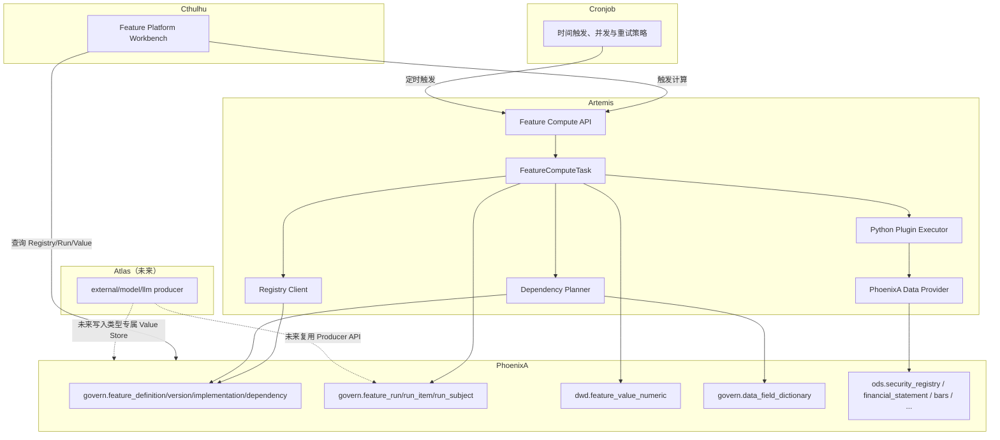
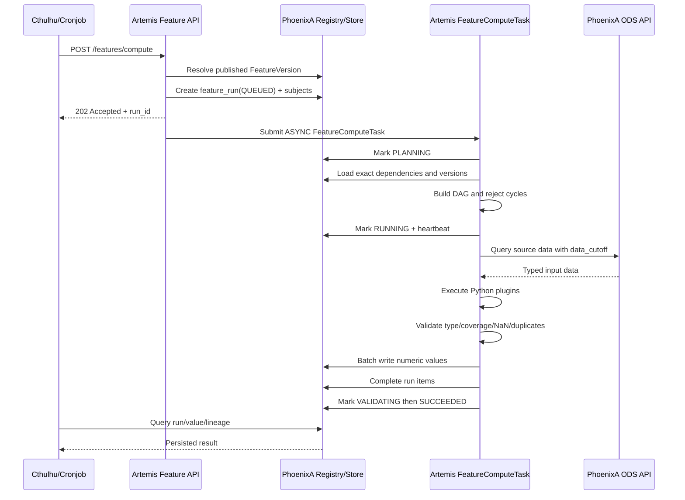
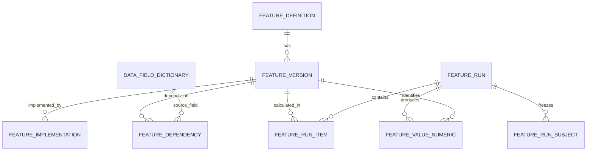
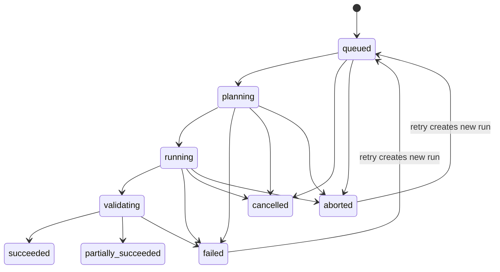

# Chaos Feature Platform 架构设计与分阶段迭代方案

> 状态：Approved，Phase 0 至 Phase 5 实现已完成（Phase 5：2026-07-18）；受信环境内财务因子开发已解锁，生产发布仍需满足认证授权、敏感配置外置、TimescaleDB 与 `warm_storage` 门禁
> 批准记录：用户于 2026-07-14 确认从 Phase 0 开始执行，并在 Phase 0 提交后启动 Phase 1
> 日期：2026-07-14
> 范围：PhoenixA、Artemis、Cthulhu、Cronjob，以及 Atlas 的未来接入预留
> 目标读者：架构设计者、后端开发、前端开发、测试人员、后续因子研究开发者
> 文档性质：系统级实施设计书；本文确认后，应作为本轮 Feature Platform 迭代的主设计依据

---

## 0. 执行摘要

本轮迭代不在现有 Factor Engine 和 Regime Engine 上继续修补，而是把它们视为未投入真实使用的实验代码，允许完整移除并重新设计。

本轮需要建设的是一个面向量化研究的 **Feature Platform（特征平台）基础设施**，它负责回答以下问题：

1. 系统中有哪些可用 Feature？
2. 每个 Feature 的业务含义、值类型、适用实体和版本是什么？
3. Feature 由什么实现，是 Python、表达式、供应商、模型还是外部服务？
4. Feature 依赖哪些 PhoenixA 数据字段或其他 Feature？
5. 某次计算使用了哪个 Feature 版本、哪个代码版本、哪个数据截止时间和哪些证券？
6. 计算结果是否持久化、是否可追溯、是否可重现？
7. Atlas、未来模型服务或其他生产者如何在不破坏平台边界的情况下接入？

本轮完成后，系统应具备：

- 统一的 Feature Definition、Version、Implementation、Dependency 模型；
- Git 管理的 Feature Manifest 和 PhoenixA 运行态注册中心；
- Artemis 中独立于旧 Factor/Regime 的 Feature 执行框架；
- 基于现有 Artemis TaskEngine 的异步执行入口；
- PhoenixA 中持久化的 Feature Run、Run Item、Subject Snapshot 和 Numeric Value；
- 可查询的版本、血缘、运行记录、数值结果和可用性状态；
- Cthulhu 中新的 Feature Platform 工作台；
- Atlas 的生产者协议和数据类型预留，但不要求 Atlas 在本轮实现任何 Feature；
- 足以支持下一阶段财务因子开发、财务因子分析和回测的基础契约。

本轮明确 **不实现** 财务因子、财务分析页面、策略、回测、DSL/AST、机器学习 Feature 或 Atlas Feature。这些能力必须在 Feature Platform 验收完成后，作为独立迭代建设。

---

## 1. 核心架构决策

### 1.1 产品定位

系统的长期定位采用：

> Chaos Feature Platform 是量化研究平台的语义、计算和物化基础设施；Factor 只是 Feature 的一种业务类型。

平台中的 Feature Kind 预留以下类型：

| Kind | 说明 | 本轮是否实现具体业务 Feature |
|---|---|---:|
| `raw` | 外部或供应商直接提供的特征；PhoenixA 已治理字段不重复注册为 raw Feature | 否 |
| `metric` | 确定性计算指标，不必包含收益预测假设 | 仅平台 Smoke Feature |
| `factor` | 用于解释或预测收益的研究特征 | 否 |
| `signal` | 由指标或因子形成的交易信号 | 否 |
| `prediction` | 统计模型、机器学习或 LLM 模型输出 | 否 |
| `label` | 对连续数据的离散分类或语义解释 | 否 |

Feature Kind 是业务语义，不决定物理存储格式。

### 1.2 “Everything is a Feature”的边界

本设计采用统一 Feature 语义，但不采用万能物理表：

- PhoenixA 行情、财务报表、公司行为、分类等原始数据继续保留在现有 ODS 表；
- `govern.data_field_dictionary` 是原始字段的权威契约，不为每个字段复制一份 FeatureDefinition；
- 派生数值型 Feature 使用 `dwd.feature_value_numeric`；
- 将来的文本、JSON、向量或分布类型使用独立的物理表或对象存储；
- Label 将来可以使用专门的有效期和人工覆盖结构，不强行与数值型值共表；
- Atlas 的文本、事件、Embedding 不在本轮落入数值表。

因此，本平台统一的是：

- 命名；
- 业务定义；
- 版本；
- 实现方式；
- 依赖关系；
- 运行上下文；
- 血缘和治理；
- 查询协议。

平台不强制所有数据采用相同的物理模型。

### 1.3 不建设通用 Entity 大表

本轮不创建统一的 `entity` 表，也不迁移公司、证券、新闻、宏观事件、组合等实体。

原因：

1. 当前真实可用的主体是 PhoenixA `ods.security_registry`；
2. Atlas 尚未真正开始迭代，没有必要提前固化新闻/事件实体模型；
3. 不同实体具有不同生命周期、唯一键和时间语义；
4. 通用 Entity 表会扩大本轮范围并带来大量无业务验证的抽象。

本轮规则：

- FeatureDefinition 中保留 `entity_type`；
- `entity_type` 当前仅允许真正执行 `security`；
- `company`、`macro`、`document`、`event`、`portfolio` 等值仅作为保留枚举或字符串空间；
- `dwd.feature_value_numeric` 当前使用明确的 `security_id`，不使用含义模糊的通用 `entity_id`；
- 将来新增其他实体时，优先增加类型专属物化表或经过评审的 EntityRef，而不是修改现有证券值语义。

### 1.4 现有 Factor/Regime 的处理

现有 Factor Engine 和 Regime Engine 不承担兼容义务：

- 不迁移内存快照；
- 不保留旧 `/factors/*`、`/regime/*` API；
- 不保留旧 FactorMeta、FactorStore、RegimeStore 作为新平台核心；
- 不把旧 YAML Factor Catalog 直接升级为新 Registry；
- 不为旧 Cthulhu Factor/Regime 页面做兼容适配；
- 旧文档保留作历史记录，但必须标记为已被本文替代。

未来需要的 PIT、TTM、标准化和财务计算逻辑，应在财务因子迭代中按照新 Feature Plugin 协议重新实现和测试，而不是在本轮搬运未使用代码。

### 1.5 Source of Truth 决策

本轮采用“Git 定义 + PhoenixA 运行投影”的 Hybrid 方案：

| 信息 | Source of Truth | 说明 |
|---|---|---|
| Derived Feature 定义 | Artemis 仓库内 YAML Manifest | 走 Git、Code Review、CI 校验 |
| 已发布版本和依赖解析结果 | PhoenixA `govern.feature_*` | 供服务查询、运行锁定和审计 |
| 原始字段契约 | PhoenixA `govern.data_field_dictionary` | 不在 Feature Manifest 中复制字段定义 |
| 实际实现代码 | Artemis Python 包或未来外部生产者 | Manifest 只保存入口和配置 |
| 运行状态 | PhoenixA `govern.feature_run*` | 可跨进程查询和恢复判断 |
| 计算结果 | PhoenixA `dwd.feature_value_numeric` | 不允许仅存在 Artemis 内存 |

PhoenixA 中已发布的 FeatureVersion 是不可变的运行契约。YAML Manifest 是作者编辑入口，Registry Sync 将它解析并投影到 PhoenixA。

### 1.6 执行技术决策

本轮不实现 DSL、Lexer、Parser、AST、Optimizer 或多后端编译。

第一种真正可执行的 Implementation Kind 是：

```text
python
```

同时在元数据中预留：

```text
expression
vendor
model
llm
external
```

非 `python` 类型在本轮可以注册为 `draft`，但不得进入可执行状态。

### 1.7 调度技术决策

- Cronjob 继续负责“何时触发”，不承载 Feature 依赖和计算逻辑；
- Artemis 负责“如何计算”；
- PhoenixA 负责“注册、运行状态和结果持久化”；
- 本轮复用 Artemis `BaseTaskUnit` 和 `TaskEngine` 的阶段生命周期；
- Feature Compute 使用独立的 `FeatureComputeTask`，通过现有 TaskEngine `ASYNC` 模式执行；
- 因为现有 ASYNC 是进程内线程，本轮必须增加持久化 Run、Heartbeat 和 Stale Run Reconciliation；
- 本轮不引入 Kafka、Celery、Ray 或新的分布式队列。

---

## 2. 当前系统基础与差距

### 2.1 可直接复用的基础

#### PhoenixA

- `ods.security_registry`：证券主体和内部 `security_id`；
- `ods.financial_statement`：资产负债表、利润表、现金流量表等财务数据；
- `ods.bars_*`：行情数据；
- `ods.corporate_action`：分红、配股等公司行为；
- `ods.taxonomy_*` 和 `dwd.taxonomy_category_derived_flags`：分类和派生语义；
- `govern.data_dataset_dictionary`；
- `govern.data_field_dictionary`；
- `govern.data_field_coverage_observation`；
- Catalog、Capabilities、字段发现和数据覆盖率 API；
- PostgreSQL 16 + TimescaleDB；
- `ods / dwd / govern / kg / public` 的现有 schema 分层。

#### Artemis

- PhoenixA HTTP Client；
- `BaseTaskUnit` 的 parameter/load/execute/post_process/sink/finalize 生命周期；
- `TaskEngine` 的 SYNC/ASYNC 执行入口和取消能力；
- Cronjob callback 集成；
- 配置系统、日志、OTEL Trace Context；
- 现有数据下载任务和 PhoenixA 数据供给。

#### Cthulhu

- Workbench 模块；
- PhoenixA、Artemis 的 HTTP Service 模式；
- 数据目录、表详情、证券选择等通用组件；
- Angular 路由和菜单元数据能力。

#### Atlas

- 当前不依赖其实现；
- 未来可作为 `producer_service=atlas` 的外部 Feature 生产者；
- 未来可输出 `prediction / label / text / vector` 类型 Feature。

### 2.2 当前关键差距

| 差距 | 影响 | 本轮处理 |
|---|---|---|
| 现有 Factor/Regime 结果仅内存保存 | 重启丢失、无法回测复现 | 完整替换为 PhoenixA 持久化 |
| Formula 只是描述字符串，计算硬编码 | 定义和实际逻辑可能漂移 | Manifest + Python entrypoint + checksum |
| 没有稳定 FeatureVersion | 历史结果无法绑定口径 | 建立不可变版本模型 |
| 没有依赖图 | 无法做血缘、环检测、影响分析 | 建立 Feature/DataField 依赖表 |
| 没有持久运行上下文 | 无法知道使用了什么数据和代码 | 建立 Run、RunItem、Subject Snapshot |
| `security_id` 注释允许重建后变化 | 历史 FeatureValue 可能串标的 | 在 Phase 0 先完成身份稳定门禁 |
| Cthulhu 是 Factor/Regime 专用页面 | 无法统一治理未来 Feature | 重建为 Feature Platform 工作台 |
| Atlas 尚无生产者协议 | 未来接入可能绕过治理 | 预留 producer-neutral 写入协议 |

---

## 3. 范围和非目标

### 3.1 本轮范围

1. 删除旧 Factor/Regime 的运行代码、API 和 UI；
2. 固化 `security_id` 的长期稳定策略；
3. 建立 Feature Manifest Schema；
4. 建立 PhoenixA Feature Registry；
5. 建立版本发布和不可变规则；
6. 建立 DataField 和 Feature 依赖关系；
7. 建立 Artemis Feature Plugin 协议；
8. 建立依赖解析、环检测和执行计划；
9. 建立 Feature Run、RunItem、Subject Snapshot；
10. 建立数值型 FeatureValue 持久化；
11. 建立计算、查询、血缘、运行、可用性 API；
12. 建立 Cthulhu Feature Platform 工作台；
13. 建立 Smoke Feature 和端到端验收；
14. 预留 Atlas/external producer 接入契约；
15. 更新 OpenAPI、系统文档和运维说明。

### 3.2 本轮非目标

- 不开发 ROE、ROA、PE、PB、质量、成长等财务因子；
- 不开发财务因子分析页面；
- 不开发选股策略；
- 不开发回测引擎或回测工作台；
- 不开发 Universe Registry；
- 不开发 DSL/AST/Operator Registry；
- 不开发 SQL/Polars/Spark/Ray 多执行后端；
- 不开发机器学习训练流水线；
- 不开发 LLM Feature；
- 不开发 Atlas 实际 Feature；
- 不开发向量 FeatureValue 表；
- 不开发通用 Entity Registry；
- 不开发实时或分钟级 Feature 流式计算；
- 不开发多租户、Feature Marketplace 或在线编辑发布功能。

---

## 4. 目标架构

### 4.1 总体组件关系



### 4.2 运行时调用序列



### 4.3 Schema 分层

| Schema | 内容 | 原因 |
|---|---|---|
| `ods` | 原始行情、财务、公司行为、证券、分类 | 保持现有数据事实层 |
| `dwd` | 派生 FeatureValue | 是从 ODS/其他 Feature 计算得到的标准派生数据 |
| `govern` | Feature 定义、版本、实现、依赖、运行、质量元数据 | 属于治理和可追溯控制面 |
| `kg` | Atlas 知识图谱数据 | 保持现有边界，本轮不变 |

不新建 `feature` schema，避免破坏现有 `ods/dwd/govern` 分层决策。

---

## 5. 服务职责边界

### 5.1 PhoenixA

PhoenixA 是 Feature Platform 的 Control Plane 和 Materialized Data Store。

负责：

- Feature Registry 持久化；
- Manifest Sync 的结构和不可变校验；
- FeatureVersion 发布；
- Feature/DataField 依赖落库；
- Lineage 查询；
- Run/RunItem/RunSubject 状态；
- Numeric Value 批量写入和查询；
- Latest Successful Materialization 解析；
- Registry、Run、Value 的 Catalog 暴露；
- 数据库层幂等、唯一约束和状态机约束。

不负责：

- 执行 Python；
- 解析业务公式；
- 调度计算时间；
- 财务因子逻辑；
- 回测和策略。

### 5.2 Artemis

Artemis 是第一代 Feature Producer 和 Compute Plane。

负责：

- Feature Manifest 维护；
- Manifest Schema 校验；
- Registry Sync Client；
- Feature Plugin 加载；
- Dependency Planner；
- DAG 环检测和拓扑排序；
- 输入数据加载；
- `data_cutoff` 约束；
- Python Feature 执行；
- 输出校验；
- 写入 PhoenixA；
- 更新 Heartbeat 和 Run 状态；
- 失败分类和可重试判断。

不负责：

- 将结果只存在进程内；
- 维护第二套运行态 Registry；
- 直接连接 PhoenixA 数据库；
- 时间调度；
- UI。

### 5.3 Cronjob

Cronjob 只负责：

- 定时调用 Artemis Feature Compute API；
- 调度级并发、重试、超时和触发记录；
- 传递外部 task/run 标识；
- 接收 Artemis TaskEngine callback。

Cronjob 不理解 Feature DAG，不解析 Feature Manifest，不写 FeatureValue。

### 5.4 Cthulhu

Cthulhu 负责：

- Registry 浏览；
- Definition/Version 详情；
- Lineage 图；
- Availability；
- Run 列表和详情；
- Numeric Value 预览；
- 手动触发 Smoke/已发布 Feature；
- 显示失败和质量信息。

本轮 Cthulhu 不提供在线编辑或发布 Feature 的能力。

### 5.5 Atlas 预留

Atlas 将来可以成为独立 Feature Producer，但本轮不得引入对 Atlas 的运行依赖。

预留规则：

- `feature_implementation.kind=external|model|llm`；
- `feature_implementation.producer_service=atlas`；
- Run API 不能写死只接受 Artemis；
- Run 保存 `producer_service` 和 `producer_run_ref`；
- Atlas 将来必须通过 PhoenixA Producer API 创建 Run、写 Value、关闭 Run；
- Atlas 不得直接写 `dwd.feature_value_*`；
- 文本/向量值将来使用独立 Value Store；
- Atlas 未接入时，不影响 Registry、Artemis 执行或 Cthulhu 使用。

---

## 6. 领域模型

### 6.1 核心对象



### 6.2 FeatureDefinition

FeatureDefinition 表达稳定的业务身份。

主要字段：

| 字段 | 说明 |
|---|---|
| `feature_code` | 全局稳定代码，不含版本 |
| `display_name` | 展示名 |
| `description` | 业务定义 |
| `kind` | metric/factor/signal/prediction/label/raw |
| `entity_type` | 当前执行只支持 security |
| `value_type` | number/integer/boolean/enum/string/json/vector/distribution |
| `unit` | ratio、percent、CNY、score 等 |
| `category` | fundamental/technical/risk/macro/alternative/ai/platform 等 |
| `owner` | 维护者或团队 |
| `status` | draft/active/deprecated/retired |
| `tags` | 业务标签，JSON array |

规则：

- `feature_code` 一经创建不可修改；
- 显示名、描述、owner、tags 可以更新；
- 改变 Kind、EntityType 或 ValueType 必须新建 FeatureCode，不能原地修改；
- FeatureCode 命名使用小写点分隔：`<domain>.<entity>.<concept>`；
- 示例：`financial.security.roe_ttm`、`market.security.return_20d`；
- 平台验收 Smoke Feature 使用 `platform.security.constant_one`。

### 6.3 FeatureVersion

FeatureVersion 表达会影响值语义的不可变版本。

必须升级版本的变化：

- 公式或算法变化；
- 依赖字段变化；
- 依赖 FeatureVersion 变化；
- PIT/data_cutoff 语义变化；
- 单位或 scale 变化；
- 缺失值处理变化；
- 标准化、去极值、行业中性化口径变化；
- Operator 语义变化；
- 模型权重或模型版本变化；
- 会导致输出值改变的实现变化。

不一定升级 FeatureVersion 的变化：

- 描述错别字；
- Owner 变化；
- UI 标签变化；
- 有严格等价性测试的性能优化。

等价性能优化必须更新 `implementation_revision` 和运行时 `code_revision`，但可以保持 FeatureVersion。

FeatureVersion 生命周期：

```text
DRAFT -> PUBLISHED -> DEPRECATED -> RETIRED
```

规则：

- 只有 PUBLISHED 可以创建新 Run；DEPRECATED/RETIRED 版本不得再计算；
- PUBLISHED 后 manifest checksum、依赖和 canonical implementation 不可修改；
- 发现错误必须发布新版本并废弃旧版本；
- 历史结果继续绑定旧版本，不级联改写；
- 未指定版本的 `latest` 只在 PUBLISHED 版本中选择有成功物化的最高版本；
- DEPRECATED/RETIRED 永远不参与 `latest`，但显式指定版本时仍可读取其历史成功结果；
- RETIRED 表示彻底停止使用；历史结果仅用于审计和复现，不作为新依赖。

### 6.4 FeatureImplementation

FeatureImplementation 描述“怎么实现”，不描述业务身份。

| 字段 | 说明 |
|---|---|
| `kind` | python/expression/vendor/model/llm/external |
| `entrypoint` | Python `module:Class` 或外部 locator |
| `producer_service` | artemis/atlas/vendor/... |
| `backend` | python、future-polars、future-sql 等 |
| `config` | 只保存非敏感参数 JSONB |
| `implementation_revision` | 等价实现修订号 |
| `checksum` | 入口配置/制品 checksum |
| `is_canonical` | 是否为当前规范实现 |
| `status` | draft/active/disabled |

本轮只有以下组合可执行：

```text
kind=python
producer_service=artemis
backend=python
status=active
```

Manifest 和数据库不得保存密码、Token、DSN 等敏感信息；只保存配置引用名。

### 6.5 FeatureDependency

Dependency 有两种类型：

#### DataField Dependency

引用 PhoenixA `govern.data_field_dictionary` 的一个确定版本字段。

Manifest 中使用自然键：

```text
source + dataset + data_type + raw_field + contract_version
```

Registry Sync 时必须解析为唯一 `data_field_dictionary_id`，并在依赖表中同时保存自然键快照。

规则：

- 不允许使用只写 `TOTAL_ASSETS` 的模糊引用；
- 不允许引用 `deprecated=true` 字段发布新版本；
- 一旦被 Published FeatureVersion 引用，旧字段契约行不得删除；
- 新字段契约使用新 `contract_version` 新增，不覆盖历史行。

#### Feature Dependency

必须绑定到确定的 `depends_on_feature_version_id`。

规则：

- Manifest 作者可以写 `feature_code@version`；
- Sync 时解析成确定版本；
- 禁止在 Published 版本中使用 `latest`；
- 发布前对完整图做环检测；
- 执行计划只使用已解析的版本 ID。

### 6.6 FeatureRun

FeatureRun 表达一次被冻结的计算请求。

关键上下文：

| 字段 | 说明 |
|---|---|
| `run_id` | UUID，跨服务使用 |
| `request_fingerprint` | 幂等指纹 |
| `producer_service` | artemis/atlas/... |
| `producer_run_ref` | Artemis/Cronjob 外部运行 ID |
| `trigger_type` | manual/cron/api/backfill |
| `as_of_time` | 本次计算的观察视点 |
| `data_cutoff_time` | 输入数据允许的最大可用时间 |
| `source_profile` | home/production 等 PhoenixA source profile |
| `market` | 当前 zh_a 等 |
| `universe_hash` | Subject Snapshot 的 SHA-256 |
| `dependency_plan_checksum` | 依赖执行计划 SHA-256；Phase 1 在 `request_payload` 和 fingerprint 中预留，Phase 2 Planner 接入后填写 |
| `code_revision` | Git commit SHA 或构建版本 |
| `status` | 状态机 |
| `heartbeat_at` | 卡死检测 |
| `retry_of_run_id` | 重试关系 |
| `error_code/error_message` | 失败摘要 |

本轮每个 Run 只允许一个 `as_of_time`。历史回填按日期拆分为多个 Run，避免一个大 Run 混合多个 PIT 上下文。

#### 6.6.1 BackfillJob

BackfillJob 是多个单日期 Run 的编排容器，不是另一种计算语义。它至少冻结：

| 字段 | 说明 |
|---|---|
| `backfill_id` | UUID |
| `root_feature_version_ids` | 精确根 FeatureVersion 集合 |
| `start_as_of/end_as_of` | 回填范围，闭区间 |
| `step` | daily/weekly/monthly/quarterly 或显式日期列表 |
| `calendar_code` | 交易日历；季度财务截面也必须明确生成规则 |
| `data_cutoff_policy` | same_as_as_of、固定 lag 或显式逐日 cutoff |
| `source_profile/market` | 所有子 Run 共用的数据上下文 |
| `universe_request` | 创建每个 RunSubject 的冻结请求模板 |
| `max_concurrency` | 子 Run 最大并发数 |
| `status/counts` | queued/running/succeeded/partially_succeeded/failed/cancelled 与进度计数 |

规则：

- 展开日期必须确定且持久化，相同 BackfillJob 重启后不得重新按“当前日历”生成；
- 每个日期创建独立 FeatureRun，并保存 `backfill_id + backfill_sequence + backfill_attempt`；
- 初始 Run 的 `backfill_attempt=1`；失败/aborted 日期重试时递增 attempt，旧 Run 和旧值保持不变；
- `(backfill_id, as_of_time, backfill_attempt)` 唯一；同一 attempt 的并发重复提交不得生成重复子 Run；
- 单个子 Run 失败不覆盖成功子 Run；Job 汇总为 partially_succeeded，并允许只 retry 失败日期；
- 取消 Job 只阻止尚未开始的子 Run；已经进入终态的 Run 和值不删除；
- BackfillJob 不允许使用 `latest` Feature 依赖，所有版本在创建时解析并冻结。
- Phase 1 尚无受治理的交易日历表，因此 `calendar_code` 只作协议预留，非空值明确返回 422；需要交易日集合时必须使用 `step=explicit` 和冻结的 `explicit_as_of_times`，不得把自然日静默解释为交易日。

### 6.7 FeatureRunItem

一个 Run 可以计算多个依赖节点，因此使用 RunItem 表达每个 FeatureVersion 的状态。

字段至少包括：

- `run_id`；
- `feature_version_id`；
- `status`；
- `started_at/finished_at`；
- `input_count/output_count/valid_count/missing_count/invalid_count`；
- `quality_summary JSONB`；
- `error_code/error_message`；
- `duration_ms`。

RunItem 状态限定为：

```text
queued -> running -> validating -> succeeded
                  \-> failed
queued/running -> skipped
```

- `skipped` 只用于上游失败导致当前节点不可执行；
- 单个 Item 进入 `failed` 后不可原地重开，Run 重试必须创建新 Run 和新 Item；
- 根节点成功但非根依赖节点失败属于实现错误，不得把整个 Run 标记为 `succeeded`；
- Run 的最终状态必须由全部 Item 的终态聚合得出，不能由调用方任意指定。

### 6.8 FeatureRunSubject

FeatureRunSubject 冻结本次实际参与计算的证券集合。

作用：

- 避免将来证券上市、退市或状态变化导致历史 Run 无法复现；
- 计算覆盖率分母明确；
- 后续回测可以引用完全相同的证券集合；
- 不需要本轮建设完整 Universe Registry。

字段：

- `run_id`；
- `security_id`；
- `symbol_snapshot`；
- `exchange_snapshot`；
- `asset_type_snapshot`；
- `included_reason` 可选。

### 6.9 FeatureValueNumeric

本轮唯一落地的值类型。

字段：

| 字段 | 说明 |
|---|---|
| `run_id` | 产生该值的 Run |
| `feature_version_id` | 精确 Feature 版本 |
| `security_id` | 当前主体 |
| `observed_at` | 值描述的时间，本轮通常等于 as_of_time |
| `value` | DOUBLE PRECISION，可为空 |
| `value_status` | valid/missing/invalid |
| `quality_flags` | 缺失原因、异常原因等 JSONB |
| `source_max_available_at` | 本值实际使用输入数据的最大可用时间；无 DataField/上游数据依赖时才可为空 |
| `computed_at` | 计算时间 |

规则：

- 缺失值不能默认填 0；
- 缺失时写 `value_status=missing` 和明确原因；
- NaN、+Inf、-Inf 不得写入，转换为 invalid 或直接使 RunItem 失败；
- `source_max_available_at` 不得晚于所属 Run 的 `data_cutoff_time`，PhoenixA 写入事务和数据库 trigger 双重拒绝越界值；
- 具有直接或传递 DataField 依赖的 Feature 必须写入 `source_max_available_at`；`constant_one` 等无外部数据依赖 Feature 才允许为空；
- 默认查询只返回 `SUCCEEDED` Run 的值；
- `PARTIALLY_SUCCEEDED` 只能在显式诊断参数下读取；
- 历史值不可原地覆盖；
- 重试通过新 Run 表达。

---

## 7. Feature Manifest 设计

### 7.1 目录结构

```text
app/projects/artemis/config/feature_catalog/
├── manifest.yaml
├── schema/
│   └── feature-manifest.schema.json
└── features/
    └── platform/
        └── constant_one.yaml
```

后续财务因子目录建议：

```text
features/
└── financial/
    ├── metrics/
    └── factors/
```

但这些目录和具体财务 Feature 不在本轮创建范围内。

### 7.2 Smoke Feature Manifest 示例

```yaml
api_version: chaos.feature/v1

feature:
  code: platform.security.constant_one
  display_name: Platform Constant One
  description: >-
    Feature Platform 端到端验收专用；对 RunSubject 中每个 security 输出 1.0。
    不用于研究、选股或回测。
  kind: metric
  entity_type: security
  value_type: number
  unit: scalar
  category: platform
  owner: platform
  tags: [smoke, internal]

version:
  number: 1
  status: published
  frequency: on_demand
  as_of_semantics: snapshot
  missing_policy: explicit_missing
  description: Initial platform smoke version

implementation:
  kind: python
  producer_service: artemis
  backend: python
  entrypoint: artemis.feature_platform.plugins.smoke.constant_one:ConstantOneFeature
  implementation_revision: 1
  config: {}
  status: active

dependencies: []

materialization:
  store: numeric
  mode: snapshot

quality:
  min_coverage_ratio: 1.0
  allow_nan: false
  allow_infinite: false
  allow_duplicates: false
```

#### 7.2.1 DataField/PIT 验收 Feature

`constant_one` 只验证控制面、执行器和存储链路。Phase 2 还必须增加测试专用的
`platform.security.datafield_pit_probe`，完整覆盖：

```text
govern.data_field_dictionary 精确解析
  -> PhoenixA financial_statement 查询
  -> ann_date/actual_ann_date 可用时间过滤
  -> source_max_available_at 聚合
  -> Numeric Value + lineage 写入
```

约束：

- 锁定 `source=amazing_data`、`dataset=financial_statement`、`data_type=income`、原始净利润字段和 `contract_version=2026-06-27`；
- 只透传或做无业务含义的数值归一化，不定义 ROE、成长率等正式财务 Feature；
- fixture 必须包含 cutoff 前、cutoff 后及修订公告三类记录，证明未来公告不会泄漏；
- cutoff 后才能获知的记录必须被过滤；输出的 `source_max_available_at` 必须等于实际入选记录的最大可用时间；
- 该 Feature 标记 `[smoke, internal, pit]`，不得用于研究、选股或回测。

### 7.3 Manifest 校验规则

CI 和 Artemis 启动时必须校验：

- `api_version` 支持；
- FeatureCode 格式；
- 枚举值；
- Version 为正整数；
- Published 版本没有 `latest` 依赖；
- Implementation Kind 可用；
- Python entrypoint 可以导入；
- DataField 自然键完整；
- 依赖没有重复；
- 数值 Store 只接受 number/integer；
- Manifest checksum 稳定；
- 不包含敏感配置字段；
- Published 版本与 PhoenixA 已有 checksum 冲突时 Sync 失败。

### 7.4 Registry Sync 行为

Sync 是幂等的：

1. 新 FeatureCode：创建 Definition 和 Version；
2. 已有 Draft 且 checksum 相同：返回 unchanged；
3. 已有 Draft 且 checksum 不同：允许更新 Draft；
4. 已有 Published 且 checksum 相同：返回 unchanged；
5. 已有 Published 且 checksum 不同：返回 409，不得覆盖；
6. 引用字段不存在或不唯一：返回 422；
7. 依赖 FeatureVersion 不存在：返回 422；
8. 完整依赖图有环：拒绝 Publish；
9. 所有失败返回结构化 error code。

---

## 8. PostgreSQL 数据模型

### 8.1 Migration 文件

按当前迁移序号，本轮建议新增：

```text
app/projects/phoenixA/migrations/postgresql/security/0008_feature_platform.sql
```

如果实施前已有新 migration，则使用当时下一个编号，不允许改写已经执行过的 migration。

### 8.2 建议 DDL 骨架

以下 DDL 是实现契约骨架。开发时可以按照 PhoenixA 现有命名和 migration helper 调整，但不得改变对象边界、唯一性和不可变规则。

```sql
CREATE TABLE govern.feature_definition (
    id              BIGSERIAL PRIMARY KEY,
    feature_code    VARCHAR(160) NOT NULL UNIQUE,
    display_name    VARCHAR(256) NOT NULL,
    description     TEXT NOT NULL DEFAULT '',
    kind            VARCHAR(32) NOT NULL,
    entity_type     VARCHAR(32) NOT NULL,
    value_type      VARCHAR(32) NOT NULL,
    unit            VARCHAR(64) NOT NULL DEFAULT '',
    category        VARCHAR(64) NOT NULL DEFAULT '',
    owner           VARCHAR(128) NOT NULL DEFAULT '',
    status          VARCHAR(32) NOT NULL DEFAULT 'draft',
    tags            JSONB NOT NULL DEFAULT '[]'::jsonb,
    created_at      TIMESTAMPTZ NOT NULL DEFAULT NOW(),
    updated_at      TIMESTAMPTZ NOT NULL DEFAULT NOW(),
    CONSTRAINT chk_feature_definition_kind
        CHECK (kind IN ('raw','metric','factor','signal','prediction','label')),
    CONSTRAINT chk_feature_definition_value_type
        CHECK (value_type IN ('number','integer','boolean','enum','string','json','vector','distribution')),
    CONSTRAINT chk_feature_definition_status
        CHECK (status IN ('draft','active','deprecated','retired'))
) TABLESPACE pg_default;

CREATE TABLE govern.feature_version (
    id                  BIGSERIAL PRIMARY KEY,
    feature_id          BIGINT NOT NULL REFERENCES govern.feature_definition(id),
    version_number      INTEGER NOT NULL,
    status              VARCHAR(32) NOT NULL DEFAULT 'draft',
    frequency           VARCHAR(32) NOT NULL DEFAULT 'on_demand',
    as_of_semantics     VARCHAR(32) NOT NULL DEFAULT 'snapshot',
    missing_policy      VARCHAR(32) NOT NULL DEFAULT 'explicit_missing',
    manifest_checksum   CHAR(64) NOT NULL,
    manifest_snapshot   JSONB NOT NULL,
    published_at        TIMESTAMPTZ,
    deprecated_at       TIMESTAMPTZ,
    created_at          TIMESTAMPTZ NOT NULL DEFAULT NOW(),
    updated_at          TIMESTAMPTZ NOT NULL DEFAULT NOW(),
    CONSTRAINT uk_feature_version UNIQUE (feature_id, version_number),
    CONSTRAINT chk_feature_version_status
        CHECK (status IN ('draft','published','deprecated','retired'))
) TABLESPACE pg_default;

CREATE TABLE govern.feature_implementation (
    id                       BIGSERIAL PRIMARY KEY,
    feature_version_id       BIGINT NOT NULL REFERENCES govern.feature_version(id),
    kind                     VARCHAR(32) NOT NULL,
    producer_service         VARCHAR(64) NOT NULL,
    backend                  VARCHAR(64) NOT NULL DEFAULT '',
    entrypoint               VARCHAR(512) NOT NULL DEFAULT '',
    implementation_revision  INTEGER NOT NULL DEFAULT 1,
    config                   JSONB NOT NULL DEFAULT '{}'::jsonb,
    checksum                 CHAR(64) NOT NULL,
    is_canonical             BOOLEAN NOT NULL DEFAULT TRUE,
    status                   VARCHAR(32) NOT NULL DEFAULT 'draft',
    created_at               TIMESTAMPTZ NOT NULL DEFAULT NOW(),
    updated_at               TIMESTAMPTZ NOT NULL DEFAULT NOW(),
    CONSTRAINT uk_feature_impl_revision
        UNIQUE (feature_version_id, producer_service, backend, implementation_revision),
    CONSTRAINT chk_feature_impl_kind
        CHECK (kind IN ('python','expression','vendor','model','llm','external')),
    CONSTRAINT chk_feature_impl_status
        CHECK (status IN ('draft','active','disabled'))
) TABLESPACE pg_default;

CREATE UNIQUE INDEX uk_feature_impl_canonical
    ON govern.feature_implementation (feature_version_id)
    WHERE is_canonical = TRUE AND status = 'active';

CREATE TABLE govern.feature_dependency (
    id                              BIGSERIAL PRIMARY KEY,
    feature_version_id              BIGINT NOT NULL REFERENCES govern.feature_version(id),
    dependency_kind                 VARCHAR(32) NOT NULL,
    depends_on_feature_version_id   BIGINT REFERENCES govern.feature_version(id),
    data_field_dictionary_id        BIGINT REFERENCES govern.data_field_dictionary(id),
    dependency_ref_snapshot         JSONB NOT NULL,
    ordinal                         INTEGER NOT NULL DEFAULT 0,
    created_at                      TIMESTAMPTZ NOT NULL DEFAULT NOW(),
    CONSTRAINT chk_feature_dependency_kind
        CHECK (dependency_kind IN ('feature','data_field')),
    CONSTRAINT chk_feature_dependency_target CHECK (
        (dependency_kind = 'feature'
         AND depends_on_feature_version_id IS NOT NULL
         AND data_field_dictionary_id IS NULL)
        OR
        (dependency_kind = 'data_field'
         AND depends_on_feature_version_id IS NULL
         AND data_field_dictionary_id IS NOT NULL)
    ),
    CONSTRAINT chk_feature_dependency_not_self
        CHECK (feature_version_id IS DISTINCT FROM depends_on_feature_version_id)
) TABLESPACE pg_default;

CREATE UNIQUE INDEX uk_feature_dependency_feature
    ON govern.feature_dependency (feature_version_id, depends_on_feature_version_id)
    WHERE dependency_kind = 'feature';

CREATE UNIQUE INDEX uk_feature_dependency_field
    ON govern.feature_dependency (feature_version_id, data_field_dictionary_id)
    WHERE dependency_kind = 'data_field';

CREATE TABLE govern.feature_backfill_job (
    backfill_id               UUID PRIMARY KEY,
    root_feature_version_ids  BIGINT[] NOT NULL,
    start_as_of               TIMESTAMPTZ NOT NULL,
    end_as_of                 TIMESTAMPTZ NOT NULL,
    step                      VARCHAR(32) NOT NULL,
    calendar_code             VARCHAR(64) NOT NULL DEFAULT '',
    expanded_as_of_times      JSONB NOT NULL,
    data_cutoff_policy        JSONB NOT NULL,
    source_profile            VARCHAR(64) NOT NULL DEFAULT 'default',
    market                    VARCHAR(32) NOT NULL DEFAULT '',
    universe_request          JSONB NOT NULL,
    max_concurrency           INTEGER NOT NULL DEFAULT 1,
    status                    VARCHAR(32) NOT NULL,
    total_count               INTEGER NOT NULL DEFAULT 0,
    succeeded_count           INTEGER NOT NULL DEFAULT 0,
    failed_count              INTEGER NOT NULL DEFAULT 0,
    created_at                TIMESTAMPTZ NOT NULL DEFAULT NOW(),
    updated_at                TIMESTAMPTZ NOT NULL DEFAULT NOW(),
    CONSTRAINT chk_feature_backfill_range CHECK (start_as_of <= end_as_of),
    CONSTRAINT chk_feature_backfill_roots CHECK (cardinality(root_feature_version_ids) > 0),
    CONSTRAINT chk_feature_backfill_concurrency CHECK (max_concurrency > 0),
    CONSTRAINT chk_feature_backfill_status CHECK (
        status IN ('queued','running','succeeded','partially_succeeded','failed','cancelled')
    )
) TABLESPACE pg_default;

CREATE TABLE govern.feature_run (
    run_id                  UUID PRIMARY KEY,
    request_fingerprint     CHAR(64) NOT NULL,
    producer_service        VARCHAR(64) NOT NULL,
    producer_run_ref        VARCHAR(128) NOT NULL DEFAULT '',
    trigger_type            VARCHAR(32) NOT NULL,
    as_of_time              TIMESTAMPTZ NOT NULL,
    data_cutoff_time        TIMESTAMPTZ NOT NULL,
    source_profile          VARCHAR(64) NOT NULL DEFAULT 'default',
    market                  VARCHAR(32) NOT NULL DEFAULT '',
    universe_hash           CHAR(64) NOT NULL,
    request_payload         JSONB NOT NULL,
    code_revision           VARCHAR(128) NOT NULL,
    status                  VARCHAR(32) NOT NULL,
    retry_of_run_id         UUID REFERENCES govern.feature_run(run_id),
    worker_id               VARCHAR(128) NOT NULL DEFAULT '',
    heartbeat_at            TIMESTAMPTZ,
    backfill_id             UUID REFERENCES govern.feature_backfill_job(backfill_id),
    backfill_sequence       INTEGER,
    backfill_attempt        INTEGER,
    started_at              TIMESTAMPTZ,
    finished_at             TIMESTAMPTZ,
    error_code              VARCHAR(64) NOT NULL DEFAULT '',
    error_message           TEXT NOT NULL DEFAULT '',
    created_at              TIMESTAMPTZ NOT NULL DEFAULT NOW(),
    updated_at              TIMESTAMPTZ NOT NULL DEFAULT NOW(),
    CONSTRAINT chk_feature_run_status CHECK (
        status IN ('queued','planning','running','validating','succeeded',
                   'partially_succeeded','failed','cancelled','aborted')
    ),
    CONSTRAINT chk_feature_run_time
        CHECK (data_cutoff_time <= as_of_time),
    CONSTRAINT chk_feature_run_retry_not_self
        CHECK (retry_of_run_id IS NULL OR retry_of_run_id <> run_id),
    CONSTRAINT chk_feature_run_backfill_fields CHECK (
        (backfill_id IS NULL AND backfill_sequence IS NULL AND backfill_attempt IS NULL)
        OR
        (backfill_id IS NOT NULL AND backfill_sequence >= 0 AND backfill_attempt > 0)
    )
) TABLESPACE pg_default;

CREATE INDEX idx_feature_run_lookup
    ON govern.feature_run (status, as_of_time DESC, created_at DESC);

CREATE INDEX idx_feature_run_fingerprint
    ON govern.feature_run (request_fingerprint, status);

CREATE UNIQUE INDEX uk_feature_run_backfill_attempt
    ON govern.feature_run (backfill_id, as_of_time, backfill_attempt)
    WHERE backfill_id IS NOT NULL;

CREATE TABLE govern.feature_run_item (
    run_id                  UUID NOT NULL REFERENCES govern.feature_run(run_id),
    feature_version_id      BIGINT NOT NULL REFERENCES govern.feature_version(id),
    status                  VARCHAR(32) NOT NULL,
    input_count             BIGINT NOT NULL DEFAULT 0,
    output_count            BIGINT NOT NULL DEFAULT 0,
    valid_count             BIGINT NOT NULL DEFAULT 0,
    missing_count           BIGINT NOT NULL DEFAULT 0,
    invalid_count           BIGINT NOT NULL DEFAULT 0,
    quality_summary         JSONB NOT NULL DEFAULT '{}'::jsonb,
    duration_ms             BIGINT NOT NULL DEFAULT 0,
    error_code              VARCHAR(64) NOT NULL DEFAULT '',
    error_message           TEXT NOT NULL DEFAULT '',
    started_at              TIMESTAMPTZ,
    finished_at             TIMESTAMPTZ,
    PRIMARY KEY (run_id, feature_version_id),
    CONSTRAINT chk_feature_run_item_status CHECK (
        status IN ('queued','running','validating','succeeded','failed','skipped')
    )
) TABLESPACE pg_default;

CREATE TABLE govern.feature_run_subject (
    run_id                  UUID NOT NULL REFERENCES govern.feature_run(run_id),
    security_id             BIGINT NOT NULL,
    symbol_snapshot         VARCHAR(32) NOT NULL DEFAULT '',
    exchange_snapshot       VARCHAR(16) NOT NULL DEFAULT '',
    asset_type_snapshot     VARCHAR(32) NOT NULL DEFAULT '',
    included_reason         VARCHAR(128) NOT NULL DEFAULT '',
    PRIMARY KEY (run_id, security_id)
) TABLESPACE pg_default;

CREATE TABLE dwd.feature_value_numeric (
    run_id                      UUID NOT NULL,
    feature_version_id          BIGINT NOT NULL,
    security_id                 BIGINT NOT NULL,
    observed_at                 TIMESTAMPTZ NOT NULL,
    value                       DOUBLE PRECISION,
    value_status                VARCHAR(16) NOT NULL,
    quality_flags               JSONB NOT NULL DEFAULT '{}'::jsonb,
    source_max_available_at     TIMESTAMPTZ,
    computed_at                 TIMESTAMPTZ NOT NULL DEFAULT NOW(),
    PRIMARY KEY (run_id, feature_version_id, security_id, observed_at),
    CONSTRAINT chk_feature_numeric_status
        CHECK (value_status IN ('valid','missing','invalid')),
    CONSTRAINT chk_feature_numeric_value
        CHECK ((value_status = 'valid' AND value IS NOT NULL)
            OR (value_status IN ('missing','invalid') AND value IS NULL))
) TABLESPACE warm_storage;

SELECT create_hypertable(
    'dwd.feature_value_numeric',
    'observed_at',
    chunk_time_interval => INTERVAL '1 month',
    if_not_exists => TRUE
);

CREATE INDEX idx_feature_numeric_series
    ON dwd.feature_value_numeric
       (feature_version_id, security_id, observed_at DESC, run_id);

CREATE INDEX idx_feature_numeric_cross_section
    ON dwd.feature_value_numeric
       (feature_version_id, observed_at DESC, run_id);

CREATE INDEX idx_feature_numeric_run
    ON dwd.feature_value_numeric (run_id, feature_version_id);

CREATE OR REPLACE FUNCTION dwd.enforce_feature_value_data_cutoff()
RETURNS trigger
LANGUAGE plpgsql
AS $$
DECLARE
    run_cutoff TIMESTAMPTZ;
BEGIN
    SELECT data_cutoff_time INTO run_cutoff
    FROM govern.feature_run
    WHERE run_id = NEW.run_id;

    IF NOT FOUND THEN
        RAISE EXCEPTION 'feature run % does not exist', NEW.run_id;
    END IF;
    IF NEW.source_max_available_at IS NOT NULL
       AND NEW.source_max_available_at > run_cutoff THEN
        RAISE EXCEPTION
            'source_max_available_at % exceeds data_cutoff_time % for run %',
            NEW.source_max_available_at, run_cutoff, NEW.run_id;
    END IF;
    RETURN NEW;
END;
$$;

-- PhoenixA Service performs one set-based validation per batch. This row-level
-- trigger is the defense-in-depth gate for any accidental direct SQL writer.
CREATE TRIGGER trg_feature_value_numeric_data_cutoff
    BEFORE INSERT OR UPDATE OF source_max_available_at, run_id
    ON dwd.feature_value_numeric
    FOR EACH ROW
    EXECUTE FUNCTION dwd.enforce_feature_value_data_cutoff();
```

### 8.3 外键策略

- `govern` 内的小型控制表使用真实外键；
- `dwd.feature_value_numeric` 到 Run/Version/Security 使用逻辑引用，由 PhoenixA Service 批量校验；
- 原因是高吞吐批量写和 TimescaleDB 运维不应被跨 schema 大量 FK 阻塞；
- 写入 API 必须确认 Run、RunItem、FeatureVersion 和 Security 均存在；
- 不允许 Artemis 或 Atlas 绕过 PhoenixA Service 直接写值表。

### 8.4 Security 身份稳定门禁

当前 `security_id` 已成为全链路内部身份，但现有注释允许 registry rebuild 后重新分配 ID。这与历史 FeatureValue 冲突。

本轮采用以下决策：

> `ods.security_registry.id` 从本轮开始必须是长期稳定、不可回收的身份。全量刷新只能使用 upsert + status/list/delist 更新，禁止 TRUNCATE 后重新生成 ID。

实施要求：

1. 删除“只在当前 rebuild cycle 稳定”的代码注释和运维假设；
2. Security 全量同步不得删除并重建 registry；
3. Natural Key `(exchange, asset_type, symbol)` 的现有 ID 必须保留；
4. 退市证券保留记录并修改状态；
5. 灾难恢复必须恢复原 ID；
6. 增加测试：重复全量 upsert 后所有 Natural Key 的 ID 不变；
7. 增加测试：下游已存在引用时禁止 destructive rebuild；
8. Feature Platform Migration 或启动健康检查应验证该策略已启用。

如果业务上必须保留 destructive rebuild，则本轮必须先单独评审并引入稳定 `security_uid`；在该评审完成前不得落 FeatureValue。默认方案不增加第二套身份。

### 8.5 数据规模和存储策略

初始财务研究预计量级示例：

```text
50 个数值 Feature × 5,500 只证券 × 20 个季度 ≈ 5,500,000 行
```

该量级适合 PostgreSQL + TimescaleDB。

控制原则：

- 不物化所有 ODS 原始字段；
- 只物化 Published 且真正需要查询/回测的派生 Feature；
- 本轮只支持 snapshot/on-demand；
- 默认按月 Timescale chunk；
- 先使用现有 warm_storage；
- 当数值表超过 100M 行或核心查询 p95 超过目标后，再评审压缩、连续聚合或 Parquet 冷存储；
- 在没有指标证据前不引入 ClickHouse。

---

## 9. API 设计

### 9.1 PhoenixA Registry API

| Method | Path | 用途 |
|---|---|---|
| `POST` | `/api/v2/features/registry/sync` | 内部批量同步 Manifest |
| `GET` | `/api/v2/features/definitions` | 条件查询 Definition |
| `GET` | `/api/v2/features/definitions/{feature_code}` | Definition + Versions |
| `GET` | `/api/v2/features/versions/{version_id}` | Version 详情 |
| `POST` | `/api/v2/features/definitions/{feature_code}/versions/{version}:publish` | 发布 Draft 版本 |
| `POST` | `/api/v2/features/definitions/{feature_code}/versions/{version}:deprecate` | 废弃版本 |
| `GET` | `/api/v2/features/lineage/{feature_code}` | 上游/下游血缘 |
| `GET` | `/api/v2/features/availability/{feature_code}` | 结构和运行可用性 |

Registry Sync Request 应包含完整 Manifest 列表和调用方 checksum，响应：

```json
{
  "created": ["platform.security.constant_one@1"],
  "updated_drafts": [],
  "unchanged": [],
  "rejected": [],
  "graph_valid": true
}
```

### 9.2 PhoenixA Producer/Run API

| Method | Path | 用途 |
|---|---|---|
| `POST` | `/api/v2/features/runs` | 创建 Run，返回 UUID |
| `POST` | `/api/v2/features/runs/{run_id}/subjects:batch` | 冻结 Subject Snapshot |
| `POST` | `/api/v2/features/runs/{run_id}/items:batch` | 初始化 RunItem |
| `PATCH` | `/api/v2/features/runs/{run_id}` | 乐观锁状态更新和 heartbeat |
| `PATCH` | `/api/v2/features/runs/{run_id}/items/{version_id}` | 更新 Item 状态和质量摘要 |
| `POST` | `/api/v2/features/runs/{run_id}/values/numeric:batch` | 批量写数值值 |
| `POST` | `/api/v2/features/runs/{run_id}:complete` | 完成并校验 Run |
| `POST` | `/api/v2/features/runs/{run_id}:fail` | 失败 Run |
| `POST` | `/api/v2/features/runs/{run_id}:cancel` | 取消 Run |
| `POST` | `/api/v2/features/backfills` | 创建并冻结 BackfillJob 与日期列表 |
| `GET` | `/api/v2/features/backfills/{backfill_id}` | 查询 Job、子 Run 和进度 |
| `POST` | `/api/v2/features/backfills/{backfill_id}:retry-failed` | 仅为失败日期创建 retry Run |
| `POST` | `/api/v2/features/backfills/{backfill_id}:cancel` | 取消未开始的子 Run |

写 API 是 producer-neutral 的，Request 必须携带 `producer_service` 或由内部服务身份注入。

### 9.3 PhoenixA Query API

| Method | Path | 用途 |
|---|---|---|
| `GET` | `/api/v2/features/runs` | 过滤查询 Run |
| `GET` | `/api/v2/features/runs/{run_id}` | Run + Items + Subject Summary |
| `GET` | `/api/v2/features/values/numeric` | 按 code/version/security/time 查询 |
| `GET` | `/api/v2/features/values/numeric/latest` | 查最新成功物化 |
| `GET` | `/api/v2/features/values/numeric/cross-section` | 某日某 Feature 全市场横截面 |

默认查询规则：

- 未指定 version 时，在存在成功物化的 PUBLISHED 版本中选择最高版本，并返回实际 version；
- DEPRECATED/RETIRED 不参与 latest；显式 version 只允许读取其历史成功结果，不允许据此创建新 Run；
- 未指定 run 时只选择最新 `succeeded` Run；
- 不默认返回 partially_succeeded；
- `security_ids` 必须严格解析，空、非数字、非正数直接 400；
- 所有分页接口返回 `items/total/limit/offset`；
- 返回 `run_id`、`feature_version_id`、`as_of_time`，不得只返回裸 value。

### 9.4 Artemis Feature API

| Method | Path | 用途 |
|---|---|---|
| `POST` | `/features/compute` | 解析请求、创建 Run、提交 TaskEngine |
| `GET` | `/features/executions/{run_id}` | 查询执行状态，可代理 PhoenixA |
| `POST` | `/features/manifests/validate` | 开发/CI 校验，不发布 |
| `POST` | `/features/registry/sync` | 运维入口，调用 PhoenixA Sync |

Compute Request：

```json
{
  "features": [
    {"code": "platform.security.constant_one", "version": 1}
  ],
  "security_ids": [1, 2, 3],
  "as_of_time": "2026-07-14T15:00:00+08:00",
  "data_cutoff_time": "2026-07-14T15:00:00+08:00",
  "market": "zh_a",
  "source_profile": "home",
  "trigger_type": "manual",
  "idempotency_key": "optional-client-key"
}
```

响应：

```json
{
  "accepted": true,
  "run_id": "5cecd0dc-5c46-4ef7-a71a-caa53b0fe8a9",
  "status": "queued",
  "request_fingerprint": "..."
}
```

### 9.5 状态更新乐观锁

Run PATCH 必须包含：

```json
{
  "expected_status": "planning",
  "new_status": "running",
  "heartbeat_at": "2026-07-14T08:00:00Z"
}
```

如果实际状态不是 expected_status，返回 409。这样可以避免重试线程覆盖已经失败、取消或完成的状态。

### 9.6 Numeric Batch 幂等

- 单批建议最多 5,000 行；
- 一个 batch 只允许同一 `run_id + feature_version_id + observed_at`；
- 主键冲突且已有值完全相同：视为幂等成功；
- 主键冲突但 value/status/flags 不同：返回 409；
- 整个 batch 在一个事务中写入；
- 写入前验证 Run 是 running/validating、Item 存在、Version 匹配、Security 属于 RunSubject；
- 每行 `source_max_available_at <= Run.data_cutoff_time`，越界返回 `DATA_CUTOFF_VIOLATION`；
- 直接或传递依赖 DataField 的 Item 不接受空 `source_max_available_at`；
- 不允许向 succeeded/failed/cancelled Run 追加值。

---

## 10. Artemis Feature 执行框架

### 10.1 包结构

```text
app/projects/artemis/artemis/feature_platform/
├── __init__.py
├── domain/
│   ├── models.py
│   ├── enums.py
│   └── errors.py
├── manifests/
│   ├── loader.py
│   ├── validator.py
│   └── checksum.py
├── registry/
│   ├── client.py
│   └── sync.py
├── planning/
│   ├── graph.py
│   ├── cycle_detector.py
│   └── execution_plan.py
├── execution/
│   ├── protocol.py
│   ├── context.py
│   ├── python_executor.py
│   ├── output_validator.py
│   └── runner.py
├── providers/
│   ├── base.py
│   └── phoenixa.py
├── storage/
│   └── phoenixa_writer.py
├── tasks/
│   └── feature_compute_task.py
└── plugins/
    └── smoke/
        └── constant_one.py
```

HTTP 层：

```text
artemis/api/http_gateway/feature_routes.py
artemis/services/feature_service.py
```

配置：

```text
FactorEngineCfg -> FeaturePlatformCfg
```

建议配置：

```yaml
engine:
  feature_platform:
    enabled: true
    manifest_root: ./config/feature_catalog
    max_parallel_features: 2
    write_batch_size: 5000
    heartbeat_interval_seconds: 15
    stale_run_timeout_seconds: 300
    plugin_timeout_seconds: 1800
```

### 10.2 Plugin 协议

```python
from typing import Protocol


class FeaturePlugin(Protocol):
    def validate(self, definition, version, implementation) -> None:
        ...

    def load_inputs(self, ctx, provider, dependencies):
        ...

    def compute(self, ctx, inputs):
        ...

    def validate_output(self, ctx, output):
        ...
```

标准输出必须转换为：

```python
FeatureNumericOutput(
    feature_version_id=123,
    observed_at=ctx.as_of_time,
    rows=[
        NumericValue(
            security_id=1,
            value=1.0,
            value_status="valid",
            quality_flags={},
            source_max_available_at=None,
        )
    ],
)
```

Plugin 不得：

- 直接写 PhoenixA 数据库；
- 修改 Registry；
- 自己选择“最新版本”；
- 读取 `data_cutoff` 之后的数据；
- 把缺失值静默填 0；
- 返回未在 RunSubject 中的 security_id；
- 在 Manifest 外隐式添加依赖。

### 10.3 Execution Plan

Planner 输入：

- Root FeatureVersion IDs；
- 完整 Registry dependencies；
- 本轮支持的 Implementation Kind；
- materialization 状态。

Planner 输出：

```text
ExecutionPlan
  root_versions
  ordered_nodes
  data_field_dependencies
  feature_dependencies
  unsupported_nodes
  plan_checksum
```

规则：

- 使用 Kahn 或 DFS 算法检测环；
- 发现环必须在 planning 阶段失败；
- 同一依赖节点只执行一次；
- Published 版本不得运行时重新解析 latest；
- P0/P1 不复用历史 FeatureValue 做依赖缓存，先保证正确性；
- 后续可增加 materialization reuse，但必须校验 version/as_of/cutoff/universe。

### 10.4 FeatureComputeTask 阶段映射

复用 `BaseTaskUnit`：

| BaseTaskUnit 阶段 | Feature 行为 |
|---|---|
| `parameter_check` | 校验 run_id、版本、时间、source、security_ids |
| `load_dynamic_parameters` | 从 PhoenixA 获取 Definition/Version/Subjects |
| `before_execute` | 更新 PLANNING、构建计划、创建 RunItems |
| `execute` | 更新 RUNNING、逐节点执行、更新 heartbeat |
| `post_process` | 输出类型、覆盖率、重复、NaN/Inf 校验 |
| `sink` | 批量写 Numeric Values 和 Item Summary |
| `finalize` | 更新 VALIDATING，完成 Run 或标记失败 |

TaskCode：

```text
feature_platform_compute
```

### 10.5 Run 状态机



状态终态：

```text
succeeded / partially_succeeded / failed / cancelled / aborted
```

终态不可重新打开。重试创建新 Run，并设置 `retry_of_run_id`。

### 10.6 Request Fingerprint

Fingerprint 对以下 canonical JSON 做 SHA-256：

- root feature version IDs；
- dependency plan checksum；
- sorted security IDs 或 universe_hash；
- as_of_time；
- data_cutoff_time；
- source_profile；
- market；
- parameters；
- code_revision。

规则：

- 相同 fingerprint 存在 queued/planning/running/succeeded Run 时，默认返回已有 Run；
- failed/aborted 可以创建新 attempt；
- `force=true` 只允许创建 retry Run，不覆盖旧 Run；
- Cronjob 的 task_run_id 不是幂等主键，只作为 producer_run_ref。

### 10.7 Heartbeat 和进程重启

现有 TaskEngine ASYNC 使用进程内 daemon thread，因此需要：

1. Running Task 每 15 秒更新 `heartbeat_at`；
2. Artemis 启动时执行 stale-run reconciliation；
3. `status in (planning,running,validating)` 且 heartbeat 超过阈值的 Run 标记 `aborted`；
4. 已写值保留，但因为 Run 非 succeeded，默认查询不可见；
5. Cronjob 或人工可以提交 retry；
6. 本轮不实现断点续跑；
7. Sink 采用幂等 batch，降低失败重试成本。

### 10.8 失败分类

建议 error code：

```text
FEATURE_NOT_FOUND
FEATURE_VERSION_NOT_PUBLISHED
MANIFEST_CHECKSUM_CONFLICT
DEPENDENCY_NOT_FOUND
DEPENDENCY_CYCLE
UNSUPPORTED_IMPLEMENTATION
PLUGIN_IMPORT_FAILED
INVALID_SUBJECT
SOURCE_UNAVAILABLE
DATA_CUTOFF_VIOLATION
INPUT_SCHEMA_INVALID
OUTPUT_SCHEMA_INVALID
OUTPUT_DUPLICATE_SUBJECT
OUTPUT_OUTSIDE_UNIVERSE
OUTPUT_NAN_OR_INFINITE
QUALITY_GATE_FAILED
VALUE_WRITE_CONFLICT
RUN_STATE_CONFLICT
PLUGIN_TIMEOUT
RUN_ABORTED_STALE
INTERNAL_ERROR
```

错误信息必须包含 `run_id`、`feature_version_id` 和可定位上下文，但不得包含凭证或完整敏感 payload。

---

## 11. 时间、PIT 和可复现语义

### 11.1 四个时间概念

| 时间 | 含义 |
|---|---|
| `observed_at` | FeatureValue 描述的时间 |
| `as_of_time` | 本次研究站在什么时间点观察 |
| `data_cutoff_time` | 允许使用的最大信息可用时间 |
| `computed_at` | 系统实际计算时间 |

第一阶段规则：

- 一个 Run 只有一个 as_of_time；
- observed_at 默认等于 as_of_time；
- data_cutoff_time 必须小于等于 as_of_time；
- 任何 provider 返回数据必须能证明可用时间不晚于 cutoff；
- Numeric Value 写入时再次强制 `source_max_available_at <= data_cutoff_time`，不能只相信 Plugin 自报；
- 财务数据未来应使用 `ann_date/actual_ann_date` 作为可用时间；
- 报告期不是信息可用时间；
- 回测不得用 reporting_period 替代 ann_date 做 PIT。

示例：系统在 2026-08-15 执行一个“站在 2026-08-01 收盘后观察”的截面计算：

```text
as_of_time       = 2026-08-01T15:00:00+08:00
observed_at      = 2026-08-01T15:00:00+08:00
data_cutoff_time = 2026-08-01T15:00:00+08:00
computed_at      = 2026-08-15T10:20:00+08:00
```

8 月 10 日才公告的财务记录即使在计算当天已经存在，也不得进入该值；`computed_at` 只表示何时执行，不改变观察视点。

### 11.2 Code Revision

每个 Run 必须保存：

- Git commit SHA；或
- 构建镜像/tag 的不可变版本；
- Manifest checksum；
- Implementation checksum；
- Execution Plan checksum。

本地 dirty worktree 的计算：

- 开发环境允许；
- `code_revision` 必须加 `-dirty`；
- 不得作为 Published/Production materialization；
- Cthulhu 明显标记为非可复现实验结果。

### 11.3 DataField Contract Version

财务字段依赖必须锁定 `contract_version`。

禁止：

```text
financial_statement.income.NET_PRO_EXCL_MIN_INT_INC
```

允许：

```text
source=amazing_data
dataset=financial_statement
data_type=income
raw_field=NET_PRO_EXCL_MIN_INT_INC
contract_version=2026-06-27
```

将来字段 canonicalization 改变时，通过新 contract_version 和新 FeatureVersion 演进。

---

## 12. Lineage 与 Availability

### 12.1 Lineage 图节点

节点类型：

- FeatureDefinition；
- FeatureVersion；
- DataField；
- Implementation；
- Run；
- Materialization。

首版 API 重点返回 Definition/Version 上游和下游：

```text
DataField -> FeatureVersion -> FeatureVersion -> Materialization
```

不把 PostgreSQL Table 本身当作 Feature，但 DataField 响应可以携带 storage table、source、dataset 和 data_type。

### 12.2 Availability 维度

Feature 可用性不能压成单一布尔值。

返回维度：

| 维度 | 状态 |
|---|---|
| `definition_status` | valid/invalid |
| `version_status` | draft/published/deprecated/retired |
| `dependency_status` | ready/missing/cycle/unknown |
| `data_status` | ready/partial/missing/unknown |
| `implementation_status` | loadable/unloadable/unsupported/disabled |
| `materialization_status` | never/succeeded/stale/failed/running |
| `execution_readiness` | ready/not_ready/unknown |

`execution_readiness=ready` 的必要条件：

- Version Published；
- 图无环；
- 所有依赖可解析；
- Implementation 为本轮支持的 active Python；
- 所需 DataField 在目标 source profile 中可用；
- EntityType 为 security；
- ValueType 为 number/integer。

### 12.3 数据可用性复用

Feature Availability 应复用 PhoenixA Catalog/Capabilities 和 Field Coverage，不重新在 Artemis 写第二套表扫描逻辑。

Artemis 只负责：

- 将依赖字段集合传给 PhoenixA；
- 展示解析结果；
- 运行前 fail closed。

---

## 13. Cthulhu Feature Platform 工作台

### 13.1 路由

删除：

```text
/workbench/factors
/workbench/regime
```

新增：

```text
/workbench/features
/workbench/features/registry
/workbench/features/definitions/:featureCode
/workbench/features/lineage/:featureCode
/workbench/features/runs
/workbench/features/runs/:runId
/workbench/features/values
```

Workbench 默认仍可保留 `market-data`，Feature Platform 作为独立菜单项。

### 13.2 页面组成

#### Registry

- FeatureCode；
- 名称；
- Kind；
- EntityType；
- ValueType；
- Category；
- 最新 Published Version；
- Owner；
- Availability；
- 最近成功运行时间。

#### Definition Detail

- 业务描述；
- 所有版本及生命周期；
- Manifest checksum；
- Implementation；
- 依赖字段；
- 依赖 Feature；
- 质量门禁；
- 最近 Run。

#### Lineage

- 上游 DataField；
- 上游 FeatureVersion；
- 下游 FeatureVersion；
- 节点状态；
- 点击跳转 Definition 或 Field Dictionary。

#### Runs

- Run ID；
- Root Features；
- as_of/cutoff；
- source profile；
- subject count；
- status；
- producer；
- code revision；
- duration；
- error summary。

#### Run Detail

- 状态时间线；
- RunItems；
- 每项 input/output/valid/missing/invalid；
- quality summary；
- Subject Snapshot 摘要；
- 错误；
- 重试关系；
- Numeric Value 样本。

#### Values

- FeatureCode + Version；
- Run/Latest Successful；
- Security 搜索；
- 时间范围；
- 横截面预览；
- value status/quality flags；
- CSV 导出不在本轮必需范围。

### 13.3 前端状态原则

- URL 包含 featureCode/runId，支持刷新；
- source profile 明确显示；
- 不把 unknown 显示成 missing；
- 不把 partial Run 当成功；
- 不隐藏实际 Version 和 Run ID；
- dirty build 或 deprecated version 明显提示；
- API 400/409/422 使用后端结构化 error code 展示。

---

## 14. 旧 Factor/Regime 移除计划

### 14.1 Artemis 删除范围

删除或替换：

```text
artemis/engines/factor_engine/
artemis/engines/regime_engine/
artemis/services/factor_service.py
artemis/services/regime_service.py
artemis/api/http_gateway/factor_routes.py
artemis/api/http_gateway/regime_routes.py
config/factor_catalog/
scripts/check_factor_availability.py
tests/test_factor_engine.py
tests/test_factor_availability.py
tests/test_phoenixa_factor_provider.py
tests/test_regime_engine.py
```

同时：

- 从 `api/http_gateway/routes.py` 移除两个 router；
- 删除 `FactorEngineCfg`，新增 `FeaturePlatformCfg`；
- 搜索并清理 factor/regime import；
- 不迁移旧 in-memory store；
- 不迁移旧 Factor Catalog；
- 不在同一提交中实现财务 Feature。

### 14.2 Cthulhu 删除范围

删除或替换：

```text
workbench/ui/factor-engine.copy.ts
workbench/services/factor.service.ts
workbench/services/regime.service.ts
workbench/pages/factor-engine.page.ts
workbench/pages/regime-engine.page.ts
workbench/models/factor.models.ts
workbench/models/regime.models.ts
```

并从 `workbench.routes.ts` 删除 Factor/Regime route，随后新增 Feature Platform route。

### 14.3 PhoenixA 清理范围

PhoenixA 当前没有真正的 Factor 持久 API，因此主要清理：

- Catalog 中 `factor_`、`factor_metadata` 的规划占位；
- 过时的 factor domain API 示例；
- 测试中的 factor placeholder；
- 旧文档引用。

新 Feature Platform 落地后重新以 `feature` domain 注册真实表和 API。

### 14.4 旧文档处理

旧 Factor/Regime 文档不删除历史内容，但在文档顶部增加：

```text
Status: Superseded by
docs/system_design/2026-07-14 FEATURE_PLATFORM_ARCHITECTURE_AND_ITERATION_PLAN.md
```

不得继续把旧文档作为新开发验收依据。

---

## 15. 分阶段实施计划

各阶段必须独立可验收。禁止在 Phase 0 尚未完成时直接开发财务因子。

### Phase 0：清场、门禁和 ADR

> 执行状态：Completed（2026-07-14）。验收证据见 `docs/system_design/2026-07-14 FEATURE_PLATFORM_PHASE_0_EXECUTION_REPORT.md`。

目标：消除旧模型干扰，建立新平台实施前提。

任务：

| ID | 任务 | 产出 |
|---|---|---|
| FP-0.1 | 评审本文并记录最终 ADR | Approved 设计决策 |
| FP-0.2 | 删除 Artemis 旧 Factor/Regime runtime/API/tests | 无旧路由和内存引擎 |
| FP-0.3 | 删除 Cthulhu 旧 Factor/Regime 页面 | Workbench 无旧入口 |
| FP-0.4 | 清理 PhoenixA factor placeholder | Catalog 无虚假能力 |
| FP-0.5 | 落实 security_id 长期稳定策略 | Upsert/rebuild 测试 |
| FP-0.6 | 标记旧文档 Superseded | 文档入口统一 |
| FP-0.7 | 建立各服务基线测试结果 | Go/Python/Angular 均通过 |

验收：

- `/factors/*` 和 `/regime/*` 不存在；
- 前端无 Factor/Regime 菜单；
- Artemis 启动无相关 import；
- Security 全量重复导入 ID 不变；
- 现有非 Factor/Regime 功能测试通过；
- 没有引入任何财务 Feature。

### Phase 1：PhoenixA Registry 与数据库控制面

目标：建立可持久、可查询、可版本化的 Feature 控制面。

任务：

| ID | 任务 | 产出 |
|---|---|---|
| FP-1.1 | 新增 `0008_feature_platform.sql` | govern/dwd 表、索引、hypertable |
| FP-1.2 | 新增 Go models | Definition/Version/Implementation/Dependency/Run/Value |
| FP-1.3 | 新增 Registry DAO/Service | Sync、Publish、查询 |
| FP-1.4 | 新增依赖解析和图校验 Service | 精确字段/版本解析、环检测 |
| FP-1.5 | 新增 Run/Value DAO/Service | 状态机、批量幂等写 |
| FP-1.6 | 新增 Controllers/Routes | `/api/v2/features/*` |
| FP-1.7 | Catalog 集成 | feature domain 显示真实表/API |
| FP-1.8 | Go 单元和 DB 集成测试 | 不可变、状态、幂等、查询覆盖 |
| FP-1.9 | Backfill 控制面 | Job、冻结日期、子 Run 唯一性、失败日期重试 |

执行状态：FP-1.1 至 FP-1.9 已完成。实现、接口、测试证据、部署前置条件和 Phase 2 交接约束见 [Phase 1 执行报告](./2026-07-14%20FEATURE_PLATFORM_PHASE_1_EXECUTION_REPORT.md)。

验收：

- 可通过 API 创建 Draft Definition/Version；
- Published 相同 checksum 幂等；
- Published 不同 checksum 返回 409；
- 未知字段依赖返回 422；
- Feature 依赖环发布失败；
- 可创建 Run、Subjects、Items；
- 可批量写 numeric values；
- 非 succeeded Run 默认不可作为 latest；
- latest 排除 deprecated/retired，显式版本仍可回溯历史成功结果；
- 越过 Run cutoff 的 Numeric Value 在 Service 和数据库 trigger 两层被拒绝；
- BackfillJob 重复展开不产生重复子 Run，失败日期可单独 retry；
- PhoenixA 重启后数据存在。

### Phase 2：Artemis Manifest 与执行面

目标：构建不依赖旧 Factor/Regime 的可执行 Python Feature 框架。

任务：

| ID | 任务 | 产出 |
|---|---|---|
| FP-2.1 | Feature Manifest JSON Schema/Pydantic Model | 本地和 CI 校验 |
| FP-2.2 | Manifest loader/checksum | canonical checksum |
| FP-2.3 | PhoenixA Registry Client | sync/resolve/run/value API |
| FP-2.4 | Dependency Planner | DAG、cycle、topological order |
| FP-2.5 | FeaturePlugin Protocol | 明确输入输出和限制 |
| FP-2.6 | Python Executor | 动态加载、超时、异常映射 |
| FP-2.7 | Output Validator | universe/type/NaN/coverage/duplicate |
| FP-2.8 | FeatureComputeTask | BaseTaskUnit 集成 |
| FP-2.9 | Feature API | `/features/compute` 等 |
| FP-2.10 | Control-plane Smoke Feature | constant_one |
| FP-2.11 | DataField/PIT Smoke Feature | datafield_pit_probe + 财务 fixture，不实现业务因子 |
| FP-2.12 | Python 测试 | manifest/planner/executor/task/provider/PIT |

验收：

- Smoke Manifest 可 Sync 并 Published；
- 选择 10 个 security_id 可提交 ASYNC Run；
- Run 状态完整变化；
- 每个 Subject 得到 1.0；
- DataField/PIT Probe 能过滤 cutoff 后公告并记录精确 source_max_available_at；
- 结果持久化到 PhoenixA；
- Artemis 重启后仍可查询结果；
- 重复请求返回相同 active/succeeded Run；
- force/retry 创建新 Run，不覆盖旧值。

### Phase 3：Lineage、Availability、恢复和质量闭环

目标：使平台达到可运维、可解释状态。

任务：

| ID | 任务 | 产出 |
|---|---|---|
| FP-3.1 | Lineage 查询 | upstream/downstream API |
| FP-3.2 | Availability 聚合 | 多维状态 |
| FP-3.3 | Heartbeat | 运行中更新 |
| FP-3.4 | Stale Run Reconciliation | 重启后 aborted |
| FP-3.5 | Quality Summary | coverage/missing/invalid |
| FP-3.6 | Structured Metrics/Logs | run/item/plugin 观测 |
| FP-3.7 | Latest Materialization 查询 | succeeded-only 规则 |
| FP-3.8 | 故障注入测试 | 数据源失败、写入失败、超时、冲突 |

验收：

- 任意 FeatureVersion 可查询完整上游；
- unknown/missing/partial 区分正确；
- 杀掉 Artemis 后 stale Run 自动标记 aborted；
- aborted 值默认不可见；
- Retry 可成功并成为 latest；
- 每个 RunItem 有质量摘要和结构化错误。

### Phase 4：Cthulhu Feature Platform 工作台

目标：用户可以理解和操作平台，而不是直接调用 API。

任务：

| ID | 任务 | 产出 |
|---|---|---|
| FP-4.1 | Feature Platform models/services | PhoenixA + Artemis Client |
| FP-4.2 | Registry 页面 | 定义列表和过滤 |
| FP-4.3 | Definition Detail | Version/Implementation/Dependency |
| FP-4.4 | Lineage 页面 | 图和节点跳转 |
| FP-4.5 | Runs 页面 | 列表、状态和错误 |
| FP-4.6 | Run Detail | Items、质量、Subjects、Values |
| FP-4.7 | Values 页面 | Series/Cross-section Preview |
| FP-4.8 | Manual Compute | Smoke/Published Feature 触发 |
| FP-4.9 | Angular tests/build | 状态和错误分支 |

执行状态：FP-4.1 至 FP-4.9 已完成（2026-07-18）。Cthulhu 已提供 `/workbench/features` 下的 Registry、Definition Detail、Lineage、Runs、Run Detail、Values 和 Manual Compute 工作台；远端 `development-home` 构建、10 个 Feature Platform 定向测试及 1 个布局回归测试通过，并完成桌面与 390px 页面渲染检查。当前 4200 页面运行正常，但 8085 上的 PhoenixA 仍是未加载新 `/api/v2/features/*` 路由的旧进程，因此真实服务联调和 Sync -> Compute -> Persist -> Query 在线 E2E 归入 Phase 5，在启动当前 PhoenixA/Artemis 版本后执行。

验收：

- 页面不依赖旧 Factor/Regime 模型；
- 可从 Definition 跳转 Lineage、Run 和 Value；
- 可清楚看到 source profile、version、run_id、as_of、cutoff；
- partial/unknown/deprecated/dirty 状态不被隐藏；
- 刷新 URL 后页面仍可恢复；
- 前端 build 和测试通过。

### Phase 5：平台总验收与文档交付

目标：宣布 Feature Platform 基础能力完成，为财务因子迭代解锁。

任务：

| ID | 任务 | 产出 |
|---|---|---|
| FP-5.1 | E2E 验收脚本 | Sync -> Compute -> Persist -> Query |
| FP-5.2 | OpenAPI | PhoenixA/Artemis 新接口 |
| FP-5.3 | 运维手册 | Sync、触发、重试、清理、诊断 |
| FP-5.4 | 开发者指南 | 如何新增 FeaturePlugin |
| FP-5.5 | 数据容量和查询压测 | 当前硬件基线 |
| FP-5.6 | 安全检查 | 内部写接口、敏感配置、审计 |
| FP-5.7 | Architecture Review | 与本文逐项核对 |

执行状态：FP-5.1 至 FP-5.7 已完成（2026-07-18）。远端 managed acceptance 使用当前工作树在隔离的 PhoenixA 18085 和 Artemis 18084 上完成双次 Registry Sync、V1/V2 各 10 个证券的计算与版本共存、DataField PIT probe、`DATA_CUTOFF_VIOLATION` 负例、Published Manifest 不可变、幂等复用，以及 PhoenixA/Artemis 双重启后的 Run/Value 恢复；1000 请求、16 并发的只读容量基线为 1000/1000 成功、637.525 req/s、整体 p95 63.731 ms。PhoenixA 全量 Go test/vet 和 20 个 Artemis Feature Platform 定向测试通过，OpenAPI 与 37 条纳入范围的真实路由一致。运维手册、FeaturePlugin 开发指南和 Phase 5 验收报告见 2026-07-18 对应文档。

安全边界：本轮完成安全审查但不等于 production ready。Feature 写接口仍需服务身份认证授权，Artemis CORS 需收敛，home/dev 明文凭证需迁移到 secret manager，TimescaleDB、`warm_storage`、备份恢复和保留策略需完成生产演练。以上不阻断受信开发网络内启动财务因子独立迭代，但阻断公网或不受信生产发布。

总验收 Gate：

- Phase 0~4 所有验收通过；
- 无旧 Factor/Regime 运行入口；
- Run/Value 跨重启持久；
- FeatureVersion 可复现；
- Lineage、Availability、Quality 可查询；
- 失败和重试行为明确；
- Smoke E2E 可重复运行；
- 文档、API、实现一致；
- 才允许开始财务因子项目。

---

## 16. 测试策略

### 16.1 PhoenixA 单元测试

- Definition 创建和 FeatureCode 唯一；
- Draft 可更新；
- Published 不可变；
- Version 单调递增；
- DataField 精确解析；
- Deprecated 字段拒绝新发布；
- Feature 依赖解析；
- 环检测；
- Run 状态合法/非法转换；
- expected_status 冲突；
- Subject 重复和非法 security_id；
- Numeric batch 幂等；
- Numeric batch 冲突；
- 非 active Run 拒绝写入；
- Latest 只选择 succeeded；
- Latest 排除 deprecated/retired，显式版本历史查询不受影响；
- source_max_available_at 晚于 cutoff 时拒绝；
- 有 DataField 依赖但 source_max_available_at 为空时拒绝；
- Backfill 日期冻结、子 Run 去重、失败日期 retry；
- partial/failed/aborted 默认隐藏。

### 16.2 Artemis 单元测试

- Manifest schema；
- canonical checksum；
- entrypoint import；
- dependency plan；
- cycle；
- stable topological order；
- request fingerprint；
- plugin timeout；
- duplicate subject；
- output outside universe；
- NaN/Inf；
- missing 不填 0；
- batch retry；
- PhoenixA error mapping；
- DataField contract 精确解析；
- 公告可用时间 cutoff 前后 fixture；
- source_max_available_at 聚合与必填；
- FeatureComputeTask 各阶段失败。

### 16.3 集成测试

- PhoenixA migration 从空库执行；
- Registry Sync 幂等执行两次；
- Artemis -> PhoenixA 完整 Run；
- PhoenixA 重启后 Run/Value 可查；
- Artemis 中途退出后的 stale reconciliation；
- 同 fingerprint 并发提交；
- 失败 Run retry；
- 多 source profile 不串数据；
- Security ID 重复全量同步不变化。
- PostgreSQL trigger 拒绝 source_max_available_at 越过 Run cutoff；
- BackfillJob 多日期展开、部分失败和 retry-failed。

### 16.4 Cthulhu 测试

- Registry loading/error/empty；
- Version 选择；
- Lineage 节点跳转；
- Run 状态刷新；
- unknown 与 missing 展示；
- partial Run 提示；
- security search；
- manual compute validation；
- 409/422 结构化错误；
- route refresh。

### 16.5 E2E 验收场景

标准场景：

1. 同步 `platform.security.constant_one@1`；
2. 再同步一次，结果 unchanged；
3. 查询 Definition/Version/Implementation；
4. 选择 10 个有效 security_id；
5. 提交 Run；
6. 检查 queued -> planning -> running -> validating -> succeeded；
7. 检查 10 个 Subject；
8. 检查 10 个 value=1.0；
9. 重启 Artemis；
10. 查询 Run 和 Value 不丢失；
11. 相同请求返回已有 succeeded Run；
12. 发布 Smoke V2（例如输出 2.0）；
13. V1/V2 值并存，默认 latest 返回 V2；
14. 指定 V1 仍可读取 V1；
15. 修改 V1 Published Manifest，Sync 返回 409。

DataField/PIT 扩展场景：

1. 同步并发布 `platform.security.datafield_pit_probe@1`；
2. fixture 同时写入 cutoff 前公告、cutoff 后公告和修订公告；
3. 以早于后两者可用时间的 cutoff 运行，确认未来记录未进入输入；
4. 检查 lineage 锁定 `contract_version=2026-06-27`；
5. 检查每个输出的 `source_max_available_at` 等于实际使用记录最大可用时间；
6. 人工构造 `source_max_available_at > data_cutoff_time` 的写请求，PhoenixA 返回 `DATA_CUTOFF_VIOLATION`。

---

## 17. 可观测性和运维

### 17.1 结构化日志字段

每条 Feature 关键日志包含：

```text
event
run_id
feature_code
feature_version_id
producer_service
source_profile
as_of_time
data_cutoff_time
phase
status
duration_ms
error_code
trace_id
```

### 17.2 指标

建议指标：

```text
feature_runs_total{status,producer}
feature_run_duration_seconds{feature_code,status}
feature_run_items_total{status}
feature_values_written_total{feature_code,status}
feature_value_write_batch_seconds
feature_output_coverage_ratio{feature_code}
feature_output_missing_total{feature_code,reason}
feature_plugin_errors_total{feature_code,error_code}
feature_stale_runs_total
feature_registry_sync_total{result}
```

### 17.3 运维动作

需要提供明确命令或 API 流程：

- Validate manifests；
- Sync registry；
- 查询 unavailable Feature；
- 手工触发 Smoke；
- 查询 stuck Run；
- 标记 stale Run；
- Retry Run；
- 查询 latest successful；
- 检查表容量和 Timescale chunks；
- 废弃 FeatureVersion；
- 禁用 Implementation。

### 17.4 数据清理

本轮默认不自动删除 FeatureValue。

将来清理规则必须按 Run 进行：

- 先确保 Run 非 succeeded 或已明确归档；
- 删除 Value；
- 再删除 RunSubject/RunItem/Run；
- Published FeatureVersion 和历史成功 Run 不允许随意删除；
- 不允许只删部分证券值而保留成功标记。

---

## 18. 风险与控制措施

| 风险 | 后果 | 控制措施 |
|---|---|---|
| 抽象过度 | 平台很大但没有业务产出 | 本轮只支持 security + numeric + Python |
| 复制 DataField 定义 | 字段契约漂移 | 依赖直接引用 field dictionary |
| security_id 重建变化 | 历史值串标的 | Phase 0 稳定身份门禁 |
| Published 版本被覆盖 | 回测不可复现 | checksum + DB 不可变 + 409 |
| Async 线程进程退出 | Run 卡住 | heartbeat + aborted + retry |
| 缺失值填 0 | 财务研究错误 | explicit missing + quality flags |
| partial 被当成功 | 下游使用不完整数据 | latest 默认 succeeded-only |
| Atlas 直接写数据库 | 绕过治理 | producer-neutral API，禁止直写 |
| 长表膨胀 | 存储和查询下降 | 只物化需要的 Feature、Timescale、容量门槛 |
| 本轮偷渡财务因子 | 平台与业务逻辑纠缠 | Scope Gate 和独立后续项目 |
| 同时建设 DSL/AST | 工期失控 | 本轮 Python-only |
| Registry 和代码不一致 | 错误实现被执行 | manifest/implementation/code checksum 全记录 |

---

## 19. 平台完成后的财务因子迭代入口

### 19.1 后续项目定位

Feature Platform 完成后，下一项建议是：

> Financial Feature Pack V1：基于 PhoenixA 财务三张表的基础财务指标与因子研究。

该项目是本文的下游消费者，不属于本文实施范围。

### 19.2 为什么从财务因子开始

当前系统已经具备：

- 资产负债表；
- 利润表；
- 现金流量表；
- 字段字典；
- 报告期和公告日期；
- Security 主数据；
- 财务 API；
- 字段覆盖率。

这些数据适合验证 Feature Platform 最重要的能力：

- DataField dependency；
- Contract version；
- PIT；
- TTM；
- 多期历史；
- 缺失值；
- 行业口径；
- FeatureVersion；
- 历史回填；
- 后续回测锁定。

### 19.3 推荐的后续分层

财务项目不要直接从“复合因子分数”开始，建议：

```text
DataField
  -> Fundamental Metric
  -> Normalized Metric
  -> Financial Factor
  -> Signal/Screen
  -> Backtest
```

示例仅用于说明未来关系，不在本轮实现：

```text
income.NET_PRO_EXCL_MIN_INT_INC
balance_sheet.TOT_SHARE_EQUITY_EXCL_MIN_INT
        ↓
net_income_ttm
average_equity
        ↓
roe_ttm
        ↓
roe_winsorized / roe_industry_zscore
        ↓
quality_factor
        ↓
quality_screen
        ↓
backtest
```

### 19.4 开始财务因子前的 Gate

必须同时满足：

- Feature Platform Phase 0~5 全部通过；
- 财务字段字典相关 contract_version 不可变；
- `ann_date`/PIT 语义明确；
- Feature Run 可以固定 data_cutoff；
- Numeric Value 可以按版本/日期/证券查询；
- Cthulhu 可以查询 Definition、Lineage、Run 和 Value；
- Security ID 稳定；
- Smoke E2E 稳定。

### 19.5 财务因子项目后续文档建议

在平台验收后单独创建：

```text
docs/system_design/YYYY-MM-DD FINANCIAL_FEATURE_PACK_V1_DESIGN.md
```

该文档再详细定义：

- 第一批 Metric/Factor 清单；
- 每个 DataField contract；
- PIT/TTM 算法；
- 行业适用范围；
- 标准化口径；
- 质量规则；
- 回填范围；
- 分析和回测方案。

---

## 20. 代码变更地图

### 20.1 PhoenixA 新增

```text
internal/model/feature.go
internal/dao/feature_registry_dao.go
internal/dao/feature_run_dao.go
internal/dao/feature_value_dao.go
internal/service/feature_registry_service.go
internal/service/feature_run_service.go
internal/service/feature_value_service.go
internal/controller/feature_controller.go
migrations/postgresql/security/0008_feature_platform.sql
```

并更新：

```text
internal/api/router_v2.go
internal/registry_ext/dao_v2.go
internal/registry_ext/service_v2.go
internal/registry_ext/controller_v2.go
internal/service/catalog_service.go
internal/model/catalog.go
```

实际开发可按 PhoenixA 现有组件粒度进一步拆分 controller，但不得把 Registry、Run 和 Value 逻辑混在 CatalogService 中。

### 20.2 Artemis 新增

```text
artemis/feature_platform/**
artemis/api/http_gateway/feature_routes.py
artemis/services/feature_service.py
config/feature_catalog/**
tests/test_feature_manifest.py
tests/test_feature_planner.py
tests/test_feature_executor.py
tests/test_feature_compute_task.py
tests/test_feature_platform_e2e.py
```

并更新：

```text
artemis/api/http_gateway/routes.py
artemis/models/configs.py
config/config.yaml
```

### 20.3 Cthulhu 新增

建议建立独立模块：

```text
src/app/features/feature-platform/
├── feature-platform.routes.ts
├── models/
├── services/
├── state/
├── pages/
│   ├── registry.page.ts
│   ├── definition-detail.page.ts
│   ├── lineage.page.ts
│   ├── runs.page.ts
│   ├── run-detail.page.ts
│   └── values.page.ts
└── ui/
```

不要继续把新平台塞入旧 FactorEngineComponent。

### 20.4 Atlas

本轮不要求代码变更。

只在本文和 PhoenixA API 中确认：

- producer_service 可扩展；
- implementation kind 可扩展；
- value_type 可扩展；
- 外部生产者不能直写数据库。

---

## 21. Definition of Done

本轮只有在以下条件全部满足时才算完成：

1. 旧 Factor/Regime runtime、API 和 UI 已移除；
2. Security ID 已明确长期稳定并有回归测试；
3. Feature Manifest 可校验和同步；
4. PhoenixA Registry 可持久化和查询；
5. Published FeatureVersion 不可被覆盖；
6. DataField/Feature dependencies 可精确解析；
7. 依赖图可以检测环；
8. Artemis 可以执行 Python Smoke Feature；
9. Run/Item/Subject/Value 全部持久化；
10. 重启 Artemis 不丢失结果；
11. Stale Run 可识别和重试；
12. Latest 查询只返回成功物化；
13. Cthulhu 可以浏览 Registry、Lineage、Runs、Values；
14. OpenAPI、测试、运维和开发者文档齐全；
15. Atlas 接入点已预留但没有形成强依赖；
16. 本轮没有实现任何财务因子或回测逻辑；
17. 平台验收后才创建 Financial Feature Pack V1 项目。

---

## 22. 最终实施顺序

不可打乱的关键依赖顺序：

```text
批准本文
  -> 移除旧 Factor/Regime
  -> 稳定 security_id
  -> PhoenixA Registry/Run/Value
  -> Artemis Manifest/Planner/Executor
  -> Smoke E2E
  -> Lineage/Availability/Recovery
  -> Cthulhu Workbench
  -> 平台总验收
  -> Financial Feature Pack
  -> 财务因子分析
  -> 策略与回测
```

平台开发过程中，如果某项需求要求提前引入财务公式、策略、回测、DSL/AST、Atlas 实际逻辑或通用 Entity 表，应暂停并单独发起范围变更评审，而不是隐式扩大本轮实现。
