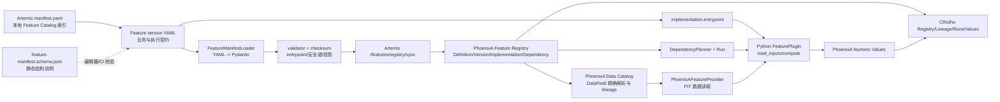

# Financial Feature Pack V1 Hands-on：首个财务指标 `net_income_ttm`

> 状态：Implementation-ready guide
>
> 基线：Feature Platform Phase 0 至 Phase 5 已完成；本文基于远端 `dev/alpha` 当前实现编写
>
> 目标：第一次把真实财务业务语义接入 Feature Platform，并讲清 Catalog、Manifest、Schema、Plugin、Registry 与平台代码如何协作

## 1. 这次到底要做什么

第一个业务 Feature 选择：

```text
financial.security.net_income_ttm@1
```

中文名：归母净利润 TTM。

它是一个 `metric`，不是最终的横截面选股 `factor`。这是有意为之。财务能力应按下面的层次逐步建设：

```text
DataField
  -> Fundamental Metric
  -> Normalized Metric
  -> Financial Factor
  -> Signal/Screen
  -> Backtest
```

第一次应用平台时，先完成一个可信的 Fundamental Metric，再让 ROE、ROA、净利率、质量因子依赖它。不要把原始字段、TTM、比率、标准化和打分塞进一个 Plugin。

本次期望产出：

```text
app/projects/artemis/
├── config/feature_catalog/
│   ├── manifest.yaml                                      # 修改：注册新文件路径
│   └── features/financial/metrics/
│       └── net_income_ttm_v1.yaml                         # 新增：治理与执行契约
├── artemis/feature_platform/plugins/financial/
│   ├── __init__.py                                        # 新增
│   └── net_income_ttm.py                                  # 新增：纯计算实现
└── tests/
    └── test_financial_feature_net_income_ttm.py           # 新增：公式、PIT、missing 测试
```

PhoenixA 第一版通常不需要新增业务 Endpoint 或 Feature 表。现有 DataField、Registry、Run 和 Numeric Value API 应被复用。只有第 5 节的前置 Gate 不能通过时，才先修改 PhoenixA 数据契约或平台治理实现。

## 2. 为什么从 `net_income_ttm` 开始

### 2.1 它比原始净利润透传更有价值

`NET_PRO_EXCL_MIN_INT_INC` 原始字段透传已经被 `platform.security.datafield_pit_probe` 覆盖。再做一个同样的业务 Feature 只能证明同一条链路再次运行，不能验证财务计算能力。

TTM 会第一次真实验证：

- 同一证券多报告期输入；
- 年报、一季报、半年报、三季报的期间语义；
- `actual_ann_date/ann_date` 的 PIT 截止；
- 可见修订版本选择；
- 计算使用记录的 `source_max_available_at`；
- 缺期、非数值和无记录的显式状态；
- 历史日期回填的可复现性。

### 2.2 它比直接做 ROE 更适合第一步

ROE 至少需要：

```text
net_income_ttm
average_equity
行业/公司类型适用规则
分母为零或负数的规则
跨利润表与资产负债表的日期对齐
```

如果第一步直接做 ROE，PIT、TTM、跨表对齐和比率规则同时出错时，很难定位责任。先把 `net_income_ttm` 做成可复用上游，第二个 Feature 再做 `average_equity`，第三个 Feature 才做 `roe_ttm`。

### 2.3 它比复合质量因子更容易审计

复合因子还会引入 winsorize、行业中性化、z-score、权重、横截面 universe 和调仓日语义。这些应该依赖已经发布的基础指标，而不是与第一条财务数据链路一起上线。

### 2.4 它的上游已经被平台 Smoke 验证

当前 PIT probe 已锁定：

```text
source           = amazing_data
dataset          = financial_statement
data_type        = income
raw_field        = NET_PRO_EXCL_MIN_INT_INC
contract_version = 2026-06-27
```

因此第一个业务 Feature 可以沿用已通过 Phase 5 E2E 的 provider 和 DataField 解析链路，把新增风险集中在 TTM 业务语义。

## 3. 先弄清五个容易混淆的对象

### 3.1 一张关系图



### 3.2 `config/feature_catalog/manifest.yaml`：本地索引

当前真实格式是：

```yaml
api_version: chaos.feature.catalog/v1
features:
  - features/platform/constant_one.yaml
  - features/platform/constant_two.yaml
  - features/platform/datafield_pit_probe.yaml
```

它只回答一个问题：Artemis 本次部署要加载哪些 Feature YAML。

重要规则：

- 键名是 `features`，不是 `manifests`；
- Plugin 文件不会被自动扫描；
- 创建 YAML 但不把路径加入这里，Validate 全 Catalog 和 Compute 都看不到它；
- 路径必须位于 `manifest_root` 内，Loader 会拒绝 `../` 逃逸；
- 同一个 `feature.code@version.number` 只能出现一次。

`manifest_root` 来自 Artemis 配置：

```yaml
engine:
  feature_platform:
    enabled: true
    manifest_root: ./config/feature_catalog
```

### 3.3 单个 Feature YAML：版本化契约和接线图

单个 YAML 同时声明：

| 区块 | 作用 | 谁使用 |
|---|---|---|
| `feature` | 稳定业务身份、类型、单位、owner | PhoenixA Definition、UI、审查者 |
| `version` | 公式/输入语义版本和生命周期初始状态 | PhoenixA Version、Planner |
| `implementation` | 哪个服务、哪个 Python class 执行，以及非敏感配置 | Artemis validator/executor、PhoenixA Implementation |
| `dependencies` | 精确 FeatureVersion 或 DataField contract | PhoenixA 解析 lineage、Artemis Planner/provider |
| `materialization` | 当前本地执行采用 numeric snapshot | Artemis 本地模型/执行策略 |
| `quality` | coverage、NaN、重复值 Gate | Artemis OutputValidator |

Manifest 不是 Python 参数文件，也不是 SQL。它是“这个业务版本是什么、依赖什么、由谁实现、如何验收输出”的声明。

### 3.4 `feature-manifest.schema.json`：静态结构规则

Schema 描述 YAML 允许的字段、必填项、正则和枚举，可用于：

- IDE/YAML 补全；
- Pull Request 中的快速结构校验；
- CI 对未知字段和基本类型 fail fast；
- 让非 Python 工具理解 Manifest 外形。

当前实现必须特别注意：

- `FeatureManifestLoader` 没有直接读取该 JSON Schema；
- 运行时权威解析是 `artemis.feature_platform.domain.models.FeatureManifest`；
- 之后还会执行 `manifests/validator.py` 的 entrypoint 和执行能力校验；
- 当前 `test_feature_platform_manifests.py` 只确认 Schema 是合法 JSON，没有用它验证全部 YAML。

因此 Schema 目前是“静态契约”，不是唯一运行时真相。第一个财务 Feature 应增加 Schema 对所有 YAML 的真实校验测试，避免 JSON Schema 和 Pydantic 漂移。

### 3.5 FeaturePlugin：Manifest 指向的可执行代码

Manifest 中：

```yaml
implementation:
  entrypoint: artemis.feature_platform.plugins.financial.net_income_ttm:NetIncomeTTMFeature
```

含义是：

```text
Python module                                               class
artemis.feature_platform.plugins.financial.net_income_ttm : NetIncomeTTMFeature
```

`validator.load_entrypoint()` 会 import 该 class，并确认它实现四个方法：

```text
validate
load_inputs
compute
validate_output
```

执行时不是 Plugin 自己查 Registry 或写数据库。平台先冻结 Run、Universe 和依赖计划，再把上下文和 provider 交给 Plugin；Plugin 返回 typed output，平台统一做 quality 校验并写 PhoenixA。

### 3.6 两种 Catalog 与 Registry 的区别

| 名称 | 所在位置 | 解决的问题 |
|---|---|---|
| Artemis Feature Catalog | Git 中 `config/feature_catalog` | 当前部署有哪些可执行 Manifest 与 Plugin 接线 |
| PhoenixA Data Catalog | `/api/v2/catalog/*`、字段字典 | 有哪些数据集/字段、字段契约和覆盖率 |
| PhoenixA Feature Registry | `/api/v2/features/*`、Feature 表 | 已治理的 Definition/Version/Dependency/Run/Value |

不能互相替代：

- Feature Catalog 有代码路径，但不是权威运行历史；
- Data Catalog 知道 `NET_PRO_EXCL_MIN_INT_INC`，但不知道 TTM 公式；
- Feature Registry 知道已同步和发布的版本，但执行时仍需要 Artemis 本地 Plugin。

## 4. 配置到代码的完整调用链

### 4.1 Validate 和 Sync

```text
POST Artemis /features/manifests/validate 或 /features/registry/sync
  -> FeatureService._loader()
  -> FeatureManifestLoader(manifest_root)
  -> 读取 manifest.yaml 的 features 列表
  -> yaml.safe_load(feature YAML)
  -> Pydantic FeatureManifest.model_validate
  -> validate_manifest
       -> quality/implementation 支持检查
       -> import entrypoint 并检查四方法
       -> registry_projection + checksums
  -> Sync 时由 FeatureRegistryClient 调用
       POST PhoenixA /api/v2/features/registry/sync
  -> PhoenixA 再校验 Manifest
  -> DataField natural key 解析为 govern.data_field_dictionary.id
  -> 写入 Definition/Version/Implementation/Dependency snapshot
```

### 4.2 Compute

```text
POST Artemis /features/compute
  -> 本地加载完整 Feature Catalog
  -> 从 PhoenixA 解析指定 Published Version
  -> DependencyPlanner 冻结 DAG 和 plan checksum
  -> 比较本地 manifest checksum 与 Registry checksum
  -> PhoenixA 创建 Run，冻结 subjects/items
  -> TaskEngine 启动 FeatureComputeTask
  -> 再加载 Catalog、重建并核对 plan
  -> PythonFeatureExecutor import entrypoint
  -> Plugin.validate(registry snapshots)
  -> Plugin.load_inputs(ctx, PhoenixAFeatureProvider, declared dependencies)
  -> Provider 查询 PhoenixA financial API 并执行 availability cutoff
  -> Plugin.compute(ctx, inputs)
  -> Plugin.validate_output(ctx, output)
  -> OutputValidator 校验 universe/重复/NaN/coverage/source availability
  -> PhoenixAFeatureWriter 写 immutable numeric values
  -> Run/RunItem 进入 succeeded 或 failed
```

### 4.3 Checksum 实际保护什么

当前 `implementation_checksum` 计算的是：

```text
kind + producer_service + backend + entrypoint + implementation_revision + config
```

它不直接 hash Python 文件内容。实际代码版本由 Run 的 `code_revision` 记录。因此：

- Plugin 代码变化必须有 Git commit；
- Published 业务语义变化必须新建 FeatureVersion；
- `implementation_revision` 不能代替 Git revision；
- 不要把 `implementation_checksum` 误解为制品文件 SHA-256。

当前 `manifest_checksum` 使用 PhoenixA Registry projection。`quality` 和 `materialization` 不在该 projection 中，它们目前是 Artemis-local policy。这是第一个财务 Feature 发布前需要关闭的治理缺口，见下一节。

## 5. 开工前 Go/No-Go Gate

### 5.1 三档门禁

| 使用等级 | 可以做什么 | 必须满足 |
|---|---|---|
| Development | Draft、fixture、单元测试、小样本 E2E | 字段可解析，公式契约确定，PIT 测试通过 |
| Research | 分析真实横截面、比较公司 | 单位、合并口径、修订选择、quality policy 已审查 |
| Backtest | 历史回填和收益评估 | 同一报表修订历史可重放，交易日截面和数据 cutoff 已冻结 |

Development Gate 通过即可开始写 Draft。Research 或 Backtest Gate 未通过时，不得用输出得出投资结论。

### 5.2 当前已发现的四个前置问题

#### Gate A：字段单位必须确认并修正

`migrations/postgresql/security/0004_govern_seed.sql` 当前把 income 的 `NET_PRO_EXCL_MIN_INT_INC` unit seed 为 `股`，这与“净利润”的业务含义不一致；balance sheet 的权益字段也有同类疑点。

在 `net_income_ttm` 发布前必须：

1. 对照 AmazingData 契约和真实样本确认原始单位；
2. 如果原始值为元，把 migration 源文件中的 unit 修正为 `CNY` 或项目统一的 `元`；
3. drop/recreate 或重跑开发库 migration；
4. 通过字段发现 API 确认新 contract；
5. Manifest 的 `feature.unit` 与公式输出保持一致。

不得仅在 Plugin 里猜测乘除 `10000`，也不得一边输出元、一边把 Feature 声明为亿元。

#### Gate B：修订历史能否重放

`ods.financial_statement` 当前唯一键为：

```text
(security_id, source, statement_type, reporting_period, report_type, statement_code)
```

DAO 对相同唯一键使用覆盖式 upsert。不同 `statement_code` 可以并存，但同一 code 的后续修订会覆盖旧值。

要求：

- Development：用 fixture 验证 cutoff 前后选择即可；
- Research：确认 AmazingData 更正是否总以不同 `statement_code` 保留；
- Backtest：若存在同 code 覆盖，先增加 append-only revision history 或 source snapshot，再做历史回填。

没有通过该 Gate 的历史回填只能标记为“使用当前数据库快照重建”，不能宣称无未来函数。

#### Gate C：quality/materialization 的不可变性

当前 Registry projection 明确排除了 `quality` 和 `materialization`。因此修改这两个区块不会改变 PhoenixA manifest checksum。

推荐在首个业务 Feature 发布前选择一种方案并加测试：

1. 将 `quality/materialization` 加入跨语言 Registry contract 和 checksum；或
2. 增加独立的 Artemis execution-policy checksum，并冻结到 Run/Version。

在平台修复前，团队流程必须把 Published YAML 的这两个区块视为不可修改，但流程约束不能替代长期技术门禁。

#### Gate D：JSON Schema 漂移

为全部 Catalog YAML 添加 Draft 2020-12 校验，并增加 JSON Schema/Pydantic 一致性测试。至少覆盖：

- 每个现有 YAML 都通过二者；
- unknown field 同时被二者拒绝；
- `api_version`、status、frequency、dependency 和 quality 枚举一致；
- PhoenixA OpenAPI 与 Artemis wire projection 的 `as_of_semantics` 一致。

当前 Manifest 使用的真实值是 `as_of_semantics: snapshot`。在 OpenAPI 漂移关闭前，不要从 PhoenixA OpenAPI 的旧枚举复制其他值。

## 6. Step 0：启动和预检

以下命令都在远端执行：

```bash
cd /home/machine/projects/chaos
export PHOENIXA=http://127.0.0.1:8085
export ARTEMIS=http://127.0.0.1:8084
```

使用现有 GoLand/PyCharm 启动配置启动当前 PhoenixA 和 Artemis。先检查端口，避免旧二进制占用：

```bash
ss -ltnp 'sport = :8085'
ss -ltnp 'sport = :8084'

curl -fsS "$PHOENIXA/api/v2/features/definitions?limit=1" | python -m json.tool
curl -fsS "$ARTEMIS/openapi.json" > /dev/null
```

如果 PhoenixA 返回 `404 page not found`，先处理旧进程，不要继续 Sync。

## 7. Step 1：审计 DataField 和真实样本

### 7.1 查字段契约

```bash
curl -fsS \
  "$PHOENIXA/api/v2/catalog/datasets/financial_statement/fields?source=amazing_data&type=income&include=all&search=NET_PRO_EXCL_MIN_INT_INC" \
  | python -m json.tool
```

必须人工确认：

```text
contract_version = 2026-06-27
value_type       = number
deprecated       = false
unit             = 已确认的货币单位，不是“股”
storage_location = data_json
```

### 7.2 查多期样本

```bash
curl -fsS \
  "$PHOENIXA/api/v2/financial/amazing_data/income?format=flat&fields=security_id,reporting_period,report_type,statement_code,ann_date,actual_ann_date,comp_type_code,NET_PRO_EXCL_MIN_INT_INC&page=1&page_size=1000" \
  > /tmp/net-income-sample.json

python -m json.tool /tmp/net-income-sample.json | less
```

从样本中选 5 至 20 个 `comp_type_code=1` 的 `security_id`，并确认至少一只证券同时具备：

- 当前中报或季报累计值；
- 上一年度年报；
- 上年同期累计值；
- 非空 `actual_ann_date` 或 `ann_date`；
- 可解释的 `statement_code`。

第一批 universe 先限定非金融公司。银行、保险、证券公司的报表口径留到独立版本审查，不要在 Plugin 内静默混算。

### 7.3 写下 V1 业务契约

在实现前由开发者和审查者确认：

| 项目 | V1 决策 |
|---|---|
| Feature code | `financial.security.net_income_ttm` |
| 输入字段 | `income.NET_PRO_EXCL_MIN_INT_INC@2026-06-27` |
| 输出单位 | 与已确认原始字段相同，建议 `CNY` |
| universe | V1 小样本和首批研究限 `comp_type_code=1` |
| 年报公式 | `TTM = 当前年报累计值` |
| 中间期公式 | `当前年累计 + 上年全年 - 上年同期累计` |
| 可见性 | 每条使用记录 `available_at <= data_cutoff_time` |
| 观察期 | `reporting_period <= as_of_time.date()` |
| 修订选择 | 按已审查的 statement code priority 和实际公告时间 |
| 缺失策略 | 任一必需期间缺失即 explicit missing，不填 0 |
| 非有限值 | invalid，不写 NaN/Inf |

## 8. Step 2：创建 Manifest

新增：

```text
app/projects/artemis/config/feature_catalog/features/financial/metrics/net_income_ttm_v1.yaml
```

建议 Draft：

```yaml
api_version: chaos.feature/v1

feature:
  code: financial.security.net_income_ttm
  display_name: Net Income TTM
  description: >-
    Point-in-time trailing-twelve-month net income attributable to parent
    shareholders for non-financial A-share companies. Intermediate periods
    use current YTD plus prior full year minus prior-year same-period YTD.
  kind: metric
  entity_type: security
  value_type: number
  unit: CNY
  category: financial
  owner: financial-research
  tags: [financial, profitability, ttm]

version:
  number: 1
  status: draft
  frequency: daily
  as_of_semantics: snapshot
  missing_policy: explicit_missing
  description: Initial PIT-safe calendar-fiscal-year TTM contract for non-financial companies

implementation:
  kind: python
  producer_service: artemis
  backend: python
  entrypoint: artemis.feature_platform.plugins.financial.net_income_ttm:NetIncomeTTMFeature
  implementation_revision: 1
  config:
    fiscal_year_end: "12-31"
    statement_code_priority: ["4", "1"]
    supported_interim_periods: ["03-31", "06-30", "09-30"]
  status: active

dependencies:
  - kind: data_field
    source: amazing_data
    dataset: financial_statement
    data_type: income
    raw_field: NET_PRO_EXCL_MIN_INT_INC
    contract_version: "2026-06-27"

materialization:
  store: numeric
  mode: snapshot

quality:
  min_coverage_ratio: 0.0
  allow_nan: false
  allow_infinite: false
  allow_duplicates: false
```

注意：

- `statement_code_priority` 只是示例决策，必须先用真实数据确认后再定；
- Draft 探索期可用 `min_coverage_ratio: 0.0` 观察 missing 原因；
- Publish 前应改成基于真实覆盖率审计得出的阈值，并先关闭 Gate C；
- 该 Feature 的频率是 daily snapshot，不代表每天产生新财报，而是每个观察日使用当时可见的最近报表；
- Published 后公式、依赖、config、quality 或 Plugin 行为变化都创建 V2。

把路径加入 Catalog 索引，键名必须是 `features`：

```yaml
api_version: chaos.feature.catalog/v1
features:
  - features/platform/constant_one.yaml
  - features/platform/constant_two.yaml
  - features/platform/datafield_pit_probe.yaml
  - features/financial/metrics/net_income_ttm_v1.yaml
```

## 9. Step 3：实现 Plugin

新增：

```text
app/projects/artemis/artemis/feature_platform/plugins/financial/__init__.py
app/projects/artemis/artemis/feature_platform/plugins/financial/net_income_ttm.py
```

职责边界：

- `load_inputs` 只能调用 provider 加载 Manifest 声明的单一 DataField；
- `compute` 执行选期、修订选择和 TTM 公式；
- 不直接发 HTTP、不连数据库、不写 PhoenixA；
- 每个冻结的 `security_id` 必须输出一行；
- 只对实际参与公式的记录取最大 `available_at`。

核心实现骨架：

```python
from __future__ import annotations

from datetime import date
import math

from artemis.feature_platform.domain.errors import FeaturePlatformError
from artemis.feature_platform.domain.models import FeatureNumericOutput, NumericValue
from artemis.feature_platform.execution.context import FeatureExecutionContext
from artemis.feature_platform.providers.base import DataFieldBatch, DataFieldRecord


class NetIncomeTTMFeature:
    def validate(self, definition: dict, version: dict, implementation: dict) -> None:
        if definition.get("value_type") != "number":
            raise FeaturePlatformError("INPUT_SCHEMA_INVALID", "net_income_ttm requires number output")
        priority = (implementation.get("config") or {}).get("statement_code_priority")
        if not isinstance(priority, list) or not priority:
            raise FeaturePlatformError("INPUT_SCHEMA_INVALID", "statement_code_priority is required")

    def load_inputs(
        self,
        ctx: FeatureExecutionContext,
        provider,
        dependencies: list[dict],
    ) -> DataFieldBatch:
        fields = [item for item in dependencies if item.get("kind") == "data_field"]
        if len(fields) != 1 or len(dependencies) != 1:
            raise FeaturePlatformError(
                "DEPENDENCY_REFERENCE_INVALID",
                "net_income_ttm requires exactly one governed income DataField",
            )
        return provider.load_data_field(ctx, fields[0])

    def compute(self, ctx: FeatureExecutionContext, inputs: DataFieldBatch) -> FeatureNumericOutput:
        grouped: dict[int, list[DataFieldRecord]] = {
            security_id: [] for security_id in ctx.security_ids
        }
        for record in inputs.records:
            grouped[record.security_id].append(record)

        rows = [self._compute_security(ctx, security_id, grouped[security_id])
                for security_id in ctx.security_ids]
        return FeatureNumericOutput(
            feature_version_id=ctx.feature_version_id,
            observed_at=ctx.as_of_time,
            rows=rows,
        )

    def validate_output(self, ctx: FeatureExecutionContext, output: FeatureNumericOutput) -> None:
        if len(output.rows) != len(ctx.security_ids):
            raise FeaturePlatformError("OUTPUT_SCHEMA_INVALID", "one output per subject is required")

    def _compute_security(
        self,
        ctx: FeatureExecutionContext,
        security_id: int,
        records: list[DataFieldRecord],
    ) -> NumericValue:
        config = ctx.implementation_config
        priority = [str(item) for item in config["statement_code_priority"]]
        rank = {code: len(priority) - index for index, code in enumerate(priority)}
        selected: dict[date, DataFieldRecord] = {}

        for record in records:
            try:
                period = date.fromisoformat(record.reporting_period)
            except ValueError:
                return self._invalid(security_id, ctx, "reporting_period_invalid")
            code = str(record.metadata.get("statement_code") or "")
            if period > ctx.as_of_time.date() or code not in rank:
                continue
            current = selected.get(period)
            candidate_key = (record.available_at, rank[code])
            current_key = (
                (current.available_at, rank[str(current.metadata.get("statement_code") or "")])
                if current else None
            )
            if current_key is None or candidate_key > current_key:
                selected[period] = record

        if not selected:
            return self._missing(security_id, ctx, "no_visible_supported_statement")

        latest_period = max(selected)
        current = selected[latest_period]
        if (latest_period.month, latest_period.day) == (12, 31):
            used = [current]
            values = [self._number(current.value)]
            method = "annual"
        else:
            suffix = f"{latest_period.month:02d}-{latest_period.day:02d}"
            if suffix not in set(config["supported_interim_periods"]):
                return self._invalid(security_id, ctx, "unsupported_reporting_period")
            prior_full_period = date(latest_period.year - 1, 12, 31)
            prior_same_period = date(
                latest_period.year - 1, latest_period.month, latest_period.day
            )
            prior_full = selected.get(prior_full_period)
            prior_same = selected.get(prior_same_period)
            if prior_full is None or prior_same is None:
                return self._missing(security_id, ctx, "ttm_required_period_missing")
            used = [current, prior_full, prior_same]
            values = [self._number(item.value) for item in used]
            method = "ytd_bridge"

        if any(value is None for value in values):
            return NumericValue(
                security_id=security_id,
                value=None,
                value_status="invalid",
                quality_flags={"reason": "source_value_not_finite"},
                source_max_available_at=max(item.available_at for item in used),
            )

        value = values[0] if method == "annual" else values[0] + values[1] - values[2]
        return NumericValue(
            security_id=security_id,
            value=value,
            value_status="valid",
            quality_flags={
                "ttm_method": method,
                "latest_reporting_period": latest_period.isoformat(),
            },
            source_max_available_at=max(item.available_at for item in used),
        )

    @staticmethod
    def _number(value) -> float | None:
        try:
            parsed = float(value)
        except (TypeError, ValueError):
            return None
        return parsed if math.isfinite(parsed) else None

    @staticmethod
    def _missing(security_id: int, ctx: FeatureExecutionContext, reason: str) -> NumericValue:
        return NumericValue(
            security_id=security_id,
            value=None,
            value_status="missing",
            quality_flags={"reason": reason, "availability_bound": "data_cutoff_time"},
            source_max_available_at=ctx.data_cutoff_time,
        )

    @staticmethod
    def _invalid(security_id: int, ctx: FeatureExecutionContext, reason: str) -> NumericValue:
        return NumericValue(
            security_id=security_id,
            value=None,
            value_status="invalid",
            quality_flags={"reason": reason},
            source_max_available_at=ctx.data_cutoff_time,
        )
```

这是实现骨架，不是对 `statement_code_priority` 的业务批准。真实开发时先用 fixture 固化选择规则，再实现代码。

## 10. Step 4：先测试，再碰 Registry

### 10.1 最低单元测试矩阵

新增测试必须覆盖：

| 场景 | 期望 |
|---|---|
| 最新可见记录是年报 | TTM 等于年报累计值 |
| 最新是 Q1/H1/Q3 | `current_ytd + prior_full - prior_same_ytd` |
| cutoff 后才公告的当前期 | 不参与计算 |
| 同期间多 statement code | 按已审查 priority 和 available_at 选择 |
| 缺上年年报 | explicit missing，reason 固定 |
| 缺上年同期 | explicit missing，reason 固定 |
| 原始值为空/字符串错误/NaN/Inf | invalid，不持久化非有限数 |
| universe 有无数据的多个证券 | 每个 security 恰好一行 |
| 使用三条记录 | `source_max_available_at` 是三者最大值 |
| `reporting_period > as_of_time` | 不参与计算 |
| 同输入执行两次 | 输出完全一致 |

### 10.2 Schema 真正校验所有 YAML

在 Manifest 测试中使用 `jsonschema.Draft202012Validator` 对 Catalog 中每个 YAML 执行校验，而不只是 `json.loads(schema)`：

```python
import json
from pathlib import Path

import yaml
from jsonschema import Draft202012Validator


def test_every_catalog_manifest_matches_json_schema():
    root = Path(__file__).parents[1] / "config" / "feature_catalog"
    schema = json.loads((root / "schema" / "feature-manifest.schema.json").read_text("utf-8"))
    index = yaml.safe_load((root / "manifest.yaml").read_text("utf-8"))
    validator = Draft202012Validator(schema)
    for relative_path in index["features"]:
        value = yaml.safe_load((root / relative_path).read_text("utf-8"))
        validator.validate(value)
```

如果 `jsonschema` 尚未声明为测试依赖，应把它加入 Artemis 的开发/测试依赖，不要让测试依赖某台机器偶然安装的包。

### 10.3 运行定向测试

```bash
cd /home/machine/projects/chaos/app/projects/artemis
source /home/machine/projects/chaos/venv/bin/activate
export PYTHONPATH=.

python -m pytest -q \
  tests/test_feature_platform_manifests.py \
  tests/test_feature_platform_planning_execution.py \
  tests/test_financial_feature_net_income_ttm.py
```

此时 Feature 仍然是纯本地 Draft，不应写 Registry。

## 11. Step 5：通过 Artemis Validate API

只验证新路径：

```bash
curl -fsS -X POST "$ARTEMIS/features/manifests/validate" \
  -H 'Content-Type: application/json' \
  -d '{
    "paths": ["features/financial/metrics/net_income_ttm_v1.yaml"],
    "check_entrypoints": true,
    "source_profile": "default"
  }' | python -m json.tool
```

预期：

```text
valid = true
count = 1
feature = financial.security.net_income_ttm@1
manifest_checksum = 64 位 lowercase SHA-256
implementation_checksum = 64 位 lowercase SHA-256
```

再验证完整 Catalog，防止新依赖破坏旧 Feature：

```bash
curl -fsS -X POST "$ARTEMIS/features/manifests/validate" \
  -H 'Content-Type: application/json' \
  -d '{"check_entrypoints": true, "source_profile": "default"}' \
  | python -m json.tool
```

## 12. Step 6：Sync Draft 到 PhoenixA

```bash
curl -fsS -X POST "$ARTEMIS/features/registry/sync" \
  -H 'Content-Type: application/json' \
  -d '{
    "paths": ["features/financial/metrics/net_income_ttm_v1.yaml"],
    "check_entrypoints": true,
    "source_profile": "default"
  }' | python -m json.tool
```

第一次预期 `created` 包含 `financial.security.net_income_ttm@1`，`rejected` 为空，`graph_valid=true`。

立即重复一次，预期进入 `unchanged`。这证明 Sync 幂等。

检查 Registry：

```bash
curl -fsS \
  "$PHOENIXA/api/v2/features/definitions/financial.security.net_income_ttm" \
  | python -m json.tool

curl -fsS \
  "$PHOENIXA/api/v2/features/lineage/financial.security.net_income_ttm" \
  | python -m json.tool

curl -fsS \
  "$PHOENIXA/api/v2/features/availability/financial.security.net_income_ttm?source_profile=default" \
  | python -m json.tool
```

人工确认：

- Version 状态仍为 `draft`；
- 只有一个 active canonical Implementation；
- lineage 指向正确的 DataField dictionary id；
- dependency snapshot 的五段自然键和 contract version 完全一致；
- Availability 在未发布时不应声称 executable。

浏览器打开：

```text
http://192.168.31.142:4200/workbench/features/registry
```

找到该 Definition，检查 Version、Lineage 和 Availability 与 API 一致。

## 13. Step 7：业务 Review，然后 Publish

Publish 前必须逐项签字：

- 字段单位 Gate 已通过；
- statement code 选择规则有真实样本和测试；
- calendar fiscal year 限制写入 description；
- missing/invalid reason 稳定；
- coverage threshold 有实测依据；
- Gate C 已技术关闭，或明确只做 Development、不发布；
- Plugin 源码、Manifest 和测试在同一个 Git revision；
- 没有把 secret 放进 config、parameters、quality flags 或日志。

发布命令：

```bash
curl -fsS -X POST \
  "$PHOENIXA/api/v2/features/definitions/financial.security.net_income_ttm/versions/1:publish" \
  | python -m json.tool
```

当前生命周期的一个反直觉规则：

- PhoenixA Registry 状态会变成 `published`；
- 本地 YAML 继续保持 `version.status: draft`；
- 不要发布后把同一 YAML 改成 `published`，因为 status 参与 checksum，会造成 checksum conflict；
- 平台 smoke Manifest 直接写 `published` 是 bootstrap 流程，不是业务 Feature 推荐流程。

发布后再次执行 Validate 和 Sync，预期 checksum 不变、Sync 返回 `unchanged`，Registry 仍是 `published`。

## 14. Step 8：小 universe 首次 Compute

把样本审计得到的真实 `security_id` 替换到请求中。第一次只用 5 至 20 个非金融证券、一个观察时间：

```bash
curl -fsS -X POST "$ARTEMIS/features/compute" \
  -H 'Content-Type: application/json' \
  -d '{
    "features": [
      {"code": "financial.security.net_income_ttm", "version": 1}
    ],
    "security_ids": [101, 202, 303],
    "as_of_time": "2026-07-20T15:00:00+08:00",
    "data_cutoff_time": "2026-07-20T15:00:00+08:00",
    "market": "zh_a",
    "source_profile": "default",
    "trigger_type": "manual",
    "idempotency_key": "net-income-ttm-v1-2026-07-20-batch-001",
    "parameters": {"purpose": "financial_feature_pack_v1_smoke"},
    "force": false
  }' | tee /tmp/net-income-compute.json | python -m json.tool
```

要求：

- `data_cutoff_time <= as_of_time`；
- 历史截面通常让二者相等；
- 不要用 symbol，必须使用稳定 `security_id`；
- 同一请求重复提交使用同一 idempotency key，预期复用已有 Run；
- 不要用 `force=true` 掩盖幂等或公式问题。

从响应取 `run_id`：

```bash
export RUN_ID=<returned-run-uuid>

curl -fsS "$ARTEMIS/features/executions/$RUN_ID?source_profile=default" \
  | python -m json.tool

curl -fsS "$PHOENIXA/api/v2/features/runs/$RUN_ID?include_subjects=true" \
  | python -m json.tool
```

Run 最终必须是 `succeeded`。检查 RunItem：

- `input_count` 等于冻结 universe；
- `valid + missing + invalid = output_count`；
- coverage 与预期一致；
- error code/message 为空；
- plan checksum、manifest checksum、code revision 可追踪。

查询值：

```bash
curl -fsS \
  "$PHOENIXA/api/v2/features/values/numeric?feature_code=financial.security.net_income_ttm&version=1&run_id=$RUN_ID&limit=500" \
  | python -m json.tool
```

对至少三只证券手工复算：

```text
latest YTD + previous full year - previous-year same YTD
```

并确认：

- `observed_at == as_of_time`；
- `source_max_available_at <= data_cutoff_time`；
- missing 行 `value=null`；
- `quality_flags.reason` 能解释缺失；
- 没有 NaN、Inf、重复 security 或 universe 外输出。

## 15. Step 9：按层放大，不要直接全市场回填

推荐顺序：

1. Fixture 单元测试。
2. 5 至 20 证券、单日期。
3. 100 证券、单日期。
4. 非金融 universe、单日期。
5. 5 至 10 个显式历史日期。
6. 重启 PhoenixA/Artemis 后重查 Run 和 Value。
7. 修订历史 Gate 通过后，才允许大范围历史回填。

Phase 1 的 backfill calendar 仍要求明确日期集合。不要把自然日静默当交易日；使用冻结的 `explicit_as_of_times`，并让每个日期的 `data_cutoff_time` 可审计。

首轮不要同时增加：

- ROE/ROA；
- 行业 z-score；
- winsorize；
- 复合质量打分；
- 自动 universe；
- 策略和回测页面。

## 16. 验收 Definition of Done

### 16.1 代码和契约

- Catalog 使用 `features` 索引并能加载完整目录；
- JSON Schema 和 Pydantic 都校验全部 YAML；
- `net_income_ttm@1` 只有一个精确 DataField dependency；
- Plugin 不直接访问数据库或未声明数据；
- 单位、合并口径和 TTM 公式有书面决策；
- 每个 subject 恰好一个 typed output；
- Git revision 可追踪。

### 16.2 PIT 和质量

- cutoff 后公告永不进入输入；
- reporting period 晚于 as-of 永不进入输入；
- 三条 TTM 输入的最大 availability 被准确记录；
- 缺期不填 0；
- NaN/Inf 不持久化；
- 修订选择有 before/after fixture；
- quality threshold 有真实覆盖率依据。

### 16.3 平台闭环

- Validate 成功且 checksum 稳定；
- Sync 两次分别为 created/unchanged；
- DataField lineage 精确解析；
- Draft review 后显式 Publish；
- 小 universe Run succeeded；
- Numeric Value 可由 PhoenixA API 和 Cthulhu 查询；
- 重启后 Run/Value 仍存在；
- 同幂等请求不会重复写值；
- 修改 Published 语义会被拒绝或要求 V2。

## 17. 第一个指标完成后的顺序

建议后续 Feature DAG：

```text
financial.security.net_income_ttm@1
financial.security.equity_average@1
        ↓
financial.security.roe_ttm@1
        ↓
financial.security.roe_ttm_winsorized@1
        ↓
financial.security.roe_industry_zscore@1
        ↓
financial.security.quality_factor@1
```

每一层都使用显式 `feature_code + feature_version` 依赖。上游发布后不可修改；公式变化发布新版本，并让下游显式选择是否升级。

## 18. 建议拆分的下一轮 Phase

### Financial Phase F0：Contract Hardening

- 修正并验证财务字段单位；
- 审计 statement code 与修订保留；
- 让 JSON Schema 真正校验 Catalog；
- 冻结 quality/materialization policy；
- 修正 Artemis/PhoenixA OpenAPI 的 `as_of_semantics` 漂移。

### Financial Phase F1：`net_income_ttm` Draft

- 新 Manifest、Plugin 和测试；
- fixture 覆盖 annual/Q1/H1/Q3/missing/revision/PIT；
- Validate、Draft Sync、Lineage 和 Availability 审查。

### Financial Phase F2：Publish 与小样本 E2E

- 显式 Publish；
- 小 universe Compute -> Persist -> Query；
- 手工复算；
- 幂等和双服务重启验证；
- Cthulhu 可见性验收。

### Financial Phase F3：历史回填准入

- revision history Gate；
- 冻结交易日和 cutoff；
- 小日期集合回填；
- 容量、coverage 和失败重试基线；
- 通过后才进入 ROE/ROA 与因子研究。

## 19. 相关代码和文档

- [Feature Platform 架构与 Phase 计划](./2026-07-14%20FEATURE_PLATFORM_ARCHITECTURE_AND_ITERATION_PLAN.md)
- [FeaturePlugin 开发者指南](./2026-07-18%20FEATURE_PLUGIN_DEVELOPER_GUIDE.md)
- [Feature Platform 运维手册](./2026-07-18%20FEATURE_PLATFORM_OPERATIONS_RUNBOOK.md)
- [Phase 5 验收报告](./2026-07-18%20FEATURE_PLATFORM_PHASE_5_ACCEPTANCE_REPORT.md)
- `app/projects/artemis/config/feature_catalog/manifest.yaml`
- `app/projects/artemis/config/feature_catalog/schema/feature-manifest.schema.json`
- `app/projects/artemis/artemis/feature_platform/manifests/loader.py`
- `app/projects/artemis/artemis/feature_platform/manifests/validator.py`
- `app/projects/artemis/artemis/feature_platform/manifests/checksum.py`
- `app/projects/artemis/artemis/feature_platform/providers/phoenixa.py`
- `app/projects/artemis/artemis/feature_platform/tasks/feature_compute_task.py`
- `app/projects/phoenixA/internal/service/feature_registry_service.go`
- `app/projects/phoenixA/internal/dao/feature_registry_dao.go`
- `app/projects/phoenixA/internal/service/catalog_service.go`
- `app/projects/phoenixA/migrations/postgresql/security/0004_govern_seed.sql`
