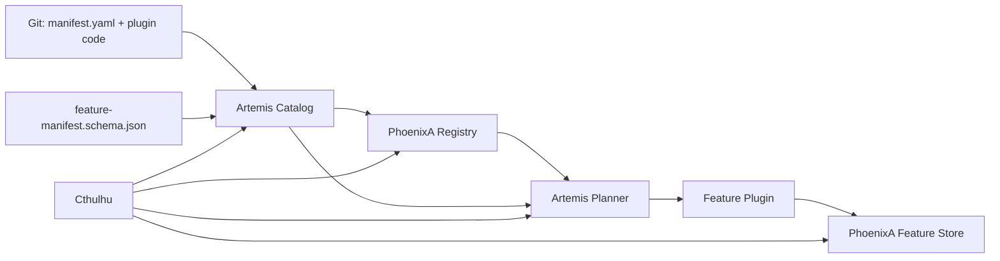
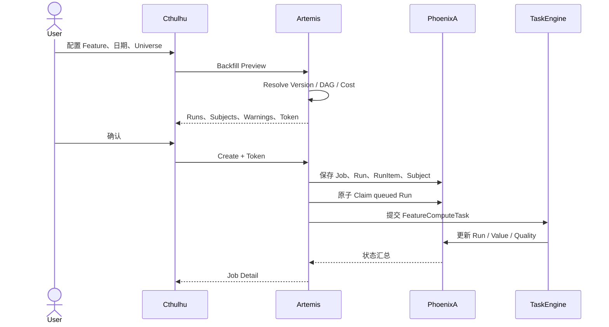

# Feature Platform 二期：治理、Preview、数据生命周期与可视化设计

> 日期：2026-07-25
> 状态：Proposed
> 适用服务：Cthulhu、Artemis、PhoenixA
> 前置文档：
>
> - `2026-07-14 FEATURE_PLATFORM_ARCHITECTURE_AND_ITERATION_PLAN.md`
> - `2026-07-18 FEATURE_PLUGIN_DEVELOPER_GUIDE.md`
> - `2026-07-20 FINANCIAL_FEATURE_PACK_V1_HANDS_ON_GUIDE.md`

---

## 1. 本文要解决什么

一期已经建立了 Feature Platform 的基本闭环：

1. Git 中的 `manifest.yaml` 描述 Feature；
2. Artemis 发现 Catalog、校验 Manifest、同步 Registry、执行插件；
3. PhoenixA 保存 Registry、Lineage、Run、Subject 和 Feature Value；
4. Cthulhu 能查询定义、血缘、可用性、Run、Value，并能发起普通 Compute。

二期关注的不是再增加一个计算接口，而是让平台从“开发者可以调用”走向“使用者可以安全地运营”：

1. 在界面完成 Manifest、Registry、生命周期和 Backfill 管理；
2. 安全、可审计地清理某个 Run 或 Feature 的物化数据；
3. 支持只计算、只展示、不写入 Feature Store 的 Preview；
4. 把 Lineage、Run、质量和 Backfill 状态做成可理解的可视化；
5. 明确 Feature Version 的治理方式。
6. 统一建模股票范围、评估日期范围、Cutoff 和算法参数。

---

## 2. 结论摘要

| 议题 | 结论 | 优先级 |
|---|---|---:|
| Manifest / Registry / Publish / Deprecate 接入 UI | 同意，但写操作必须带权限、原因、确认和审计；Registry Sync 先 Preview Diff 再执行 | P0 |
| Backfill 接入 UI | 同意，但不能直接暴露 PhoenixA 当前的创建接口；必须先补 Artemis 调度执行闭环 | P0 |
| 删除 Run 或 Feature 数据 | 同意，但二期只“清理物化值”，不硬删除 Run、Definition、Version 和审计元数据 | P1 |
| 只计算不落库 | 强烈建议；设计为独立的 `/features/preview`，而不是给 `/compute` 增加容易误用的 `persist=false` | P0 |
| 选择股票和日期范围 | 必须支持；单日期创建一个 Run，日期范围展开为 Backfill Runs，非持久化范围使用有上限的 Batch Preview | P0 |
| 通用 Feature Parameters | 不开放任意 JSON；持久化语义参数由 Manifest + Version 管理，Preview 只允许 Schema 声明的临时 Override | P0 |
| 可视化 | 同意；先做 Lineage DAG、Run DAG、质量分布和 Backfill 热力图，不做任意 BI Dashboard | P1 |
| YAML Version 自动递增 | 不建议由服务端静默递增；YAML 继续保存显式语义版本，平台只提供“建议下一个版本” | P0 |

推荐实施顺序：

1. P2-A：治理契约、权限边界、Manifest Catalog 和 Registry Diff；
2. P2-B：治理控制台和 Definition 生命周期；
3. P2-C：非持久化 Preview；
4. P2-D：Lineage / Run / Quality 可视化；
5. P2-E：Backfill 编排与管理；
6. P2-F：物化数据 Purge；
7. P2-G：容量、审计、安全和故障恢复验收。

这个顺序的核心原因是：先建立权限、审计和执行契约，再开放会改变状态或删除数据的操作。

---

## 3. 当前代码事实与缺口

### 3.1 Cthulhu

当前 Feature Platform UI 已接入：

- Definition 列表和详情；
- Lineage 查询；
- Availability 查询；
- Run 列表和详情；
- Value 查询；
- Compute 和 Execution 状态。

尚未接入：

- Manifest Catalog；
- Manifest Validate；
- Registry Sync 和 Sync Diff；
- Publish / Deprecate；
- Backfill 创建、列表、详情、取消和失败重试；
- Preview；
- Purge；
- 真正的图结构 Lineage。

当前 Lineage 页面是三列布局，不是支持缩放、聚焦和交互的 DAG。Cthulhu 已经依赖 ECharts 和 ngx-echarts，因此二期不需要增加新的图形库。

### 3.2 Artemis

当前已有：

- `POST /features/manifests/validate`；
- `POST /features/registry/sync`；
- `POST /features/compute`；
- `GET /features/executions/{run_id}`；
- Stale Run Reconcile。

当前缺少：

- 提供给 UI 的 Manifest Catalog 查询；
- 非变更的 Registry Sync Diff；
- Preview 执行；
- Backfill 编排器、队列恢复和并发控制；
- 对正在运行的 Backfill Task 做协作式取消。

当前 `FeatureComputeTask` 同时承担 Run 状态管理、计划生成、执行、校验和 Sink。Preview 若直接复制这段逻辑，会很快与持久化计算产生行为分叉，因此必须先抽出共享执行内核。

### 3.3 PhoenixA

当前已有：

- Registry Definition / Version / Implementation / Dependency；
- Publish / Deprecate；
- Lineage / Availability；
- Run / RunItem / Subject；
- Numeric Value；
- Backfill Job 和 queued Run 的持久化；
- Backfill Retry Failed / Cancel。

当前缺少：

- Backfill 列表接口；
- 真正消费 queued Run 的 Artemis 调度闭环；
- Purge Job、物化状态和审计；
- Value 聚合统计接口；
- Run 的完整执行计划快照；
- 生命周期事件审计；
- 面向写操作的授权和并发冲突保护。

特别需要注意：当前 PhoenixA 创建 Backfill 后，只会创建 Job 和 queued Run，不会自动执行这些 Run。Cthulhu 不能直接把这个接口包装成“可用的 Backfill”。

---

## 4. 二期架构原则

### 4.1 Source of Truth 不改变

职责继续保持：

- Git + `manifest.yaml`：Feature 的期望定义；
- `feature-manifest.schema.json`：Manifest 的静态结构契约；
- Catalog：Artemis 在指定目录中发现的 Manifest 集合；
- Plugin：实现 Feature 计算逻辑的运行时代码；
- PhoenixA Registry：已同步的运行时定义和生命周期状态；
- Artemis：计划、执行和编排；
- PhoenixA Feature Store：运行元数据和物化结果；
- Cthulhu：治理与观测界面。

关系如下：



UI 不成为新的 Source of Truth。二期不允许直接在浏览器修改并保存服务器上的 Manifest 文件。UI 负责发现、校验、比较、同步和管理运行时状态；Manifest 的实质性修改仍然走 Git Review。

### 4.2 数据所有者负责数据语义

- Manifest 和执行计划属于 Artemis；
- Definition、Version、Run、Value 和 Purge 属于 PhoenixA；
- Backfill 的执行由 Artemis 编排，状态事实由 PhoenixA 保存；
- Cthulhu 不能自己拼接跨服务状态变更。

### 4.3 Preview 和 Persisted Compute 明确分离

Preview 是临时分析能力，不是一个特殊状态的 Run：

- 不创建 PhoenixA Run；
- 不创建 RunItem 和 Subject；
- 不写 Feature Value；
- 不参与 Latest Value；
- 不支持 Retry 和 Backfill；
- 页面必须始终显示“Preview / 未持久化”水印。

### 4.4 删除数据不等于删除事实

Run 成功执行过、使用过哪些 Version、计算过哪些 Subject，是治理事实。即使物化值被清理，这些事实也应保留。

二期的“删除”统一命名为 **Purge Materialized Values**：

- 删除 `dwd.feature_value_numeric` 中的物化值；
- 保留 Definition、Version、Run、RunItem、Subject、Backfill 和审计；
- 修改 RunItem 的物化状态；
- Latest 和 Availability 查询跳过已清理的数据。

### 4.5 所有危险操作先预览，再确认

以下操作采用两步模式：

- Registry Sync；
- Backfill Create；
- Purge；
- 大范围 Deprecate 后续影响检查。

第一步返回精确 Diff 或影响范围和短时有效的 `confirmation_token`；第二步必须携带 Token。Token 要绑定请求参数、操作者和过期时间，参数变化后不可复用。

---

## 5. Manifest、Catalog、Registry、Plugin 与平台代码

### 5.1 Manifest 是声明，不是计算代码

Manifest 描述：

- Feature 身份：`feature_code`、名称、值类型；
- 语义版本：`version.number`；
- 依赖：DataField 或其他 Feature Version；
- 时间语义：`event_time_field`、`available_time_field`；
- 实现绑定：插件类型、入口、参数；
- 输出契约和质量规则；
- 所属、标签和描述等治理信息。

Manifest 不应该包含：

- SQL 密码或服务 Secret；
- 任意可执行脚本；
- 环境相关的绝对路径；
- UI 展示状态；
- 服务端自动生成但无法回写 Git 的版本号。

### 5.2 Schema 是提交前和运行前的最低契约

`feature-manifest.schema.json` 解决“结构是否正确”，例如：

- 必填字段；
- 字段类型；
- 枚举值；
- 条件字段；
- 不允许的额外字段。

Schema 不足以完成语义校验。Artemis Validate 还必须检查：

- `feature_code + version` 是否重复；
- 依赖是否存在；
- 依赖图是否有环；
- 插件入口是否可加载；
- 参数能否被插件接受；
- 输出类型是否匹配；
- 已发布版本是否发生不可变字段漂移。

### 5.3 Catalog 是 Git 世界到运行时世界的桥

Catalog 是 Artemis 启动时或按请求扫描得到的 Manifest 集合。它负责：

- 发现文件；
- Schema 校验；
- 语义校验；
- 计算 Manifest / Implementation / Dependency Checksum；
- 绑定插件；
- 构建可同步的定义集合。

二期新增 Catalog Read API，使 Cthulhu 可以展示：

- Manifest 路径；
- Feature Code 和 Version；
- Validate 状态；
- Catalog Checksum；
- Plugin 加载状态；
- Registry 是否存在；
- Catalog 与 Registry 是否一致；
- 错误所在字段和文件位置。

### 5.4 Registry 是已接受的运行时目录

Registry 不是 Manifest 文件的副本目录，而是平台运行时需要查询和约束的结构化状态：

- Definition；
- Version 及 Draft / Published / Deprecated 状态；
- Implementation；
- Dependency；
- Checksum；
- Lineage。

Compute 只解析允许执行的 Registry Version，并用 Checksum 防止“定义看起来相同，但实际代码或参数已经变化”。

### 5.5 Plugin 是 Manifest 所引用的实现

插件负责：

- 接收平台构造的执行上下文；
- 按 Cutoff 读取依赖数据；
- 执行确定性计算；
- 返回符合输出契约的结果。

平台负责：

- 选择 Version；
- 解析 DAG；
- 构造上下文；
- 校验输出；
- 决定写入 Sink 还是返回 Preview；
- 记录状态、质量和审计。

插件不应该自行写 Feature Store。否则 Preview 无法保证“不落库”，Retry 也无法保证幂等。

---

## 6. 治理控制台设计

### 6.1 页面信息架构

建议在 Cthulhu Feature Platform 下增加：

- `Registry`
- `Manifests`
- `Definitions`
- `Lineage`
- `Preview`
- `Compute`
- `Runs`
- `Backfills`
- `Values`
- `Purges`

其中：

- Manifest 页面负责 Git/Catalog/Registry 对齐；
- Definition 详情负责 Publish / Deprecate；
- Backfill 页面只调用 Artemis 编排接口；
- Purge 页面只清理物化值；
- Preview 与 Compute 使用不同页面，降低误操作概率。

### 6.2 Manifest Catalog API

Artemis 新增：

```http
GET /features/manifests/catalog
```

建议返回：

```json
{
  "catalog_checksum": "sha256:...",
  "loaded_at": "2026-07-25T10:00:00Z",
  "items": [
    {
      "path": "app/features/financial/pe_ttm/manifest.yaml",
      "feature_code": "financial.pe_ttm",
      "version": 1,
      "validation_status": "valid",
      "manifest_checksum": "sha256:...",
      "plugin_status": "loadable",
      "registry_status": "in_sync",
      "errors": []
    }
  ]
}
```

路径只返回项目内相对路径，不泄露服务器绝对路径。

### 6.3 Manifest Validate

复用现有 Validate 能力，在 UI 提供两种操作：

- Validate All；
- Validate Selected。

Validate 是只读操作，可以对 Developer 开放。结果需要区分：

- Schema Error；
- Semantic Error；
- Dependency Error；
- Plugin Load Error；
- Registry Conflict；
- Warning。

### 6.4 Registry Sync Preview

Artemis 新增：

```http
POST /features/registry/sync:preview
```

返回 Diff：

```json
{
  "catalog_checksum": "sha256:...",
  "confirmation_token": "...",
  "expires_at": "2026-07-25T10:10:00Z",
  "changes": [
    {
      "feature_code": "financial.pe_ttm",
      "version": 2,
      "action": "create_version",
      "changed_fields": ["implementation.params", "quality_rules"]
    }
  ],
  "blocked": [],
  "warnings": []
}
```

执行 Sync 时必须携带 Preview 返回的 Token。若 Catalog Checksum 已变化，返回 `409 Conflict`，要求重新 Preview。

### 6.5 Publish / Deprecate

现有 PhoenixA API 可以继续作为数据所有者，但请求要增加：

```json
{
  "reason": "Validated against 2026Q2 financial dataset",
  "expected_status": "draft",
  "expected_checksum": "sha256:..."
}
```

必须记录：

- Actor；
- Action；
- Reason；
- Before / After Status；
- Feature Version；
- Checksum；
- Request / Trace ID；
- Timestamp。

Definition 详情页的操作规则：

- Draft 可以 Publish；
- Published 可以 Deprecate；
- Deprecated 不在二期提供原地恢复；
- 已发布 Version 的 Manifest、Implementation、Dependency 和语义字段不可原地修改；
- 冲突返回 409，UI 刷新后由用户重新确认。

### 6.6 权限模型

建议能力分层：

| Role | 能力 |
|---|---|
| Viewer | 查看 Catalog、Registry、Lineage、Run、Value、Backfill、Purge 记录 |
| Developer | Validate、Registry Sync Preview、Preview Compute |
| Publisher | Registry Sync、Publish、Deprecate |
| Operator | Persisted Compute、Backfill Create / Cancel / Retry |
| Data Steward | Purge Preview、提交 Purge |
| Admin | 跨全部 Version 的 Feature Purge 等高风险操作 |

当前若仍处于可信开发环境，可以用服务端 Capability Flag 临时开启写按钮；生产环境在 OIDC/JWT 或 BFF 身份链路完成前必须默认关闭写操作。Secret 不能下发到浏览器。

---

## 7. 计算范围与参数模型

### 7.1 先区分三类“参数”

用户在界面中选择股票、日期和算法参数时，看起来都叫参数，但它们的生命周期和数据语义不同，不能继续放在一个任意 `parameters` JSON 中。

| 类型 | 示例 | 所属 | 是否改变 Feature Version 语义 |
|---|---|---|---|
| Universe Scope | 股票 600519、000001，或明确选择“当前全部 A 股” | Run / Backfill / Preview Request | 否 |
| Evaluation Scope | 单个 As-Of，或 2026-01-01 到 2026-06-30 每月一次 | Run / Backfill / Preview Request | 否 |
| Data Cutoff Policy | Cutoff 等于 As-Of，或落后 1 天 | Run / Backfill / Preview Request | 通常不改变定义，但必须冻结 |
| Semantic Feature Config | TTM 窗口、分母字段、复权方式、Winsorize 规则 | Manifest Implementation Config | 是 |
| Operational Option | 批大小、并发度、超时 | Artemis 平台配置 | 否，且不应进入插件业务参数 |
| Preview Override | 临时试验不同窗口或阈值 | Preview Request | 会改变输出，但不允许直接持久化 |

核心规则：

- **选择哪些股票、在哪些时间点计算，是 Execution Scope，不是 Feature 定义。**
- **改变因子业务含义的参数，是 Manifest 中的版本化配置。**
- **普通持久化 Compute 不接受未声明的任意算法参数。**
- **Preview 可以允许受 Schema 约束的临时 Override，但结果明确标记为非标准、不可持久化。**

### 7.2 当前能力

当前普通 Compute 已经要求：

- `security_ids`：1 到 20,000 个显式正整数；
- `as_of_time`：一个带时区的评估时间；
- `data_cutoff_time`：一个不晚于 As-Of 的数据截止时间；
- `market`；
- `source_profile`。

Cthulhu 当前也已经支持搜索并加入若干股票。因此“选几只股票计算单个日期”不是全新后端能力，主要缺少更清晰的 Scope UI 和批量日期能力。

当前没有的能力：

- 普通 Compute 不接受日期区间；
- Cthulhu 不提供日期范围和频率选择；
- “全部标的”没有显式解析和影响预览；
- 通用 `parameters` 没有 Manifest Schema；
- 当前插件没有实际使用 `parameters`；
- `idempotency_key` 被混入传给插件的参数字典，平台元数据和业务参数没有彻底隔离；
- Backfill 虽然能展开日期，但还没有 Artemis 执行闭环。

### 7.3 Universe Scope

二期首版支持两种模式：

#### Explicit Securities

```json
{
  "mode": "explicit",
  "security_ids": [100001, 100002]
}
```

适合：

- 几只股票试算；
- 问题排查；
- 小范围 Preview；
- 精确重算。

规则：

- `security_ids` 必填、非空、去重、全部为正整数；
- 空数组绝不能解释为“全部”；
- 提交前解析并显示 Security 名称、代码和市场；
- Run 创建后冻结到 `feature_run_subject`；
- Universe Hash 基于排序后的 ID 生成，输入顺序不影响幂等性。

#### All Active Securities

```json
{
  "mode": "all_active",
  "market": "zh_a"
}
```

这必须是用户显式选择的模式，不能由空条件触发。Artemis 在提交前：

1. 向 PhoenixA Security Registry 查询当前 active Security；
2. 返回数量和样例供用户确认；
3. 将结果解析为显式 Security IDs；
4. 计算 Universe Hash；
5. 创建 Run Subject Snapshot。

“全部”只表示解析时刻的当前 active 集合。对于历史日期区间，这会带来幸存者偏差，因此 UI 必须提示：

> 当前全部标的是在提交时冻结的集合，并不代表每个历史 As-Of 当时的真实成分。

按历史日期动态解析成分属于 **Point-in-Time Universe**，需要可靠的历史上市、退市、指数成分或自定义 Universe 数据源，二期首版不伪装支持。

### 7.4 Evaluation Scope

二期支持：

#### Point

```json
{
  "mode": "point",
  "as_of_time": "2026-06-30T15:00:00+08:00"
}
```

只产生一个评估截面：

- 持久化：一个独立 Run；
- 非持久化：一次 Preview Execution。

#### Range

```json
{
  "mode": "range",
  "start_as_of": "2026-01-31T15:00:00+08:00",
  "end_as_of": "2026-06-30T15:00:00+08:00",
  "step": "monthly"
}
```

支持的 Step 与当前 Backfill 保持一致：

- `daily`
- `weekly`
- `monthly`
- `quarterly`
- `explicit`

规则：

- Start 和 End 都包含时区；
- End 是包含边界；
- 每个展开时间都是一个独立评估截面；
- `monthly` / `quarterly` 以 Start 的日期和时间为锚；
- `explicit` 必须提供唯一、有序、位于范围内的完整时间；
- 当前 `calendar_code` 尚未真正参与日期过滤，因此 UI 不能把 Daily 宣称为“交易日”；
- 交易日、月末交易日和财报日历必须等 Calendar Provider 落地后再开放。

### 7.5 为什么日期区间不能塞进一个 Run

Run 的关键事实包括：

- 一个 `as_of_time`；
- 一个 `data_cutoff_time`；
- 一个冻结 Universe；
- 一份状态和质量结果；
- 一组按 Feature Version 统计的 RunItem。

如果一个 Run 同时包含多个 As-Of：

- Cutoff 不再唯一；
- 某一天失败时无法单独 Retry；
- Latest Value 选择含糊；
- RunItem 质量统计无法定位到日期；
- Backfill Cancel 和进度统计失去粒度。

因此统一规则是：

- **一个持久化 Run 对应一个 As-Of。**
- **日期区间展开为多个 Run，并由一个 Backfill Job 聚合。**
- **批量 Preview 可以由一个请求包含多个评估时间，但响应必须按 Evaluation 分组，它仍然不创建 Run。**

### 7.6 Data Cutoff Policy

单日期 Compute 继续接受显式：

```json
{
  "as_of_time": "2026-06-30T15:00:00+08:00",
  "data_cutoff_time": "2026-06-30T15:00:00+08:00"
}
```

日期区间使用策略生成每个 Run 的 Cutoff：

```json
{
  "mode": "same_as_as_of"
}
```

或：

```json
{
  "mode": "lag_seconds",
  "seconds": 86400
}
```

高级场景可以使用当前已有的 `explicit` 映射。所有模式都必须保证：

```text
data_cutoff_time <= as_of_time
```

财务因子查询底层报表时，Provider 必须同时遵守：

- 仅查询选定 `security_ids`；
- 报表业务期满足因子需要的历史窗口；
- `available_at <= data_cutoff_time`；
- 不能因为某只股票无数据而退化为无过滤查询。

### 7.7 范围成本和确认

提交前必须显示：

```text
security_count
evaluation_count
root_feature_count
expanded_dag_node_count
estimated_root_cells = security_count * evaluation_count * root_feature_count
estimated_execution_cells = security_count * evaluation_count * expanded_dag_node_count
```

例如：

```text
2 只股票
2026-01-31 至 2026-06-30，每月一次，共 6 个评估截面
1 个 Root Feature
预计 6 个 Run
预计 12 个 Root 输出单元
```

这不是数据库扫描行数的准确预测，但足以阻止用户误把“小范围试算”提交成全市场多年日频任务。

限额分层：

- Preview：按 Security × Evaluation × DAG Node 做严格小额度限制；
- Manual Compute：只允许一个 Evaluation；
- Backfill：允许更大范围，但必须 Preview Cost、确认并受并发控制；
- 超过平台 Hard Limit：返回 422，不允许前端绕过。

### 7.8 Feature 算法参数

#### 持久化计算

影响 Feature 语义的参数继续放在：

```yaml
implementation:
  config:
    lookback_periods: 4
    denominator_policy: average_equity
```

它们参与 Implementation / Manifest Checksum。Published 后修改这些值必须创建新 Feature Version。

原因是如果同一个 Feature Version 允许分别用 `lookback=4` 和 `lookback=8` 写入，Value Query、Latest、Lineage 和质量统计都无法仅凭 Feature Version 判断结果含义。

二期不引入 `parameter_set_id` 维度，因此：

- Persisted Compute 不开放任意 Semantic Override；
- Cthulhu 不提供自由 JSON Parameters 输入框；
- Artemis 对未声明参数 Fail Closed；
- 平台元数据如 `idempotency_key` 保持顶层字段，不再注入插件参数；
- 批大小、并发度等 Operational Option 由平台控制，不传给 Feature Plugin。

#### Preview

Preview 可以支持 Manifest 明确声明的试验参数：

```yaml
preview_parameters:
  lookback_periods:
    type: integer
    minimum: 1
    maximum: 20
    default: 4
```

请求：

```json
{
  "preview_overrides": {
    "lookback_periods": 8
  }
}
```

规则：

- 仅 Preview 接受；
- 必须通过 Manifest Schema 校验；
- 不允许 Secret；
- 响应回显标准值和 Override；
- 页面标记 `non_canonical = true`；
- 不能把结果直接写入 Feature Store；
- 若试验结果要正式使用，创建新 Version 并把参数写入 Manifest。

首个财务因子接入时可以暂不声明任何 Preview Parameter，先完成股票和日期范围。这样避免为了“参数化”提前建设一个复杂 DSL。

### 7.9 统一请求概念

为了不在 Compute、Preview 和 Backfill 中产生三套名字，Cthulhu 使用统一的表单模型：

```json
{
  "features": [
    {
      "code": "financial.valuation.pe_ttm",
      "version": 1
    }
  ],
  "universe": {
    "mode": "explicit",
    "security_ids": [100001, 100002]
  },
  "evaluation": {
    "mode": "range",
    "start_as_of": "2026-01-31T15:00:00+08:00",
    "end_as_of": "2026-06-30T15:00:00+08:00",
    "step": "monthly"
  },
  "data_cutoff_policy": {
    "mode": "same_as_as_of"
  },
  "market": "zh_a",
  "source_profile": "default"
}
```

提交动作决定后端语义：

| 用户动作 | Point | Range |
|---|---|---|
| Preview | 单次 Preview | 受限 Batch Preview |
| Persist | 普通 Compute，创建 1 个 Run | Backfill，创建 N 个 Run |

当前 `/features/compute` 可以继续保持 `security_ids + as_of_time + data_cutoff_time` 的简单契约。统一表单不要求立即把所有后端接口改成一个大而抽象的 API。

### 7.10 Cthulhu 交互

Compute / Preview / Backfill 共享可复用的 Scope Editor：

- Feature 和 Version；
- Universe Mode；
- Security Search 和已选列表；
- Evaluation Mode；
- Start / End / Step；
- As-Of Time；
- Cutoff Policy；
- Market / Source Profile；
- Scope Summary；
- Cost Estimate；
- Warning。

行为：

- 默认是 Explicit Securities，不默认全市场；
- 默认是 Point，不默认全部历史；
- 选择 Range + Persist 时明确跳转 Backfill；
- 选择 Range + Preview 时应用 Preview 小额度；
- All Active 必须先 Resolve 并显示数量；
- 提交前显示最终冻结的日期数量和标的数量；
- 不把 `security_ids=[]`、空日期或缺失条件解释为全量。

### 7.11 首个财务因子示例

目标：

```text
计算 600519 和 000001
从 2026-01-31 到 2026-06-30
每月一个 PE TTM 截面
```

平台解析为：

```text
Universe: 2 个冻结 Security ID
Evaluation: 6 个 As-Of
Cutoff: 每个 As-Of 使用 same_as_as_of
Persisted Mode: 1 个 Backfill Job + 6 个独立 Run
Preview Mode: 1 个有界请求 + 6 组临时结果
Root Output: 最多 12 个 Security-AsOf 单元
```

每个截面独立执行 Point-in-Time 查询。源数据库中即使存在所有股票和所有日期，Provider 也只能读取本次 Scope 和计算所需的历史窗口，不能无条件全表计算后再在 UI 过滤。

---

## 8. 非持久化 Preview 设计

### 8.1 为什么使用独立接口

不建议：

```http
POST /features/compute
{ "persist": false }
```

原因：

- 调用者容易漏传或误传；
- Compute 的 Run / Retry / Idempotency 语义会变得含糊；
- 审计时无法仅通过接口判断是否写入；
- 后续限流和权限无法独立配置。

建议：

```http
POST /features/preview
```

### 8.2 请求与响应

Point 和 Range 使用第 7 节的统一 Scope。Range 请求示例：

```json
{
  "feature_refs": [
    {
      "feature_code": "financial.pe_ttm",
      "version": 1
    }
  ],
  "universe": {
    "mode": "explicit",
    "security_ids": [100001, 100002]
  },
  "evaluation": {
    "mode": "range",
    "start_as_of": "2026-01-31T15:00:00+08:00",
    "end_as_of": "2026-06-30T15:00:00+08:00",
    "step": "monthly"
  },
  "data_cutoff_policy": {
    "mode": "same_as_as_of"
  },
  "market": "zh_a",
  "source_profile": "default",
  "preview_overrides": {}
}
```

响应按评估截面分组。Point 模式也返回只有一个元素的 `evaluations`，避免前端维护两套结果模型：

```json
{
  "preview_id": "01J...",
  "persisted": false,
  "non_canonical": false,
  "code_revision": "ee2d319...",
  "plan_checksum": "sha256:...",
  "scope": {
    "security_count": 2,
    "evaluation_count": 6,
    "universe_hash": "sha256:..."
  },
  "features": [
    {
      "feature_code": "financial.pe_ttm",
      "version": 1,
      "manifest_checksum": "sha256:..."
    }
  ],
  "evaluations": [
    {
      "as_of_time": "2026-01-31T15:00:00+08:00",
      "data_cutoff_time": "2026-01-31T15:00:00+08:00",
      "rows": [],
      "quality_summary": {
        "valid": 2,
        "missing": 0,
        "invalid": 0
      }
    }
  ],
  "warnings": []
}
```

### 8.3 执行内核重构

将当前 Compute 中可复用的执行部分抽为：

```text
FeatureExecutionEngine
  -> resolve plan
  -> build execution contexts
  -> execute plugins
  -> validate output
  -> produce ExecutionResult
```

然后由两种模式消费：

```text
Persisted Compute
  -> Phoenix Run Observer
  -> Phoenix Value Sink

Preview
  -> No-op Run Observer
  -> In-memory Result Collector
```

两种模式必须复用：

- Version 解析；
- DAG；
- Point-in-Time Cutoff；
- Provider；
- Plugin；
- Output Validator；
- Quality Rules；
- Checksum。

只有生命周期和 Sink 不同。

### 8.4 Preview 安全边界

首版建议限制：

- 最多 100 个 Security；
- Range 最多 20 个 Evaluation，Point 按 1 个计算；
- 最多 5 个 Root Feature；
- 展开后最多 20 个 DAG Node；
- `Security × Evaluation × DAG Node` 最多 5,000 个执行单元；
- 最多返回 5,000 行；
- 最长 60 秒；
- 只允许 Published Version；
- 不支持服务端保存结果。

超限返回 `422 Unprocessable Entity`，同时给出具体限制。结果只保留在浏览器内存，页面刷新即丢失；JSON / CSV 下载由浏览器基于响应生成。

插件契约增加：

- 插件不得自行写 Feature Store；
- 插件声明是否 `preview_supported`；
- 平台日志不得记录完整 Preview Value；
- Preview 仍然遵守数据访问权限和脱敏规则。

---

## 9. Backfill 完整闭环

### 9.1 当前问题

PhoenixA 当前的 Backfill Create 能保存：

- Backfill Job；
- 展开的 As-Of Date；
- queued Run；
- Retry / Cancel 状态。

但它不负责加载 Feature Plugin，也没有 Artemis Dispatcher 消费 queued Run。因此二期不能只做前端接线。

### 9.2 服务边界

Cthulhu 只调用 Artemis 的 Backfill Facade：

```http
POST /features/backfills:preview
POST /features/backfills
GET  /features/backfills
GET  /features/backfills/{backfill_id}
POST /features/backfills/{backfill_id}:cancel
POST /features/backfills/{backfill_id}:retry-failed
```

Artemis 内部调用 PhoenixA 保存状态，并负责执行。

### 9.3 创建流程



### 9.4 首版 Universe 与 Schedule

首版只支持：

- 显式 `security_ids`；
- 提交时解析并冻结的 `all_active`；
- `daily` / `weekly` / `monthly` / `quarterly` / `explicit` 日期；
- 有边界、有成本上限的日期展开。

无论 UI 使用 Explicit 还是 All Active，创建 Job 前都必须转换成完整 Security ID Snapshot。Saved Universe、历史指数成分、Point-in-Time Universe 和复杂 Calendar 放到后续。原因是 Backfill 必须冻结“到底计算哪些 Security”，不能依赖运行中变化的查询条件。

Artemis 在 Create 前计算：

- `universe_hash`；
- `plan_checksum`；
- `code_revision`；
- Root Version IDs；
- 预计 Run 数；
- 预计 Subject 数；
- 预计最大任务量。

### 9.5 Dispatcher

Dispatcher 必须：

- 原子领取 queued Run；
- 将 queued 转为 planning 后再提交 TaskEngine；
- 限制每个 Backfill 和全局并发；
- 服务重启后继续扫描 queued Run；
- 避免同一个 Run 被重复提交；
- 使用现有 heartbeat / stale reconciliation 发现卡死执行；
- Retry 创建新的 Run，并设置 `retry_of_run_id`，不覆盖旧记录。

### 9.6 Cancel

Cancel 分两层：

- queued Run：PhoenixA 直接标记 cancelled；
- running Run：Artemis 请求 TaskEngine 协作式取消，任务在安全点停止，并更新 PhoenixA。

Cancel 不是数据库强杀。已成功的 Run 和 Value 保留，除非用户之后单独发起 Purge。

### 9.7 Backfill UI

页面包括：

- 创建向导；
- Preview 影响范围；
- Job 列表；
- Job 进度；
- 每个 As-Of Run 状态；
- 成功 / 失败 / 取消计数；
- 错误聚合；
- Retry Failed；
- Cancel Remaining；
- 跳转 Run Detail。

---

## 10. 物化数据 Purge

### 10.1 支持范围

二期支持：

1. 清理某个 Run 的全部 Feature Value；
2. 清理某个精确 Feature Version 的全部 Feature Value；
3. 由 Admin 明确选择“全部 Version”后清理整个 Feature 的 Value。

二期不支持：

- 硬删除 Run；
- 硬删除 Definition / Version；
- 删除 Backfill 事实；
- 删除 Lifecycle / Purge Audit；
- 任意 SQL 条件删除；
- 默认级联删除所有 Version。

Feature 删除默认必须精确到 Version。因为不同 Version 可能有不同语义，不能用一个普通确认框将它们视为同一批数据。

### 10.2 数据模型

在开发阶段可按现有约定直接修改原始 Feature Platform Migration，不新增历史兼容 Migration。

建议新增：

#### `govern.feature_data_purge_job`

- `purge_id`
- `scope_type`: `run` / `feature_version` / `feature_all_versions`
- `criteria_snapshot`
- `criteria_checksum`
- `reason`
- `requested_by`
- `status`: `previewed` / `queued` / `running` / `succeeded` / `failed` / `cancelled`
- `estimated_rows`
- `deleted_rows`
- `affected_run_count`
- `affected_version_count`
- `created_at`
- `started_at`
- `finished_at`
- `error_summary`

#### `govern.feature_lifecycle_event`

统一记录：

- Registry Sync；
- Publish；
- Deprecate；
- Backfill Create / Cancel / Retry；
- Purge Create / Complete / Fail。

#### `govern.feature_run_item`

增加：

- `materialization_state`: `none` / `available` / `purging` / `purged`
- `materialized_row_count`
- `purged_at`
- `last_purge_id`

Run 成功但输出合法地为 0 行时，仍然可以是 `available`；`materialized_row_count = 0` 不等于没有完成物化。

### 10.3 API

PhoenixA 新增：

```http
POST /api/v2/features/purges:preview
POST /api/v2/features/purges
GET  /api/v2/features/purges
GET  /api/v2/features/purges/{purge_id}
POST /api/v2/features/purges/{purge_id}:cancel
```

Preview 返回：

- 精确条件；
- 预计删除行数；
- 影响 Run 数；
- 影响 Version 数；
- 是否影响当前 Latest；
- 当前物化时间范围；
- Confirmation Token；
- 风险提示。

提交 Purge 必须提供：

- Preview Token；
- 非空 Reason；
- 当前 Actor；
- 二次确认的 Scope 文本。

### 10.4 执行语义

Purge 是异步 Job：

1. 校验 Token、权限和条件未变化；
2. 拒绝包含 active Run 的 Run Scope；
3. 将目标 RunItem 原子标记为 `purging`；
4. 按 RunItem 分事务删除 Timescale 中的值；
5. 每个完整删除的 RunItem 标记为 `purged`；
6. 更新计数和 Lifecycle Event；
7. 可重入地完成剩余目标。

一个 Run 可能同时计算 Root 和依赖 Feature。Run Scope 会清理该 Run 的全部 Item；Feature Version Scope 只清理命中的 Item，不影响同 Run 中其他 Version。

### 10.5 查询行为必须同时修改

不能只删除 Value 行。还必须修改：

- Latest Value 只选择 `materialization_state = available` 的 RunItem；
- Availability 返回物化状态和最近可用 Run；
- Run Detail 明确显示“执行成功，但值已清理”；
- Feature Detail 展示当前可用 Version 和最近 Purge；
- Value Query 不把 purged Run 误报为“成功但无值”；
- 清理 Latest 后，Latest Query 回退到更早的 available Run。

这也是为什么不推荐硬删除 Run：保留元数据后，平台可以解释数据为什么不再可用。

### 10.6 Purge UI

Purge 页面分为：

- Preview；
- Awaiting Confirmation；
- Running；
- History。

危险操作必须：

- 显示 Feature Code、Version 或 Run ID；
- 显示预计行数；
- 显示 Latest 影响；
- 输入 Reason；
- 输入确认文本；
- 权限校验；
- 记录 Actor；
- 不提供一键 Undo 的虚假承诺。

恢复被清理数据的方式是重新 Compute 或 Backfill，生成新的 Run，而不是恢复旧 Run 的状态。

---

## 11. 可视化设计

### 11.1 Lineage DAG

使用现有 ECharts Graph：

- Feature Version 节点；
- DataField 节点；
- 有向依赖边；
- Root 高亮；
- 按 Version 状态和节点类型着色；
- Zoom / Pan；
- 限制展开深度；
- 点击跳转 Definition 或 Data Catalog；
- 支持搜索和重新聚焦；
- 保留表格视图作为无障碍和移动端降级。

节点 ID 必须带类型前缀，避免整数 ID 冲突：

```text
fv:<feature_version_id>
df:<data_field_id>
```

### 11.2 Run Execution DAG

Run 页面展示实际执行计划，而不是查询当前 Registry 后重新推导。为此 Run 创建时必须保存不可变的 Plan Snapshot，至少包含：

- Node；
- Edge；
- Version；
- Manifest Checksum；
- Implementation Checksum；
- Dependency Checksum；
- Root 标记；
- 执行顺序。

图上叠加：

- queued / planning / running / succeeded / failed / cancelled；
- 每个节点耗时；
- 输出行数；
- missing / invalid；
- 错误摘要。

### 11.3 Value Quality

新增服务端聚合接口，避免浏览器下载大量明细后统计：

```http
POST /api/v2/features/values/numeric:stats
```

首版返回：

- count；
- missing / invalid / valid；
- min / max / mean；
- p25 / p50 / p75；
- Histogram Buckets；
- As-Of / Observed Time 范围。

Cthulhu 展示：

- Histogram；
- Box Plot；
- Quality Stacked Bar；
- 随 As-Of Time 的有效率趋势。

### 11.4 Backfill 可视化

使用 Calendar Heatmap 或日期状态矩阵：

- 日期是格子；
- 颜色和图标同时表达状态；
- 点击进入 Run；
- 顶部显示完成率、失败率、ETA；
- 不能只依赖颜色区分状态。

### 11.5 二期不做

- 任意拖拽 Dashboard；
- 用户自定义图表 DSL；
- 超大图的全量浏览；
- 把 Feature Platform 变成通用 BI；
- 浏览器端全量 Value 分析。

---

## 12. Feature Version 决策

### 12.1 为什么不自动递增

数据库主键可以自动生成，但 Feature Version 是公开的语义身份。若 Registry Sync 在服务端自动递增，会产生：

- 同一个 Git Commit 在不同环境得到不同 Version；
- Sync Retry 可能产生无意义的新版本；
- 分支并发导致版本竞争；
- Dependency 无法在 Review 时固定；
- Manifest Checksum 与运行时身份脱节；
- 无法从 Git 直接回答“Version 3 是什么”。

因此：

- `feature_version.id` 继续由数据库生成；
- `version.number` 继续在 YAML 中显式声明；
- 服务端绝不静默改写版本号。

### 12.2 改善开发体验

增加：

```http
GET /api/v2/features/definitions/{feature_code}/versions:next
```

返回：

```json
{
  "feature_code": "financial.pe_ttm",
  "latest_version": 3,
  "suggested_version": 4,
  "latest_status": "published",
  "latest_checksum": "sha256:..."
}
```

Cthulhu 或 CLI 提供：

- Propose Next Version；
- 从当前版本生成 Manifest 模板；
- 显示 Version Diff；
- 当用户修改 Published Version 时提示“请创建 V+1”。

生成结果必须显式写入 YAML 并进入 Git Review，不能仅存在于数据库。

### 12.3 Version 修改规则

| 当前状态 | 允许行为 |
|---|---|
| Draft | 可在同一 Version 内修正，Sync 使用 Checksum 和乐观锁 |
| Published | 语义、依赖、实现或参数变化必须创建新 Version |
| Deprecated | 保留历史，不原地修改；需要恢复能力时创建新 Version |

描述和标签是否属于不可变字段，应在 Schema 中分成：

- Semantic Fields；
- Runtime Fields；
- Mutable Metadata。

只有明确列入 Mutable Metadata 的字段允许在 Published 后修改。

---

## 13. API 路由责任矩阵

| 能力 | Cthulhu 调用 | 数据/执行所有者 |
|---|---|---|
| Manifest Catalog / Validate | Artemis | Artemis |
| Registry Sync Preview / Sync | Artemis | Artemis 协调 PhoenixA |
| Definition / Version 查询 | PhoenixA | PhoenixA |
| Publish / Deprecate | PhoenixA | PhoenixA |
| Lineage / Availability | PhoenixA | PhoenixA |
| Preview | Artemis | Artemis |
| Persisted Compute | Artemis | Artemis + PhoenixA |
| Run / Value 查询 | PhoenixA | PhoenixA |
| Backfill | Artemis Facade | Artemis 编排，PhoenixA 持久化 |
| Purge | PhoenixA | PhoenixA |
| Value Stats | PhoenixA | PhoenixA |

即使开发环境中 Cthulhu 直接访问两个服务，也必须使用同一用户身份和权限声明。生产环境可进一步通过 BFF 统一入口，但这不是二期业务功能的前置实现要求。

---

## 14. 分阶段实施计划

## P2-A：治理基础和契约

目标：先让平台能安全地“看清楚准备改变什么”。

工作：

- 定义统一 Error / Actor / Reason / Confirmation Token 契约；
- Artemis 增加 Manifest Catalog Read；
- Artemis 增加 Registry Sync Preview；
- PhoenixA 生命周期写操作增加乐观并发参数；
- 增加 Lifecycle Event；
- 定义角色与 Capability；
- 定义 Universe / Evaluation / Cutoff / Semantic Config 的参数边界；
- 将 Idempotency 等平台元数据与 Plugin Parameters 分离；
- 输出 OpenAPI 和 Cthulhu Model。

验收：

- UI 能看到每个 Manifest 的文件、校验、插件和 Registry 状态；
- Sync 前能看到精确 Diff；
- Catalog 变化后旧 Token 返回 409；
- Publish / Deprecate 有 Actor、Reason 和审计；
- 空 Security 列表不会退化成全市场；
- Persisted Compute 不接受未声明的 Semantic Override；
- 未授权用户看不到或无法调用写操作。

## P2-B：治理控制台

目标：把已有的安全契约接入 Cthulhu。

工作：

- Manifest 页面；
- Validate All / Selected；
- Registry Diff / Sync；
- Definition Publish / Deprecate；
- 操作确认、错误定位和审计历史；
- 导航和权限守卫。

验收：

- 所有现有 Manifest / Registry / Lifecycle API 均可通过 UI 管理；
- UI 不允许编辑服务器 Manifest 文件；
- 409、422、403 有可执行的错误提示；
- 全局错误和页面错误不重复弹出同一失败。

## P2-C：Preview

目标：使用同一计算内核完成不落库计算。

工作：

- 抽取 `FeatureExecutionEngine`；
- 新增 Preview API；
- In-Memory Collector；
- 可复用 Scope Editor；
- Explicit / All Active Universe 解析和冻结预览；
- Point / Bounded Range Evaluation；
- Manifest 声明式 Preview Parameter 校验；
- 限额、超时和权限；
- Preview 页面、结果表格、质量摘要和 CSV / JSON 下载；
- 对比测试 Preview 与 Persisted Compute 的输出一致性。

验收：

- 相同输入下 Preview 与 Persisted Compute 的值和质量状态一致；
- Preview 前后 PhoenixA Run / RunItem / Subject / Value 行数不变；
- Range Preview 按 Evaluation 分组，且不创建多个隐式 Run；
- `Security × Evaluation × DAG Node` 超限时在执行前拒绝；
- All Active 先显示解析数量，不由空输入隐式触发；
- 超限和超时可解释；
- 页面始终显示未持久化状态。

## P2-D：可视化

目标：让使用者理解依赖、执行和质量。

工作：

- ECharts Lineage DAG；
- Run Plan Snapshot；
- Run Execution DAG；
- Numeric Stats API；
- Histogram / Box Plot / Quality；
- 表格降级和移动端布局。

验收：

- DAG 有稳定节点 ID，无环时布局稳定；
- Run 图使用执行时快照，不受后续 Registry 修改影响；
- 大 Value 查询只获取聚合统计；
- 图形信息可通过表格完整访问。

## P2-E：Backfill

目标：完成创建、调度、恢复、取消和重试闭环。

工作：

- Artemis Backfill Facade；
- Range Scope、日期展开 Preview 和成本限制；
- Explicit / All Active 解析为冻结 Subject Snapshot；
- PhoenixA Backfill List；
- Dispatcher 和原子 Claim；
- 重启恢复；
- 并发控制；
- 协作式取消；
- Backfill UI 和热力图。

验收：

- Create 后 queued Run 自动执行；
- N 个 Evaluation 创建 N 个独立 Run；
- 每个 Run 冻结同一份已确认的 Universe Snapshot；
- Artemis 重启后未完成 Job 能继续；
- 同一个 Run 不被重复执行；
- Cancel 停止未开始任务，并请求停止运行任务；
- Retry Failed 创建新 Run 且保留旧 Run；
- Job 汇总与 Run 状态一致。

## P2-F：Purge

目标：安全清理物化值，同时保留治理事实。

工作：

- 修改原始 Migration；
- Purge Job / Lifecycle Event / Materialization State；
- Preview / Submit / List / Detail；
- 异步分批执行和幂等恢复；
- Latest / Availability / Value Query 适配；
- Purge UI。

验收：

- Run Scope 只清理该 Run 的值；
- Feature Version Scope 不影响其他 Version；
- Metadata 和 Audit 始终保留；
- Latest 能回退到更早的 available Run；
- 失败任务可安全重试而不重复计数；
- 无权限、无 Reason、Token 过期均拒绝执行。

## P2-G：生产化验收

目标：关闭跨功能的运行风险。

工作：

- OIDC/JWT 或 BFF 身份链路；
- 审计查询和导出；
- Rate Limit；
- Backfill / Preview / Purge 容量压测；
- Metrics、Tracing 和 Alert；
- 故障注入；
- Runbook。

验收：

- 服务重启、网络中断、重复请求不会造成重复执行或越权删除；
- 所有写操作可以追溯到 Actor 和 Reason；
- Preview 和 Backfill 受独立并发限制；
- Purge 失败有明确恢复流程；
- Dashboard 和告警覆盖队列积压、失败率和执行延迟。

---

## 15. 测试策略

### 15.1 Contract Test

- Artemis OpenAPI 与 Cthulhu Model；
- PhoenixA OpenAPI 与 Cthulhu Model；
- 状态枚举；
- Error Code；
- Confirmation Token；
- Lifecycle Event Payload。

### 15.2 Scope 与参数边界

- Explicit Security 去重、非正数和空数组；
- All Active 必须显式选择并冻结 Subject；
- Universe Hash 不受输入顺序影响；
- Point 只展开一个 Evaluation；
- Range 的包含边界、月末 Clamp、重复 Explicit Time 和 Hard Limit；
- 空 Scope 不会退化为全市场或全部历史；
- 每个 Evaluation 的 Cutoff 都不晚于 As-Of；
- Semantic Config 变化进入 Manifest Checksum；
- Persisted Compute 拒绝任意 Override；
- Preview Override 必须符合 Manifest Schema；
- Idempotency Key 不进入 Plugin Context。

### 15.3 Preview 一致性

对同一：

- Feature Version；
- Security；
- As-Of；
- Cutoff；
- Code Revision；

分别执行 Preview 和 Persisted Compute，比较：

- Value；
- Observed Time；
- Quality；
- Missing Reason；
- Plan Checksum；
- Manifest Checksum。

Range 模式还要逐个比较每个 Evaluation 的结果，并验证响应分组顺序稳定。

### 15.4 Backfill 故障测试

- Create 后 Artemis 立即重启；
- Task 提交前崩溃；
- Task 运行中崩溃；
- PhoenixA 暂时不可用；
- 重复 Create Request；
- Cancel 与 Complete 并发；
- Retry 与旧任务晚到结果并发。

### 15.5 Purge 故障测试

- Preview 后条件变化；
- Token 过期；
- 删除中断；
- 重复提交；
- Feature Version 与 Run Scope 重叠；
- 清理当前 Latest；
- 清理非 Latest；
- 清理多 Root Run 的一个 Version；
- Purge 与 Compute 并发。

### 15.6 UI E2E

在远端服务启动后，通过：

```text
http://192.168.31.142:4200/workbench/features/
```

覆盖：

- Viewer 只读；
- Validate 和 Sync Diff；
- Publish / Deprecate；
- 几只股票的单日期 Scope；
- 几只股票的日期范围 Scope 和成本预览；
- All Active 的显式确认与幸存者偏差提示；
- Preview 不落库；
- Backfill 创建到完成；
- Purge Preview 到完成；
- Lineage 和 Run 图跳转；
- 403 / 409 / 422 / 500 的页面行为。

---

## 16. 明确延期的能力

以下能力不进入二期首轮：

- 在 Cthulhu 中直接编辑 Git Manifest；
- 服务端静默自动递增 Version；
- 硬删除 Run / Definition / Version；
- Purge Undo；
- 任意时间条件或任意 SQL Purge；
- 任意 Dashboard Builder；
- Saved Universe、Point-in-Time Universe 和复杂交易日历；
- 持久化 Parameter Set 维度；
- 未经 Manifest 声明的自由 JSON 算法参数；
- Preview 结果服务端持久化；
- 自动将 Preview 一键“转正”为同一个 Run。

“将 Preview Scope 带入 Compute / Backfill 表单”可以支持，但必须创建新的 Persisted Run 并重新执行，不能把浏览器中的 Preview 结果直接写入 Feature Store。Preview Semantic Override 只有先写回 Manifest 并创建正式 Version 后才能持久化。

---

## 17. 建议立即开始的下一阶段

下一阶段建议实施 **P2-A：治理基础和契约**，而不是直接做 Backfill 或 Purge UI。

最小交付范围：

1. Artemis Manifest Catalog Read；
2. Artemis Registry Sync Preview；
3. PhoenixA Lifecycle Event；
4. Publish / Deprecate 的 Reason、Actor、Expected Status / Checksum；
5. 定义 Universe / Evaluation / Cutoff / Semantic Config 的共享契约；
6. 将 Idempotency 元数据与 Plugin Parameters 分离；
7. Cthulhu API Model 和只读 Manifest 页面骨架；
8. 统一 403 / 409 / 422 错误展示；
9. 单元、集成和远端 UI Smoke Test。

P2-A 只固定参数边界和单日期兼容契约，不提前实现 Range 执行。完成 P2-A 后，P2-B 主要是安全地接线；P2-C 在稳定契约上实现 Scope Editor、共享执行内核和有界 Range Preview；P2-E 再把 Range Persist 接入完整 Backfill。Purge 则在物化状态完成后开放操作入口。
